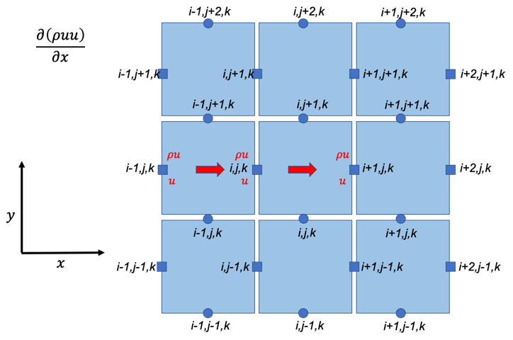
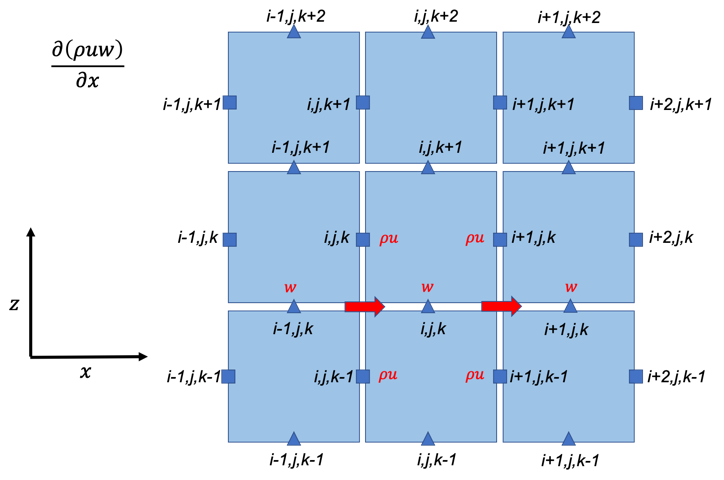
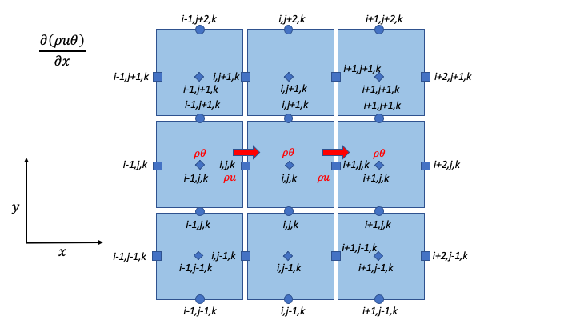
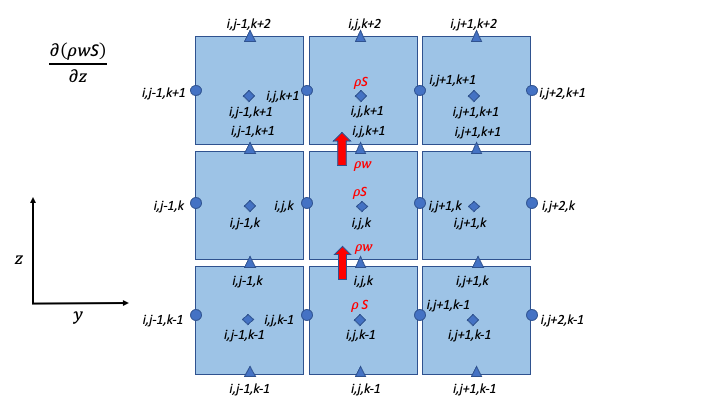
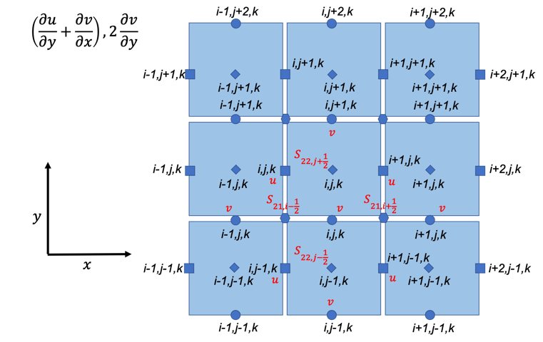
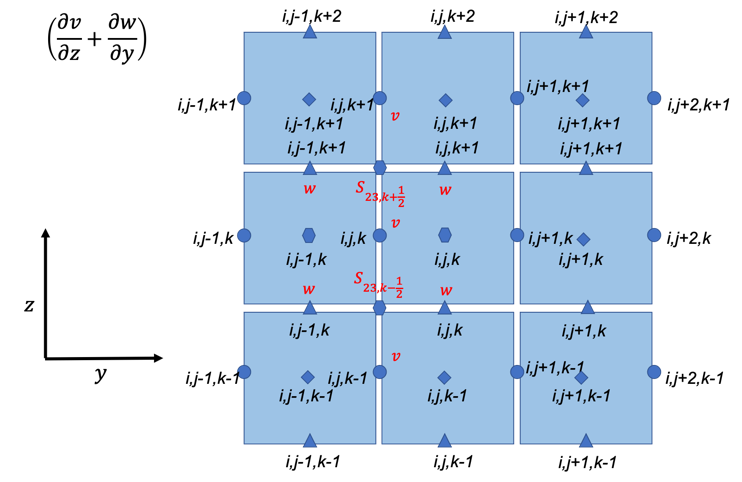
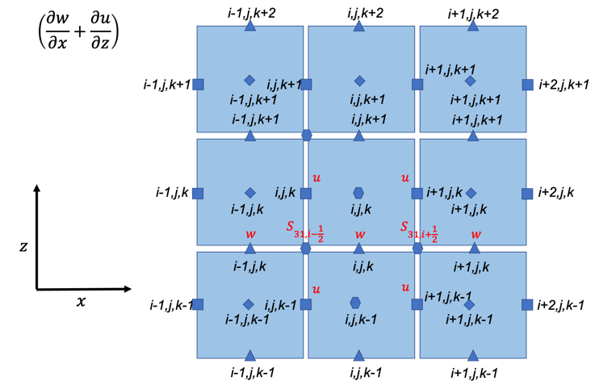
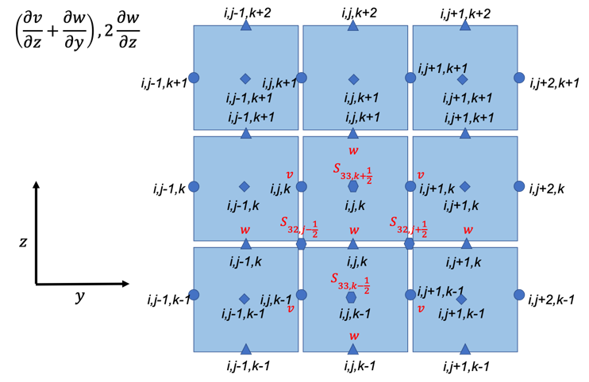

Table of Contents
=================

`1. Finite difference discretization of Euler/Navier-Stokes equations
for the ERF model
2 <#finite-difference-discretization-of-eulernavier-stokes-equations-for-the-erf-model>`__

`2. Mass Conservation 2 <#mass-conservation>`__

`3. Advection Contribution to DNS/LES
2 <#advection-contribution-to-dnsles>`__

`i. Momentum Conservation – U Momentum
2 <#momentum-conservation-u-momentum>`__

`ii. Momentum Conservation – V Momentum
3 <#momentum-conservation-v-momentum>`__

`iii. Momentum Conservation – W Momentum
3 <#momentum-conservation-w-momentum>`__

`iv. Energy Conservation – Potential Temperature Advection
3 <#energy-conservation-potential-temperature-advection>`__

`v. Scalar Conservation – Scalar Advection
3 <#scalar-conservation-scalar-advection>`__

`vi. Pressure Diagnostic 4 <#pressure-diagnostic>`__

`4. Differencing 4 <#_Toc74601091>`__

`5. Momentum, Thermal, and Scalar Diffusion Contribution to DNS
4 <#momentum-thermal-and-scalar-diffusion-contribution-to-dns>`__

`i. Strain Rate Tensor 4 <#strain-rate-tensor>`__

`ii. Momentum Conservation – U Momentum viscous stress divergence
4 <#momentum-conservation-u-momentum-viscous-stress-divergence>`__

`iii. Momentum Conservation – V Momentum viscous stress divergence
5 <#momentum-conservation-v-momentum-viscous-stress-divergence>`__

`iv. Momentum Conservation – W Momentum viscous stress divergence
5 <#momentum-conservation-w-momentum-viscous-stress-divergence>`__

`v. Energy Conservation – Potential Temperature Diffusion
6 <#energy-conservation-potential-temperature-diffusion>`__

`vi. Scalar Conservation – Scalar Diffusion
6 <#scalar-conservation-scalar-diffusion>`__

`6. Momentum, Thermal, and Scalar Diffusion Contribution to LES
6 <#momentum-thermal-and-scalar-diffusion-contribution-to-les>`__

`i. Strain Rate and Eddy Viscosity
6 <#strain-rate-and-eddy-viscosity>`__

`ii. Momentum Conservation – U Momentum - subfilter stress divergence
6 <#momentum-conservation-u-momentum---subfilter-stress-divergence>`__

`iii. Momentum Conservation – V Momentum - subfilter stress divergence
7 <#momentum-conservation-v-momentum---subfilter-stress-divergence>`__

`iv. Momentum Conservation – W Momentum - subfilter stress divergence
7 <#momentum-conservation-w-momentum---subfilter-stress-divergence>`__

`v. Energy Conservation- Subgrid heat flux
7 <#energy-conservation--subgrid-heat-flux>`__

`vi. Prognostic Equation for Subgrid Kinetic Energy
7 <#prognostic-equation-for-subgrid-kinetic-energy>`__

**
**

Finite difference discretization of Euler/Navier-Stokes equations for the ERF model
===================================================================================

+----------------------------------------------------------+----------+
| |image5|                                                 | |image6| |
+==========================================================+==========+
| Figure 1. X-Y (left) and Y-Z (right) staggered grids     |          |
| indicating where variables are located.                  |          |
+----------------------------------------------------------+----------+

Mass Conservation
=================

.. math::

   \begin{matrix}
   \rho_{i,j,k}^{n + 1} & = & \rho_{i,j,k}^{n} & - & \Delta t & \left\{ \frac{1}{\Delta x} \right.\  & \left\lbrack \left( \text{ρu} \right)_{i + 1,j,k}^{n} \right.\  & - & \left. \ \left( \text{ρu} \right)_{i.j,k}^{n} \right\rbrack \\
    & & & & & + \frac{1}{\Delta y} & \left\lbrack \left( \text{ρv} \right)_{i,j + 1,k}^{n} \right.\  & - & \left. \ \left( \text{ρv} \right)_{i.j,k}^{n} \right\rbrack \\
    & & & & & + \frac{1}{\Delta z} & \left\lbrack \left( \text{ρw} \right)_{i,j,k + 1}^{n} \right.\  & - & \left. \ \left. \ \left( \text{ρw} \right)_{i,j,k}^{n} \right\rbrack \right\} \\
   \end{matrix}

+--------------------------------------------+-----------+-----------+
| |image13|                                  | |image14| | |image15| |
+============================================+===========+===========+
| Figure 2. Divergence components: x         |           |           |
| direction (left), y direction (center), z  |           |           |
| direction (right).                         |           |           |
+--------------------------------------------+-----------+-----------+

Advection Contribution to DNS/LES
=================================

Momentum Conservation – U Momentum
----------------------------------

.. math::

   \begin{matrix}
   \left( \text{ρu} \right)_{i,j,k}^{n + 1} & = & \left( \text{ρu} \right)_{i,j,k}^{n} & - & \Delta t & \left\{ \frac{1}{2\Delta x}\ \left\lbrack \left( \left( \text{ρu} \right)_{i + 1,j,k}^{n} + \left( \text{ρu} \right)_{i,j,k}^{n} \right)u_{i + \frac{1}{2},j,k}^{n} - \left( \left( \text{ρu} \right)_{i,j,k}^{n} + \left( \text{ρu} \right)_{i - 1,j,k}^{n} \right)u_{i - \frac{1}{2},j,k}^{n} \right\rbrack \right.\  \\
    & & & & & + \frac{1}{2\Delta y}\left\lbrack \left( \left( \text{ρv} \right)_{i,j + 1,k}^{n} + \left( \text{ρv} \right)_{i - 1,j + 1,k}^{n} \right)u_{i,j + \frac{1}{2},k}^{n} - \left( \left( \text{ρv} \right)_{i,j,k}^{n} + \left( \text{ρv} \right)_{i - 1,j,k}^{n} \right)u_{i,j - \frac{1}{2},k}^{n} \right\rbrack \\
    & & & & & \  + \ \left. \ \frac{1}{2\Delta z}\left\lbrack \left( \left( \text{ρw} \right)_{i,j,k + 1}^{n} + \left( \text{ρw} \right)_{i - 1,j,k + 1}^{n} \right)u_{i,j,k + \frac{1}{2}}^{n} - \left( \left( \text{ρw} \right)_{i,j,k}^{n} + \left( \text{ρw} \right)_{i - 1,j,k}^{n} \right)u_{i,j,k - \frac{1}{2}}^{n} \right\rbrack \right\} \\
    & & & & & - \frac{\Delta t}{\Delta x}\left\lbrack p_{i,\ j,\ k}^{n} - p_{i - 1,\ j,\ k}^{n} \right\rbrack \\
   \end{matrix}

+--------------------------------------------+-----------+-----------+
| |image22|                                  | |image23| | |image24| |
+============================================+===========+===========+
| Figure 3. U momentum: x advection (left),  |           |           |
| y advection (center), z advection (right). |           |           |
+--------------------------------------------+-----------+-----------+

Momentum Conservation – V Momentum
----------------------------------

.. math::

   \begin{matrix}
   \left( \text{ρv} \right)_{i,j,k}^{n + 1} & = & \left( \text{ρv} \right)_{i,j,k}^{n} & - & \Delta t & \left\{ \frac{1}{2\Delta x}\ \left\lbrack \left( \left( \text{ρu} \right)_{i + 1,j,k}^{n} + \left( \text{ρu} \right)_{i + 1,j - 1,k}^{n} \right)v_{i + \frac{1}{2},j,k}^{n} - \left( \left( \text{ρu} \right)_{i,j,k}^{n} + \left( \text{ρu} \right)_{i,j - 1,k}^{n} \right)v_{i - \frac{1}{2},j,k}^{n} \right\rbrack \right.\  \\
    & & & & & + \frac{1}{2\Delta y}\left\lbrack \left( \left( \text{ρv} \right)_{i,j + 1,k}^{n} + \left( \text{ρv} \right)_{i,j,k}^{n} \right)v_{i,j + \frac{1}{2},k}^{n} - \left( \left( \text{ρv} \right)_{i,j,k}^{n} + \left( \text{ρv} \right)_{i,j - 1,k}^{n} \right)v_{i,j - \frac{1}{2},k}^{n} \right\rbrack \\
    & & & & & + \left. \ \frac{1}{2\Delta z}\left\lbrack \left( \left( \text{ρw} \right)_{i,j,k + 1}^{n} + \left( \text{ρw} \right)_{i,j - 1,k + 1}^{n} \right)v_{i,j,k + \frac{1}{2}}^{n} - \left( \left( \text{ρw} \right)_{i,j,k}^{n} + \left( \text{ρw} \right)_{i,j - 1,k}^{n} \right)v_{i,j,k - \frac{1}{2}}^{n} \right\rbrack \right\} \\
    & & & & & - \frac{\Delta t}{\Delta y}\left\lbrack p_{i,j,\ k}^{n} - p_{i,\ j - 1,\ k}^{n} \right\rbrack \\
   \end{matrix}

+--------------------------------------------+-----------+-----------+
| |image31|                                  | |image32| | |image33| |
+============================================+===========+===========+
| Figure 4. V momentum: x advection (left),  |           |           |
| y advection (center), z advection (right). |           |           |
+--------------------------------------------+-----------+-----------+

Momentum Conservation – W Momentum
----------------------------------

.. math::

   \begin{matrix}
   \left( \text{ρw} \right)_{i,j,k}^{n + 1} & = & \left( \text{ρw} \right)_{i,j,k}^{n} & - & \Delta t & \left\{ \frac{1}{2\Delta x}\ \left\lbrack \left( \left( \text{ρu} \right)_{i + 1,j,k}^{n} + \left( \text{ρu} \right)_{i + 1,j,k - 1}^{n} \right)w_{i + \frac{1}{2},j,k}^{n} - \left( \left( \text{ρu} \right)_{i,j,k}^{n} + \left( \text{ρu} \right)_{i,j,k - 1}^{n} \right)w_{i - \frac{1}{2},j,k}^{n} \right\rbrack \right.\  \\
    & & & & & + \frac{1}{2\Delta y}\left\lbrack \left( \left( \text{ρv} \right)_{i,j + 1,k}^{n} + \left( \text{ρv} \right)_{i,j + 1,k - 1}^{n} \right)w_{i,j + \frac{1}{2},k}^{n} - \left( \left( \text{ρv} \right)_{i,j,k}^{n} + \left( \text{ρv} \right)_{i,j,k - 1}^{n} \right)w_{i,j - \frac{1}{2},k}^{n} \right\rbrack \\
    & & & & & + \left. \ \frac{1}{2\Delta z}\left\lbrack \left( \left( \text{ρw} \right)_{i,j,k + 1}^{n} + \left( \text{ρw} \right)_{i,j,k}^{n} \right)w_{i,j,k + \frac{1}{2}}^{n} - \left( \left( \text{ρw} \right)_{i,j,k}^{n} + \left( \text{ρw} \right)_{i,j,k - 1}^{n} \right)w_{i,j,k - \frac{1}{2}}^{n} \right\rbrack \right\} \\
    & & & & & - \frac{\Delta t}{\Delta z}\left\lbrack p_{i,\ j,\ k}^{n} - p_{i,\ j,\ \ k - 1}^{n} \right\rbrack\  + \ \Delta\text{t\ }\left\lbrack \rho_{i,j,k - \ \frac{1}{2}}^{n} \right\rbrack\text{\ g} \\
   \end{matrix}

+--------------------------------------------+-----------+-----------+
| |image40|                                  | |image41| | |image42| |
+============================================+===========+===========+
| Figure 5. W momentum: x advection (left),  |           |           |
| y advection (center), z advection (right). |           |           |
+--------------------------------------------+-----------+-----------+

Energy Conservation – Potential Temperature Advection 
-----------------------------------------------------

.. math::

   \begin{matrix}
   \left( \text{ρθ} \right)_{i,j,k}^{n + 1} & = & \left( \text{ρθ} \right)_{i,j,k}^{n} & - & \Delta t & \left\{ \frac{1}{\Delta x}\ \left\lbrack \left( \text{ρu} \right)_{i + 1,j,k}^{n}\text{\ θ}_{i + \frac{1}{2},j,k}^{n} - \left( \text{ρu} \right)_{i,j,k}^{n}\text{\ θ}_{i - \frac{1}{2},j,k}^{n} \right\rbrack \right.\  \\
    & & & & & + \frac{1}{\Delta y}\left\lbrack \left( \text{ρv} \right)_{i,j + 1,k}^{n}\text{\ θ}_{i,j + \frac{1}{2},k}^{n} - \left( \text{ρv} \right)_{i,j,k\ }^{n}\theta_{i,j - \frac{1}{2},k}^{n} \right\rbrack \\
    & & & & & + \left. \ \frac{1}{\Delta z}\left\lbrack \left( \text{ρw} \right)_{i,j,k + 1\ }^{n}\theta_{i,j,k + \frac{1}{2}}^{n} - \left( \text{ρw} \right)_{i,j,k}^{n}\text{\ θ}_{i,j,k - \frac{1}{2}}^{n} \right\rbrack \right\} \\
   \end{matrix}

+--------------------------------------------+-----------+-----------+
| |image49|                                  | |image50| | |image51| |
+============================================+===========+===========+
| Figure 6. Potential temperature equation:  |           |           |
| x advection (left), y advection (center),  |           |           |
| z advection (right).                       |           |           |
+--------------------------------------------+-----------+-----------+

Scalar Conservation – Scalar Advection 
--------------------------------------

.. math::

   \begin{matrix}
   \left( \text{ρS} \right)_{i,j,k}^{n + 1} & = & \left( \text{ρS} \right)_{i,j,k}^{n} & - & \Delta t & \left\{ \frac{1}{\Delta x}\ \left\lbrack \left( \text{ρu} \right)_{i + 1,j,k}^{n}\text{\ S}_{i + \frac{1}{2},j,k}^{n} - \left( \text{ρu} \right)_{i,j,k}^{n}\text{\ S}_{i - \frac{1}{2},j,k}^{n} \right\rbrack \right.\  \\
    & & & & & + \frac{1}{\Delta y}\left\lbrack \left( \text{ρv} \right)_{i,j + 1,k}^{n}\text{\ S}_{i,j + \frac{1}{2},k}^{n} - \left( \text{ρv} \right)_{i,j,k\ }^{n}S_{i,j - \frac{1}{2},k}^{n} \right\rbrack \\
    & & & & & + \left. \ \frac{1}{\Delta z}\left\lbrack \left( \text{ρw} \right)_{i,j,k + 1\ }^{n}S_{i,j,k + \frac{1}{2}}^{n} - \left( \text{ρw} \right)_{i,j,k}^{n}\text{\ S}_{i,j,k - \frac{1}{2}}^{n} \right\rbrack \right\} \\
   \end{matrix}

+--------------------------------------------+-----------+-----------+
| |image58|                                  | |image59| | |image60| |
+============================================+===========+===========+
| Figure 7. Scalar conservation equation: x  |           |           |
| advection (left), y advection (center), z  |           |           |
| advection (right).                         |           |           |
+--------------------------------------------+-----------+-----------+

Pressure Diagnostic
-------------------

   This is included here but pressure can be diagnosed from other
   variables solved for irrespective of whether the effect of advection
   or diffusion or both or none is considered.

.. math:: {}{\text{\ \ }p_{i,\ j,\ k}^{n}} = \rho_{i,\ j,\ k}^{n}R_{d}\theta_{i,\ j,\ k}^{n}\left( \frac{p_{i,\ j,\ k}^{n}}{p_{0}} \right)^{\frac{R_{d}}{c_{p}}}

.. math:: {}{\text{\ \ }p_{i,\ j,\ k}^{n}} = \left\lbrack \rho_{i,\ j,\ k}^{n}R_{d}\theta_{i,\ j,\ k}^{n}\left( \frac{1}{p_{0}} \right)^{\frac{R_{d}}{c_{p}}} \right\rbrack^{\gamma}

.. math:: q = \lbrack\rho,\ u,v,w,\theta\rbrack\ \ \ \ \ \ \ \ \ \ \ \ \ \ \ m = i,j,k\ \ \ \ \ \ \ \ \ \ \ \ U_{d} = \lbrack u,v,w\rbrack\text{\ for\ }\lbrack x,y,z\rbrack\ \text{differences},\ \text{respecively}\text{\ \ \ }

.. math::

   \begin{matrix}
   \left. \ q_{m + \frac{1}{2}} \right|^{2nd} & = & \frac{1}{2}\left( q_{m + 1} + q_{m} \right) & & & & & & & \\
   \left. \ q_{m + \frac{1}{2}} \right|^{4th} & = & \frac{7}{12}\left( q_{m + 1} + q_{m} \right) & - & \frac{1}{12}\left( q_{m + 2} + q_{m - 1} \right) & & & & & \\
   \left. \ q_{m + \frac{1}{2}} \right|^{6th} & = & \frac{37}{60}\left( q_{m + 1} + q_{m} \right) & - & \frac{2}{15}\left( q_{m + 2} + q_{m - 1} \right) & + & \frac{1}{60}\left( q_{m + 3} + q_{m - 2} \right) & & & \\
    & & & & & & & & & \\
   \left. \ q_{m + \frac{1}{2}} \right|^{3rd} & = & \left. \ q_{m + \frac{1}{2}} \right|^{4th} & + & \frac{U_{d}}{\left| U_{d} \right|}\frac{1}{12}\left\lbrack \left( q_{m + 2} + q_{m - 1} \right) \right.\  & - & 3\left. \ \left( q_{m + 1} + q_{m} \right) \right\rbrack & & & \\
    & & & & & & & & & \\
   \left. \ q_{m + \frac{1}{2}} \right|^{5th} & = & \left. \ q_{m + \frac{1}{2}} \right|^{6th} & - & \frac{U_{d}}{\left| U_{d} \right|}\frac{1}{60}\left\lbrack \left( q_{m + 3} + q_{m - 2} \right) \right.\  & - & 5\left( q_{m + 2} + q_{m - 1} \right) & + & 10\left. \ \left( q_{m + 1} + q_{m} \right) \right\rbrack & \\
   \end{matrix}

.. math::

   \begin{matrix}
   \left. \ q_{m - \frac{1}{2}} \right|^{2nd} & = & \frac{1}{2}\left( q_{m} + q_{m - 1} \right) & & & & & & & \\
   \left. \ q_{m - \frac{1}{2}} \right|^{4th} & = & \frac{7}{12}\left( q_{m} + q_{m - 1} \right) & - & \frac{1}{12}\left( q_{m + 1} + q_{m - 2} \right) & & & & & \\
   \left. \ q_{m - \frac{1}{2}} \right|^{6th} & = & \frac{37}{60}\left( q_{m} + q_{m - 1} \right) & - & \frac{2}{15}\left( q_{m + 1} + q_{m - 2} \right) & + & \frac{1}{60}\left( q_{m + 2} + q_{m - 3} \right) & & & \\
    & & & & & & & & & \\
   \left. \ q_{m - \frac{1}{2}} \right|^{3rd} & = & \left. \ q_{m - \frac{1}{2}} \right|^{4th} & + & \frac{U_{d}}{\left| U_{d} \right|}\frac{1}{12}\left\lbrack \left( q_{m + 1} + q_{m - 2} \right) \right.\  & - & 3\left. \ \left( q_{m} + q_{m - 1} \right) \right\rbrack & & & \\
    & & & & & & & & & \\
   \left. \ q_{m - \frac{1}{2}} \right|^{5th} & = & \left. \ q_{m - \frac{1}{2}} \right|^{6th} & - & \frac{U_{d}}{\left| U_{d} \right|}\frac{1}{60}\left\lbrack \left( q_{m + 2} + q_{m - 1} \right) \right.\  & - & 5\left( q_{m + 1} + q_{m - 2} \right) & + & 10\left. \ \left( q_{m} + q_{m - 1} \right) \right\rbrack & \\
   \end{matrix}

Momentum, Thermal, and Scalar Diffusion Contribution to DNS
===========================================================

Strain Rate Tensor
------------------

+-----------------------------------------------+
| |Diagram Description automatically generated| |
+===============================================+
| Figure 8. Strain rate tensor schematic.       |
+-----------------------------------------------+

Momentum Conservation – U Momentum viscous stress divergence
------------------------------------------------------------

.. math::

   \begin{matrix}
   \left( \text{ρu} \right)_{i,j,k}^{n + 1} & = & \left( \text{ρu} \right)_{i,j,k}^{n} & + & \Delta t\ 2_{}\nu & \left. \ \left\{ \frac{1}{\Delta x}\ \left\lbrack S_{11,i + \frac{1}{2}} - S_{11,i - \frac{1}{2}} \right\rbrack \right.\  + \frac{1}{\Delta y}\ \left\lbrack S_{12,j + \frac{1}{2}} - S_{12,j - \frac{1}{2}} \right\rbrack + \frac{1}{\Delta z}\ \left\lbrack S_{13,k + \frac{1}{2}} - S_{13,k - \frac{1}{2}} \right\rbrack \right\} \\
   \end{matrix}

.. math::

   \begin{matrix}
   S_{11,i + \frac{1}{2}} = \frac{1}{\Delta x}\left( u_{i + 1,j,k} - u_{i,j,k} \right) \\
   S_{11,i - \frac{1}{2}} = \frac{1}{\Delta x}\left( u_{i,j,k} - u_{i - 1,j,k} \right) \\
   S_{12,j + \frac{1}{2}} = \frac{1}{2}\left\lbrack \frac{1}{\Delta y}\left( u_{i,j + 1,k} - u_{i,j,k} \right) + \frac{1}{\Delta x}\left( v_{i,j + 1,k} - v_{i - 1,j + 1,k} \right) \right\rbrack \\
   S_{12,j - \frac{1}{2}} = \frac{1}{2}\left\lbrack \frac{1}{\Delta y}\left( u_{i,j,k} - u_{i,j - 1,k} \right) + \frac{1}{\Delta x}\left( v_{i,j,k} - v_{i - 1,j,k} \right) \right\rbrack \\
   S_{13,k + \frac{1}{2}} = \frac{1}{2}\left\lbrack \frac{1}{\Delta z}\left( u_{i,j,k + 1} - u_{i,j,k} \right) + \frac{1}{\Delta x}\left( w_{i,j,k + 1} - w_{i - 1,j,k + 1} \right) \right\rbrack \\
   S_{13,k - \frac{1}{2}} = \frac{1}{2}\left\lbrack \frac{1}{\Delta z}\left( u_{i,j,k} - u_{i,j,k - 1} \right) + \frac{1}{\Delta x}\left( w_{i,j,k} - w_{i - 1,j,k} \right) \right\rbrack \\
   \end{matrix}

================================================ =========
|image61|                                        |image62|
================================================ =========
Figure 9. Viscous stress divergence – U momentum 
================================================ =========

Momentum Conservation – V Momentum viscous stress divergence
------------------------------------------------------------

.. math::

   \begin{matrix}
   \left( \text{ρv} \right)_{i,j,k}^{n + 1} & = & \left( \text{ρv} \right)_{i,j,k}^{n} & & \Delta t\ 2_{}\nu & \left. \ \left\{ \frac{1}{\Delta x}\ \left\lbrack S_{21,i + \frac{1}{2}} - S_{21,i - \frac{1}{2}} \right\rbrack \right.\  + \frac{1}{\Delta y}\ \left\lbrack S_{22,j + \frac{1}{2}} - S_{22,j - \frac{1}{2}} \right\rbrack + \frac{1}{\Delta z}\ \left\lbrack S_{23,k + \frac{1}{2}} - S_{23,k - \frac{1}{2}} \right\rbrack \right\} \\
   \end{matrix}

.. math::

   \begin{matrix}
   S_{21,i + \frac{1}{2}} = \frac{1}{2}\left\lbrack \frac{1}{\Delta y}\left( u_{i + 1,j,k} - u_{i + 1,j - 1,k} \right) + \frac{1}{\Delta x}\left( v_{i + 1,j,k} - v_{i,j,k} \right) \right\rbrack \\
   S_{21,i - \frac{1}{2}} = \frac{1}{2}\left\lbrack \frac{1}{\Delta y}\left( u_{i,j,k} - u_{i,j - 1,k} \right) + \frac{1}{\Delta x}\left( v_{i,j,k} - v_{i - 1,j,k} \right) \right\rbrack \\
   S_{22,j + \frac{1}{2}} = \frac{1}{\Delta y}\left( v_{i,j + 1,k} - v_{i,j,k} \right) \\
   S_{22,j - \frac{1}{2}} = \frac{1}{\Delta y}\left( v_{i,j,k} - v_{i,j - 1,k} \right) \\
   S_{23,k + \frac{1}{2}} = \frac{1}{2}\left\lbrack \frac{1}{\Delta z}\left( v_{i,j,k + 1} - v_{i,j,k} \right) + \frac{1}{\Delta y}\left( w_{i,j,k + 1} - w_{i,j - 1,k + 1} \right) \right\rbrack \\
   S_{23,k - \frac{1}{2}} = \frac{1}{2}\left\lbrack \frac{1}{\Delta z}\left( v_{i,j,k} - v_{i,j,k - 1} \right) + \frac{1}{\Delta y}\left( w_{i,j,k} - w_{i,j - 1,k} \right) \right\rbrack \\
   \end{matrix}

================================================= =========
|image63|                                         |image64|
================================================= =========
Figure 10. Viscous stress divergence – V momentum 
================================================= =========

.. _section-1:

Momentum Conservation – W Momentum viscous stress divergence
------------------------------------------------------------

.. math::

   \begin{matrix}
   \left( \text{ρw} \right)_{i,j,k}^{n + 1} & = & \left( \text{ρw} \right)_{i,j,k}^{n} & & \Delta t\ 2_{}\nu & \left. \ \left\{ \frac{1}{\Delta x}\ \left\lbrack S_{31,i + \frac{1}{2}} - S_{31,i - \frac{1}{2}} \right\rbrack \right.\  + \frac{1}{\Delta y}\ \left\lbrack S_{32,j + \frac{1}{2}} - S_{32,j - \frac{1}{2}} \right\rbrack + \frac{1}{\Delta z}\ \left\lbrack S_{33,k + \frac{1}{2}} - S_{33,k - \frac{1}{2}} \right\rbrack \right\} \\
   \end{matrix}

.. math::

   \begin{matrix}
   S_{31,i + \frac{1}{2}} = \frac{1}{2}\left\lbrack \frac{1}{\Delta z}\left( u_{i + 1,j,k} - u_{i + 1,j,k - 1} \right) + \frac{1}{\Delta x}\left( w_{i + 1,j,k} - w_{i,j,k} \right) \right\rbrack \\
   S_{31,i - \frac{1}{2}} = \frac{1}{2}\left\lbrack \frac{1}{\Delta z}\left( u_{i,j,k} - u_{i,j,k - 1} \right) + \frac{1}{\Delta x}\left( w_{i,j,k} - w_{i - 1,j,k} \right) \right\rbrack \\
   S_{32,j + \frac{1}{2}} = \frac{1}{2}\left\lbrack \frac{1}{\Delta z}\left( v_{i,j + 1,k} - v_{i,j + 1,k - 1} \right) + \frac{1}{\Delta y}\left( w_{i,j + 1,k} - w_{i,j,k} \right) \right\rbrack \\
   S_{32,j - \frac{1}{2}} = \frac{1}{2}\left\lbrack \frac{1}{\Delta z}\left( v_{i,j,k} - v_{i,j,k - 1} \right) + \frac{1}{\Delta y}\left( w_{i,j,k} - w_{i,j - 1,k} \right) \right\rbrack \\
   S_{33,k + \frac{1}{2}} = \frac{1}{\Delta z}\left( w_{i,j,k + 1} - w_{i,j,k} \right) \\
   S_{33,k - \frac{1}{2}} = \frac{1}{\Delta z}\left( w_{i,j,k} - w_{i,j,k - 1} \right) \\
   \end{matrix}

================================================= =========
|image65|                                         |image66|
================================================= =========
Figure 11. Viscous stress divergence – W momentum 
================================================= =========

Energy Conservation – Potential Temperature Diffusion 
-----------------------------------------------------

.. math::

   \begin{matrix}
   \left( \text{ρθ} \right)_{i,j,k}^{n + 1} & = & \left( \text{ρθ} \right)_{i,j,k}^{n} & + &_{}\Delta t_{}_{} & \left\{ \frac{1}{{\Delta x}^{2}}\ \left\lbrack {()}_{i + 1,j,k}^{n} - \ {2()}_{i,j,k}^{n} + \ {()}_{i - 1,j,k}^{n} \right\rbrack \right.\  \\
    & & & & & + \frac{1}{{\Delta y}^{2}}\left\lbrack {()}_{i,j + 1,k}^{n} - \ 2{()}_{i,j,k}^{n} + \ {()}_{i,j - 1,k}^{n} \right\rbrack \\
    & & & & & + \left. \ \frac{1}{{\Delta z}^{2}}\left\lbrack {()}_{i,j,k + 1}^{n} - \ {2()}_{i,j,k}^{n} + \ {()}_{i,j,k - 1}^{n} \right\rbrack \right\} \\
   \end{matrix}

Scalar Conservation – Scalar Diffusion 
--------------------------------------

.. math::

   \begin{matrix}
   (\rho)_{i,j,k}^{n + 1} & = & (\rho)_{i,j,k}^{n} & + & \Delta t_{}_{} & \left\{ \frac{1}{{\Delta x}^{2}}\ \left\lbrack_{i + 1,j,k}^{n} - \ {2}_{i,j,k}^{n} + \ _{i - 1,j,k}^{n} \right\rbrack \right.\  \\
    & & & & & + \frac{1}{{\Delta y}^{2}}\left\lbrack {()}_{i,j + 1,k}^{n} - \ 2{()}_{i,j,k}^{n} + \ {()}_{i,j - 1,k}^{n} \right\rbrack \\
    & & & & & + \left. \ \frac{1}{{\Delta z}^{2}}\left\lbrack {()}_{i,j,k + 1}^{n} - \ {2()}_{i,j,k}^{n} + \ {()}_{i,j,k - 1}^{n} \right\rbrack \right\} \\
   \end{matrix}

Momentum, Thermal, and Scalar Diffusion Contribution to LES
===========================================================

Strain Rate and Eddy Viscosity
------------------------------

   The goal is to compute eddy viscosity at the *cell centers* and
   interpolated them to the edges. Refer again to the strain rate tensor
   schematic.

   .. image:: 2ccb8f35e86d4b46825742edc2c4a26e/media/image21.png
      :alt: Diagram Description automatically generated
      :width: 3.85in
      :height: 1.97in

.. math::

   \begin{matrix}
   S_{11} = S_{11i + \frac{1}{2}} \\
   S_{22} = S_{22j + \frac{1}{2}} \\
   \begin{matrix}
   S_{33} = S_{33k + \frac{1}{2}} \\
   S_{12} = \frac{1}{4}\left\lbrack S_{12i,j - \frac{1}{2}} + S_{12i,j + \frac{1}{2}} + S_{12i + 1,j - \frac{1}{2}} + S_{12i + 1,j + \frac{1}{2}} \right\rbrack = Average\ of\ the\ 4\ edges\ surrouding\ the\ cell \\
   \begin{matrix}
   S_{21} = \frac{1}{4}\left\lbrack S_{21i - \frac{1}{2},j} + S_{21i + \frac{1}{2},j} + S_{21i - \frac{1}{2},j + 1} + S_{21i + \frac{1}{2},j + 1} \right\rbrack = Average\ of\ the\ 4\ edges\ surrouding\ the\ cell \\
   \begin{matrix}
   S_{13} = \frac{1}{4}\left\lbrack S_{13i,k - \frac{1}{2}} + S_{13i,k + \frac{1}{2}} + S_{13i + 1,k - \frac{1}{2}} + S_{13i + 1,k + \frac{1}{2}} \right\rbrack = Average\ of\ the\ 4\ edges\ surrouding\ the\ cell \\
   S_{31} = \frac{1}{4}\left\lbrack S_{31i - \frac{1}{2},k} + S_{31i + \frac{1}{2},k} + S_{31i - \frac{1}{2},k + 1} + S_{31i + \frac{1}{2},k + 1} \right\rbrack = Average\ of\ the\ 4\ edges\ surrouding\ the\ cell \\
   \begin{matrix}
   S_{23} = \frac{1}{4}\left\lbrack S_{23j,k - \frac{1}{2}} + S_{23j,k + \frac{1}{2}} + S_{23j + 1,k - \frac{1}{2}} + S_{23j + 1,k + \frac{1}{2}} \right\rbrack = Average\ of\ the\ 4\ edges\ surrouding\ the\ cell \\
   S_{32} = \frac{1}{4}\left\lbrack S_{32j - \frac{1}{2},k} + S_{32j + \frac{1}{2},k} + S_{32j - \frac{1}{2},k + 1} + S_{32j + \frac{1}{2},k + 1} \right\rbrack = Average\ of\ the\ 4\ edges\ surrouding\ the\ cell \\
   \end{matrix} \\
   \end{matrix} \\
   \end{matrix} \\
   \end{matrix} \\
   \end{matrix}

   Note that:

.. math:: S_{12} = S_{21}

.. math:: S_{13} = S_{31}

.. math:: S_{23} = S_{32}

:math:`K_{i,j,k} = {- 2\left( C_{S}\mathrm{\Delta} \right)^{2}\rho_{i,j,k}\left( {2S}_{\text{mn}}S_{\text{mn}} \right)}^{\frac{1}{2}}`,
where

.. math::

   \begin{matrix}
   S_{\text{mn}}S_{\text{mn}} = S_{11}^{2} + S_{22}^{2} + S_{33}^{2} + S_{12}^{2} + S_{13}^{2} + S_{23}^{2} + S_{21}^{2} + S_{31}^{2} + S_{32}^{2} \\
   \end{matrix}

Owing to symmetry we need to compute 6 of the 9 tensor components.

+-----------------------------------------------------------------+
| |Shape Description automatically generated with low confidence| |
+=================================================================+
| Figure 12. Eddy viscosity.                                      |
+-----------------------------------------------------------------+

The interpolated values of eddy-viscosity at the edges are the average
of the values at the centers of the 4 cells the edge is part of.

.. math::

   \begin{matrix}
   \begin{matrix}
   K_{i + \frac{1}{2},j - \frac{1}{2},k} = \frac{1}{4}\left\lbrack K_{i,j - 1,k} + K_{i,j,k} + K_{i + 1,j - 1,k} + K_{i + 1,j,k} \right\rbrack \\
   \begin{matrix}
   K_{i + \frac{1}{2},j + \frac{1}{2},k} = \frac{1}{4}\left\lbrack K_{i,j,k} + K_{i,j + 1,k} + K_{i + 1,j,k} + K_{i + 1,j + 1,k} \right\rbrack \\
   \begin{matrix}
   K_{i + \frac{1}{2},j,k - \frac{1}{2}} = \frac{1}{4}\left\lbrack K_{i,j,k} + K_{i,j,k - 1} + K_{i + 1,j,k} + K_{i + 1,j,k - 1} \right\rbrack \\
   \begin{matrix}
   K_{i + \frac{1}{2},j,k + \frac{1}{2}} = \frac{1}{4}\left\lbrack K_{i,j,k + 1} + K_{i,j,k} + K_{i + 1,j,k + 1} + K_{i + 1,j,k} \right\rbrack \\
   \begin{matrix}
   K_{i,j + \frac{1}{2},k - \frac{1}{2}} = \frac{1}{4}\left\lbrack K_{i,j,k} + K_{i,j,k - 1} + K_{i,j + 1,k} + K_{i,j + 1,k - 1} \right\rbrack \\
   \begin{matrix}
   K_{i,j + \frac{1}{2},k + \frac{1}{2}} = \frac{1}{4}\left\lbrack K_{i,j,k} + K_{i,j,k + 1} + K_{i,j + 1,k} + K_{i,j + 1,k + 1} \right\rbrack \\
   \end{matrix} \\
   \end{matrix} \\
   \end{matrix} \\
   \end{matrix} \\
   \end{matrix} \\
   \end{matrix} \\
   \end{matrix}

Momentum Conservation – U Momentum - subfilter stress divergence
----------------------------------------------------------------

.. math::

   \begin{matrix}
   \left( \text{ρu} \right)_{i,j,k}^{n + 1} & = & \left( \text{ρu} \right)_{i,j,k}^{n} & - & \Delta\text{t\ } & \left. \ \left\{ \frac{1}{\Delta x}\ \left\lbrack \tau_{11,i + \frac{1}{2}} - \tau_{11,i - \frac{1}{2}} \right\rbrack \right.\  + \frac{1}{\Delta y}\ \left\lbrack \tau_{12,j + \frac{1}{2}} - \tau_{12,j - \frac{1}{2}} \right\rbrack + \frac{1}{\Delta z}\ \left\lbrack \tau_{13,k + \frac{1}{2}} - \tau_{13,k - \frac{1}{2}} \right\rbrack \right\} \\
   \end{matrix}

.. math::

   \begin{matrix}
   \tau_{11,i + \frac{1}{2}}{= K_{i,j,k}\text{\ S}}_{11,i + \frac{1}{2}} = K_{i,j,k}\frac{1}{\Delta x}\left( u_{i + 1,j,k} - u_{i,j,k} \right) \\
   \tau_{11,i - \frac{1}{2}} = {K_{i - 1,j,k}\text{\ S}}_{11,i - \frac{1}{2}} = K_{i - 1,j,k}\frac{1}{\Delta x}\left( u_{i,j,k} - u_{i - 1,j,k} \right) \\
   \tau_{12,j + \frac{1}{2}} = {K_{i - \frac{1}{2},j + \frac{1}{2},k}\text{\ S}}_{12,j + \frac{1}{2}} = K_{i - \frac{1}{2},j + \frac{1}{2},k}\frac{1}{2}\left\lbrack \frac{1}{\Delta y}\left( u_{i,j + 1,k} - u_{i,j,k} \right) + \frac{1}{\Delta x}\left( v_{i,j + 1,k} - v_{i - 1,j + 1,k} \right) \right\rbrack \\
   \tau_{12,j - \frac{1}{2}} = K_{i - \frac{1}{2},j - \frac{1}{2},k}\ S_{12,j - \frac{1}{2}} = K_{i - \frac{1}{2},j - \frac{1}{2},k}\frac{1}{2}\left\lbrack \frac{1}{\Delta y}\left( u_{i,j,k} - u_{i,j - 1,k} \right) + \frac{1}{\Delta x}\left( v_{i,j,k} - v_{i - 1,j,k} \right) \right\rbrack \\
   \tau_{13,k + \frac{1}{2}} = {K_{i - \frac{1}{2},j,k + \frac{1}{2}}\text{\ S}}_{13,k + \frac{1}{2}} = K_{i - \frac{1}{2},j,k + \frac{1}{2}}\frac{1}{2}\left\lbrack \frac{1}{\Delta z}\left( u_{i,j,k + 1} - u_{i,j,k} \right) + \frac{1}{\Delta x}\left( w_{i,j,k + 1} - w_{i - 1,j,k + 1} \right) \right\rbrack \\
   {\tau_{13,k - \frac{1}{2}} = K_{i - \frac{1}{2},j,k - \frac{1}{2}}\text{\ S}}_{13,k - \frac{1}{2}} = K_{i - \frac{1}{2},j,k - \frac{1}{2}}\frac{1}{2}\left\lbrack \frac{1}{\Delta z}\left( u_{i,j,k} - u_{i,j,k - 1} \right) + \frac{1}{\Delta x}\left( w_{i,j,k} - w_{i - 1,j,k} \right) \right\rbrack \\
   \end{matrix}

Momentum Conservation – V Momentum - subfilter stress divergence
----------------------------------------------------------------

.. math::

   \begin{matrix}
   \left( \text{ρv} \right)_{i,j,k}^{n + 1} & = & \left( \text{ρv} \right)_{i,j,k}^{n} & - & \Delta\text{t\ } & \left. \ \left\{ \frac{1}{\Delta x}\ \left\lbrack \tau_{21,i + \frac{1}{2}} - \tau_{21,i - \frac{1}{2}} \right\rbrack \right.\  + \frac{1}{\Delta y}\ \left\lbrack \tau_{22,j + \frac{1}{2}} - \tau_{22,j - \frac{1}{2}} \right\rbrack + \frac{1}{\Delta z}\ \left\lbrack \tau_{23,k + \frac{1}{2}} - \tau_{23,k - \frac{1}{2}} \right\rbrack \right\} \\
   \end{matrix}

.. math::

   \begin{matrix}
   {{\tau_{21,i + \frac{1}{2}} = K}_{i + \frac{1}{2},j - \frac{1}{2},k}\text{\ S}}_{21,i + \frac{1}{2}} = K_{i + \frac{1}{2},j - \frac{1}{2},k}\frac{1}{2}\left\lbrack \frac{1}{\Delta y}\left( u_{i + 1,j,k} - u_{i + 1,j - 1,k} \right) + \frac{1}{\Delta x}\left( v_{i + 1,j,k} - v_{i,j,k} \right) \right\rbrack \\
   {{\tau_{21,i - \frac{1}{2}} = K}_{i - \frac{1}{2},j - \frac{1}{2},k}\text{\ S}}_{21,i - \frac{1}{2}} = K_{i - \frac{1}{2},j - \frac{1}{2},k}\frac{1}{2}\left\lbrack \frac{1}{\Delta y}\left( u_{i,j,k} - u_{i,j - 1,k} \right) + \frac{1}{\Delta x}\left( v_{i,j,k} - v_{i - 1,j,k} \right) \right\rbrack \\
   {\tau_{22,j + \frac{1}{2}} = K}_{i,j,k}\ S_{22,j + \frac{1}{2}} = K_{i,j,k}\frac{1}{\Delta y}\left( v_{i,j + 1,k} - v_{i,j,k} \right) \\
   \tau_{22,j - \frac{1}{2}} = K_{i,j - 1,k}\ S_{22,j - \frac{1}{2}} = K_{i,j - 1,k}\frac{1}{\Delta y}\left( v_{i,j,k} - v_{i,j - 1,k} \right) \\
   \tau_{23,k + \frac{1}{2}} = K_{i,j - \frac{1}{2},k + \frac{1}{2}}\ S_{23,k + \frac{1}{2}} = K_{i,j - \frac{1}{2},k + \frac{1}{2}}\frac{1}{2}\left\lbrack \frac{1}{\Delta z}\left( v_{i,j,k + 1} - v_{i,j,k} \right) + \frac{1}{\Delta y}\left( w_{i,j,k + 1} - w_{i,j - 1,k + 1} \right) \right\rbrack \\
   \tau_{23,k - \frac{1}{2}} = K_{i,j - \frac{1}{2}k - \frac{1}{2}}\text{\ S}_{23,k - \frac{1}{2}} = K_{i,j - \frac{1}{2},k - \frac{1}{2}}\frac{1}{2}\left\lbrack \frac{1}{\Delta z}\left( v_{i,j,k} - v_{i,j,k - 1} \right) + \frac{1}{\Delta y}\left( w_{i,j,k} - w_{i,j - 1,k} \right) \right\rbrack \\
   \end{matrix}

Momentum Conservation – W Momentum - subfilter stress divergence
----------------------------------------------------------------

.. math::

   \begin{matrix}
   \left( \text{ρw} \right)_{i,j,k}^{n + 1} & = & \left( \text{ρw} \right)_{i,j,k}^{n} & - & \Delta\text{t\ } & \left. \ \left\{ \frac{1}{\Delta x}\ \left\lbrack \tau_{31,i + \frac{1}{2}} - \tau_{31,i - \frac{1}{2}} \right\rbrack \right.\  + \frac{1}{\Delta y}\ \left\lbrack \tau_{32,j + \frac{1}{2}} - \tau_{32,j - \frac{1}{2}} \right\rbrack + \frac{1}{\Delta z}\ \left\lbrack \tau_{33,k + \frac{1}{2}} - \tau_{33,k - \frac{1}{2}} \right\rbrack \right\} \\
   \end{matrix}

.. math::

   \begin{matrix}
   {K_{i + \frac{1}{2},j,k - \frac{1}{2}}\text{\ S}}_{31,i + \frac{1}{2}} = K_{i + \frac{1}{2},j,k - \frac{1}{2}}\frac{1}{2}\left\lbrack \frac{1}{\Delta z}\left( u_{i + 1,j,k} - u_{i + 1,j,k - 1} \right) + \frac{1}{\Delta x}\left( w_{i + 1,j,k} - w_{i,j,k} \right) \right\rbrack \\
   K_{i - \frac{1}{2},j,k - \frac{1}{2}}\ S_{31,i - \frac{1}{2}} = K_{i - \frac{1}{2},j,k - \frac{1}{2}}\frac{1}{2}\left\lbrack \frac{1}{\Delta z}\left( u_{i,j,k} - u_{i,j,k - 1} \right) + \frac{1}{\Delta x}\left( w_{i,j,k} - w_{i - 1,j,k} \right) \right\rbrack \\
   K_{i,j + \frac{1}{2},k - \frac{1}{2}}\ S_{32,j + \frac{1}{2}} = K_{i,j + \frac{1}{2},k - \frac{1}{2}}\frac{1}{2}\left\lbrack \frac{1}{\Delta z}\left( v_{i,j + 1,k} - v_{i,j + 1,k - 1} \right) + \frac{1}{\Delta y}\left( w_{i,j + 1,k} - w_{i,j,k} \right) \right\rbrack \\
   K_{i,j - \frac{1}{2},k - \frac{1}{2}}S_{32,j - \frac{1}{2}} = K_{i,j - \frac{1}{2},k - \frac{1}{2}}\frac{1}{2}\left\lbrack \frac{1}{\Delta z}\left( v_{i,j,k} - v_{i,j,k - 1} \right) + \frac{1}{\Delta y}\left( w_{i,j,k} - w_{i,j - 1,k} \right) \right\rbrack \\
   K_{i,j,k}S_{33,k + \frac{1}{2}} = K_{i,j,k}\frac{1}{\Delta z}\left( w_{i,j,k + 1} - w_{i,j,k} \right) \\
   K_{i,jk - 1}S_{33,k - \frac{1}{2}} = K_{i,j,k - 1}\frac{1}{\Delta z}\left( w_{i,j,k} - w_{i,j,k - 1} \right) \\
   \end{matrix}

Energy Conservation- Subgrid heat flux
--------------------------------------

.. math::

   \begin{matrix}
   \left( \text{ρθ} \right)_{i,j,k}^{n + 1} & = & \left( \text{ρθ} \right)_{i,j,k}^{n} & - & \Delta t & \left\{ \frac{1}{\Delta x}\ \left\lbrack {\vartheta_{1}}_{i + \frac{1}{2},j,k}^{n} - {\ \vartheta_{1}}_{i - \frac{1}{2},j,k}^{n} \right\rbrack \right.\  \\
    & & & & & + \frac{1}{\Delta y}\left\lbrack {\ \vartheta_{2}}_{i,j + \frac{1}{2},k}^{n} - {\vartheta_{2}}_{i,j - \frac{1}{2},k}^{n} \right\rbrack \\
    & & & & & + \left. \ \frac{1}{\Delta z}\left\lbrack {\vartheta_{3}}_{i,j,k + \frac{1}{2}}^{n} - {\ \vartheta_{3}}_{i,j,k - \frac{1}{2}}^{n} \right\rbrack \right\} \\
   \end{matrix}

.. math:: \vartheta_{1i,j,k} = K_{i,j,k}\frac{1}{2\Delta x}\ \left\lbrack \text{\ θ}_{i + 1,j,k}^{n} - \text{\ θ}_{i - 1,j,k}^{n} \right\rbrack

.. math:: \vartheta_{2i,j,k} = K_{i,j,k}\frac{1}{2\Delta y}\ \left\lbrack \text{\ θ}_{i,j + 1,k}^{n} - \text{\ θ}_{i,j - 1,k}^{n} \right\rbrack

.. math:: \vartheta_{3i,jk} = K_{i,j,k}\frac{1}{2\Delta z}\ \left\lbrack \text{\ θ}_{i,j,k + 1}^{n} - \text{\ θ}_{i,j,k - 1}^{n} \right\rbrack

.. math:: \vartheta_{1i + \frac{1}{2},j,k} = \frac{1}{2}\left( \vartheta_{1i + 1,j,k} + \vartheta_{1i,j,k} \right)

.. math:: \vartheta_{1i - \frac{1}{2},j,k} = \frac{1}{2}\left( \vartheta_{1i,j,k} + \vartheta_{1i - 1,j,k} \right)

.. math:: \vartheta_{1i,j + \frac{1}{2},k} = \frac{1}{2}\left( \vartheta_{1i,j + 1,k} + \vartheta_{1i,j,k} \right)

.. math:: \vartheta_{1i,j - \frac{1}{2},k} = \frac{1}{2}\left( \vartheta_{1i,j,k} + \vartheta_{1i1,j - 1,k} \right)

.. math:: \vartheta_{1i,j,k + \frac{1}{2}} = \frac{1}{2}\left( \vartheta_{1i,j,k +} + \vartheta_{1i,j,k} \right)

.. math:: \vartheta_{1i,j,k - \frac{1}{2}} = \frac{1}{2}\left( \vartheta_{1i,j,k} + \vartheta_{1i1,j,k - 1} \right)

vi.  .. rubric:: Scalar Conservation- Subgrid scalar flux
        :name: scalar-conservation--subgrid-scalar-flux

vii. .. rubric:: Prognostic Equation for Subgrid Kinetic Energy
        :name: prognostic-equation-for-subgrid-kinetic-energy

.. math::

   \begin{matrix}
   \left( \text{ρe} \right)_{i,j,k}^{n + 1} & = & \left( \text{ρe} \right)_{i,j,k}^{n} & - & \Delta t & \frac{1}{\Delta x}\ \left\lbrack \left( \text{ρu} \right)_{i + 1,j,k}^{n}\text{\ e}_{i + \frac{1}{2},j,k}^{n} - \left( \text{ρu} \right)_{i,j,k}^{n}\text{\ e}_{i - \frac{1}{2},j,k}^{n} \right\rbrack \\
    & & & & & + \frac{1}{\Delta y}\left\lbrack \left( \text{ρv} \right)_{i,j + 1,k}^{n}\text{\ e}_{i,j + \frac{1}{2},k}^{n} - \left( \text{ρv} \right)_{i,j,k\ }^{n}e_{i,j - \frac{1}{2},k}^{n} \right\rbrack \\
    & & & & & + \frac{1}{\Delta z}\left\lbrack \left( \text{ρw} \right)_{i,j,k + 1\ }^{n}e_{i,j,k + \frac{1}{2}}^{n} - \left( \text{ρw} \right)_{i,j,k}^{n}\text{\ e}_{i,j,k - \frac{1}{2}}^{n} \right\rbrack \\
    & & & & & + \frac{g}{\Theta}\vartheta_{3} - \tau_{\text{mn}}\frac{\partial u_{m}}{\partial x_{n}} - \frac{\partial\left\langle \left( u_{n}^{'}\rho e + u_{n}^{'}p^{'} \right) \right\rangle}{\partial x_{n}} - \epsilon \\
   \end{matrix}

.. math:: \vartheta_{i} = K_{H}\frac{\partial\theta}{\partial x_{i}}

.. math:: K_{H} = \left( 1 + 2\frac{\mathcal{l}}{\Delta s} \right)K_{M}

.. math:: K_{M} = 0.1\mathcal{l}e^{\frac{1}{2}} = 0.1\mathcal{l}e_{i,j,k}^{\frac{1}{2}}

.. math:: K_{Mi,j,k} = 0.1\mathcal{l}e_{i,j,k}^{\frac{1}{2}}

:math:`\mathcal{l} = \Delta s = \sqrt[3]{\Delta\text{x\ }\Delta\text{y\ }\Delta\text{z\ }}`,
convective case

.. math:: \mathcal{l} = 0.76\ e^{\frac{1}{2}}\left( \frac{g}{\Theta}\frac{\partial\theta}{\partial z} \right) = 0.76e_{i,j,k}^{\frac{1}{2}}\left\lbrack \frac{g}{\Theta}\frac{1}{2\Delta z}\left( \text{\ θ}_{i,j,k + 1}^{n} - \text{\ θ}_{i,j,k - 1}^{n} \right) \right\rbrack

.. math:: \vartheta_{1} = {K_{H}}_{i,j,k}\frac{1}{2\Delta x}\ \left\lbrack \text{\ θ}_{i + 1,j,k}^{n} - \text{\ θ}_{i - 1,j,k}^{n} \right\rbrack

.. math:: \vartheta_{2} = {K_{H}}_{i,j,k}\frac{1}{2\Delta y}\ \left\lbrack \text{\ θ}_{i,j + 1,k}^{n} - \text{\ θ}_{i,j - 1,k}^{n} \right\rbrack

.. math:: \vartheta_{3} = {K_{H}}_{i,j,k}\frac{1}{2\Delta z}\ \left\lbrack \text{\ θ}_{i,j,k + 1}^{n} - \text{\ θ}_{i,j,k - 1}^{n} \right\rbrack

.. math:: \frac{\partial\left\langle \left( u_{n}^{'}\rho e + u_{n}^{'}p^{'} \right) \right\rangle}{\partial x_{n}} = K_{i,j,k}\left\{ \frac{1}{2\Delta x}\ \left\lbrack \text{\ e}_{i + 1,j,k}^{n} - \text{\ e}_{i - 1j,k}^{n} \right\rbrack + \right.\ \frac{1}{2\Delta y}\left\lbrack \text{\ e}_{i,j + 1,k}^{n} - e_{i,j - 1,k}^{n} \right\rbrack + \left. \ \frac{1}{2\Delta z}\left\lbrack e_{i,j,k + 1}^{n} - \text{\ e}_{i,j,k - 1}^{n} \right\rbrack \right\}

.. math:: \epsilon = C_{\epsilon}\rho_{i,j,k}\frac{\left( e_{i,j,k} \right)^{\frac{3}{2}}}{\mathcal{l}}

.. math:: C_{\epsilon} = 0.19 + 0.51\frac{\mathcal{l}}{\Delta s}

.. math:: \tau_{\text{mn}}\frac{\partial u_{m}}{\partial x_{n}} = KS_{\text{mn}}\frac{\partial u_{m}}{\partial x_{n}} = KS_{\text{mn}}S_{\text{mn}} = K(S_{11}^{2} + S_{22}^{2} + S_{33}^{2} + S_{12}^{2} + S_{13}^{2} + S_{23}^{2} + S_{21}^{2} + S_{31}^{2} + S_{32}^{2})

========= ========= =========
|image67| |image68| |image69|
========= ========= =========

Figure 13. Subgrid kinetic energy.

.. |image1| image:: 2ccb8f35e86d4b46825742edc2c4a26e/media/image1.png
   :width: 3.88814in
   :height: 2.18708in
.. |image2| image:: 2ccb8f35e86d4b46825742edc2c4a26e/media/image2.png
   :width: 3.84709in
   :height: 2.16399in
.. |image3| image:: 2ccb8f35e86d4b46825742edc2c4a26e/media/image1.png
   :width: 3.88814in
   :height: 2.18708in
.. |image4| image:: 2ccb8f35e86d4b46825742edc2c4a26e/media/image2.png
   :width: 3.84709in
   :height: 2.16399in
.. |image5| image:: 2ccb8f35e86d4b46825742edc2c4a26e/media/image1.png
   :width: 3.88814in
   :height: 2.18708in
.. |image6| image:: 2ccb8f35e86d4b46825742edc2c4a26e/media/image2.png
   :width: 3.84709in
   :height: 2.16399in
.. |image7| image:: 2ccb8f35e86d4b46825742edc2c4a26e/media/image3.PNG
   :width: 3.79259in
   :height: 2.13333in
.. |image8| image:: 2ccb8f35e86d4b46825742edc2c4a26e/media/image4.PNG
   :width: 3.81927in
   :height: 2.14834in
.. |image9| image:: 2ccb8f35e86d4b46825742edc2c4a26e/media/image5.PNG
   :width: 3.81889in
   :height: 2.14813in
.. |image10| image:: 2ccb8f35e86d4b46825742edc2c4a26e/media/image3.PNG
   :width: 3.79259in
   :height: 2.13333in
.. |image11| image:: 2ccb8f35e86d4b46825742edc2c4a26e/media/image4.PNG
   :width: 3.81927in
   :height: 2.14834in
.. |image12| image:: 2ccb8f35e86d4b46825742edc2c4a26e/media/image5.PNG
   :width: 3.81889in
   :height: 2.14813in
.. |image13| image:: 2ccb8f35e86d4b46825742edc2c4a26e/media/image3.PNG
   :width: 3.79259in
   :height: 2.13333in
.. |image14| image:: 2ccb8f35e86d4b46825742edc2c4a26e/media/image4.PNG
   :width: 3.81927in
   :height: 2.14834in
.. |image15| image:: 2ccb8f35e86d4b46825742edc2c4a26e/media/image5.PNG
   :width: 3.81889in
   :height: 2.14813in

.. |image17| image:: 2ccb8f35e86d4b46825742edc2c4a26e/media/image7.png
   :width: 3.29in
   :height: 2.18in
.. |image18| image:: 2ccb8f35e86d4b46825742edc2c4a26e/media/image8.png
   :width: 3.29in
   :height: 2.18in

.. |image20| image:: 2ccb8f35e86d4b46825742edc2c4a26e/media/image7.png
   :width: 3.29in
   :height: 2.18in
.. |image21| image:: 2ccb8f35e86d4b46825742edc2c4a26e/media/image8.png
   :width: 3.29in
   :height: 2.18in

.. |image23| image:: 2ccb8f35e86d4b46825742edc2c4a26e/media/image7.png
   :width: 3.29in
   :height: 2.18in
.. |image24| image:: 2ccb8f35e86d4b46825742edc2c4a26e/media/image8.png
   :width: 3.29in
   :height: 2.18in
.. |image25| image:: 2ccb8f35e86d4b46825742edc2c4a26e/media/image9.png
   :width: 3.29in
   :height: 2.18in
.. |image26| image:: 2ccb8f35e86d4b46825742edc2c4a26e/media/image10.png
   :width: 3.29in
   :height: 2.18in
.. |image27| image:: 2ccb8f35e86d4b46825742edc2c4a26e/media/image11.png
   :width: 3.29in
   :height: 2.18in
.. |image28| image:: 2ccb8f35e86d4b46825742edc2c4a26e/media/image9.png
   :width: 3.29in
   :height: 2.18in
.. |image29| image:: 2ccb8f35e86d4b46825742edc2c4a26e/media/image10.png
   :width: 3.29in
   :height: 2.18in
.. |image30| image:: 2ccb8f35e86d4b46825742edc2c4a26e/media/image11.png
   :width: 3.29in
   :height: 2.18in
.. |image31| image:: 2ccb8f35e86d4b46825742edc2c4a26e/media/image9.png
   :width: 3.29in
   :height: 2.18in
.. |image32| image:: 2ccb8f35e86d4b46825742edc2c4a26e/media/image10.png
   :width: 3.29in
   :height: 2.18in
.. |image33| image:: 2ccb8f35e86d4b46825742edc2c4a26e/media/image11.png
   :width: 3.29in
   :height: 2.18in

.. |image35| image:: 2ccb8f35e86d4b46825742edc2c4a26e/media/image13.png
   :width: 3.29in
   :height: 2.18in
.. |image36| image:: 2ccb8f35e86d4b46825742edc2c4a26e/media/image14.png
   :width: 3.29in
   :height: 2.18in

.. |image38| image:: 2ccb8f35e86d4b46825742edc2c4a26e/media/image13.png
   :width: 3.29in
   :height: 2.18in
.. |image39| image:: 2ccb8f35e86d4b46825742edc2c4a26e/media/image14.png
   :width: 3.29in
   :height: 2.18in

.. |image41| image:: 2ccb8f35e86d4b46825742edc2c4a26e/media/image13.png
   :width: 3.29in
   :height: 2.18in
.. |image42| image:: 2ccb8f35e86d4b46825742edc2c4a26e/media/image14.png
   :width: 3.29in
   :height: 2.18in

.. |image44| image:: 2ccb8f35e86d4b46825742edc2c4a26e/media/image16.png
   :width: 3.85514in
   :height: 2.16851in
.. |image45| image:: 2ccb8f35e86d4b46825742edc2c4a26e/media/image17.png
   :width: 3.75371in
   :height: 2.11146in

.. |image47| image:: 2ccb8f35e86d4b46825742edc2c4a26e/media/image16.png
   :width: 3.85514in
   :height: 2.16851in
.. |image48| image:: 2ccb8f35e86d4b46825742edc2c4a26e/media/image17.png
   :width: 3.75371in
   :height: 2.11146in

.. |image50| image:: 2ccb8f35e86d4b46825742edc2c4a26e/media/image16.png
   :width: 3.85514in
   :height: 2.16851in
.. |image51| image:: 2ccb8f35e86d4b46825742edc2c4a26e/media/image17.png
   :width: 3.75371in
   :height: 2.11146in

.. |image53| image:: 2ccb8f35e86d4b46825742edc2c4a26e/media/image19.png
   :width: 3.85514in
   :height: 2.16851in

.. |image56| image:: 2ccb8f35e86d4b46825742edc2c4a26e/media/image19.png
   :width: 3.85514in
   :height: 2.16851in

.. |image59| image:: 2ccb8f35e86d4b46825742edc2c4a26e/media/image19.png
   :width: 3.85514in
   :height: 2.16851in

.. |Diagram Description automatically generated| image:: 2ccb8f35e86d4b46825742edc2c4a26e/media/image21.png
   :width: 3.85in
   :height: 1.97in
.. |image61| image:: 2ccb8f35e86d4b46825742edc2c4a26e/media/image22.png
   :width: 3.46in
   :height: 2.18in
.. |image62| image:: 2ccb8f35e86d4b46825742edc2c4a26e/media/image23.png
   :width: 3.37in
   :height: 2.19in

.. |Shape Description automatically generated with low confidence| image:: 2ccb8f35e86d4b46825742edc2c4a26e/media/image28.png
   :width: 3.34in
   :height: 1.94in
.. |image67| image:: 2ccb8f35e86d4b46825742edc2c4a26e/media/image29.png
   :width: 3.08in
   :height: 2.04in
.. |image68| image:: 2ccb8f35e86d4b46825742edc2c4a26e/media/image30.png
   :width: 3.08in
   :height: 2.04in
.. |image69| image:: 2ccb8f35e86d4b46825742edc2c4a26e/media/image31.png
   :width: 3.08in
   :height: 2.05in
