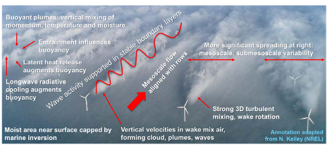
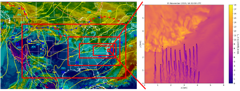

.. highlight:: rst

.. Warning:: This documentation is a work in progress. It is reasonably complete and hopefully useful but is likely error prone and in places misleading.

Applications and Requirements
=============================

Goal
----

A modern, flexible, and efficient software framework incorporating modern architecture and design principles that can:

1. Simulate mesoscale weather and environmental phenomena and features impacting energy inflow and power generation, at fidelity necessary to address outstanding challenges confronting wind energy expansion, including

   * Operation of larger turbines in larger arrays (penetrating deeper into the atmospheric boundary layer)
   * Array to array interactions in regions of dense development
   * Offshore environments, including impacts of sea surface temperature and roughness, wave and swell, current, stability changes via air mass advection, ...
   * Complicated mesoscale weather, including low-level jets, precipitation, storm outflows, tropical and subtropical disturbances, …
   * Complex terrain effects (local and remote, gravity flows, gravity waves, mountain-valley circulations, coastal jets) 
   * Fidelity comparable to or exceeding that of the Weather Research and Forecasting (WRF) model in similar mesoscale settings
   * Capability beyond WRF in complex terrain and offshore settings (steep terrain handling, wave and surface temperature/current, array-to-array coupling, …)

2. Flexibly and efficiently downscale larger-scale flow features to the wind plant scale

   * Mean flow and variability, shear/veer, turbulence content, sensible weather, …
   * Impacts of ocean waves/currents, complex terrain, surface cover, neighboring turbines and plants, ...

3. Robustly compile and perform effectively on a range of next-generation high-performance computing (HPC) assets

   * LCF machines at DOE labs
   * Commodity desktops (?)
   * Commodity laptops (?)
   * Cloud resources (?)

4. Flexibly accommodate various model configurations to support
   
   * Real data driven “whole model” applications in relevant use cases
   * Idealized setups to address a variety of process-level studies

5. Prepare and ingest initial and boundary forcing data from larger-scale model databases

   * Compile and integrate with the WRF Preprocessing System (WPS)?

6. Provide interface to couple with external code bases (other CFD models such as AMR-Wind, or physics models such as ocean current and wave state, wind turbine, ...)

7. Flexibly accommodate incorporation of new methods and process submodels

   * Encourage community development and extensibility 

8. Balance useability, maintainability and robustness with efficient performance

Applications
------------
1. Capture mesoscale atmospheric flow physics relevant to wind energy applications over land and water surfaces with improved fidelity relative to today’s models

2. Downscale weather and environment-dependent energy flow parameters to the wind plant scales  where turbines and arrays extract energy from the flow:

   * Mean flow and variability, shear/veer, turbulence content, sensible weather, …
   * Impacts of complex terrain, surface cover, ocean waves/currents, …

3. Efficient coupling with AMRWind microscale simulation code

4. Capability to couple with other codes, e.g. ocean wave/current turbine/load/structure, …

   * Upscale relevant microscale  physics and flow features back to mesoscale flow at the relevant ERF model timestep (e.g. first RK step):

     * wakes, wake blockage effects, internal boundary layers, gravity waves,…

5. Idealized simulations at meso and micro scales

   * Critical for process-level understanding of phenomena and interactions

6. Forensic analysis of interesting events

7. Capability to provide computational databases for machine learning, development of reduced-order approaches

   * Storage of model state variables and derived quantities
   * Storage of restart files or 2D slices for data compression

Figure 1 below shows the importance of including atmospheric and environmental factors in a wind energy production use case, here showing a portion of the Horns Rev wind plant in the North Sea, annotated with various atmospheric phenomena of relevance.

   Figure 1. Image of the Horns Rev wind plant in the North Sea (photo by Christian Steiness), showing cloud formation induced by turbine operation, annotated to highlight relevant atmospheric physical processes. 

8. Downscaling at the time frequency of the outer domain RK timestep (complete time step, then downscale to run subdomains)

   * Static mesh refinement 
   * Arbitrary integer refinement in horizontal, arbitrary vertical discretization
   * Different timesteps for each mesh

9. Ease of use, documentation and test cases. Mimic the WRF user/developer experience

   * Documented code modifications within the GIT commit structure
   * Lots of comments in the code so that new users can modify and improve
   * Higher-level information in readthedocs

Requirements
------------

   Figure 2. Depiction of how multiscale atmospheric simulation using ERF (left) coupled with microscale wind plant simulations using ExaWind (right) would work. Herein WRF was used for both simulations; ERF and ExaWind will provide significantly enhanced fidelity and throughput. 

