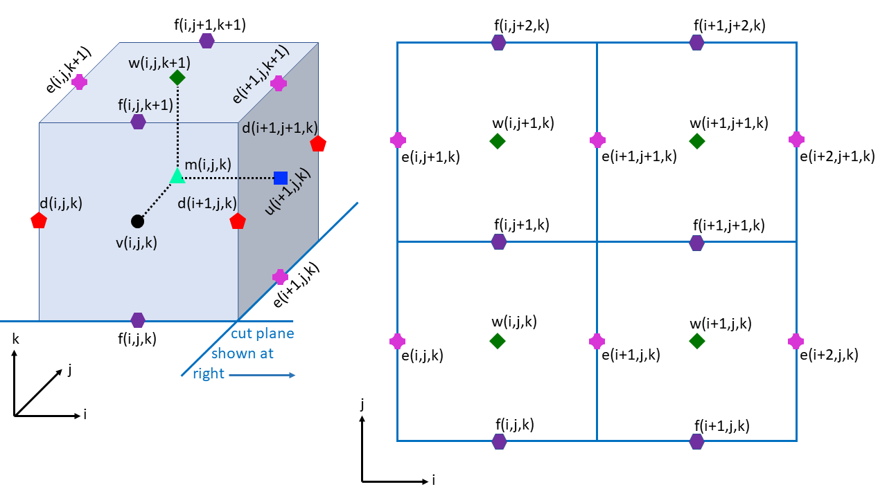
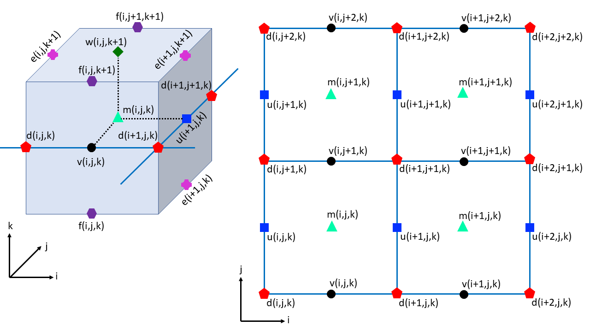
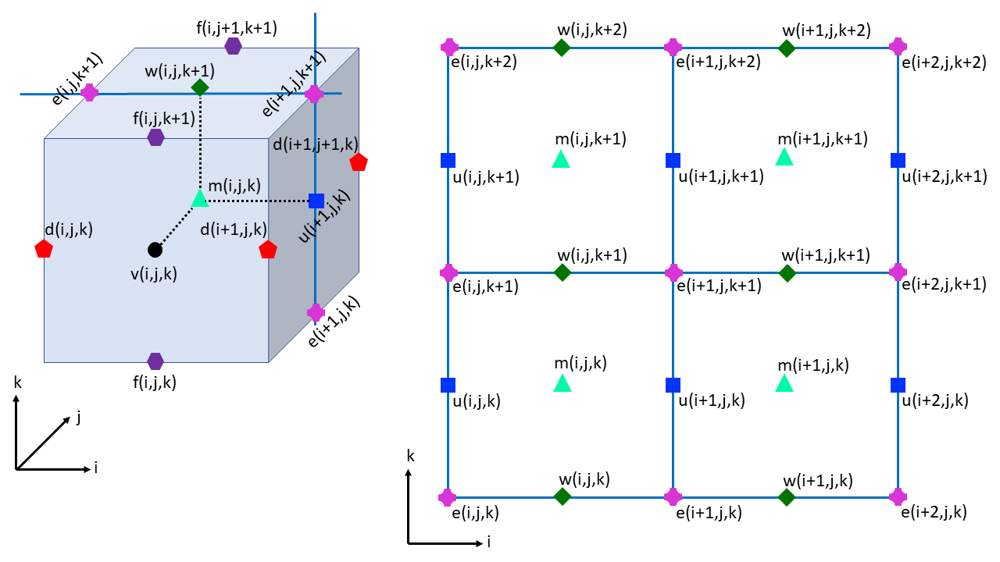
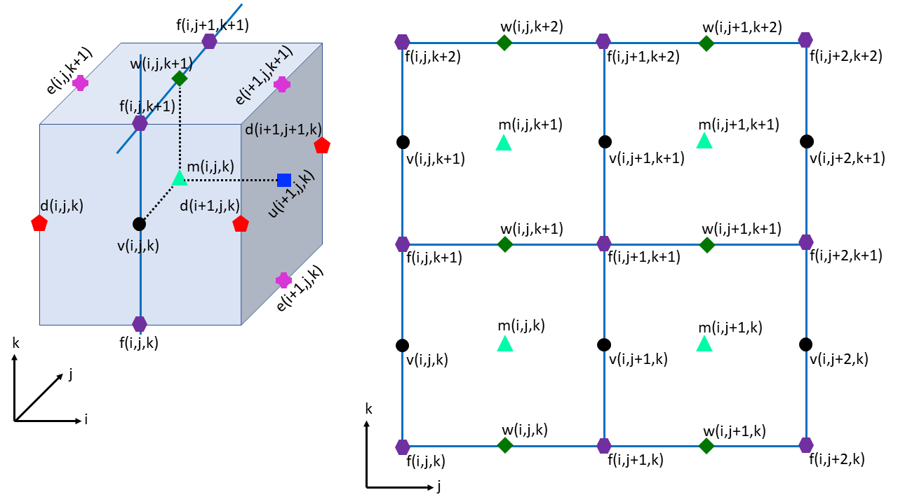

 .. role:: cpp(code)
    :language: c++

.. _ArakawaCGrid:

Arakawa C-Grid
==============
Variables are located on Arakawa C-grid as pictured in the images below.

.. image:: figures/grid_discretization/Arakawa_1.png
  :width: 400

