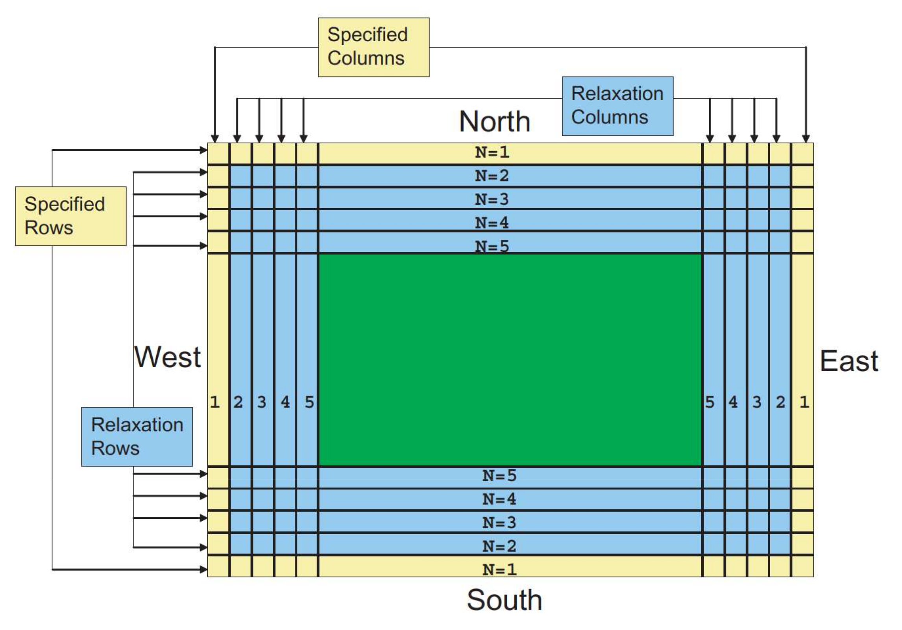
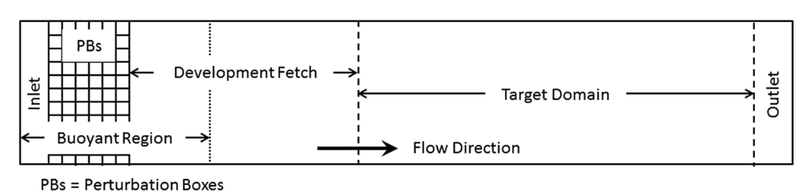

 .. role:: cpp(code)
    :language: c++

.. _sec:LateralBoundaryConditions:

Domain Boundary Conditions
~~~~~~~~~~~~~~~~~~~~~~~~~~~~~~~~~~~~~~~~~~~~~~~~~~~

Ideal Domain BCs
----------------------

There are two primary types of physical/domain boundary conditions: those which rely only on the
data in the valid regions, and those which rely on externally specified values.

ERF allows users to specify types of boundary condition with keywords in the inputs file.
The information for each face is preceded by
``xlo``, ``xhi``, ``ylo``, ``yhi``, ``zlo``, or ``zhi``.

Currently available type of boundary conditions are
``inflow``, ``outflow``, ``slipwall``, ``noslipwall``, ``symmetry`` or ``MOST``.
(Spelling of the type matters; capitalization does not.)

For example, setting

::

    xlo.type = "Inflow"
    xhi.type = "Outflow"
    zlo.type = "SlipWall"
    zhi.type = "SlipWall"

    geometry.is_periodic = 0 1 0

would define a problem with inflow in the low-\ :math:`x` direction,
outflow in the high-\ :math:`x` direction, periodic in the :math:`y`-direction,
and slip wall on the low and high :math:`y`-faces, and
Note that no keyword is needed for a periodic boundary, here only the
specification in ``geometry.is_periodic`` is needed.

Each of these types of physical boundary condition has a mapping to a mathematical boundary condition
for each type; this is summarized in the table below.

.. _sec:dirichlet:

ERF provides the ability to specify a variety of boundary conditions (BCs) in the inputs file.
We use the following options preceded by ``xlo``, ``xhi``, ``ylo``, ``yhi``, ``zlo``, and ``zhi``:

+------------+--------------+----------------+----------------+--------------------------+---------------+
| Type       | Normal vel   | Tangential vel | Density        | Theta                    | Scalar        |
+============+==============+================+================+==========================+===============+
| inflow     | ext_dir      | ext_dir        | ext_dir        | ext_dir                  | ext_dir       |
+------------+--------------+----------------+----------------+--------------------------+---------------+
| outflow    | foextrap     | foextrap       | foextrap       | foextrap                 | foextrap      |
+------------+--------------+----------------+----------------+--------------------------+---------------+
| slipwall   | ext_dir      | foextrap       | foextrap       | ext_dir/foextrap/neumann | foextrap      |
+------------+--------------+----------------+----------------+--------------------------+---------------+
| noslipwall | ext_dir      | ext_dir        | foextrap       | ext_dir/foextrap/neumann | foextrap      |
+------------+--------------+----------------+----------------+--------------------------+---------------+
| symmetry   | reflect_odd  | reflect_even   | reflect_even   | reflect_even             | reflect_even  |
+------------+--------------+----------------+----------------+--------------------------+---------------+
| MOST       |              |                |                |                          |               |
+------------+--------------+----------------+----------------+--------------------------+---------------+

Here ``ext_dir``, ``foextrap``, and ``reflect_even`` refer to AMReX keywords.   The ``ext_dir`` type
refers to an "external Dirichlet" boundary, which means the values must be specified by the user.
The ``foextrap`` type refers to "first order extrapolation" which sets all the ghost values to the
same value in the last valid cell/face  (AMReX also has a ``hoextrap``, or "higher order extrapolation"
option, which does a linear extrapolation from the two nearest valid values). By contrast, ``neumann``
is an ERF-specific boundary type that allows a user to specify a variable gradient. Currently, the
``neumann`` BC is only supported for theta to allow for weak capping inversion
(:math:`\partial \theta / \partial z`) at the top domain.

As an example,

::

    xlo.type                =   "Inflow"
    xlo.velocity            =   1. 0.9  0.
    xlo.density             =   1.
    xlo.theta               =   300.
    xlo.scalar              =   2.

sets the boundary condtion type at the low x face to be an inflow with xlo.type = “Inflow”.

xlo.velocity = 1. 0. 0. sets all three componentns the inflow velocity,
xlo.density       = 1. sets the inflow density,
xlo.theta         = 300. sets the inflow potential temperature,
xlo.scalar        = 2. sets the inflow value of the advected scalar

The "slipwall" and "noslipwall" types have options for adiabatic vs Dirichlet boundary conditions.
If a value for theta is given for a face with type "slipwall" or "noslipwall" then the boundary
condition for theta is assumed to be "ext_dir", i.e. theta is specified on the boundary.
If no value is specified then the wall is assumed to be adiabiatc, i.e. there is no temperature
flux at the boundary.  This is enforced with the "foextrap" designation.

For example

::

    zlo.type  = "NoSlipWall"
    zhi.type  = "NoSlipWall"

    zlo.theta = 301.0

would designate theta = 301 at the bottom (zlo) boundary, while
the top boundary condition would default to a zero gradient (adiabatic)
since no value is specified for ``zhi.theta`` or ``zhi.theta_grad``.
By contrast, thermal inversion may be imposed at the top boundary
by providing a specified gradient for theta

::

    zlo.type  = "NoSlipWall"
    zhi.type  = "NoSlipWall"

    zlo.theta = 301.0
    zhi.theta_grad = 1.0

We note that "noslipwall" allows for non-zero tangential velocities to be specified, as in the
Couette regression test example, in which we specify

::

    geometry.is_periodic = 1 1 0

    zlo.type = "NoSlipWall"
    zhi.type = "NoSlipWall"

    zlo.velocity    = 0.0 0.0 0.0
    zhi.velocity    = 2.0 0.0 0.0

We also note that in the case of a "slipwall" boundary condition in a simulation with non-zero
viscosity specified, the "foextrap" boundary condition enforces zero strain at the wall.

The keywork "MOST" is an ERF-specific boundary type; see :ref:`sec:MOST` for more information.

It is important to note that external Dirichlet boundary data should be specified
as the value on the face of the cell bounding the domain, even for cell-centered
state data.

Real Domain BCs
----------------------

When using real lateral boundary conditions, time-dependent observation data is read
from a file.  The observation data is utilized to directly set Dirichlet values on the
lateral domain BCs as well as nudge the solution state towards the observation data.
The user may specify (in the inputs file)
the total width of the interior Dirichlet and relaxation region with
``erf.real_width = <Int>`` (yellow + blue)
and analogously the width of the interior Dirichlet region may be specified with
``erf.real_set_width = <Int>`` (yellow).
The real BCs are only imposed for :math:`\psi = \left\{ \rho; \; \rho \theta; \; \rho q_v; \; u; \; v \right\}`.
Due to the staggering of scalars (cell center) and velocities (face center) with an Arakawa C grid,
we reduce the relaxation width of the scalars :math:`\left\{ \rho; \; \rho \theta; \; \rho q_v \right\}` by 1
to ensure the momentum updates at the last relaxation cell involve a pressure gradient that is computed with
relaxed and non-relaxed data.

.. _fig:lateral_BCs:

.. table:: Lateral boundaries

   +-----------------------------------------------------+
   |                     |wrfbdy|                        |
   +-----------------------------------------------------+
   |  Image taken from `Skamarock et al. (2021)`_        |
   +-----------------------------------------------------+

.. _`Skamarock et al. (2021)`: http://dx.doi.org/10.5065/1dfh-6p97

Within the interior Dirichlet cells, the RHS is exactly :math:`\psi^{n} - \ps^{BDY} / \Delta t`
and, as such, we directly impose this value in the yellow region.
Within the relaxation region (blue), the RHS (:math:`F`) is given by the following:

.. math::

   \begin{align}
   F &= G + R, \\
   R &= \left[ H_{1} \left( \psi^{BDY} - \psi^{\*} \right) - H_{2} \Delta^2 \left( \psi^{BDY} - \psi^{\*} \right) \right] \exp \left(-C_{01} \left(n - {\rm SpecWidth}\right)  \right), \\
   H_{1} &= \frac{1}{10 \Delta t} \frac{{\rm SpecWidth} + {\rm RelaxWidth} - n}{{\rm RelaxWidth} - 1}, \\
   H_{2} &= \frac{1}{50 \Delta t} \frac{{\rm SpecWidth} + {\rm RelaxWidth} - n}{{\rm RelaxWidth} - 1},
   \end{align}

where :math:`G` is the RHS of the Navier-Stokes equations, :math:`\psi^{*}` is the state variable at the
current RK stage, :math:`\psi^{BDY}` is temporal interpolation of the observational data, :math:`C_{01} = -\ln(0.01) / ({\rm RealWidth - SpecWidth})`
is a constant that ensure the exponential blending function obtains a value of 0.01 at the last relaxation cell,
and :math:`n` is the minimum number of grid points from a lateral boundary.

Sponge zone domain BCs
----------------------

ERF provides the capability to apply sponge zones at the boundaries to prevent spurious reflections that otherwise occur at the domain boundaries if standard extrapolation boundary condition is used. The sponge zone is implemented as a source term in the governing equations, which are active in a volumteric region at the boundaries that is specified by the user in the inputs file. Currently the target condition to which the sponge zones should be forced towards is to be specifed by the user in the inputs file.

.. math::

   \frac{dQ}{dt} = \mathrm{RHS} - A\xi^n(Q-Q_\mathrm{target})

where RHS are the other right-hand side terms. The parameters to be set by the user are -- `A` is the sponge amplitude, `n` is the sponge strength and the :math:`Q_\mathrm{target}` -- the target solution in the sponge. :math:`\xi` is a linear coordinate that is 0 at the beginning of the sponge and 1 at the end. An example of the sponge inputs can be found in ``Exec/RegTests/Terrain2d_Cylinder`` and is given below. This list of inputs specifies sponge zones in the inlet and outlet of the domain in the x-direction and the outlet of the domain in the z-direction. The `start` and `end` parameters specify the starting and ending of the sponge zones. At the inlet, the sponge starts at :math:`x=0` and at the outlet the sponge ends at :math:`x=L` -- the end of the domain. The sponge amplitude `A` has to be adjust
ed in a problem-specific manner. The density and the :math:`x, y, z` velocities to be used in the sponge zones have to be specified in the inputs list.

::

          erf.sponge_strength = 10000.0
          erf.use_xlo_sponge_damping = true
          erf.xlo_sponge_end = 4.0
          erf.use_xhi_sponge_damping = true
          erf.xhi_sponge_start = 26.0
          erf.use_zhi_sponge_damping = true
          erf.zhi_sponge_start = 8.0

          erf.sponge_density = 1.2
          erf.sponge_x_velocity = 10.0
          erf.sponge_y_velocity = 0.0
          erf.sponge_z_velocity = 0.0

Another way of specifying sponge zones is by providing the sponge zone data as a text file input. This is currently implemented only for forcing :math:`x` and :math:`y` velocities in the sponge zones.
The sponge data is input as a text file with 3 columns containing :math:`z, u, v` values. An example can be found in ``Exec/SpongeTest`` and a sample inputs list for using this feature is given below. This list specifies a sponge zone in the inlet in the x-direction. The :math:`u` and :math:`v` velocity forcing in the sponge zones will be read in from the text file -- `input_sponge_file.txt`.

::

          erf.sponge_type = "input_sponge"
          erf.input_sponge_file = "input_sponge_file.txt"
          erf.sponge_strength = 1000.0
          erf.use_xlo_sponge_damping = true
          erf.xlo_sponge_end = 4.0

Inflow turbulence generation
---------------------------

ERF provides the capability to apply a perturbation zone at the inflow domain boundary to mechanically trip turbulence into the domain.

.. _fig:pb_fig:

.. table:: Box perturbation method

   +-----------------------------------------------------+
   |                     |PBinflw|                       |
   +-----------------------------------------------------+
   |  Image taken from `DeLeon et al. (2018)`            |
   +-----------------------------------------------------+

Two different types of perturbation are currently avaliable, ``source``, adopted from `DeLeon et al. (2018)`_

.. _`DeLeon et al. (2018)`: https://doi.org/10.2514/1.J057245 

and ``direct``, adopted from `Muñoz-Esparza et al. (2015)`_.

.. _`Muñoz-Esparza et al. (2015)`: https://link.springer.com/article/10.1007/s10546-023-00786-1

The ``source`` option applies the perturbation amplitude range, `\pm \Phi_{PB}`, to each cell within the perturbation box as a source term. It's important to note that while this perturbation starts as white noise, it becomes colored noise due to the eddy viscosity turbulence closure. Conversely, the ``direct`` option applies the calculated temperature difference directly onto the `\rho \theta field`.

The current implementation only supports West and South face perturbations, specified by ``erf.perturbation_direction``, where the 3 integer inputs represent the `x`, `y`, and `z` directions, respectively. The flow perturbation method requires the dimensions of an individual box input through ``erf.perturbation_box_dim``, with 3 integer inputs representing `nx_{pb}`, `ny_{pb}`, and `nz_{pb}`, respectively. Following the guidance of `Ma and Senocak (2023)`_,

.. _`Ma and Senocak (2023)`: https://link.springer.com/article/10.1007/s10546-023-00786-1

the general rule of thumb is to use `H_{PB} = 1/8 \delta` as the height of the perturbation box, where `\delta` is the boundary layer height. The length of the box in the x-direction should be `L_{PB} = 2H_{PB}`. Depending on the direction of the bulk flow, the width of the box in the y-direction should be defined as `W_{PB} = L_{PB} \tan{\theta_{inflow}}`. Note that the current implementation only accepts ``int`` entries. Therefore, considering the domain size and mesh resolution, the dimensions of a singular box can be determined.

The specification of the number of layers and the offset into the domain of the perturbation boxes can be made through ``erf.perturbation_layers`` and ``erf.perturbation_offset``, respectively.

::

          erf.inlet_perturbation_type = "source"

          erf.perturbation_direction = 1 0 0
          erf.perturbation_box_dims = 8 8 4
          erf.perturbation_layers = 3
          erf.perturbation_offset = 1

          erf.perturbation_nondimensional = 0.042
          erf.perturbation_T_infinity = 300.0
          erf.perturbation_T_intensity = 0.1

Before delving into the details, it's important to note that the two methods are interchangeable. While we adhere to the guidelines from the referenced publications, the use of ``direct`` type forcing is not restricted to having unity cell height, nor is ``source`` type forcing limited to boxes. We have generalized the perturbation methods to allow for flexibility in mixing and matching different types of turbulence generation.

Source type forcing
-------------------

The perturbation update interval is determined by the equation,

.. math::

   \frac{t_p \langle U(z) \rangle_{PB}}{D_{PB}} = 1,

The change in the perturbation is defined as,

.. math::

   {Ri}_{PB} = \frac{g \beta \Delta \overline{\phi} H_{PB}}{{\langle U(z) \rangle}^2_{PB}}.

The magnitude of the perturbation, ignoring the advection and diffusion effects in the transport equation can be made through a proportionality ratio between the update time and change in the box temperature,

.. math::

   \Phi_{PB} \propto \frac{\Delta \overliner{\phi}}{t_p}

and the perturbation amplitude is determined by the equation,

.. math::

   \Phi_{PB} = \frac{Ri_{PB} {\langle U(z) \rangle}^3_{PB}}{g \beta D_{PB} H_{PB}}.

The ``source`` type forcing can adopt the box perturbation method by having the following inputs list.

::

          erf.inlet_perturbation_type = "source"

          erf.perturbation_direction = 1 0 0
          erf.perturbation_box_dims = 8 8 4
          erf.perturbation_layers = 3
          erf.perturbation_offset = 1

          erf.perturbation_nondimensional = 0.042 # Ri
          erf.perturbation_T_infinity = 300.0
          erf.perturbation_T_intensity = 0.1

Direct type forcing
-------------------

The perturbation update interval is determined by the equation,
.. math::

   \frac{t_p U_{1}}{d_{c}}

and the perturbation amplitude is determined by the equation,
.. math::

   Ec = \frac{{U_g}^2}{\rho c_p \theta_{pm}}.

The ``direct`` type forcing can adopt the cell perturbation method by having the following inputs list.
::

          erf.inlet_perturbation_type = "direct"

          erf.perturbation_direction = 1 0 0
          erf.perturbation_box_dims = 8 8 1
          erf.perturbation_layers = 3
          erf.perturbation_offset = 1

          erf.perturbation_nondimensional = 0.16 #Ec
          erf.perturbation_rho_0 = 1.0
          erf.perturbation_cp = 1250

From `Muñoz-Esparza et al. (2015)`_ the choice of the Eckert number is 0.16.
