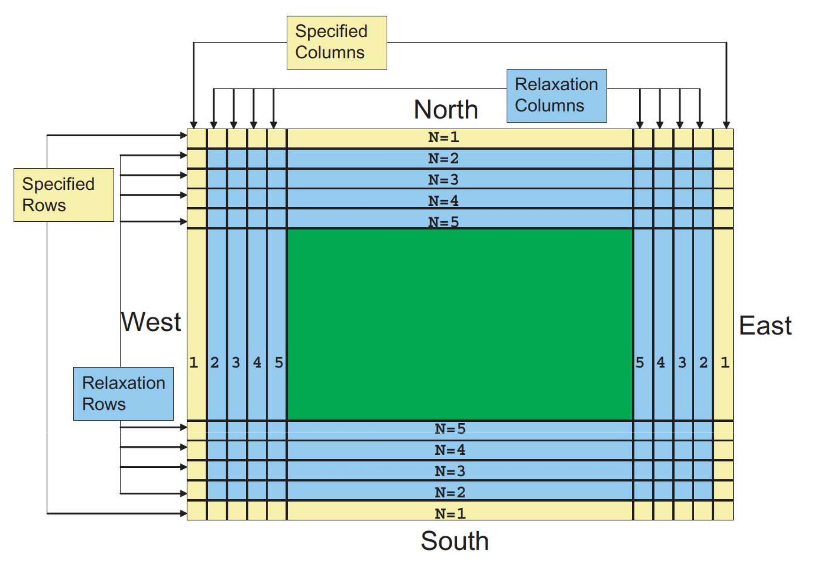

 .. role:: cpp(code)
    :language: c++

.. _sec:LateralBoundaryConditions:

Domain Boundary Condition Types
~~~~~~~~~~~~~~~~~~~~~~~~~~~~~~~~~~~~~~~~~~~~~~~~~~~

Lateral boundary conditions in ERF can be specified for idealized simulations as periodic, inflow, outflow, or open. More realistic conditions include the use of time-varying values read in from external files, such as the wrfbdy files generated by the WRF Preprocessing System (WPS).
ERF also has the option to run precursor simulations, save planes of data at specified times, and later read boundary data from those files analogously to how data from the wrfbdy are used.

The bottom surface boundary condition can be specified as a simple wall or by using Monin-Obukhov similarity theory (MOST).
When utilizing MOST, the surface roughness, :math:`z_0`, may be specified as a constant, read from a file,
or dynamically computed from the Charnock or shallow water formulation.
Time-varying sea surface temperatures may also be employed in conjunction with MOST.

Ideal Domain BCs
----------------------

There are two primary types of physical/domain boundary conditions: those which rely only on the
data in the valid regions, and those which rely on externally specified values.

ERF allows users to specify types of boundary condition with keywords in the inputs file.
The information for each face is preceded by
``xlo``, ``xhi``, ``ylo``, ``yhi``, ``zlo``, or ``zhi``.

Currently available type of boundary conditions are
``inflow``, ``outflow``, ``inflow_outflow``, ``slipwall``, ``noslipwall``, ``symmetry`` or ``surface_layer``.
(Spelling of the type matters; capitalization does not.)

For example, setting

::

    xlo.type = "inflow"
    xhi.type = "outflow"
    zlo.type = "slipwall"
    zhi.type = "slipwall"

    geometry.is_periodic = 0 1 0

would define a problem with inflow in the low-\ :math:`x` direction,
outflow in the high-\ :math:`x` direction, periodic in the :math:`y`-direction,
and slip wall on the low and high :math:`y`-faces, and
Note that no keyword is needed for a periodic boundary, here only the
specification in ``geometry.is_periodic`` is needed.

Each of these types of physical boundary condition has a mapping to a mathematical boundary condition
for each type; this is summarized in the table below.

.. _sec:dirichlet:

ERF provides the ability to specify a variety of boundary conditions (BCs) in the inputs file.
We use the following options preceded by ``xlo``, ``xhi``, ``ylo``, ``yhi``, ``zlo``, and ``zhi``:

+---------------+--------------+----------------+----------------+--------------------------+---------------+
| Type          | Normal vel   | Tangential vel | Density        | Theta                    | Scalar        |
+===============+==============+================+================+==========================+===============+
| inflow        | ext_dir      | ext_dir        | ext_dir        | ext_dir                  | ext_dir       |
+---------------+--------------+----------------+----------------+--------------------------+---------------+
| outflow       | foextrap     | foextrap       | foextrap       | foextrap                 | foextrap      |
+---------------+--------------+----------------+----------------+--------------------------+---------------+
| inflowoutflow | ext_dir if   | ext_dir if     | ext_dir if     | ext_dir if               | ext_dir if    |
|               | inflowing;   | inflowing;     | inflowing;     | inflowing;               | inflowing;    |
|               | otherwise    | otherwise      | otherwise      | otherwise                | otherwise     |
|               | foextrap     | foextrap       | foextrap       | foextrap                 | foextrap      |
+---------------+--------------+----------------+----------------+--------------------------+---------------+
| slipwall      | ext_dir      | foextrap       | foextrap       | ext_dir/foextrap/neumann | foextrap      |
+---------------+--------------+----------------+----------------+--------------------------+---------------+
| noslipwall    | ext_dir      | ext_dir        | foextrap       | ext_dir/foextrap/neumann | foextrap      |
+---------------+--------------+----------------+----------------+--------------------------+---------------+
| symmetry      | reflect_odd  | reflect_even   | reflect_even   | reflect_even             | reflect_even  |
+---------------+--------------+----------------+----------------+--------------------------+---------------+
| surface_layer | ext_dir      | hoextrap       | hoextrap       | hoextrap                 | hoextrap      |
+---------------+--------------+----------------+----------------+--------------------------+---------------+

Here ``ext_dir``, ``foextrap``, and ``reflect_even`` refer to AMReX keywords.   The ``ext_dir`` type
refers to an "external Dirichlet" boundary, which means the values must be specified by the user.
The ``foextrap`` type refers to "first order extrapolation" which sets all the ghost values to the
same value in the last valid cell/face. By contrast, ``hoextrap``, or "higher order extrapolation",
does a linear extrapolation from the two nearest valid values. The ``neumann`` condition
is an ERF-specific boundary type that allows a user to specify a variable gradient. Currently, the
``neumann`` BC is only supported for theta to allow for weak capping inversion
(:math:`\partial \theta / \partial z`) at the top domain. The ``surface_layer`` condition is an ERF-specific
boundary type that employs the above set of boundary conditions but also directly specifies the
subgrid scale diffusive fluxes; see :ref:`sec:surface_layer` for more information.

As an example,

::

    xlo.type                =   inflow
    xlo.velocity            =   1. 0.9  0.
    xlo.density             =   1.
    xlo.theta               =   300.
    xlo.scalar              =   2.

sets the boundary condition type at the low x face to be an inflow with xlo.type = “inflow”.

xlo.velocity = 1. 0. 0. sets all three componentns the inflow velocity,
xlo.density       = 1. sets the inflow density,
xlo.theta         = 300. sets the inflow potential temperature,
xlo.scalar        = 2. sets the inflow value of the advected scalar

Non-reflecting inflow
^^^^^^^^^^^^^^^^^^^^^

By default, the ``inflow`` boundary prescribes Dirichlet values for all variables
including :math:`\rho\theta`, which implicitly fixes the pressure in the ghost cells.
This causes upstream-propagating acoustic waves to reflect off the boundary,
which can destabilize simulations with terrain or other pressure perturbation sources.

Setting ``nonreflecting = true`` on an inflow face switches the :math:`\rho\theta`
boundary condition from ``ext_dir`` to ``foextrap`` (zero-gradient extrapolation from
the interior) while keeping velocity and density prescribed. This allows the outgoing
acoustic characteristic (pressure) to exit the domain.

::

    xlo.type            = “Inflow”
    xlo.velocity        = 10. 0. 0.
    xlo.density         = 1.16
    xlo.theta           = 300.
    xlo.nonreflecting   = true

Additionally, one may use an input file to specify the Dirichlet velocities as a function of the
vertical coordinate z. The input file is expected to contain either ``{z  u  v  w}`` or
``{z  u  v  w  theta}`` and is currently only available for the ``xlo`` face. For a file
named ``inflow_file`` that contains the variables ``{z  u  v  w}``, one would use
the inputs below; note, that if the inflow file contains ``{z  u  v  w  theta}`` then the
below example should be modified to ``not`` include ``xlo.theta = <val>``.
If ``theta`` is provided, it is by default the primitive variable, not the conserved quantity
rho*theta. To specify rho*theta instead, ``xlo.read_prim_theta = false`` should be set.

::

    xlo.type                =   "inflow"
    xlo.dirichlet_file      =   "inflow_file"
    xlo.density             =   1.
    xlo.theta               =   300.
    xlo.scalar              =   2.

The ``slipwall`` and ``noslipwall`` types have options for adiabatic vs Dirichlet boundary conditions.
If a value for theta is given for a face with type ``slipwall`` or ``noslipwall`` then the boundary
condition for theta is assumed to be "ext_dir", i.e. theta is specified on the boundary.
If no value is specified then the wall is assumed to be adiabatic, i.e. there is no temperature
flux at the boundary.  This is enforced with the "foextrap" designation.

Solid-wall scalar inputs are independent on each physical face. A density
specified on ``xlo`` does not change how ``theta`` or ``qv`` is interpreted on
``xhi``, and a face that omits density remains primitive even when another
face supplies density. Presence is explicit: numerical zero is a valid input.
In particular, ``qv = 0.0`` on a supported ``noslipwall`` requests an
explicitly dry wall; it does not request the default extrapolated value.

Users continue to provide primitive ``theta`` and ``qv`` values. In a
compressible simulation, supplying density on the same face causes ERF to
store the corresponding conserved value (for example,
``rho*theta = density*theta``). When same-face density is omitted, ERF uses
the primitive value through ``ext_dir_prim`` and the adjacent valid-cell
density. A fixed value and a gradient for the same variable on the same face
are mutually exclusive; for example, ``zhi.theta`` and ``zhi.theta_grad``
together produce an input error. A supplied gradient is recognized even when
its value is exactly zero. The currently supported Neumann wall input is
theta; qv input is supported on no-slip walls, not slip walls.

In anelastic simulations, omit ``density`` and ``density_grad`` on all
solid-wall faces. Anelastic ERF evolves with fixed/base-state density, while
Stage 0 wall theta and qv values are primitive wall properties. Supplying a
separate wall density would therefore describe an inconsistent boundary
contract. This restriction does not apply to inflow boundaries.

For example

::

    zlo.type  = "NoSlipWall"
    zhi.type  = "NoSlipWall"

    zlo.theta = 301.0

would designate theta = 301 at the bottom (zlo) boundary, while
the top boundary condition would default to a zero gradient (adiabatic)
since no value is specified for ``zhi.theta`` or ``zhi.theta_grad``.
By contrast, thermal inversion may be imposed at the top boundary
by providing a specified gradient for theta

::

    zlo.type  = "NoSlipWall"
    zhi.type  = "NoSlipWall"

    zlo.theta = 301.0
    zhi.theta_grad = 1.0

We note that ``noslipwall`` allows for non-zero tangential velocities to be specified, as in the
Couette regression test example, in which we specify

::

    geometry.is_periodic = 1 1 0

    zlo.type = "NoSlipWall"
    zhi.type = "NoSlipWall"

    zlo.velocity    = 0.0 0.0 0.0
    zhi.velocity    = 2.0 0.0 0.0

We also note that in the case of a ``slipwall`` boundary condition in a simulation with non-zero
viscosity specified, the "foextrap" boundary condition enforces zero strain at the wall.

It is important to note that external Dirichlet boundary data should be specified
as the value on the face of the cell bounding the domain, even for cell-centered
state data.

Wall scalar flux convention
^^^^^^^^^^^^^^^^^^^^^^^^^^^

For chamber budgets, a wall-normal scalar flux ``J_in`` is positive from the
wall into the fluid. ERF's diffusive face flux is oriented toward increasing
coordinate, so ``F_d = +J_in`` on a low face and ``F_d = -J_in`` on a high
face; equivalently, ``F dot n = -J_in``. With uniform Cartesian cells,

.. math::

   \frac{d}{dt}\sum_C V_C U_C = \sum_{f\in\partial\Omega} A_f J_{in,f} + \sum_C V_C S_C.

Stage 0 establishes this convention for manufactured tests and future wall
work; it does not add a direct prescribed wall-flux input keyword.

Chamber Stage 0 foundation
^^^^^^^^^^^^^^^^^^^^^^^^^^

The Stage 0 chamber foundation is a six-wall ``NoSlipWall`` anelastic case.
Selected faces may specify primitive potential temperature through the
existing ``<face>.theta`` keyword; faces that omit both ``<face>.theta`` and
``<face>.theta_grad`` are adiabatic. The supported example is limited to a
rectangular Cartesian domain with uniform ``dx``, ``dy``, and ``dz``;
no terrain-fitted coordinates, stretched vertical grid, or embedded
boundaries; and ``erf.vert_implicit = false``. It is a foundation for later
chamber configurations, not a general wall-model implementation: it does not
add direct heat/moisture fluxes, temperature/RH conversion, roughness laws,
conjugate wall conduction, or particle-wall physics.

Real Domain BCs
----------------------

When using real lateral boundary conditions, time-dependent observation data is read
from a file. In ERF, the observation (BDY) data is utilized to nudge the solution state towards
the observation data in the interior of the domain. We explicitly note that the wall normal
velocity on a domain boundary are set to the observational data and the RHS for these points
is assigned the BDY tendency. The user may specify (in the inputs file) the total
width of the interior boundary region with ``erf.real_width = <Int>`` (yellow + blue).
The real BCs are only imposed for :math:`\psi = \left\{ \theta; \; q_v; \; u; \; v \right\}`.

.. _fig:lateral_BCs:

.. table:: Lateral boundaries

   +-----------------------------------------------------+
   |                     |wrfbdy|                        |
   +-----------------------------------------------------+
   |  Image taken from `Skamarock et al. (2021)`_        |
   +-----------------------------------------------------+

.. _`Skamarock et al. (2021)`: http://dx.doi.org/10.5065/1dfh-6p97

To nudge the state data towards the observation data, we add a source term (:math:`G`) to the RHS (:math:`F`)
of the governing equations:

.. math::

   \begin{align}
   G &= \frac{1}{A \Delta t} \xi^{2} \left( \psi^{BDY} - \psi^{*} \right),
   \end{align}

where :math:`A` is specified with ``erf.bdy_nudge_factor`` (defaults to 10.0),
:math:`\psi^{*}` is the state variable at the current RK stage, :math:`\psi^{BDY}` is
the temporal interpolation of the observational data, and :math:`\xi` is a linear coordinate
that is 1 at the domain boundary and 0 at the edge of the nudge region.

For turbulent inflow perturbations, including the ``erf.perturbation_type`` options and
their placement on level subdomains, see :doc:`InflowTurbulenceGeneration`.

ERF Boundary Data Files
----------------------

For real lateral boundary conditions, ``init_type`` of ``metgrid`` or ``wrfinput``, ERF can
write lateral boundary data to an AMReX-native file during initialization. The file name is
configurable with ``erf.erfbdy_file`` (default ``"erfbdy"``). Use of the the erfbdy file is
mandatory for ``init_type`` of ``metgrid``, but can be optionally disabled for ``init_type``
of ``wrfinput`` with ``erf.write_erfbdy = false`` so that the boundary data is processed
as-needed during time integration.
