#########################################
Discretizations
#########################################
Last update: 2021-11-24

NOTE: For the sake of simplicity, the discretized equations mention time levels :math:`n` and :math:`n+1`. They should be treated as initial and final states of each RK3 stage.

Staggered Grids
===============
The staggered grids indicating where different variables are located.

XY Plane
--------
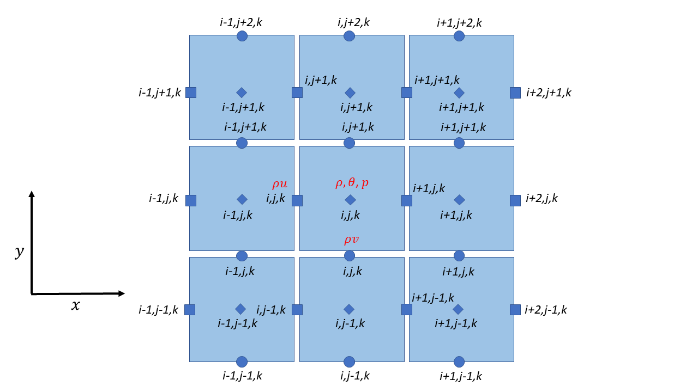

YZ Plane
--------
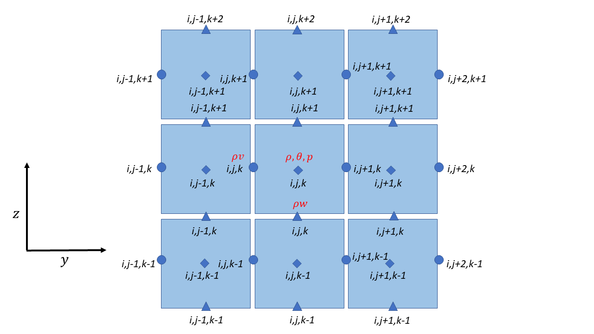

Mass Conservation
=================

.. math::

   \begin{align}
   \rho_{i,j,k}^{n + 1} = \rho_{i,j,k}^{n} - \Delta t & \left\{         \frac{1}{\Delta x} \left\lbrack \left( \rho u \right)_{i + 1,j,k}^{n} - \left( \rho u \right)_{i.j,k}^{n} \right\rbrack \right. \\
                                                      & \hspace{-5pt} + \frac{1}{\Delta y} \left\lbrack \left( \rho v \right)_{i,j + 1,k}^{n} - \left( \rho v \right)_{i.j,k}^{n} \right\rbrack \\
                                                      & \left. +        \frac{1}{\Delta z} \left\lbrack \left( \rho w \right)_{i,j,k + 1}^{n} - \left( \rho w \right)_{i,j,k}^{n} \right\rbrack \right\}
   \end{align}

Contributions from different directions
---------------------------------------
.. image:: figures/grid_discretization/continuity_x.PNG
  :width: 400
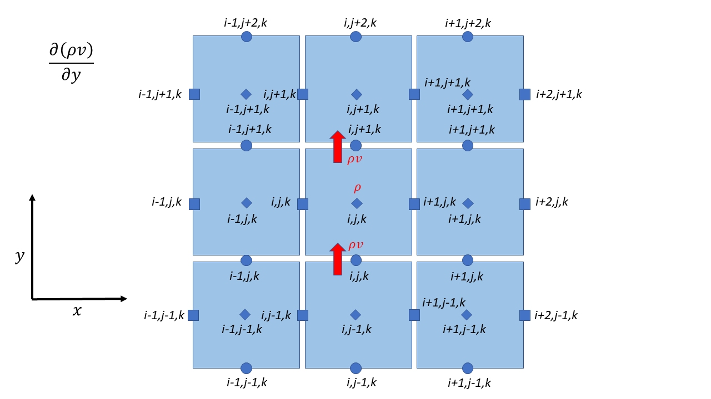
.. image:: figures/grid_discretization/continuity_z.PNG
  :width: 400

Advection Contribution to DNS/LES
=================================

U Momentum
----------------------------------

.. math::

   \begin{align}
   \left( \rho u \right)_{i,j,k}^{n + 1} & = \left( \rho u \right)_{i,j,k}^{n} - \\
      \Delta t &  \left\{ \frac{1}{2\Delta x}\ \left\lbrack \left( \left( \rho u \right)_{i + 1,j,k}^{n} + \left( \rho u \right)_{i,j,k}^{n}         \right)u_{i + \frac{1}{2},j,k}^{n} - \left( \left( \rho u \right)_{i,j,k}^{n} + \left( \rho u \right)_{i - 1,j,k}^{n} \right)u_{i - \frac{1}{2},j,k}^{n} \right\rbrack \right.  \\
               &        + \frac{1}{2\Delta y}  \left\lbrack \left( \left( \rho v \right)_{i,j + 1,k}^{n} + \left( \rho v \right)_{i - 1,j + 1,k}^{n} \right)u_{i,j + \frac{1}{2},k}^{n} - \left( \left( \rho v \right)_{i,j,k}^{n} + \left( \rho v \right)_{i - 1,j,k}^{n} \right)u_{i,j - \frac{1}{2},k}^{n} \right\rbrack          \\
               & + \left. \frac{1}{2\Delta z}  \left\lbrack \left( \left( \rho w \right)_{i,j,k + 1}^{n} + \left( \rho w \right)_{i - 1,j,k + 1}^{n} \right)u_{i,j,k + \frac{1}{2}}^{n} - \left( \left( \rho w \right)_{i,j,k}^{n} + \left( \rho w \right)_{i - 1,j,k}^{n} \right)u_{i,j,k - \frac{1}{2}}^{n} \right\rbrack \right\} \\
               & - \frac{\Delta t}{\Delta x}\left\lbrack p_{i,\ j,\ k}^{n} - p_{i - 1,\ j,\ k}^{n} \right\rbrack \\
   \end{align}

Contributions from different directions
~~~~~~~~~~~~~~~~~~~~~~~~~~~~~~~~~~~~~~~
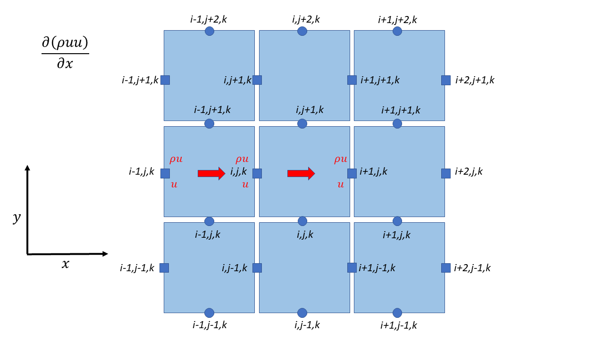
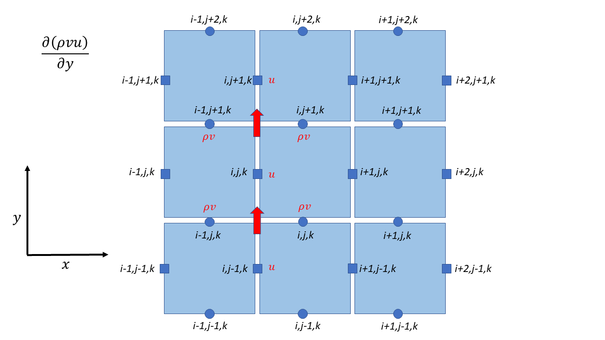
.. image:: figures/grid_discretization/x_mom_advec_z.PNG
  :width: 400

V Momentum
----------------------------------

.. math::

   \begin{align}
   \left( \rho v \right)_{i,j,k}^{n + 1} & = \left( \rho v \right)_{i,j,k}^{n} - \\
    \Delta t & \left\{    \frac{1}{2\Delta x}\ \left\lbrack \left( \left( \rho u \right)_{i + 1,j,k}^{n} + \left( \rho u \right)_{i + 1,j - 1,k}^{n} \right)v_{i + \frac{1}{2},j,k}^{n} - \left( \left( \rho u \right)_{i,j,k}^{n} + \left( \rho u \right)_{i,j - 1,k}^{n} \right)v_{i - \frac{1}{2},j,k}^{n} \right\rbrack \right.  \\
             & +          \frac{1}{2\Delta y}  \left\lbrack \left( \left( \rho v \right)_{i,j + 1,k}^{n} + \left( \rho v \right)_{i,j,k}^{n}         \right)v_{i,j + \frac{1}{2},k}^{n} - \left( \left( \rho v \right)_{i,j,k}^{n} + \left( \rho v \right)_{i,j - 1,k}^{n} \right)v_{i,j - \frac{1}{2},k}^{n} \right\rbrack          \\
             & + \left. \ \frac{1}{2\Delta z}  \left\lbrack \left( \left( \rho w \right)_{i,j,k + 1}^{n} + \left( \rho w \right)_{i,j - 1,k + 1}^{n} \right)v_{i,j,k + \frac{1}{2}}^{n} - \left( \left( \rho w \right)_{i,j,k}^{n} + \left( \rho w \right)_{i,j - 1,k}^{n} \right)v_{i,j,k - \frac{1}{2}}^{n} \right\rbrack \right\} \\
             & - \frac{\Delta t}{\Delta y}\left\lbrack p_{i,j,\ k}^{n} - p_{i,\ j - 1,\ k}^{n} \right\rbrack \\
   \end{align}

Contributions from different directions
~~~~~~~~~~~~~~~~~~~~~~~~~~~~~~~~~~~~~~~
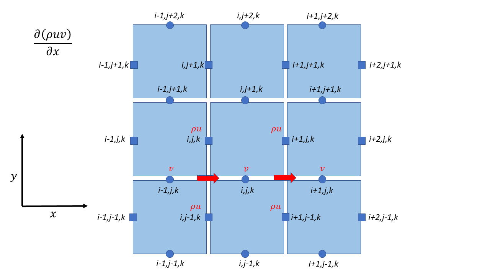
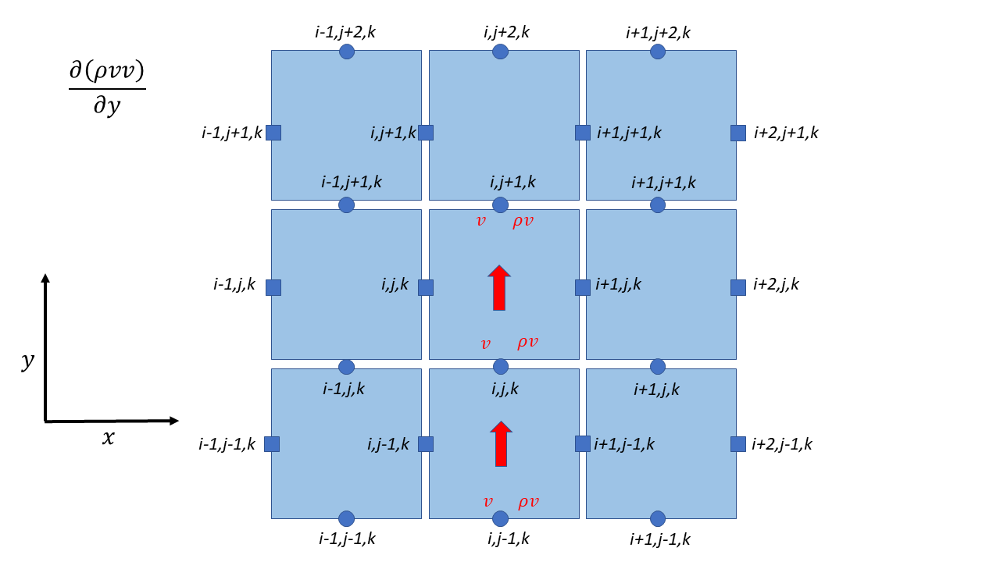
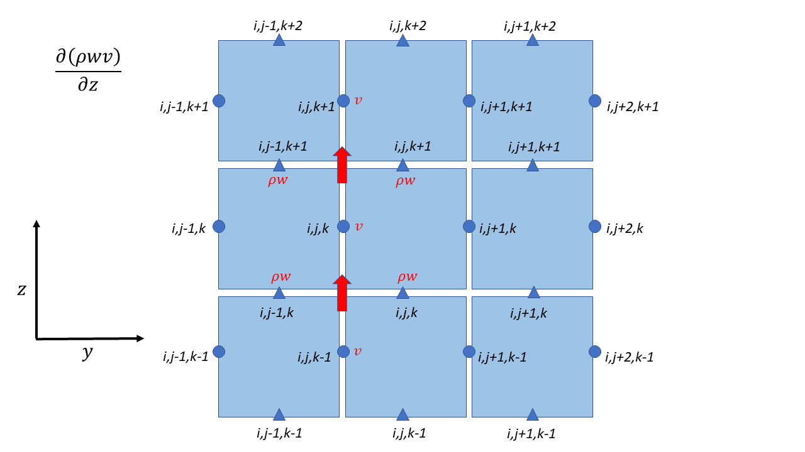

W Momentum
----------

.. math::

   \begin{align}
   \left( \rho w \right)_{i,j,k}^{n + 1} & = \left( \rho w \right)_{i,j,k}^{n} - \\
   \Delta t & \left\{    \frac{1}{2\Delta x}\ \left\lbrack \left( \left( \rho u \right)_{i + 1,j,k}^{n} + \left( \rho u \right)_{i + 1,j,k - 1}^{n} \right)w_{i + \frac{1}{2},j,k}^{n} - \left( \left( \rho u \right)_{i,j,k}^{n} + \left( \rho u \right)_{i,j,k - 1}^{n} \right)w_{i - \frac{1}{2},j,k}^{n} \right\rbrack \right.  \\
            & +          \frac{1}{2\Delta y}  \left\lbrack \left( \left( \rho v \right)_{i,j + 1,k}^{n} + \left( \rho v \right)_{i,j + 1,k - 1}^{n} \right)w_{i,j + \frac{1}{2},k}^{n} - \left( \left( \rho v \right)_{i,j,k}^{n} + \left( \rho v \right)_{i,j,k - 1}^{n} \right)w_{i,j - \frac{1}{2},k}^{n} \right\rbrack          \\
            & + \left. \ \frac{1}{2\Delta z}  \left\lbrack \left( \left( \rho w \right)_{i,j,k + 1}^{n} + \left( \rho w \right)_{i,j,k}^{n}         \right)w_{i,j,k + \frac{1}{2}}^{n} - \left( \left( \rho w \right)_{i,j,k}^{n} + \left( \rho w \right)_{i,j,k - 1}^{n} \right)w_{i,j,k - \frac{1}{2}}^{n} \right\rbrack \right\} \\
            & - \frac{\Delta t}{\Delta z}\left\lbrack p_{i,\ j,\ k}^{n} - p_{i,\ j,\ \ k - 1}^{n} \right\rbrack\  + \ \Delta t \left\lbrack \rho_{i,j,k - \ \frac{1}{2}}^{n} \right\rbrack g \\
   \end{align}

Contributions from different directions
~~~~~~~~~~~~~~~~~~~~~~~~~~~~~~~~~~~~~~~
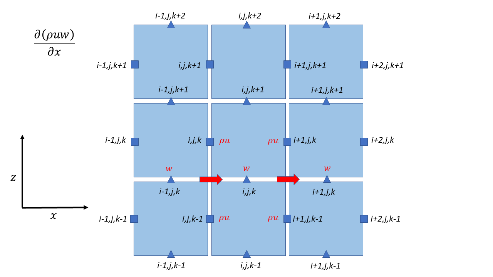
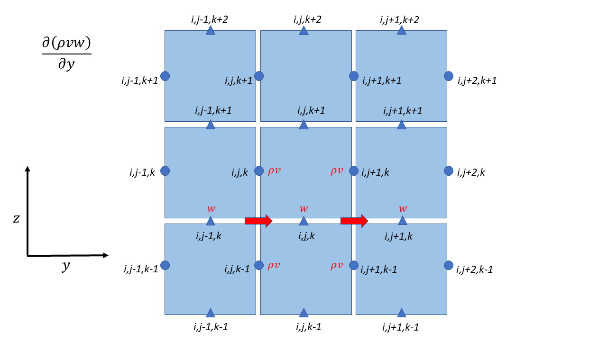
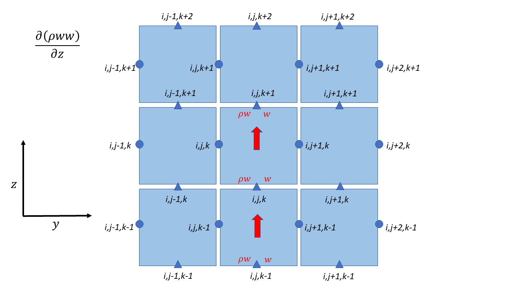

Potential Temperature Advection
-----------------------------------------------------

.. math::

   \begin{align}
   \left( \rho \theta \right)_{i,j,k}^{n + 1}  = \left( \rho \theta \right)_{i,j,k}^{n} -
    \Delta t &   \left\{ \frac{1}{\Delta x}\ \left\lbrack \left( \rho u \right)_{i + 1,j,k}^{n} \theta_{i + \frac{1}{2},j,k}^{n} - \left( \rho u \right)_{i,j,k}^{n} \theta_{i - \frac{1}{2},j,k}^{n} \right\rbrack \right.  \\
             & +         \frac{1}{\Delta y}  \left\lbrack \left( \rho v \right)_{i,j + 1,k}^{n} \theta_{i,j + \frac{1}{2},k}^{n} - \left( \rho v \right)_{i,j,k}^{n} \theta_{i,j - \frac{1}{2},k}^{n} \right\rbrack          \\
             & + \left.  \frac{1}{\Delta z}  \left\lbrack \left( \rho w \right)_{i,j,k + 1}^{n} \theta_{i,j,k + \frac{1}{2}}^{n} - \left( \rho w \right)_{i,j,k}^{n} \theta_{i,j,k - \frac{1}{2}}^{n} \right\rbrack \right\} \\
   \end{align}

Contributions from different directions
~~~~~~~~~~~~~~~~~~~~~~~~~~~~~~~~~~~~~~~
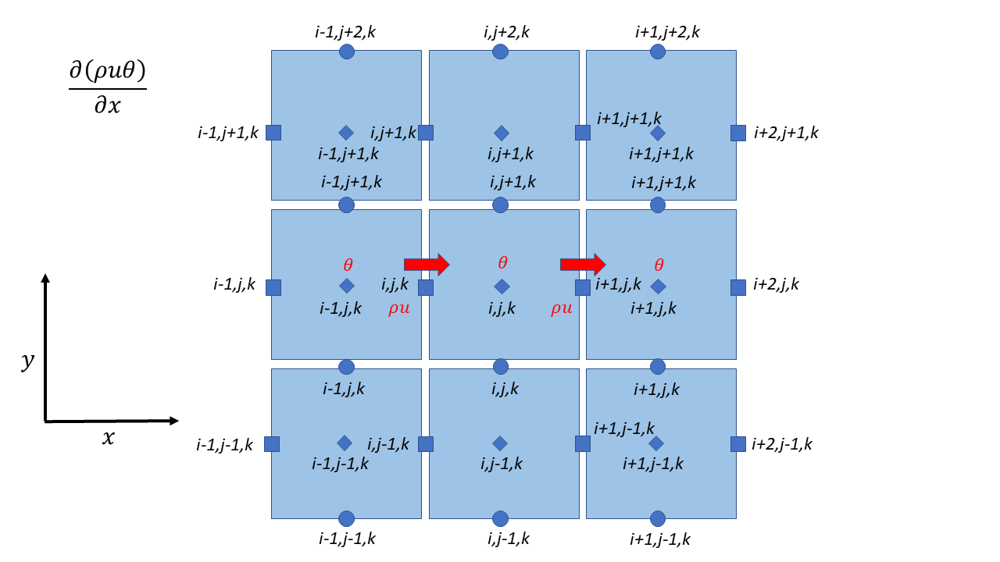
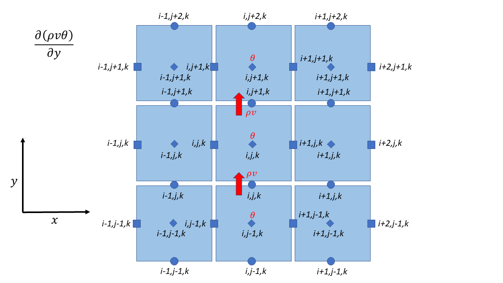
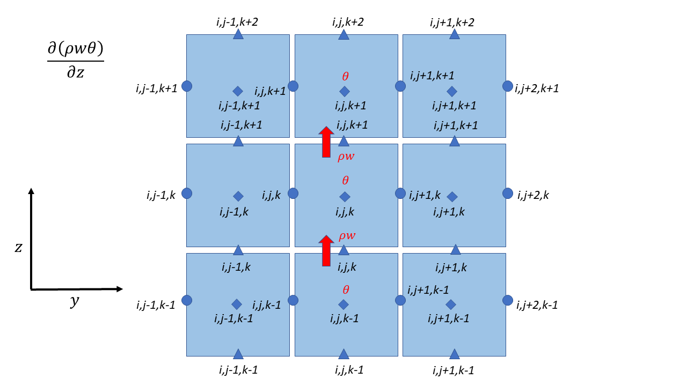

Scalar Advection
-----------------------------------------------------

.. math::

   \begin{align}
   \left( \rho C \right)_{i,j,k}^{n + 1} = \left( \rho C \right)_{i,j,k}^{n} -
   \Delta t & \left\{  \frac{1}{\Delta x}\ \left\lbrack \left( \rho u \right)_{i + 1,j,k}^{n} C_{i + \frac{1}{2},j,k}^{n} - \left( \rho u \right)_{i,j,k}^{n} C_{i - \frac{1}{2},j,k}^{n} \right\rbrack \right.  \\
            & +        \frac{1}{\Delta y}  \left\lbrack \left( \rho v \right)_{i,j + 1,k}^{n} C_{i,j + \frac{1}{2},k}^{n} - \left( \rho v \right)_{i,j,k}^{n} C_{i,j - \frac{1}{2},k}^{n} \right\rbrack          \\
            & + \left. \frac{1}{\Delta z}  \left\lbrack \left( \rho w \right)_{i,j,k + 1}^{n} C_{i,j,k + \frac{1}{2}}^{n} - \left( \rho w \right)_{i,j,k}^{n} C_{i,j,k - \frac{1}{2}}^{n} \right\rbrack \right\} \\
   \end{align}

Contributions from different directions
~~~~~~~~~~~~~~~~~~~~~~~~~~~~~~~~~~~~~~~
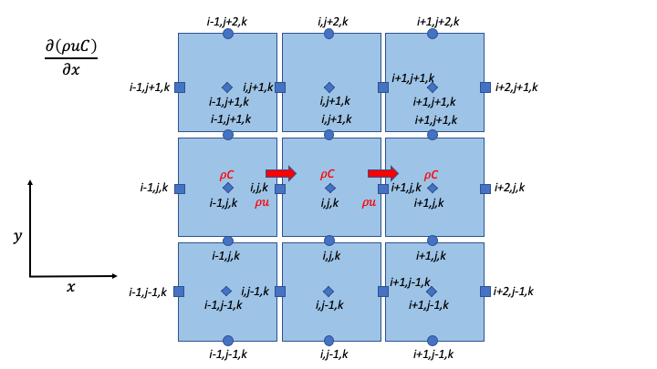
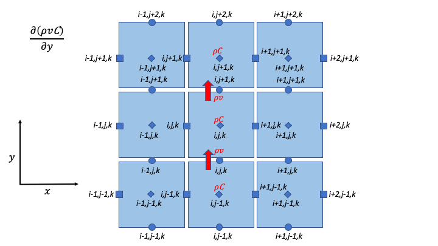
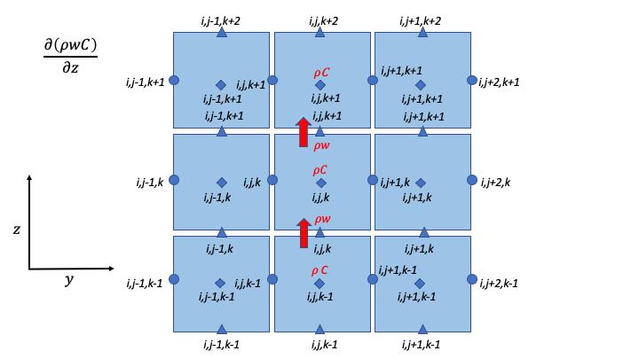

Diagnostic Variables
--------------------

.. math::

  p_{i, j, k}^n = (\rho_{i, j, k}^n R_d \theta_{i, j, k}^n / p_0^{R_d / c_p} )^\gamma

.. math::

  T_{i, j, k}^n =  \frac{p_{i, j, k}^n}{  \rho_{i, j, k}^n R_d}

Here :math:`\rho_{i, j, k}^n, T_{i, j, k}^n, \theta_{i, j, k}^n`, and :math:`p_{i, j, k}^n` are the density, temperature, potential temperature and pressure, respectively;
these variables are all defined at cell centers of cell indexed by :math:`(i, j, k)` and at time level :math:`n`.

:math:`R_d` and :math:`c_p` are the gas constant and specific heat capacity for dry air respectively,
and :math:`\gamma = c_p / (c_p - R_d)` .  :math:`p_0` is a reference value for pressure.

Differencing of Different Orders
================================

Interpolation Methods
---------------------
The midpoint values given above :math:`q_{m - \frac{1}{2}}`, where :math:`q` may be :math:`[u, v, w, \theta, C]`, :math:`m = i, j, k`, :math:`U_d = [u, v, w]` for :math:`[x, y, z]` directions respectively, the following interpolation schemes are available:

.. math::

   \begin{array}{lll}
   \left. q_{m - \frac{1}{2}} \right|^{2nd} = \frac{1}{2}\left( q_{m} + q_{m - 1} \right)   & & \\
   \left. q_{m - \frac{1}{2}} \right|^{4th} = \frac{7}{12}\left( q_{m} + q_{m - 1} \right)  & \hspace{-5pt} - \frac{1}{12}\left( q_{m + 1} + q_{m - 2} \right)                                                          & \\
   \left. q_{m - \frac{1}{2}} \right|^{6th} = \frac{37}{60}\left( q_{m} + q_{m - 1} \right) & \hspace{-5pt} - \frac{2}{15}\left( q_{m + 1} + q_{m - 2} \right)                                                          & \hspace{-5pt} + \frac{1}{60}\left( q_{m + 2} + q_{m - 3} \right) \\
    & & \\
   \left. q_{m - \frac{1}{2}} \right|^{3rd} = \left. q_{m - \frac{1}{2}} \right|^{4th}      & \hspace{-5pt} + \beta_{\text{up}}\frac{U_{d}}{\left| U_{d} \right|}\frac{1}{12}\left\lbrack \left( q_{m + 1} - q_{m - 2} \right) \right.\  & \hspace{-5pt} - 3\left. \ \left( q_{m} - q_{m - 1} \right) \right\rbrack \\
    & & \\
   \left. q_{m - \frac{1}{2}} \right|^{5th} = \left. q_{m - \frac{1}{2}} \right|^{6th}      & \hspace{-5pt} - \beta_{\text{up}}\frac{U_{d}}{\left| U_{d} \right|}\frac{1}{60}\left\lbrack \left( q_{m + 2} - q_{m - 1} \right) \right.\  & \hspace{-5pt} - 5\left( q_{m + 1} - q_{m - 2} \right) + 10\left. \left( q_{m} - q_{m - 1} \right) \right\rbrack
   \end{array}

An extra blending factor (:math:`\beta_{\text{up}}`) has been added to allow control
over the amount of upwinding added to the scheme. This hybrid scheme has been
demonstrated by Sauer and Muñoz-Esparza (2020, JAMES).

Refs:

Skamarock, W. C., Klemp, J. B., Dudhia, J., Gill, D. O., Liu, Z., Berner, J., ... Huang, X. -yu. (2019). A Description of the Advanced Research WRF Model Version 4 (No. NCAR/TN-556+STR). `doi:10.5065/1dfh-6p97 <http://dx.doi.org/10.5065/1dfh-6p97>`_

Sauer, J. A., & Muñoz-Esparza, D. (2020). The FastEddy® resident-GPU accelerated large-eddy simulation framework: Model formulation, dynamical-core validation and performance benchmarks. Journal of Advances in Modeling Earth Systems, 12, e2020MS002100. doi:10.1029/2020MS002100

WENO Methods
------------
Additionally, weighted essentially non-oscillatory (WENO) schemes are available for :math:`3rd` and :math:`5th` order interpolation. The general formulation is as follows:

.. math::

   \begin{array}{ll}
   q_{m + \frac{1}{2}} = \sum_{n=1}^{N} w_n q_{m + \frac{1}{2}}^{(n)} &  \\
   w_{n} = \frac{\hat{w}_{n}}{\sum_{l=1}^{N} \hat{w}_{l}} & \hat{w}_{l} = \frac{\omega_{l}}{\left(\epsilon + \beta_{l} \right)^2} \\
   \end{array}

With the WENO3 scheme, one has :math:`N=2, \; \omega_{1} = 1/3, \; \omega_{2} = 2/3` and the following closures

.. math::

   \begin{array}{l}
   \beta_{1} = \left(q_{m} - q_{m-1} \right)^2 \\
   \beta_{2} = \left(q_{m+1} - q_{m} \right)^2 \\
   q_{m + \frac{1}{2}}^{(1)} = -\frac{1}{2} q_{m-1} + \frac{3}{2} q_{m} \\
   q_{m + \frac{1}{2}}^{(2)} = \frac{1}{2} q_{m} + \frac{1}{2} q_{m+1}
   \end{array}

With the WENO5 scheme, one has :math:`N=3, \; \omega_{1} = 1/10, \; \omega_{2} = 3/5, \; \omega_{3} = 3/10` and the following closures

.. math::

   \begin{array}{l}
   \beta_{1} = \frac{13}{12} \left(q_{m-2} - 2 q_{m-1} + q_{m} \right)^2 + \frac{1}{4} \left(q_{m-2} - 4 q_{m-1} + 3 q_{m} \right)^2  \\
   \beta_{2} = \frac{13}{12} \left(q_{m-1} - 2 q_{m} + q_{m+1} \right)^2 + \frac{1}{4} \left(q_{m-1} - q_{m+1} \right)^2  \\
   \beta_{3} = \frac{13}{12} \left(q_{m} - 2 q_{m+1} + q_{m+2} \right)^2 + \frac{1}{4} \left( 3 q_{m} - 4 q_{m+1} + q_{m+2} \right)^2  \\
   q_{m + \frac{1}{2}}^{(1)} = \frac{1}{3} q_{m-2} - \frac{7}{6} q_{m-1} + \frac{11}{6} q_{m} \\
   q_{m + \frac{1}{2}}^{(2)} = -\frac{1}{6} q_{m-1} + \frac{5}{6} q_{m} + \frac{1}{3} q_{m+1} \\
   q_{m + \frac{1}{2}}^{(3)} = \frac{1}{3} q_{m} + \frac{5}{6} q_{m+1} - \frac{1}{6} q_{m+2}
   \end{array}

By default, the WENO3 scheme will be employed for moisture variables if the code is compiled with moisture support.
However, users may utilize the WENO scheme for dry scalar variables as well.   The scheme for each type is specified by

::

   erf.dryscal_horiz_adv_type   =
   erf.dryscal_vert_adv_type    =
   erf.moistscal_horiz_adv_type =
   erf.moistscal_vert_adv_type  =

Ref: Muñoz-Esparza, D., Sauer, J. A., Jensen, A. A., Xue, L., & Grabowski, W. W. (2022). The FastEddy® resident-GPU accelerated large-eddy simulation framework: Moist dynamics extension, validation and sensitivities of modeling non-precipitating shallow cumulus clouds. Journal of Advances in Modeling Earth Systems, 14, e2021MS002904.
`doi:10.1029/2021MS002904 <https://onlinelibrary.wiley.com/doi/10.1029/2021MS002904>`_

Momentum, Thermal, and Scalar Diffusion Contribution to DNS
===========================================================

Strain Rate Tensor
------------------
The schematic below (isomeric view) shows the definition of strain-rate components.

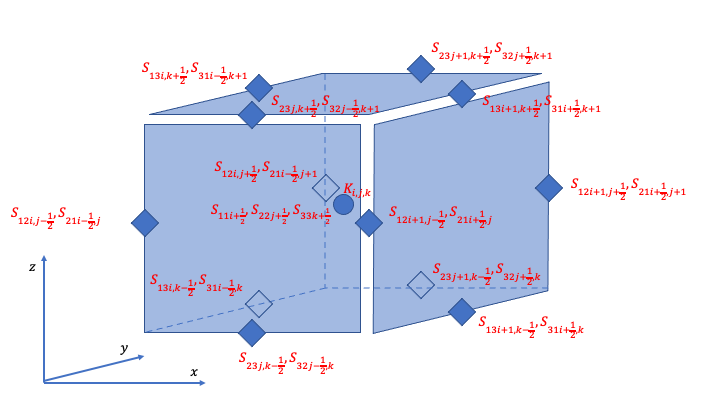

Strain-Rate Components for X-Momentum Equation
~~~~~~~~~~~~~~~~~~~~~~~~~~~~~~~~~~~~~~~~~~~~~~~

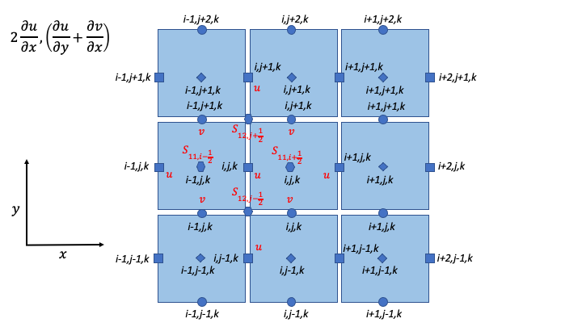
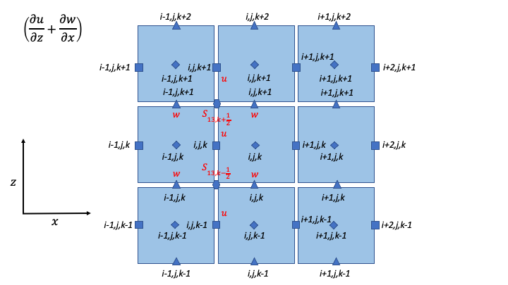

.. math::

   \begin{array}{ll}
   S_{11,i + \frac{1}{2}} = & \frac{1}{\Delta x}\left( u_{i + 1,j,k} - u_{i,j,k} \right) \\
   S_{11,i - \frac{1}{2}} = & \frac{1}{\Delta x}\left( u_{i,j,k} - u_{i - 1,j,k} \right) \\
   S_{12,j + \frac{1}{2}} = & \frac{1}{2}\left\lbrack \frac{1}{\Delta y}\left( u_{i,j + 1,k} - u_{i,j,k} \right) + \frac{1}{\Delta x}\left( v_{i,j + 1,k} - v_{i - 1,j + 1,k} \right) \right\rbrack \\
   S_{12,j - \frac{1}{2}} = & \frac{1}{2}\left\lbrack \frac{1}{\Delta y}\left( u_{i,j,k} - u_{i,j - 1,k} \right) + \frac{1}{\Delta x}\left( v_{i,j,k} - v_{i - 1,j,k} \right) \right\rbrack \\
   S_{13,k + \frac{1}{2}} = & \frac{1}{2}\left\lbrack \frac{1}{\Delta z}\left( u_{i,j,k + 1} - u_{i,j,k} \right) + \frac{1}{\Delta x}\left( w_{i,j,k + 1} - w_{i - 1,j,k + 1} \right) \right\rbrack \\
   S_{13,k - \frac{1}{2}} = & \frac{1}{2}\left\lbrack \frac{1}{\Delta z}\left( u_{i,j,k} - u_{i,j,k - 1} \right) + \frac{1}{\Delta x}\left( w_{i,j,k} - w_{i - 1,j,k} \right) \right\rbrack \\
   \end{array}

Strain-Rate Components for Y-Momentum Equation
~~~~~~~~~~~~~~~~~~~~~~~~~~~~~~~~~~~~~~~~~~~~~~~

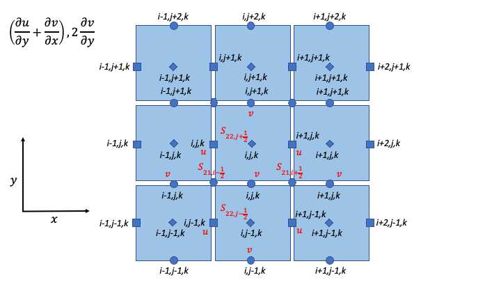
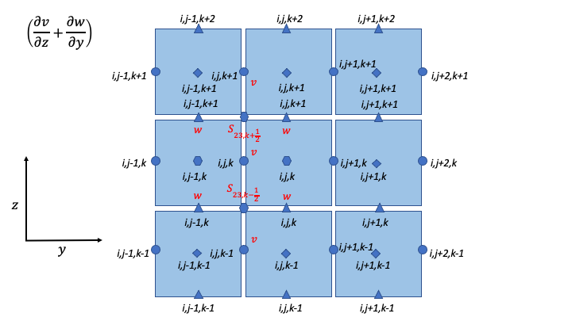

.. math::

   \begin{array}{ll}
   S_{21,i + \frac{1}{2}} = & \frac{1}{2}\left\lbrack \frac{1}{\Delta y}\left( u_{i + 1,j,k} - u_{i + 1,j - 1,k} \right) + \frac{1}{\Delta x}\left( v_{i + 1,j,k} - v_{i,j,k} \right) \right\rbrack \\
   S_{21,i - \frac{1}{2}} = & \frac{1}{2}\left\lbrack \frac{1}{\Delta y}\left( u_{i,j,k} - u_{i,j - 1,k} \right) + \frac{1}{\Delta x}\left( v_{i,j,k} - v_{i - 1,j,k} \right) \right\rbrack \\
   S_{22,j + \frac{1}{2}} = & \frac{1}{\Delta y}\left( v_{i,j + 1,k} - v_{i,j,k} \right) \\
   S_{22,j - \frac{1}{2}} = & \frac{1}{\Delta y}\left( v_{i,j,k} - v_{i,j - 1,k} \right) \\
   S_{23,k + \frac{1}{2}} = & \frac{1}{2}\left\lbrack \frac{1}{\Delta z}\left( v_{i,j,k + 1} - v_{i,j,k} \right) + \frac{1}{\Delta y}\left( w_{i,j,k + 1} - w_{i,j - 1,k + 1} \right) \right\rbrack \\
   S_{23,k - \frac{1}{2}} = & \frac{1}{2}\left\lbrack \frac{1}{\Delta z}\left( v_{i,j,k} - v_{i,j,k - 1} \right) + \frac{1}{\Delta y}\left( w_{i,j,k} - w_{i,j - 1,k} \right) \right\rbrack \\
   \end{array}

Strain-Rate Components for Z-Momentum Equation
~~~~~~~~~~~~~~~~~~~~~~~~~~~~~~~~~~~~~~~~~~~~~~~

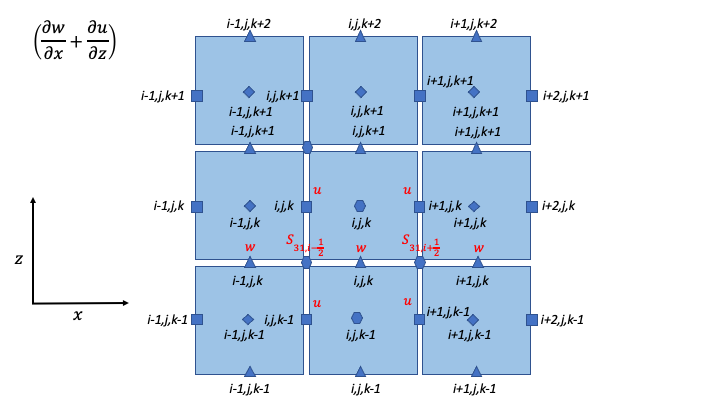
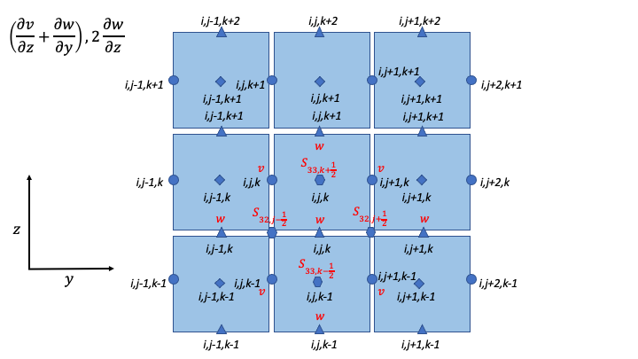

.. math::

   \begin{array}{ll}
   S_{31,i + \frac{1}{2}} = & \frac{1}{2}\left\lbrack \frac{1}{\Delta z}\left( u_{i + 1,j,k} - u_{i + 1,j,k - 1} \right) + \frac{1}{\Delta x}\left( w_{i + 1,j,k} - w_{i,j,k} \right) \right\rbrack \\
   S_{31,i - \frac{1}{2}} = & \frac{1}{2}\left\lbrack \frac{1}{\Delta z}\left( u_{i,j,k}     - u_{i,j,k - 1}     \right) + \frac{1}{\Delta x}\left( w_{i,j,k} - w_{i - 1,j,k} \right) \right\rbrack \\
   S_{32,j + \frac{1}{2}} = & \frac{1}{2}\left\lbrack \frac{1}{\Delta z}\left( v_{i,j + 1,k} - v_{i,j + 1,k - 1} \right) + \frac{1}{\Delta y}\left( w_{i,j + 1,k} - w_{i,j,k} \right) \right\rbrack \\
   S_{32,j - \frac{1}{2}} = & \frac{1}{2}\left\lbrack \frac{1}{\Delta z}\left( v_{i,j,k}     - v_{i,j,k - 1}     \right) + \frac{1}{\Delta y}\left( w_{i,j,k} - w_{i,j - 1,k} \right) \right\rbrack \\
   S_{33,k + \frac{1}{2}} = & \frac{1}{\Delta z}\left( w_{i,j,k + 1} - w_{i,j,k} \right) \\
   S_{33,k - \frac{1}{2}} = & \frac{1}{\Delta z}\left( w_{i,j,k} - w_{i,j,k - 1} \right) \\
   \end{array}

Expansion-Rate Tensor
-------------------------

Expansion-Rate Components for X-Momentum Equation
~~~~~~~~~~~~~~~~~~~~~~~~~~~~~~~~~~~~~~~~~~~~~~~~~~

.. math::

   \begin{array}{ll}
   D_{11,i + \frac{1}{2}} = & \frac{1}{3}\left\lbrack \frac{1}{\Delta x}\left( u_{i + 1,j,k} - u_{i,j,k} \right) + \frac{1}{\Delta y}\left( v_{i,j + 1,k} - v_{i,j,k} \right) + \frac{1}{\Delta z}\left( w_{i,j,k + 1} - w_{i,j,k} \right) \right\rbrack \\
   D_{11,i - \frac{1}{2}} = & \frac{1}{3}\left\lbrack \frac{1}{\Delta x}\left( u_{i,j,k} - u_{i-1,j,k} \right) + \frac{1}{\Delta y}\left( v_{i-1,j + 1,k} - v_{i-1,j,k} \right) + \frac{1}{\Delta z}\left( w_{i-1,j,k + 1} - w_{i-1,j,k} \right) \right\rbrack \\
   D_{12,j + \frac{1}{2}} = & 0 \\
   D_{12,j - \frac{1}{2}} = & 0 \\
   D_{13,k + \frac{1}{2}} = & 0 \\
   D_{13,k - \frac{1}{2}} = & 0 \\
   \end{array}

Expansion-Rate Components for Y-Momentum Equation
~~~~~~~~~~~~~~~~~~~~~~~~~~~~~~~~~~~~~~~~~~~~~~~~~~

.. math::

   \begin{array}{ll}
   D_{21,i + \frac{1}{2}} = & 0 \\
   D_{21,i - \frac{1}{2}} = & 0 \\
   D_{22,j + \frac{1}{2}} = & \frac{1}{3}\left\lbrack \frac{1}{\Delta x}\left( u_{i + 1,j,k} - u_{i,j,k} \right) + \frac{1}{\Delta y}\left( v_{i,j + 1,k} - v_{i,j,k} \right) + \frac{1}{\Delta z}\left( w_{i,j,k + 1} - w_{i,j,k} \right) \right\rbrack \\
   D_{22,j - \frac{1}{2}} = & \frac{1}{3}\left\lbrack \frac{1}{\Delta x}\left( u_{i + 1,j-1,k} - u_{i,j-1,k} \right) + \frac{1}{\Delta y}\left( v_{i,j,k} - v_{i,j-1,k} \right) + \frac{1}{\Delta z}\left( w_{i,j-1,k + 1} - w_{i,j-1,k} \right) \right\rbrack \\
   D_{23,k + \frac{1}{2}} = & 0 \\
   D_{23,k - \frac{1}{2}} = & 0 \\
   \end{array}

Expansion-Rate Components for Z-Momentum Equation
~~~~~~~~~~~~~~~~~~~~~~~~~~~~~~~~~~~~~~~~~~~~~~~~~~

.. math::

   \begin{array}{ll}
   D_{21,i + \frac{1}{2}} = & 0 \\
   D_{21,i - \frac{1}{2}} = & 0 \\
   D_{22,j + \frac{1}{2}} = & 0 \\
   D_{22,j - \frac{1}{2}} = & 0 \\
   D_{23,k + \frac{1}{2}} = & \frac{1}{3}\left\lbrack \frac{1}{\Delta x}\left( u_{i + 1,j,k} - u_{i,j,k} \right) + \frac{1}{\Delta y}\left( v_{i,j + 1,k} - v_{i,j,k} \right) + \frac{1}{\Delta z}\left( w_{i,j,k + 1} - w_{i,j,k} \right) \right\rbrack \\
   D_{23,k - \frac{1}{2}} = & \frac{1}{3}\left\lbrack \frac{1}{\Delta x}\left( u_{i + 1,j,k-1} - u_{i,j,k-1} \right) + \frac{1}{\Delta y}\left( v_{i,j + 1,k-1} - v_{i,j,k-1} \right) + \frac{1}{\Delta z}\left( w_{i,j,k} - w_{i,j,k-1} \right) \right\rbrack \\
   \end{array}

U Momentum viscous stress divergence
------------------------------------

.. math::

   \begin{align}
   \left( \rho u \right)_{i,j,k}^{n + 1} = \left( \rho u \right)_{i,j,k}^{n} - & \\
     \Delta t &  \left\{ \frac{1}{\Delta x}\ \left\lbrack \tau_{11,i + \frac{1}{2}} - \tau_{11,i - \frac{1}{2}} \right\rbrack \right.\  \\
              &        + \frac{1}{\Delta y}\ \left\lbrack \tau_{12,j + \frac{1}{2}} - \tau_{12,j - \frac{1}{2}} \right\rbrack           \\
              & + \left. \frac{1}{\Delta z}\ \left\lbrack \tau_{13,k + \frac{1}{2}} - \tau_{13,k - \frac{1}{2}} \right\rbrack \right\} \\
   \end{align}

Note that LES equation has a similar format for computing :math:`\tau_{11,i + \frac{1}{2}}`, :math:`\tau_{11,i - \frac{1}{2}}`,
:math:`\tau_{12,j + \frac{1}{2}}`, :math:`\tau_{12,j - \frac{1}{2}}`, :math:`\tau_{13,k + \frac{1}{2}}`,
and :math:`\tau_{13,k - \frac{1}{2}}`.

.. math::

   \begin{array}{ll}
   \tau_{ij,m + \frac{1}{2}} = & -\mu_{eff} \ \left\lbrack S_{ij,m + \frac{1}{2}} - D_{ij,m + \frac{1}{2}} \right\rbrack \\
   \tau_{ij,m - \frac{1}{2}} = & -\mu_{eff} \ \left\lbrack S_{ij,m - \frac{1}{2}} - D_{ij,m - \frac{1}{2}} \right\rbrack
   \end{array}

where :math:`m = i, j, k`.

:math:`\mu_{eff} = 2\mu` if a constant molecular diffusion type is chosen (``erf.molec_diff_type = "Constant"``).
Otherwise (``erf.molec_diff_type = "None"``), :math:`\mu_{eff} = 0`.

The nomenclature is similar for other two momentum equations. Note that :math:`\mu` is constant in the current
implementation and its variation with temperature for low-Mach atmospheric flows has been ignored.

V Momentum viscous stress divergence
------------------------------------

.. math::

   \begin{align}
   \left( \rho v \right)_{i,j,k}^{n + 1} = \left( \rho v \right)_{i,j,k}^{n} - & \\
     \Delta t & \left\{  \frac{1}{\Delta x} \left\lbrack \tau_{21,i + \frac{1}{2}} - \tau_{21,i - \frac{1}{2}} \right\rbrack \right.  \\
              &        + \frac{1}{\Delta y} \left\lbrack \tau_{22,j + \frac{1}{2}} - \tau_{22,j - \frac{1}{2}} \right\rbrack          \\
              & + \left. \frac{1}{\Delta z} \left\lbrack \tau_{23,k + \frac{1}{2}} - \tau_{23,k - \frac{1}{2}} \right\rbrack \right\}
   \end{align}

Note that LES equation has a similar format for computing :math:`\tau_{21,i + \frac{1}{2}}`, :math:`\tau_{21,i - \frac{1}{2}}`,
:math:`\tau_{22,j + \frac{1}{2}}`, :math:`\tau_{22,j - \frac{1}{2}}`, :math:`\tau_{23,k + \frac{1}{2}}`,
and :math:`\tau_{23,k - \frac{1}{2}}`.

W Momentum viscous stress divergence
------------------------------------

.. math::

   \begin{align}
   \left( \rho w \right)_{i,j,k}^{n + 1} = \left( \rho w \right)_{i,j,k}^{n} - & \\
    \Delta t &  \left\{ \frac{1}{\Delta x} \left\lbrack \tau_{31,i + \frac{1}{2}} - \tau_{31,i - \frac{1}{2}} \right\rbrack \right.  \\
             &        + \frac{1}{\Delta y} \left\lbrack \tau_{32,j + \frac{1}{2}} - \tau_{32,j - \frac{1}{2}} \right\rbrack            \\
             & + \left. \frac{1}{\Delta z} \left\lbrack \tau_{33,k + \frac{1}{2}} - \tau_{33,k - \frac{1}{2}} \right\rbrack \right\}
   \end{align}

Note that LES equation has a similar format for computing :math:`\tau_{31,i + \frac{1}{2}}`, :math:`\tau_{31,i - \frac{1}{2}}`,
:math:`\tau_{32,j + \frac{1}{2}}`, :math:`\tau_{32,j - \frac{1}{2}}`, :math:`\tau_{33,k + \frac{1}{2}}`,
and :math:`\tau_{33,k - \frac{1}{2}}`.

Potential Temperature Diffusion
-------------------------------

.. math::

   \begin{matrix}
   \left( \rho \theta \right)_{i,j,k}^{n + 1} & = & \left( \rho \theta \right)_{i,j,k}^{n} & + & \Delta t\rho_{i,j,k}\alpha_{T} & \left\{ \frac{1}{{\Delta x}^{2}}\ \left\lbrack \theta_{i + 1,j,k}^{n} - \ {2\theta}_{i,j,k}^{n} + \ \theta_{i - 1,j,k}^{n} \right\rbrack \right.\  \\
    & & & & & + \frac{1}{{\Delta y}^{2}}\left\lbrack \theta_{i,j + 1,k}^{n} - \ 2\theta_{i,j,k}^{n} + \ \theta_{i,j - 1,k}^{n} \right\rbrack \\
    & & & & & + \left. \frac{1}{{\Delta z}^{2}}\left\lbrack \theta_{i,j,k + 1}^{n} - \ {2\theta}_{i,j,k}^{n} + \ \theta_{i,j,k - 1}^{n} \right\rbrack \right\}
   \end{matrix}

Scalar Diffusion
----------------

.. math::

   \begin{matrix}
   \left( \rho C \right)_{i,j,k}^{n + 1} & = & \left( \rho C \right)_{i,j,k}^{n} & + & \Delta t\rho_{i,j,k}\alpha_{C} & \left\{ \frac{1}{{\Delta x}^{2}}\ \left\lbrack C_{i + 1,j,k}^{n} - \ 2C_{i,j,k}^{n} + \ C_{i - 1,j,k}^{n} \right\rbrack \right.\  \\
    & & & & & + \frac{1}{{\Delta y}^{2}}\left\lbrack C_{i,j + 1,k}^{n} - \ 2C_{i,j,k}^{n} + \ C_{i,j - 1,k}^{n} \right\rbrack \\
    & & & & & + \left. \frac{1}{{\Delta z}^{2}}\left\lbrack C_{i,j,k + 1}^{n} - \ 2C_{i,j,k}^{n} + \ C_{i,j,k - 1}^{n} \right\rbrack \right\}
   \end{matrix}

**Note**: In WRF, the diffusion coefficients specified in the input file (:math:`K_h` and :math:`K_v` for horizontal and vertical diffusion) get divided by the Prandtl number for 
the potential temperature and the scalars. For the momentum, they are used as it is. In ERF, the coefficients specified in the inputs (:math:`\alpha_T` and :math:`\alpha_C`) are used as it is, and no division by Prandtl number is done.

Momentum, Thermal, and Scalar Diffusion Contribution to LES
===========================================================

Strain Rate and Eddy Viscosity
------------------------------

The goal is to compute eddy viscosity at the *cell centers* and interpolated them to the edges. Refer again to the strain rate tensor schematic.

.. math::

   \begin{array}{ll}
   S_{11} = & S_{11i + \frac{1}{2}} \\
   S_{22} = & S_{22j + \frac{1}{2}} \\
   S_{33} = & S_{33k + \frac{1}{2}}
   \end{array}

.. math::

   \begin{matrix}
   S_{12} = & \frac{1}{4}\left\lbrack S_{12i,j - \frac{1}{2}} + S_{12i,j + \frac{1}{2}} + S_{12i + 1,j - \frac{1}{2}} + S_{12i + 1,j + \frac{1}{2}} \right\rbrack = \begin{smallmatrix} \text{Average of the 4 edges} \\ \text{surrouding the cell}\end{smallmatrix} \\
   S_{21} = & \frac{1}{4}\left\lbrack S_{21i - \frac{1}{2},j} + S_{21i + \frac{1}{2},j} + S_{21i - \frac{1}{2},j + 1} + S_{21i + \frac{1}{2},j + 1} \right\rbrack = \begin{smallmatrix} \text{Average of the 4 edges} \\ \text{surrouding the cell}\end{smallmatrix} \\
   S_{13} = & \frac{1}{4}\left\lbrack S_{13i,k - \frac{1}{2}} + S_{13i,k + \frac{1}{2}} + S_{13i + 1,k - \frac{1}{2}} + S_{13i + 1,k + \frac{1}{2}} \right\rbrack = \begin{smallmatrix} \text{Average of the 4 edges} \\ \text{surrouding the cell}\end{smallmatrix} \\
   S_{31} = & \frac{1}{4}\left\lbrack S_{31i - \frac{1}{2},k} + S_{31i + \frac{1}{2},k} + S_{31i - \frac{1}{2},k + 1} + S_{31i + \frac{1}{2},k + 1} \right\rbrack = \begin{smallmatrix} \text{Average of the 4 edges} \\ \text{surrouding the cell}\end{smallmatrix} \\
   S_{23} = & \frac{1}{4}\left\lbrack S_{23j,k - \frac{1}{2}} + S_{23j,k + \frac{1}{2}} + S_{23j + 1,k - \frac{1}{2}} + S_{23j + 1,k + \frac{1}{2}} \right\rbrack = \begin{smallmatrix} \text{Average of the 4 edges} \\ \text{surrouding the cell}\end{smallmatrix} \\
   S_{32} = & \frac{1}{4}\left\lbrack S_{32j - \frac{1}{2},k} + S_{32j + \frac{1}{2},k} + S_{32j - \frac{1}{2},k + 1} + S_{32j + \frac{1}{2},k + 1} \right\rbrack = \begin{smallmatrix} \text{Average of the 4 edges} \\ \text{surrouding the cell}\end{smallmatrix}
   \end{matrix}

Note that:

.. math::

   \begin{array}{ll}
   S_{12} = & S_{21} \\
   S_{13} = & S_{31} \\
   S_{23} = & S_{32}
   \end{array}

:math:`K_{i,j,k} = {2\left( C_{S}\ \Delta \right)^{2}\left( {2S}_{mn}S_{mn} \right)}^{\frac{1}{2}} \ \rho_{i,j,k}`,
where

.. math::

   S_{mn}S_{mn} = S_{11}^{2} + S_{22}^{2} + S_{33}^{2} + S_{12}^{2} + S_{13}^{2} + S_{23}^{2} + S_{21}^{2} + S_{31}^{2} + S_{32}^{2} \\

Owing to symmetry we need to compute 6 of the 9 tensor components.

:math:`K_{i,j,k} = 2 \ {\mu_{t}}_{i, j, k}` is the modeled turbulent viscosity and can be considered analogous to
:math:`2\mu_{i, j, k}`.

:math:`\mu_{eff} = 2\mu + K = 2\mu + 2\mu_{t}` if a constant molecular diffusion type is chosen (``erf.molec_diff_type = "Constant"``).
Otherwise (``erf.molec_diff_type = "None"``), :math:`\mu_{eff} = K = 2\mu_{t}`.

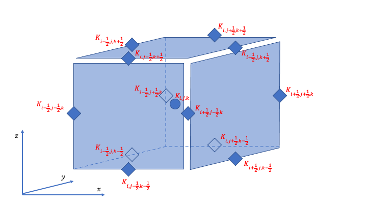

The interpolated values of eddy-viscosity at the edges are the average
of the values at the centers of the 4 cells the edge is part of.

.. math::

   \begin{array}{c}
   K_{i + \frac{1}{2},j - \frac{1}{2},k} = \frac{1}{4}\left\lbrack K_{i,j - 1,k} + K_{i,j,k} + K_{i + 1,j - 1,k} + K_{i + 1,j,k} \right\rbrack \\
   K_{i + \frac{1}{2},j + \frac{1}{2},k} = \frac{1}{4}\left\lbrack K_{i,j,k} + K_{i,j + 1,k} + K_{i + 1,j,k} + K_{i + 1,j + 1,k} \right\rbrack \\
   K_{i + \frac{1}{2},j,k - \frac{1}{2}} = \frac{1}{4}\left\lbrack K_{i,j,k} + K_{i,j,k - 1} + K_{i + 1,j,k} + K_{i + 1,j,k - 1} \right\rbrack \\
   K_{i + \frac{1}{2},j,k + \frac{1}{2}} = \frac{1}{4}\left\lbrack K_{i,j,k + 1} + K_{i,j,k} + K_{i + 1,j,k + 1} + K_{i + 1,j,k} \right\rbrack \\
   K_{i,j + \frac{1}{2},k - \frac{1}{2}} = \frac{1}{4}\left\lbrack K_{i,j,k} + K_{i,j,k - 1} + K_{i,j + 1,k} + K_{i,j + 1,k - 1} \right\rbrack \\
   K_{i,j + \frac{1}{2},k + \frac{1}{2}} = \frac{1}{4}\left\lbrack K_{i,j,k} + K_{i,j,k + 1} + K_{i,j + 1,k} + K_{i,j + 1,k + 1} \right\rbrack
   \end{array}

U Momentum - subfilter stress divergence
----------------------------------------------------------------

.. math::

   \begin{align}
   \left( \rho u \right)_{i,j,k}^{n + 1} = \left( \rho u \right)_{i,j,k}^{n} - & \\
     \Delta t &  \left\{ \frac{1}{\Delta x}\ \left\lbrack \tau_{11,i + \frac{1}{2}} - \tau_{11,i - \frac{1}{2}} \right\rbrack \right.\  \\
              &        + \frac{1}{\Delta y}\ \left\lbrack \tau_{12,j + \frac{1}{2}} - \tau_{12,j - \frac{1}{2}} \right\rbrack           \\
              & + \left. \frac{1}{\Delta z}\ \left\lbrack \tau_{13,k + \frac{1}{2}} - \tau_{13,k - \frac{1}{2}} \right\rbrack \right\} \\
   \end{align}

.. math::

   \begin{array}{l}
   \tau_{11,i + \frac{1}{2}} = -K_{i,j,k}                             \ S_{11,i + \frac{1}{2}} \\
   \tau_{11,i - \frac{1}{2}} = -K_{i - 1,j,k}                         \ S_{11,i - \frac{1}{2}} \\
   \tau_{12,j + \frac{1}{2}} = -K_{i - \frac{1}{2},j + \frac{1}{2},k} \ S_{12,j + \frac{1}{2}} \\
   \tau_{12,j - \frac{1}{2}} = -K_{i - \frac{1}{2},j - \frac{1}{2},k} \ S_{12,j - \frac{1}{2}} \\
   \tau_{13,k + \frac{1}{2}} = -K_{i - \frac{1}{2},j,k + \frac{1}{2}} \ S_{13,k + \frac{1}{2}} \\
   \tau_{13,k - \frac{1}{2}} = -K_{i - \frac{1}{2},j,k - \frac{1}{2}} \ S_{13,k - \frac{1}{2}}
   \end{array}

V Momentum - subfilter stress divergence
----------------------------------------------------------------

.. math::

   \begin{align}
   \left( \rho v \right)_{i,j,k}^{n + 1} = \left( \rho v \right)_{i,j,k}^{n} - & \\
     \Delta t & \left\{  \frac{1}{\Delta x} \left\lbrack \tau_{21,i + \frac{1}{2}} - \tau_{21,i - \frac{1}{2}} \right\rbrack \right.  \\
              &        + \frac{1}{\Delta y} \left\lbrack \tau_{22,j + \frac{1}{2}} - \tau_{22,j - \frac{1}{2}} \right\rbrack          \\
              & + \left. \frac{1}{\Delta z} \left\lbrack \tau_{23,k + \frac{1}{2}} - \tau_{23,k - \frac{1}{2}} \right\rbrack \right\}
   \end{align}

.. math::

   \begin{array}{ll}
   \tau_{21,i + \frac{1}{2}} = -K_{i + \frac{1}{2},j - \frac{1}{2},k} \ S_{21,i + \frac{1}{2}} \\
   \tau_{21,i - \frac{1}{2}} = -K_{i - \frac{1}{2},j - \frac{1}{2},k} \ S_{21,i - \frac{1}{2}} \\
   \tau_{22,j + \frac{1}{2}} = -K_{i,j,k}                             \ S_{22,j + \frac{1}{2}} \\
   \tau_{22,j - \frac{1}{2}} = -K_{i,j - 1,k}                         \ S_{22,j - \frac{1}{2}} \\
   \tau_{23,k + \frac{1}{2}} = -K_{i,j - \frac{1}{2},k + \frac{1}{2}} \ S_{23,k + \frac{1}{2}} \\
   \tau_{23,k - \frac{1}{2}} = -K_{i,j - \frac{1}{2}k - \frac{1}{2}}  \ S_{23,k - \frac{1}{2}}
   \end{array}

W Momentum - subfilter stress divergence
----------------------------------------------------------------

.. math::

   \begin{align}
   \left( \rho w \right)_{i,j,k}^{n + 1} = \left( \rho w \right)_{i,j,k}^{n} - & \\
    \Delta t &  \left\{ \frac{1}{\Delta x} \left\lbrack \tau_{31,i + \frac{1}{2}} - \tau_{31,i - \frac{1}{2}} \right\rbrack \right.  \\
             &        + \frac{1}{\Delta y} \left\lbrack \tau_{32,j + \frac{1}{2}} - \tau_{32,j - \frac{1}{2}} \right\rbrack            \\
             & + \left. \frac{1}{\Delta z} \left\lbrack \tau_{33,k + \frac{1}{2}} - \tau_{33,k - \frac{1}{2}} \right\rbrack \right\}
   \end{align}

.. math::

   \begin{array}{ll}
   \tau_{31,i + \frac{1}{2}} = -K_{i + \frac{1}{2},j,k - \frac{1}{2}} \ S_{31,i + \frac{1}{2}} \\
   \tau_{31,i - \frac{1}{2}} = -K_{i - \frac{1}{2},j,k - \frac{1}{2}} \ S_{31,i - \frac{1}{2}} \\
   \tau_{32,j + \frac{1}{2}} = -K_{i,j + \frac{1}{2},k - \frac{1}{2}} \ S_{32,j + \frac{1}{2}} \\
   \tau_{32,j - \frac{1}{2}} = -K_{i,j - \frac{1}{2},k - \frac{1}{2}} \ S_{32,j - \frac{1}{2}} \\
   \tau_{33,k + \frac{1}{2}} = -K_{i,j,k}                             \ S_{33,k + \frac{1}{2}} \\
   \tau_{33,k - \frac{1}{2}} = -K_{i,j, k - 1}                        \ S_{33,k - \frac{1}{2}}
   \end{array}

Energy Conservation- Subgrid heat flux
--------------------------------------

.. math::

   \begin{align}
   \left( \rho \theta \right)_{i,j,k}^{n + 1}  =  \left( \rho \theta \right)_{i,j,k}^{n}  - & \\
      & \Delta t \left\{   \frac{1}{\Delta x^2} \left\lbrack
                 K_{i+\frac{1}{2},j,k} (\theta_{i+1,j,k}^{n} - \theta_{i  ,j,k}^{n}) -
                 K_{i-\frac{1}{2},j,k} (\theta_{i  ,j,k}^{n} - \theta_{i-1,j,k}^{n}) \right\rbrack \right.  \\
              &         + \frac{1}{\Delta y^2} \left\lbrack
                 K_{i,j+\frac{1}{2},k} (\theta_{i,j+1,k}^{n} - \theta_{i,j  ,k}^{n}) -
                 K_{i,j-\frac{1}{2},k} (\theta_{i,j  ,k}^{n} - \theta_{i,j-1,k}^{n})  \right\rbrack          \\
              &  \left. + \frac{1}{\Delta z^2} \left\lbrack
                 K_{i,j,k-\frac{1}{2}} (\theta_{i,j,k+1}^{n} - \theta_{i,j,k  }^{n})
                 K_{i,j,k-\frac{1}{2}} (\theta_{i,j,k  }^{n} - \theta_{i,j,k-1}^{n}) \right\rbrack \right\}
   \end{align}

Analogous formulae apply for the subgrid scalar flux.

Prognostic Equation for Subgrid Kinetic Energy
----------------------------------------------

.. math::

   \begin{align}
   \left( \rho e \right)_{i,j,k}^{n + 1} = \left( \rho e \right)_{i,j,k}^{n} - & \\
     \Delta t & \left\{  \frac{1}{\Delta x}\left\lbrack \left( \rho u \right)_{i+1,j,k}^{n}e_{i+\frac{1}{2},j,k}^{n}
                                                      - \left( \rho u \right)_{i  ,j,k}^{n}e_{i-\frac{1}{2},j,k}^{n} \right\rbrack \right. \\
              & +        \frac{1}{\Delta y}\left\lbrack \left( \rho v \right)_{i,j+1,k}^{n}e_{i,j+\frac{1}{2},k}^{n}
                                                      - \left( \rho v \right)_{i,j  ,k}^{n}e_{i,j-\frac{1}{2},k}^{n} \right\rbrack \\
              & +       \frac{1}{\Delta z}\left\lbrack \left( \rho w \right)_{i,j,k+1}^{n}e_{i,j,k+\frac{1}{2}}^{n}
                                                     - \left( \rho w \right)_{i,j,k  }^{n}e_{i,j,k-\frac{1}{2}}^{n} \right\rbrack  \\
              & + \left. \rho_{i,j,k} K_H \frac{g}{\theta_{i,j,k}} (\frac{\partial\theta}{\partial z})_{i,j,k}
                        - \tau_{mn}\frac{\partial u_{m}}{\partial x_{n}}
                        + (\nabla \cdot (K \nabla e))_{i,j,k}
                        - \rho_{i,j,k} C_{\epsilon} \frac{\left( e_{i,j,k} \right)^{\frac{3}{2}}}{\mathcal{l}}  \right\}
   \end{align}

where

.. math::

   \begin{array}{l}
   C_{\epsilon} = 0.19 + 0.51\frac{\mathcal{l}}{\Delta s} \\
    K_{H}        = \left( 1 + 2\frac{\mathcal{l}}{\Delta s} \right)K_{M} \\
    K_{M}        = 0.1  \mathcal{l}  e^{\frac{1}{2}}
    \end{array}

For convective or neutral cases, :math:`\theta^{n}_{i,j,k+1}-\theta^{n}_{i,j,k-1} < 0`, :math:`\mathcal{l} = \Delta s = \sqrt[3]{\Delta x \Delta y \Delta z}`

For stable cases, :math:`\theta^{n}_{i,j,k+1}-\theta^{n}_{i,j,k-1} > 0`,

.. math::

   \begin{align}
   \mathcal{l} & = 0.76\ e^{\frac{1}{2}}\left( \frac{g}{\theta}\frac{\partial\theta}{\partial z} \right) \\
               & = 0.76e_{i,j,k}^{\frac{1}{2}}\left\lbrack \frac{g}{\theta_{i,j,k}}\frac{1}{2\Delta z}\left( \theta_{i,j,k + 1}^{n} - \theta_{i,j,k - 1}^{n} \right) \right\rbrack
   \end{align}

The second to last term on the right hand side takes the form

.. math::

   \begin{align}
              & \frac{1}{\Delta x^2} \left\lbrack
                 K_{i+\frac{1}{2},j,k} (e_{i+1,j,k}^{n} - e_{i  ,j,k}^{n}) -
                 K_{i-\frac{1}{2},j,k} (e_{i  ,j,k}^{n} - e_{i-1,j,k}^{n}) \right\rbrack + \\
              &  \frac{1}{\Delta y^2} \left\lbrack
                 K_{i,j+\frac{1}{2},k} (e_{i,j+1,k}^{n} - e_{i,j  ,k}^{n}) -
                 K_{i,j-\frac{1}{2},k} (e_{i,j  ,k}^{n} - e_{i,j-1,k}^{n})  \right\rbrack + \\
              &  \frac{1}{\Delta z^2} \left\lbrack
                 K_{i,j,k-\frac{1}{2}} (e_{i,j,k+1}^{n} - e_{i,j,k  }^{n}) -
                 K_{i,j,k-\frac{1}{2}} (e_{i,j,k  }^{n} - e_{i,j,k-1}^{n}) \right\rbrack
   \end{align}

Finally,

.. math::

   \begin{align}
   \tau_{mn}\frac{\partial u_{m}}{\partial x_{n}} & = K S_{mn}\frac{\partial u_{m}}{\partial x_{n}} \\
                                                  & = K S_{mn}S_{mn} \\
                                                  & = K (S_{11}^{2} + S_{22}^{2} + S_{33}^{2} + S_{12}^{2} + S_{13}^{2} + S_{23}^{2} + S_{21}^{2} + S_{31}^{2} + S_{32}^{2})
   \end{align}

Contributions from different directions
~~~~~~~~~~~~~~~~~~~~~~~~~~~~~~~~~~~~~~~
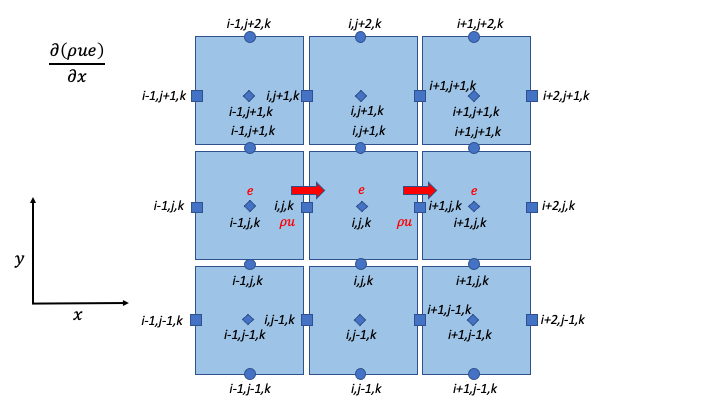
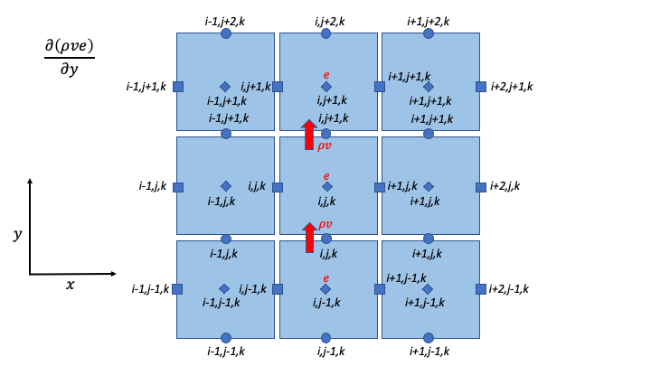

