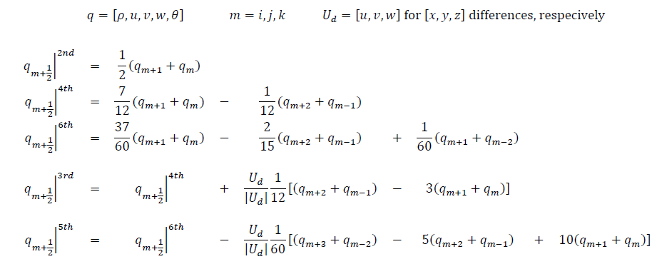

.. highlight:: rst

###################################################
Finite Difference Discretization of Euler Equations
###################################################

Last update: 2021-02-12

Staggered Grids
===============
The staggered grids indicating where different variables are located.

XY Plane
--------
.. image:: figures/grid_discretization/stagger_XY.PNG
  :width: 400
  
YZ Plane
--------
.. image:: figures/grid_discretization/stagger_YZ.PNG
  :width: 400

Mass Conservation
=================

Difference Equation
-------------------

.. math::

	\begin{align*}
		\rho_{i, j, k}^{n+1} = \rho_{i, j, k}^{n}
		- \Delta t
		\{& \frac{1}{\Delta x} [ {(\rho u)}_{i+1, j, k}^{n} - {(\rho u)}_{i, j, k}^{n}]\\
		+ & \frac{1}{\Delta y} [ {(\rho v)}_{i, j+1, k}^{n} - {(\rho v)}_{i, j, k}^{n}]\\
		+ & \frac{1}{\Delta z} [ {(\rho w)}_{i, j, k+1}^{n} - {(\rho w)}_{i, j, k}^{n}] \}
	\end{align*}

Divergence Compoments
---------------------
.. image:: figures/grid_discretization/continuity_x.PNG
  :width: 400
.. image:: figures/grid_discretization/continuity_y.PNG
  :width: 400
.. image:: figures/grid_discretization/continuity_z.PNG
  :width: 400

X-Momentum Conservation
=======================

Difference Equation
-------------------

.. math::

	\begin{align*}
		(\rho u)_{i, j, k}^{n+1} = (\rho u)_{i, j, k}^{n}
		- \Delta t
		\{& \frac{1}{2 \Delta x} [( {(\rho u)}_{i+1, j, k}^{n} + {(\rho u)}_{i, j, k}^{n}) u_{i+\frac{1}{2},j,k}^n
								 -( {(\rho u)}_{i, j, k}^{n} + {(\rho u)}_{i-1, j, k}^{n}) u_{i-\frac{1}{2},j,k}^n]\\
		+ & \frac{1}{2 \Delta y} [( {(\rho v)}_{i, j+1, k}^{n} + {(\rho v)}_{i-1, j+1, k}^{n}) u_{i, j+\frac{1}{2},k}^n
							     -( {(\rho v)}_{i, j, k}^{n} + {(\rho v)}_{i-1, j, k}^{n}) u_{i, j-\frac{1}{2},k}^n]\\
		+ & \frac{1}{2 \Delta z} [( {(\rho w)}_{i, j, k+1}^{n} + {(\rho w)}_{i-1, j, k+1}^{n}) u_{i, j, k+\frac{1}{2}}^n
							     -( {(\rho w)}_{i, j, k}^{n} + {(\rho w)}_{i-1, j, k}^{n}) u_{i, j, k-\frac{1}{2}}^n] \}\\
		- & \frac{\Delta t}{\Delta x}[p_{i, j, k}^{n} - p_{i-1, j, k}^{n}]	
	\end{align*}

Divergence Compoments
---------------------
.. image:: figures/grid_discretization/x_mom_advec_x.PNG
  :width: 400
.. image:: figures/grid_discretization/x_mom_advec_y.PNG
  :width: 400
.. image:: figures/grid_discretization/x_mom_advec_z.PNG
  :width: 400

Y-Momentum Conservation
=======================

Difference Equation
-------------------

.. math::

	\begin{align*}
	(\rho v)_{i, j, k}^{n+1} = (\rho v)_{i, j, k}^{n}
	- \Delta t
		\{& \frac{1}{2 \Delta x} [( {(\rho u)}_{i+1, j, k}^{n} + {(\rho u)}_{i+1, j-1, k}^{n}) v_{i+\frac{1}{2},j,k}^n
						   	  -( {(\rho u)}_{i, j, k}^{n} + {(\rho u)}_{i, j-1, k}^{n}) v_{i-\frac{1}{2},j,k}^n]\\
		+ & \frac{1}{2 \Delta y} [( {(\rho v)}_{i, j+1, k}^{n} + {(\rho v)}_{i, j, k}^{n}) v_{i, j+\frac{1}{2},k}^n
							  -( {(\rho v)}_{i, j, k}^{n} + {(\rho v)}_{i, j-1, k}^{n}) v_{i, j-\frac{1}{2},k}^n]\\
		+ & \frac{1}{2 \Delta z} [( {(\rho w)}_{i, j, k+1}^{n} + {(\rho w)}_{i, j-1, k+1}^{n}) v_{i, j, k+\frac{1}{2}}^n
							  -( {(\rho w)}_{i, j, k}^{n} + {(\rho w)}_{i, j-1, k}^{n}) v_{i, j, k-\frac{1}{2}}^n] \}\\
		- & \frac{\Delta t}{\Delta y}[p_{i, j, k}^{n} - p_{i, j-1, k}^{n}]
	\end{align*}

Divergence Compoments
---------------------
.. image:: figures/grid_discretization/y_mom_advec_x.PNG
  :width: 400
.. image:: figures/grid_discretization/y_mom_advec_y.PNG
  :width: 400
.. image:: figures/grid_discretization/y_mom_advec_z.PNG
  :width: 400

Z-Momentum Conservation
=======================

Difference Equation
-------------------
  
.. math::

	\begin{align*}
	(\rho w)_{i, j, k}^{n+1} = (\rho w)_{i, j, k}^{n}
	- \Delta t
		\{& \frac{1}{2 \Delta x} [( {(\rho u)}_{i+1, j, k}^{n} + {(\rho u)}_{i+1, j, k-1}^{n}) w_{i+\frac{1}{2},j,k}^n
								 -( {(\rho u)}_{i, j, k}^{n} + {(\rho u)}_{i, j, k-1}^{n}) w_{i-\frac{1}{2},j,k}^n]\\
		+ & \frac{1}{2 \Delta y} [( {(\rho v)}_{i, j+1, k}^{n} + {(\rho v)}_{i, j+1, k-1}^{n}) w_{i, j+\frac{1}{2},k}^n
							     -( {(\rho v)}_{i, j, k}^{n} + {(\rho v)}_{i, j, k-1}^{n}) w_{i, j-\frac{1}{2},k}^n]\\
		+ & \frac{1}{2 \Delta z} [( {(\rho w)}_{i, j, k+1}^{n} + {(\rho w)}_{i, j, k}^{n}) w_{i, j, k+\frac{1}{2}}^n
							     -( {(\rho w)}_{i, j, k}^{n} + {(\rho w)}_{i, j, k-1}^{n}) w_{i, j, k-\frac{1}{2}}^n] \}\\
		- & \frac{\Delta t}{\Delta z}[p_{i, j, k}^{n} - p_{i, j, k-1}^{n}] + \Delta t g \rho_{i, j, k-\frac{1}{2}}^n
	\end{align*}

Divergence Compoments
---------------------
.. image:: figures/grid_discretization/z_mom_advec_x.PNG
  :width: 400
.. image:: figures/grid_discretization/z_mom_advec_y.PNG
  :width: 400
.. image:: figures/grid_discretization/z_mom_advec_z.PNG
  :width: 400

Energy Conservation
===================

Difference Equation
-------------------
   
.. math::

	\begin{align*}
		(\rho \theta)_{i, j, k}^{n+1} = (\rho \theta)_{i, j, k}^{n}
		- \Delta t
		\{& \frac{1}{\Delta x} [{(\rho u)}_{i+1, j, k}^{n} \theta_{i+\frac{1}{2},j,k}^n
								 -{(\rho u)}_{i, j, k}^{n})  \theta_{i-\frac{1}{2},j,k}^n]\\
		+ & \frac{1}{\Delta y} [{(\rho v)}_{i, j+1, k}^{n} \theta_{i, j+\frac{1}{2},k}^n
							     -{(\rho v)}_{i, j, k}^{n} \theta_{i, j-\frac{1}{2},k}^n]\\
		+ & \frac{1}{\Delta z} [{(\rho w)}_{i, j, k+1}^{n} \theta_{i, j, k+\frac{1}{2}}^n
								 -{(\rho w)}_{i, j, k}^{n} \theta_{i, j, k-\frac{1}{2}}^n] \}
	\end{align*}

Divergence Compoments
---------------------
.. image:: figures/grid_discretization/temp_advec_x.PNG
  :width: 400
.. image:: figures/grid_discretization/temp_advec_y.PNG
  :width: 400
.. image:: figures/grid_discretization/temp_advec_z.PNG
  :width: 400

Diagnostic Variables
====================
 
.. math::

  p_{i, j, k}^n = (\rho_{i, j, k}^n R_d \theta_{i, j, k}^n / p_0^{R_d / c_p} )^\gamma
  
.. math::

  T_{i, j, k}^n =  \frac{p_{i, j, k}^n}{  \rho_{i, j, k}^n R_d}

Here :math:`\rho_{i, j, k}^n, T_{i, j, k}^n, \theta_{i, j, k}^n`, and :math:`p_{i, j, k}^n` are the density, temperature, potential temperature and pressure, respectively; 
these variables are all defined at cell centers of cell indexed by :math:`(i, j, k)` and at time level :math:`n`.

:math:`R_d` and :math:`c_p` are the gas constant and specific heat capacity for dry air respectively, 
and :math:`\gamma = c_p / (c_p - R_d)` .  :math:`p_0` is a reference value for pressure.

Differencing of Different Orders
================================

