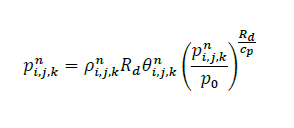
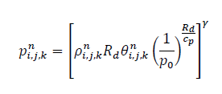

.. highlight:: rst

###################################################
Finite Difference Discretization of Euler Equations
###################################################

Last update: 2021-02-12

Staggered Grids
===============
The staggered grids indicating where different variables are located.

XY Plane
--------
.. image:: figures/grid_discretization/stagger_XY.PNG
  :width: 400
  
YZ Plane
--------
.. image:: figures/grid_discretization/stagger_YZ.PNG
  :width: 400

Mass Conservation
=================

Difference Equation
-------------------
.. image:: figures/grid_discretization/continuity_eqn.PNG
  :width: 400

Divergence Compoments
---------------------
.. image:: figures/grid_discretization/continuity_x.PNG
  :width: 400
.. image:: figures/grid_discretization/continuity_y.PNG
  :width: 400
.. image:: figures/grid_discretization/continuity_z.PNG
  :width: 400

X-Momentum Conservation
=======================

Difference Equation
-------------------
.. image:: figures/grid_discretization/x_mom_eqn.PNG
  :width: 400

Divergence Compoments
---------------------
.. image:: figures/grid_discretization/x_mom_advec_x.PNG
  :width: 400
.. image:: figures/grid_discretization/x_mom_advec_y.PNG
  :width: 400
.. image:: figures/grid_discretization/x_mom_advec_z.PNG
  :width: 400

Y-Momentum Conservation
=======================

Difference Equation
-------------------
.. image:: figures/grid_discretization/y_mom_eqn.PNG
  :width: 400

Divergence Compoments
---------------------
.. image:: figures/grid_discretization/y_mom_advec_x.PNG
  :width: 400
.. image:: figures/grid_discretization/y_mom_advec_y.PNG
  :width: 400
.. image:: figures/grid_discretization/y_mom_advec_z.PNG
  :width: 400

Z-Momentum Conservation
=======================

Difference Equation
-------------------
.. image:: figures/grid_discretization/z_mom_eqn.PNG
  :width: 400

Divergence Compoments
---------------------
.. image:: figures/grid_discretization/z_mom_advec_x.PNG
  :width: 400
.. image:: figures/grid_discretization/z_mom_advec_y.PNG
  :width: 400
.. image:: figures/grid_discretization/z_mom_advec_z.PNG
  :width: 400

Energy Conservation
===================

Difference Equation
-------------------
.. image:: figures/grid_discretization/temp_eqn.PNG
  :width: 400

Divergence Compoments
---------------------
.. image:: figures/grid_discretization/temp_advec_x.PNG
  :width: 400
.. image:: figures/grid_discretization/temp_advec_y.PNG
  :width: 400
.. image:: figures/grid_discretization/temp_advec_z.PNG
  :width: 400

Diagnostic Variables
====================

Differencing of Different Orders
================================

.. image:: figures/grid_discretization/differencing.PNG
  :width: 400
