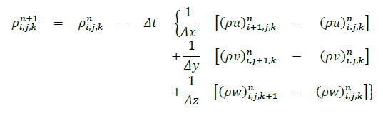
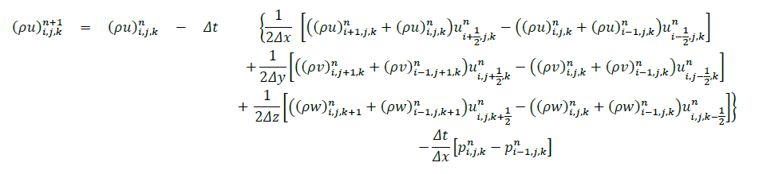
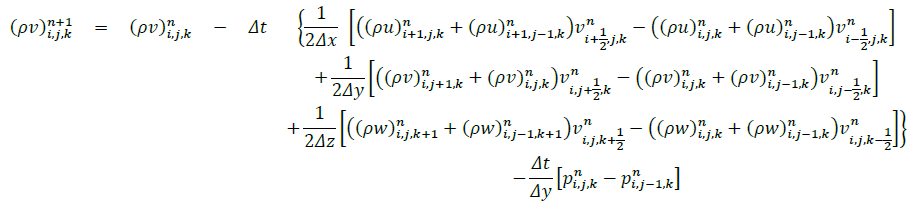
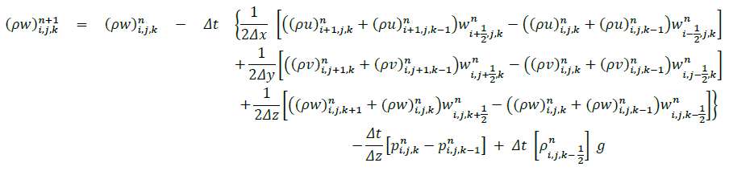
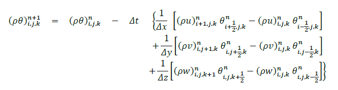

.. highlight:: rst

###################################################
Finite Difference Discretization of Euler Equations
###################################################

Last update: 2021-02-12

Staggered Grids
===============
The staggered grids indicating where different variables are located.

XY Plane
--------
.. image:: figures/grid_discretization/stagger_XY.PNG
  :width: 400
  
YZ Plane
--------
.. image:: figures/grid_discretization/stagger_YZ.PNG
  :width: 400

Mass Conservation
=================

Difference Equation
-------------------

Divergence Compoments
---------------------
.. image:: figures/grid_discretization/continuity_x.PNG
  :width: 400
.. image:: figures/grid_discretization/continuity_y.PNG
  :width: 400
.. image:: figures/grid_discretization/continuity_z.PNG
  :width: 400

X-Momentum Conservation
=======================

Difference Equation
-------------------

Divergence Compoments
---------------------
.. image:: figures/grid_discretization/x_mom_advec_x.PNG
  :width: 400
.. image:: figures/grid_discretization/x_mom_advec_y.PNG
  :width: 400
.. image:: figures/grid_discretization/x_mom_advec_z.PNG
  :width: 400

Y-Momentum Conservation
=======================

Difference Equation
-------------------

Divergence Compoments
---------------------
.. image:: figures/grid_discretization/y_mom_advec_x.PNG
  :width: 400
.. image:: figures/grid_discretization/y_mom_advec_y.PNG
  :width: 400
.. image:: figures/grid_discretization/y_mom_advec_z.PNG
  :width: 400

Z-Momentum Conservation
=======================

Difference Equation
-------------------

Divergence Compoments
---------------------
.. image:: figures/grid_discretization/z_mom_advec_x.PNG
  :width: 400
.. image:: figures/grid_discretization/z_mom_advec_y.PNG
  :width: 400
.. image:: figures/grid_discretization/z_mom_advec_z.PNG
  :width: 400

Energy Conservation
===================

Difference Equation
-------------------

Divergence Compoments
---------------------
.. image:: figures/grid_discretization/temp_advec_x.PNG
  :width: 400
.. image:: figures/grid_discretization/temp_advec_y.PNG
  :width: 400
.. image:: figures/grid_discretization/temp_advec_z.PNG
  :width: 400

Diagnostic Variables
====================
 
.. math::

  p_{i, j, k}^n = \rho_{i, j, k}^n R_d T_{i, j, k}^n;

and 

.. math::

  \theta_{i, j, k}^n = T_{i, j, k}^n (\frac{p_0}{p_{i, j, k}^n})^{R_d / c_p}

lead to:

.. math::

  p_{i, j, k}^n = (\rho_{i, j, k}^n R_d \theta_{i, j, k}^n / p_0^{R_d / c_p} )^\gamma

Here :math:`\rho_{i, j, k}^n, T_{i, j, k}^n, \theta_{i, j, k}^n`, and :math:`p_{i, j, k}^n` are the density, temperature, potential temperature and pressure, respectively; 
these variables are all defined at cell centers of cell indexed by :math:`(i, j, k)` and at time level :math:`n`.

:math:`R_d` and :math:`c_p` are the gas constant and specific heat capacity for dry air respectively, 
and :math:`\gamma = c_p / (c_p - R_d)` .  :math:`p_0` is a reference value for pressure.

Differencing of Different Orders
================================

.. image:: figures/grid_discretization/differencing.PNG
  :width: 400
