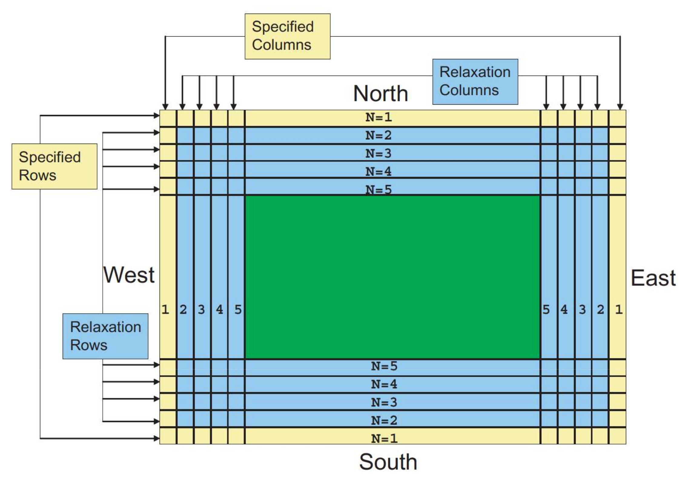

 .. role:: cpp(code)
    :language: c++

 .. _MeshRefinement:

Mesh Refinement
===============

ERF allows both static and dynamic mesh refinement, as well as three different options for
how the coarse and fine data.

Note that any tagged region will be covered by one or more boxes.  The user may
specify the refinement criteria and/or region to be covered, but not the decomposition of the region into
individual grids.

See the `Gridding`_ section of the AMReX documentation for details of how individual grids are created.

.. _`Gridding`: https://amrex-codes.github.io/amrex/docs_html/ManagingGridHierarchy_Chapter.html

Static Mesh Refinement
----------------------

For static refinement, we control the placement of grids by specifying
the low and high extents (in physical space) of each box in the lateral
directions.   ERF enforces that all refinement spans the entire vertical direction.

The following example demonstrates how to tag regions for static refinement.
In this first example, all cells in the region ((.15,.25,prob_lo_z)(.35,.45,prob_hi_z))
and in the region ((.65,.75,prob_lo_z)(.85,.95,prob_hi_z)) are tagged for
one level of refinement, where prob_lo_z and prob_hi_z are the vertical extents of the domain:

::

          amr.max_level = 1
          amr.ref_ratio = 2

          erf.refinement_indicators = box1 box2

          erf.box1.in_box_lo = .15 .25
          erf.box1.in_box_hi = .35 .45

          erf.box2.in_box_lo = .65 .75
          erf.box2.in_box_hi = .85 .95

In the example below, we refine the region ((.15,.25,prob_lo_z)(.35,.45,prob_hi_z))
by two levels of factor 3 refinement. In this case, the refined region at level 1 will
be sufficient to enclose the refined region at level 2.

::

          amr.max_level = 2
          amr.ref_ratio = 3 3

          erf.refinement_indicators = box1

          erf.box1.in_box_lo = .15 .25
          erf.box1.in_box_hi = .35 .45

And in this final example, the region ((.15,.25,prob_lo_z)(.35,.45,prob_hi_z))
will be refined by two levels of factor 3, but the larger region, ((.05,.05,prob_lo_z)(.75,.75,prob_hi_z))
will be refined by a single factor 3 refinement.

::

          amr.max_level = 2
          amr.ref_ratio = 3 3

          erf.refinement_indicators = box1 box2

          erf.box1.in_box_lo = .15 .25
          erf.box1.in_box_hi = .35 .45

          erf.box2.in_box_lo = .05 .05
          erf.box2.in_box_hi = .75 .75
          erf.box2.max_level = 1

Dynamic Mesh Refinement
-----------------------

Dynamically created tagging functions are based on runtime data specified in the inputs file.
These dynamically generated functions test on either state variables or derived variables
defined in ERF_derive.cpp and included in the derive_lst in Setup.cpp.

Available tests include

-  “greater\_than”: :math:`field >= threshold`

-  “less\_than”: :math:`field <= threshold`

-  “adjacent\_difference\_greater”: :math:`max( | \text{difference between any nearest-neighbor cell} | ) >= threshold`

This example adds three user-named criteria –
hi\_rho: cells with density greater than 1 on level 0, and greater than 2 on level 1 and higher;
lo\_theta: cells with theta less than 300 that are inside the region ((.25,.25,.25)(.75,.75,.75));
and adv_diff: cells having a difference in the scalar of 0.01 or more from that of any immediate neighbor.
The first will trigger up to AMR level 3, the second only to level 1, and the third to level 2.
The third will be active only when the problem time is between 0.001 and 0.002 seconds.

Note that density and rhoadv_0 are the names of state variables, whereas theta is the name of a derived variable,
computed by dividing the variable named rhotheta by the variable named density.

::

          erf.refinement_indicators = hi_rho lo_theta advdiff

          erf.hi_rho.max_level = 3
          erf.hi_rho.value_greater = 1. 2.
          erf.hi_rho.field_name = density

          erf.lo_theta.max_level = 1
          erf.lo_theta.value_less = 300
          erf.lo_theta.field_name = rhotheta
          erf.lo_theta.in_box_lo = .25 .25 .25
          erf.lo_theta.in_box_hi = .75 .75 .75

          erf.advdiff.max_level = 2
          erf.advdiff.adjacent_difference_greater = 0.01
          erf.advdiff.field_name = rhoadv_0
          erf.advdiff.start_time = 0.001
          erf.advdiff.end_time = 0.002

Coupling Types
--------------

ERF supports one-way, two-way, and "mixed" coupling between levels; this is a run-time input

::

      erf.coupling_type = "OneWay" or "TwoWay" or "Mixed"

By one-way coupling, we mean that between each pair of refinement levels,
the coarse mesh communicates data to the fine mesh to serve as boundary conditions
for the time advance of the fine solution . For cell-centered quantities,
and face-baced normal momenta on the coarse-fine interface, the coarse data is conservatively
interpolated to the fine mesh. The interpolated data is utilized to specify ghost cell data
(outside of the valid fine region) as well as specified and relaxation data inside the lateral boundaries
of the fine region. More specifically, similarly to how the lateral boundaries are treated,
a user may specify the total width of the interior Dirichlet and relaxation region with 
``erf.cf_width = <Int>`` (yellow + blue)
and analogously the width of the interior Dirichlet region may be specified with
``erf.cf_set_width = <Int>`` (yellow).

.. _fig:Lateral BCs

.. table:: Lateral boundaries with OneWay coupling

   +-----------------------------------------------------+
   |                     |wrfbdy|                        |
   +-----------------------------------------------------+
   |  Image taken from `Skamarock et al. (2021)`_        |
   +-----------------------------------------------------+

.. _`Skamarock et al. (2021)`: http://dx.doi.org/10.5065/1dfh-6p97

Within the interior Dirichlet region (yellow), the RHS is exactly 0. However, within the relaxation region (blue),
the RHS (:math:`F`) is given by the following:

.. math::

   \begin{align}
   F &= G + R, \\
   \psi^{\prime} &= \psi^{n} + \Delta t \; G, \\
   R &= H_{1} \left( \psi^{FP} - \psi^{\prime} \right) - H_{2} \Delta^2 \left( \psi^{FP} - \psi^{\prime} \right), \\
   H_{1} &= \frac{1}{10 \Delta t} \frac{{\rm SpecWidth} + {\rm RelaxWidth} - n}{{\rm RelaxWidth} - 1}, \\
   H_{2} &= \frac{1}{50 \Delta t} \frac{{\rm SpecWidth} + {\rm RelaxWidth} - n}{{\rm RelaxWidth} - 1},
   \end{align}

where :math:`G` is the RHS of the evolution equations, :math:`\psi^{\prime}` is the predicted update without
relaxation, :math:`\psi^{FP}` is the fine data obtained from spatial and temporal interpolation of the
coarse data, and :math:`n` is the minimum number of grid points from a lateral boundary. The specified and
relaxation regions are applied to all dycore variables :math:`\left[\rho \; \rho\Theta \; U\; V\; W \right]`
on the fine mesh. 

Finally, we note that time dependent Dirichlet data, provided via an external boundary file,
may be enforced on the lateral boundary conditions of the domain (coarsest mesh). For such cases,
the relaxation region width at the domain edges may be specified with ``erf.wrfbdy_width = <Int>``
(yellow + blue) while the interior Dirichlet region may be specified with ``erf.wrfbdy_set_width = <Int>``
(yellow). With the boundary file approach, all dycore variables are set and relaxed but
moisture is only set in the yellow region if it is present within the boundary file.

By two-way coupling, we mean that in additional to specifying ghost cell data (outside of the valid fine region),
the fine mesh communicates data back to the coarse mesh in two ways:

- The fine cell-centered data is conservatively averaged onto the coarse mesh covered by fine mesh.

- A "reflux" operation is performed for all cell-centered data.

We define "mixed" coupling as using the two-way coupling algorithm for all cell-centered quantities except for
:math:`\rho` and :math:`\rho \theta.`

We note that all three coupling schemes are conservative for mass because the fluxes for the continuity
equation are the momenta themselves, which are interpolated on faces at the coarse-fine interface.  Other advected
quantities which are advanced in conservation form will lose conservation with one-way coupling.
Two-way coupling ensures conservation of the advective contribution to all scalar updates but
does not account for loss of conservation due to diffusive or source terms.
