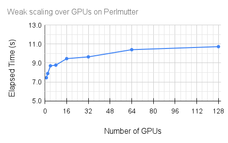

.. role:: cpp(code)
    :language: c++

 .. role:: f(code)
    :language: fortran

.. _sec:Performance:

***********
Performance
***********
.. toctree::
   :maxdepth: 1
   
GPU weak scaling
================

The plot shows weak scaling of the ABL application using A100 GPUs on the Perlmutter system. The domain size is **amr.n_cell = 32 32 128** for a **single GPU** which is progressively scaled up to **512 256 128** for **128 GPUs** while using all 4 GPUs per node.

The test turns off molecular diffusion and activates the Smagorinsky LES model. The processing is limited to the initialization and time-stepping functions by turning off diagnostic calculations, such as the mass summations, and file I/O such as writing checkpoints or plotfiles.

