.. _RegressionTests:

Regression Tests
================

This page covers complete ERF regression cases. For focused GoogleTest cases,
see :ref:`UnitTests`.

ERF runs a set of CMake regression tests on every pull request. These tests use
the AMReX version in the ERF submodule. Nightly GNU Make tests use an AMReX
build configured for the nightly environment.

Results from the nightly CPU tests can be found here: `CPU tests`_

Results from the nightly GPU tests can be found here: `GPU tests`_

.. _`CPU tests`: https://ccse.lbl.gov/pub/RegressionTesting1/ERF

.. _`GPU tests`: https://ccse.lbl.gov/pub/GpuRegressionTesting/ERF

The following problems are currently tested in the CI:

+-------------------------------+----------+----------+----------+------------+-------+---------------------------------+
| Test                          | nx ny nz | xbc      | ybc      | zbc        | Ext   | Other                           |
+===============================+==========+==========+==========+============+=======+=================================+
| Bubble_Density_Current        | 256 4 64 | Symmetry | Periodic | SlipWall   | None  | moist bubble                    |
|                               |          | Outflow  |          | SlipWall   |       |                                 |
+-------------------------------+----------+----------+----------+------------+-------+---------------------------------+
| AnelasticWallDiffusion_X/Y/Z  | 8 12 17  |NoSlipWall|NoSlipWall| NoSlipWall | None  | rotated stationary linear-theta |
|                               |          |          |          |            |       | wall-diffusion tests            |
+-------------------------------+----------+----------+----------+------------+-------+---------------------------------+
| CouetteFlow_x                 | 32 4  16 | Periodic | Periodic | NoSlipWall | None  | inhomogeneous                   |
|                               |          |          |          | NoSlipWall |       | bc at zhi (u = 2)               |
+-------------------------------+----------+----------+----------+------------+-------+---------------------------------+
| CouetteFlow_y                 | 4 32  16 | Periodic | Periodic | NoSlipWall | None  | inhomogeneous                   |
|                               |          |          |          | NoSlipWall |       | bc at zhi (v = 2)               |
+-------------------------------+----------+----------+----------+------------+-------+---------------------------------+
| DensityCurrent                | 256 4 64 | Symmetry | Periodic | SlipWall   | None  | +gravity                        |
|                               |          | Outflow  |          | SlipWall   |       |                                 |
+-------------------------------+----------+----------+----------+------------+-------+---------------------------------+
| DensityCurrent_detJ2          | 256 4 64 | Symmetry | Periodic | SlipWall   | None  | terrain_type = StaticFittedMesh |
|                               |          | Outflow  |          | SlipWall   |       | uses zlevels                    |
|                               |          | Outflow  |          | SlipWall   |       | detJ = 2 everywhere             |
+-------------------------------+----------+----------+----------+------------+-------+---------------------------------+
| DensityCurrent_detJ2_nosub    | 256 4 64 | Symmetry | Periodic | SlipWall   | None  | terrain_type = StaticFittedMesh |
|                               |          | Outflow  |          | SlipWall   |       | uses zlevels                    |
|                               |          |          |          |            |       | detJ = 2 everywhere             |
|                               |          |          |          |            |       | no substepping                  |
+-------------------------------+----------+----------+----------+------------+-------+---------------------------------+
| DensityCurrent_detJ2_MT       | 256 4 64 | Symmetry | Periodic | SlipWall   | None  | terrain_type = MovingFittedMesh |
|                               |          | Outflow  |          | SlipWall   |       | uses zlevels                    |
|                               |          | Outflow  |          | SlipWall   |       | detJ = 2 everywhere             |
+-------------------------------+----------+----------+----------+------------+-------+---------------------------------+
| EkmanSpiral                   | 4 4 400  | Periodic | Periodic | NoSlipWall | Geo   | +Coriolis                       |
|                               |          |          |          | SlipWall   |       | +gravity                        |
+-------------------------------+----------+----------+----------+------------+-------+---------------------------------+
| IsentropicVortexAdvecting     | 48 48  4 | Periodic | Periodic | SlipWall   | None  |                                 |
|                               |          |          |          | SlipWall   |       |                                 |
+-------------------------------+----------+----------+----------+------------+-------+---------------------------------+
| IsentropicVortexStationary    | 48 48  4 | Periodic | Periodic | SlipWall   | None  |                                 |
|                               |          |          |          | SlipWall   |       |                                 |
+-------------------------------+----------+----------+----------+------------+-------+---------------------------------+
| MSF_NoSub_IsentropicVortexAdv | 48 48  4 | Periodic | Periodic | SlipWall   | None  | tests map factors               |
|                               |          |          |          | SlipWall   |       | without substepping             |
+-------------------------------+----------+----------+----------+------------+-------+---------------------------------+
| MSF_Sub_IsentropicVortexAdv   | 48 48  4 | Periodic | Periodic | SlipWall   | None  | tests map factors               |
|                               |          |          |          | SlipWall   |       | with substepping                |
+-------------------------------+----------+----------+----------+------------+-------+---------------------------------+
| PoiseuilleFlow_x              | 32 4  16 | Periodic | Periodic | NoSlipWall | GradP |                                 |
|                               |          |          |          | NoSlipWall | in x  |                                 |
+-------------------------------+----------+----------+----------+------------+-------+---------------------------------+
| PoiseuilleFlow_y              | 4 32  16 | Periodic | Periodic | NoSlipWall | GradP |                                 |
|                               |          |          |          | NoSlipWall | in y  |                                 |
+-------------------------------+----------+----------+----------+------------+-------+---------------------------------+
| RayleighDamping               | 64  4 64 | Periodic | Periodic | SlipWall   | None  | Rayleigh damping                |
|                               |          |          |          | SlipWall   |       |                                 |
+-------------------------------+----------+----------+----------+------------+-------+---------------------------------+
| ScalarAdvectionUniformU       | 64 64  4 | Periodic | Periodic | SlipWall   | None  |                                 |
|                               |          |          |          | SlipWall   |       |                                 |
+-------------------------------+----------+----------+----------+------------+-------+---------------------------------+
| ScalarAdvectionShearedU       | 64  4 64 | Periodic | Periodic | SlipWall   | None  |                                 |
|                               |          |          |          | SlipWall   |       |                                 |
+-------------------------------+----------+----------+----------+------------+-------+---------------------------------+
| ScalarAdvDiff_order2          | 32 32 32 | Periodic | Periodic | SlipWall   | None  | advection + diffusion           |
|                               |          |          |          | SlipWall   |       | "Centered_2nd"                  |
+-------------------------------+----------+----------+----------+------------+-------+---------------------------------+
| ScalarAdvDiff_order3          | 32 32 32 | Periodic | Periodic | SlipWall   | None  | advection + diffusion           |
|                               |          |          |          | SlipWall   |       | "Upwind_3rd"                    |
+-------------------------------+----------+----------+----------+------------+-------+---------------------------------+
| ScalarAdvDiff_order4          | 32 32 32 | Periodic | Periodic | SlipWall   | None  | advection + diffusion           |
|                               |          |          |          | SlipWall   |       | "Centered_4th"                  |
+-------------------------------+----------+----------+----------+------------+-------+---------------------------------+
| ScalarAdvDiff_order5          | 32 32 32 | Periodic | Periodic | SlipWall   | None  | advection + diffusion           |
|                               |          |          |          | SlipWall   |       | "Upwind_5th"                    |
+-------------------------------+----------+----------+----------+------------+-------+---------------------------------+
| ScalarAdvDiff_order6          | 32 32 32 | Periodic | Periodic | SlipWall   | None  | advection + diffusion           |
|                               |          |          |          | SlipWall   |       | "Centered_6th"                  |
+-------------------------------+----------+----------+----------+------------+-------+---------------------------------+
| ScalarDiffusionGaussian       | 16 16 16 | Periodic | Periodic | SlipWall   | None  |                                 |
|                               |          |          |          | SlipWall   |       |                                 |
+-------------------------------+----------+----------+----------+------------+-------+---------------------------------+
| ScalarDiffusionSine           | 16 16  4 | Periodic | Periodic | SlipWall   | None  |                                 |
|                               |          |          |          | SlipWall   |       |                                 |
+-------------------------------+----------+----------+----------+------------+-------+---------------------------------+
| TaylorGreenAdvecting          | 16 16 16 | Periodic | Periodic | SlipWall   | None  |                                 |
|                               |          |          |          | SlipWall   |       |                                 |
+-------------------------------+----------+----------+----------+------------+-------+---------------------------------+
| TaylorGreenAdvectingDiffusing | 16 16 16 | Periodic | Periodic | SlipWall   | None  |                                 |
|                               |          |          |          | SlipWall   |       |                                 |
+-------------------------------+----------+----------+----------+------------+-------+---------------------------------+
| ParticleAdvect_AMR1_box       | 128 4 32 | Inflow   | Periodic | SlipWall   | None  | particle advection, 1 AMR level |
|                               |          | Outflow  |          | SlipWall   |       | static box tagging, partial z   |
+-------------------------------+----------+----------+----------+------------+-------+---------------------------------+
| ParticleAdvect_AMR1_pcount    | 128 4 32 | Inflow   | Periodic | SlipWall   | None  | particle advection, 1 AMR level |
|                               |          | Outflow  |          | SlipWall   |       | particle-count tagging          |
+-------------------------------+----------+----------+----------+------------+-------+---------------------------------+
| ParticleAdvect_AMR2_pcount    | 128 4 32 | Inflow   | Periodic | SlipWall   | None  | particle advection, 2 AMR levels|
|                               |          | Outflow  |          | SlipWall   |       | particle-count tagging          |
+-------------------------------+----------+----------+----------+------------+-------+---------------------------------+

while the following tests are run nightly:

+-------------------------------+-------------+----------+----------+------------+-------+---------------------------------+
| Test                          | nx ny nz    | xbc      | ybc      | zbc        | Ext   | Other                           |
+===============================+=============+==========+==========+============+=======+=================================+
| ABL-Deardorff                 | 64 64 64    | Periodic | Periodic | NoSlipWall | None  | LES                             |
|                               |             |          |          | SlipWall   |       |                                 |
+-------------------------------+-------------+----------+----------+------------+-------+---------------------------------+
| ABL-Deardorff-OMP             | 64 64 64    | Periodic | Periodic | NoSlipWall | None  | LES                             |
|                               |             |          |          | SlipWall   |       | uses OpenMP                     |
+-------------------------------+-------------+----------+----------+------------+-------+---------------------------------+
| ABL-MOST                      | 64 64 64    | Periodic | Periodic | SurfLay    | None  | LES with MOST bc                |
|                               |             |          |          | SlipWall   |       |                                 |
+-------------------------------+-------------+----------+----------+------------+-------+---------------------------------+
| ABL-MOST-OMP                  | 64 64 64    | Periodic | Periodic | SurfLay    | None  | LES with MOST bc                |
|                               |             |          |          | SlipWall   |       | uses OpenMP                     |
+-------------------------------+-------------+----------+----------+------------+-------+---------------------------------+
| ABL-MYNN                      | 2  2  64    | Periodic | Periodic | SurfLay    | None  | MYNN2.5 Model                   |
|                               |             |          |          | SlipWall   |       |                                 |
+-------------------------------+-------------+----------+----------+------------+-------+---------------------------------+
| ABL-Smag                      | 64 64 64    | Periodic | Periodic | NoSlipWall | None  | LES                             |
|                               |             |          |          | SlipWall   |       |                                 |
+-------------------------------+-------------+----------+----------+------------+-------+---------------------------------+
| ABL-Smag-OMP                  | 64 64 64    | Periodic | Periodic | NoSlipWall | None  | LES                             |
|                               |             |          |          | SlipWall   |       | uses OpenMP                     |
+-------------------------------+-------------+----------+----------+------------+-------+---------------------------------+
| Bomex                         | 32 32 100   | Periodic | Periodic | SurfLay    | None  | Kessler_NoRain                  |
|                               |             |          |          | SlipWall   |       |                                 |
+-------------------------------+-------------+----------+----------+------------+-------+---------------------------------+
| Bubble_Kessler                | 100 4 100   | SlipWall | Periodic | SlipWall   | None  | Kessler                         |
|                               |             |          |          | SlipWall   |       |                                 |
+-------------------------------+-------------+----------+----------+------------+-------+---------------------------------+
| Bubble_Kessler_NoRain         | 200 4 100   | SlipWall | Periodic | SlipWall   | None  | Kessler_NoRain                  |
|                               |             |          |          | SlipWall   |       |                                 |
+-------------------------------+-------------+----------+----------+------------+-------+---------------------------------+
| DensityCurrent                | 256 4 64    | Symmetry | Periodic | SlipWall   | None  | +gravity                        |
|                               |             | Outflow  |          | SlipWall   |       |                                 |
+-------------------------------+-------------+----------+----------+------------+-------+---------------------------------+
| DensityCurrent-OMP            | 256 4 64    | Symmetry | Periodic | SlipWall   | None  | +gravity                        |
|                               |             | Outflow  |          | SlipWall   |       | uses OpenMP                     |
+-------------------------------+-------------+----------+----------+------------+-------+---------------------------------+
| DensityCurrent_Terrain        | 256 4 64    | Symmetry | Periodic | SlipWall   | None  | +gravity                        |
|                               |             | Outflow  |          | SlipWall   |       | terrain_type = StaticFittedMesh |
+-------------------------------+-------------+----------+----------+------------+-------+---------------------------------+
| DensityCurrent_Terrain-OMP    | 256 4 64    | Symmetry | Periodic | SlipWall   | None  | +gravity                        |
|                               |             | Outflow  |          | SlipWall   |       | terrain_type = StaticFittedMesh |
|                               |             | Outflow  |          | SlipWall   |       | uses OpenMP                     |
+-------------------------------+-------------+----------+----------+------------+-------+---------------------------------+
| DensityCurrent_anelastic      | 256 4 64    | Symmetry | Periodic | SlipWall   | None  | +gravity                        |
|                               |             | Outflow  |          | SlipWall   |       | anelastic                       |
+-------------------------------+-------------+----------+----------+------------+-------+---------------------------------+
| DensityCurrent_detJ2          | 256 4 64    | Symmetry | Periodic | SlipWall   | None  | +gravity                        |
|                               |             | Outflow  |          | SlipWall   |       | uses z_levels                   |
+-------------------------------+-------------+----------+----------+------------+-------+---------------------------------+
| EkmanSpiral_custom            | 12 10 400   | Periodic | Periodic | NoSlipWall | Geo   | custom init                     |
|                               |             |          |          | SlipWall   | Cor   |                                 |
+-------------------------------+-------------+----------+----------+------------+-------+---------------------------------+
| EkmanSpiral_ideal             | 12 10 400   | Periodic | Periodic | NoSlipWall | Geo   | init from ideal                 |
|                               |             |          |          | SlipWall   | Cor   | wrfinput file                   |
+-------------------------------+-------------+----------+----------+------------+-------+---------------------------------+
| EkmanSpiral_input_sounding    | 4 4 400     | Periodic | Periodic | NoSlipWall | Geo   | init from                       |
|                               |             |          |          | SlipWall   | Cor   | input_sounding                  |
+-------------------------------+-------------+----------+----------+------------+-------+---------------------------------+
| EkmanSpiral_restart           | 4 4 400     | Periodic | Periodic | NoSlipWall | Geo   | restart test                    |
|                               |             |          |          | SlipWall   | Cor   |                                 |
+-------------------------------+-------------+----------+----------+------------+-------+---------------------------------+
| IsentropicVortexAdvecting     | 48 48  4    | Periodic | Periodic | SlipWall   | None  |                                 |
|                               |             |          |          | SlipWall   |       |                                 |
+-------------------------------+-------------+----------+----------+------------+-------+---------------------------------+
| IsentropicVortexStationary    | 48 48  4    | Periodic | Periodic | SlipWall   | None  |                                 |
|                               |             |          |          | SlipWall   |       |                                 |
+-------------------------------+-------------+----------+----------+------------+-------+---------------------------------+
| MetGrid                       | 140 80 100  | Outflow  | Outflow  | SurfLay    | None  | init from                       |
|                               |             |          |          | SlipWall   |       | metgrid file                    |
+-------------------------------+-------------+----------+----------+------------+-------+---------------------------------+
| MovingTerrain_nosub           | 40  8  79   | Periodic | Periodic | SlipWall   | None  | terrain_type = MovingFittedMesh |
|                               |             |          |          | SlipWall   |       |                                 |
+-------------------------------+-------------+----------+----------+------------+-------+---------------------------------+
| ParticlesOverWoA              | 256 8  64   | Inflow   | Periodic | SlipWall   | None  | particle                        |
|                               |             | Outflow  |          | SlipWall   |       | advection                       |
+-------------------------------+-------------+----------+----------+------------+-------+---------------------------------+
| ScalarAdvecDiffDoubleDen      | 32 32 32    | Periodic | Periodic | SlipWall   | None  | Density = 2                     |
|                               |             |          |          | SlipWall   |       |                                 |
+-------------------------------+-------------+----------+----------+------------+-------+---------------------------------+
| ScalarAdvDiffInflowOutflow    | 32 32 32    | Inflow   | Periodic | SlipWall   | None  |                                 |
|                               |             | Outflow  |          | SlipWall   |       |                                 |
+-------------------------------+-------------+----------+----------+------------+-------+---------------------------------+
| ScalarAdvecDiffUniformU       | 32 32 32    | Periodic | Periodic | SlipWall   | None  |                                 |
|                               |             |          |          | SlipWall   |       |                                 |
+-------------------------------+-------------+----------+----------+------------+-------+---------------------------------+
| ScalarAdvecUniformU           | 64 64  4    | Periodic | Periodic | SlipWall   | None  |                                 |
|                               |             |          |          | SlipWall   |       |                                 |
+-------------------------------+-------------+----------+----------+------------+-------+---------------------------------+
| ScalarAdvecShearedU           | 64  4 64    | Periodic | Periodic | SlipWall   | None  |                                 |
|                               |             |          |          | SlipWall   |       |                                 |
+-------------------------------+-------------+----------+----------+------------+-------+---------------------------------+
| ScalarAdvecUniformU           | 64 64  4    | Periodic | Periodic | SlipWall   | None  |                                 |
|                               |             |          |          | SlipWall   |       |                                 |
+-------------------------------+-------------+----------+----------+------------+-------+---------------------------------+
| ScalarDiffusion               | 64 64 64    | Periodic | Periodic | SlipWall   | None  |                                 |
|                               |             |          |          | SlipWall   |       |                                 |
+-------------------------------+-------------+----------+----------+------------+-------+---------------------------------+
| ScalarDiffusionSine           | 64 64 4     | Periodic | Periodic | SlipWall   | None  |                                 |
|                               |             |          |          | SlipWall   |       |                                 |
+-------------------------------+-------------+----------+----------+------------+-------+---------------------------------+
| TaylorGreenAdvecting          | 64 64 64    | Periodic | Periodic | SlipWall   | None  |                                 |
|                               |             |          |          | SlipWall   |       |                                 |
+-------------------------------+-------------+----------+----------+------------+-------+---------------------------------+
| TaylorGreenAdvDiffDoubleDen   | 64 64 64    | Periodic | Periodic | SlipWall   | None  | Density = 2                     |
|                               |             |          |          | SlipWall   |       |                                 |
+-------------------------------+-------------+----------+----------+------------+-------+---------------------------------+
| TurbulentInflow               | 64 16 32    | Inflow   | Periodic | SurfLay    | None  | LES                             |
|                               |             | Outflow  |          | SlipWall   |       |                                 |
+-------------------------------+-------------+----------+----------+------------+-------+---------------------------------+
| TurbulentInflow_anelastic     | 64 16 32    | Inflow   | Periodic | SurfLay    | None  | LES                             |
|                               |             | Outflow  |          | SlipWall   |       |                                 |
+-------------------------------+-------------+----------+----------+------------+-------+---------------------------------+
| WPS_Test_Terrain              | 200 200 176 | wrfbdy   | wrfbdy   | NoSlipWall | None  | init from                       |
|                               |             | wrfbdy   | wrfbdy   | SlipWall   |       | wrfinput                        |
+-------------------------------+-------------+----------+----------+------------+-------+---------------------------------+
| WPS_Test_Terrain-OMP          | 200 200 176 | wrfbdy   | wrfbdy   | NoSlipWall | None  | init from                       |
|                               |             | wrfbdy   | wrfbdy   | SlipWall   |       | wrfinput                        |
+-------------------------------+-------------+----------+----------+------------+-------+---------------------------------+
| WPS_Test_restart              | 200 200 176 | wrfbdy   | wrfbdy   | NoSlipWall | None  | init from                       |
|                               |             | wrfbdy   | wrfbdy   | SlipWall   |       | wrfinput                        |
+-------------------------------+-------------+----------+----------+------------+-------+---------------------------------+

More details about the CI tests are given below.

Scalar Advection by Uniform Flow in XY Plane
------------------------------------------------
This tests scalar advection with periodic boundaries in the lateral directions and slip walls at low and high z.

Test Location: `Tests/test_files/ScalarAdvectionUniformU`_

.. _`Tests/test_files/ScalarAdvectionUniformU`: https://github.com/erf-model/ERF/tree/development/Tests/test_files/ScalarAdvectionUniformU

Problem Location: `Exec/RegTests/ScalarAdvDiff`_

.. _`Exec/RegTests/ScalarAdvDiff`: https://github.com/erf-model/ERF/tree/development/Exec/RegTests/ScalarAdvDiff

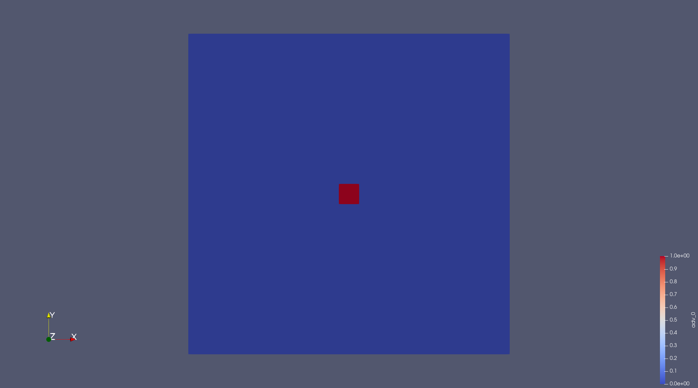

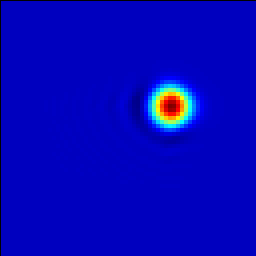

.. _fig:scalar_advection_uniform_u:

.. table:: X-Y slice of a 2-d cylindrical blob in a uniform velocity field (10,5,0)

   +-----------------------------------------------------+------------------------------------------------------+
   |                        |a2|                         |                        |b2|                          |
   +-----------------------------------------------------+------------------------------------------------------+
   |   Scalar concentration at t=0.                      |   Scalar concentration at 20 steps.                  |
   +-----------------------------------------------------+------------------------------------------------------+

Scalar Advection by Sheared Flow
------------------------------------------------
This tests scalar advection with periodic boundaries in the lateral directions and slip walls at low and high z.

Test Location: `Tests/test_files/ScalarAdvectionShearedU`_

.. _`Tests/test_files/ScalarAdvectionShearedU`: https://github.com/erf-model/ERF/tree/development/Tests/test_files/ScalarAdvectionShearedU

Problem Location: `Exec/RegTests/ScalarAdvDiff`_

.. _`Exec/RegTests/ScalarAdvDiff`: https://github.com/erf-model/ERF/tree/development/Exec/RegTests/ScalarAdvDiff

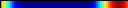

.. _fig:scalar_advection_sheared_u:

.. table:: X-Z slice of a 2-d cylindrical blob in a uniform shearing velocity field (8 log( (z+z0)/z0 ) / log ( (zref+z0)/z0 )
   with z0 = 0.1 and zref = 80 in a triply periodic domain 8x8x8

   +-----------------------------------------------------+------------------------------------------------------+
   |                        |a3|                         |                        |b3|                          |
   +-----------------------------------------------------+------------------------------------------------------+
   |   Scalar concentration at t=0.                      |   Scalar concentration at 80 steps                   |
   +-----------------------------------------------------+------------------------------------------------------+

Scalar Diffusion: Sphere of Scalar
------------------------------------------------
This tests scalar diffusion with periodic boundaries in the lateral directions and slip walls at low and high z.

Test Location: `Tests/test_files/ScalarDiffusionGaussian`_

.. _`Tests/test_files/ScalarDiffusionGaussian`: https://github.com/erf-model/ERF/tree/development/Tests/test_files/ScalarDiffusionGaussian

Problem Location: `Exec/RegTests/ScalarAdvDiff`_

.. _`Exec/RegTests/ScalarAdvDiff`: https://github.com/erf-model/ERF/tree/development/Exec/RegTests/ScalarAdvDiff

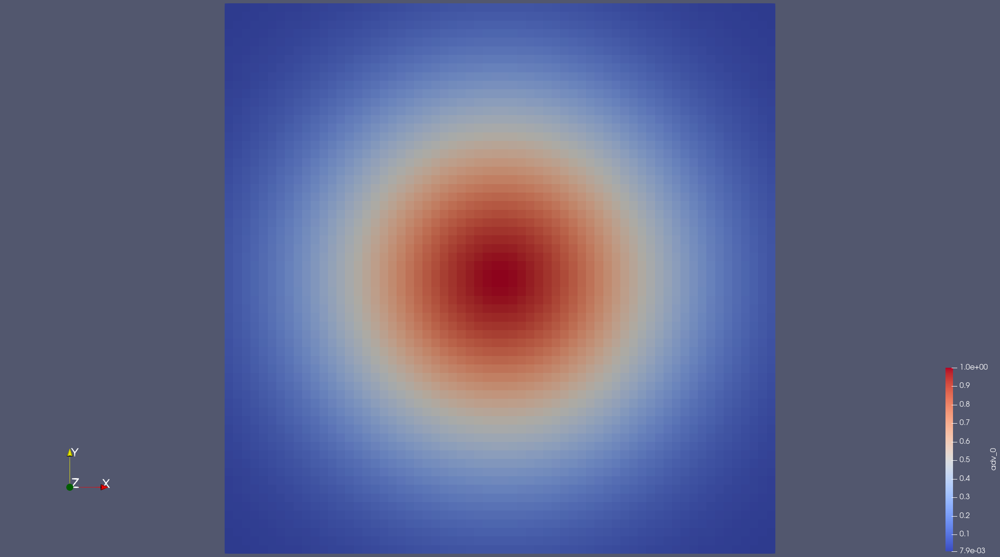

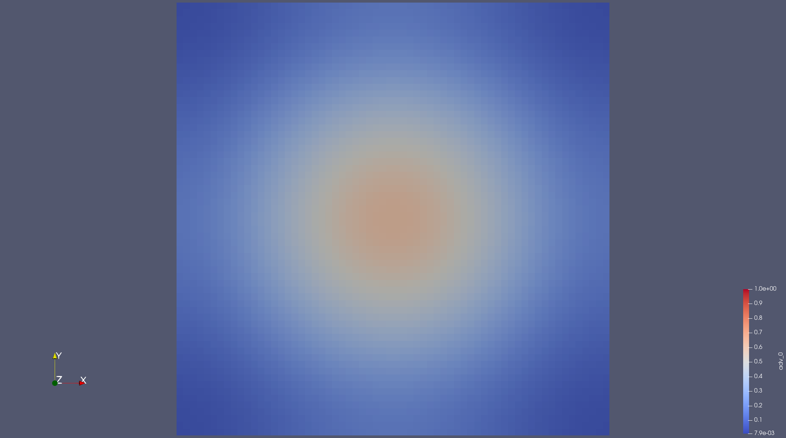

.. _fig:scalar_diffusion_gaussian:

.. table:: Diffusion of a spherical blob of scalar

   +-----------------------------------------------------+------------------------------------------------------+
   |                        |a5|                         |                        |b5|                          |
   +-----------------------------------------------------+------------------------------------------------------+
   |   Scalar concentration at t=0.                      |   Scalar concentration at 20 steps (t = 0.01).       |
   +-----------------------------------------------------+------------------------------------------------------+

Scalar Diffusion: Sinusoidal Variation of Scalar
------------------------------------------------
This tests scalar diffusion with periodic boundaries in the lateral directions and slip walls at low and high z.

Test Location: `Tests/test_files/ScalarDiffusionSine`_

.. _`Tests/test_files/ScalarDiffusionSine`: https://github.com/erf-model/ERF/tree/development/Tests/test_files/ScalarDiffusionSine

Problem Location: `Exec/RegTests/ScalarAdvDiff`_

.. _`Exec/RegTests/ScalarAdvDiff`: https://github.com/erf-model/ERF/tree/development/Exec/RegTests/ScalarAdvDiff

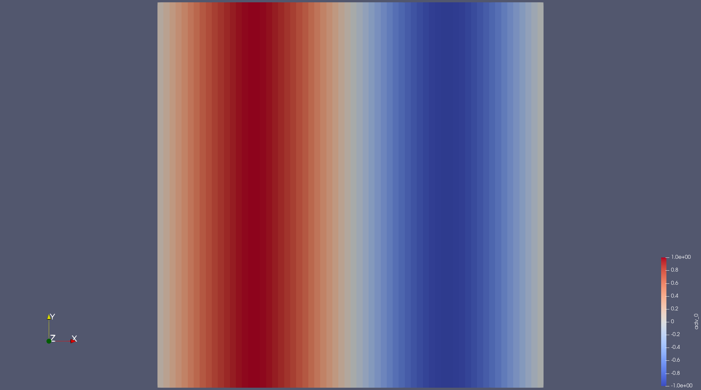

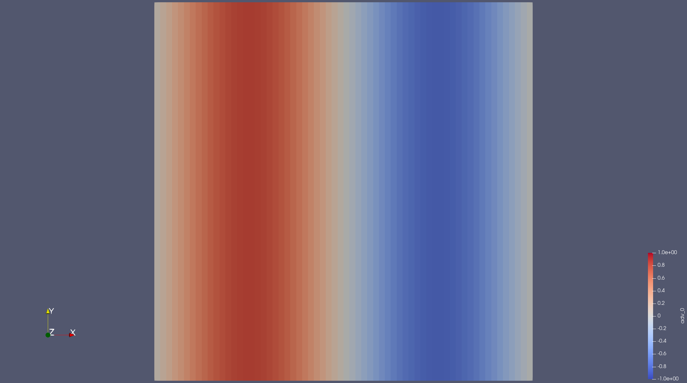

.. _fig:scalar_diffusion_sine:

.. table:: Diffusion of a scalar initialized as sin(x)

   +-----------------------------------------------------+------------------------------------------------------+
   |                        |a6|                         |                        |b6|                          |
   +-----------------------------------------------------+------------------------------------------------------+
   |   Scalar concentration at t=0.                      |   Scalar concentration at 20 steps (t = 0.2).        |
   +-----------------------------------------------------+------------------------------------------------------+

Scalar Advection/Diffusion by Uniform Flow With Different Spatial Orders
------------------------------------------------------------------------
This tests scalar advection and diffusion with periodic boundaries in the lateral directions and slip walls at low and high z.

Test Location (for 2nd order): `Tests/test_files/ScalarAdvDiff_order2`_

.. _`Tests/test_files/ScalarAdvDiff_order2`: https://github.com/erf-model/ERF/tree/development/Tests/test_files/ScalarAdvDiff_order2

Problem Location: `Exec/RegTests/ScalarAdvDiff`_

.. _`Exec/RegTests/ScalarAdvDiff`: https://github.com/erf-model/ERF/tree/development/Exec/RegTests/ScalarAdvDiff

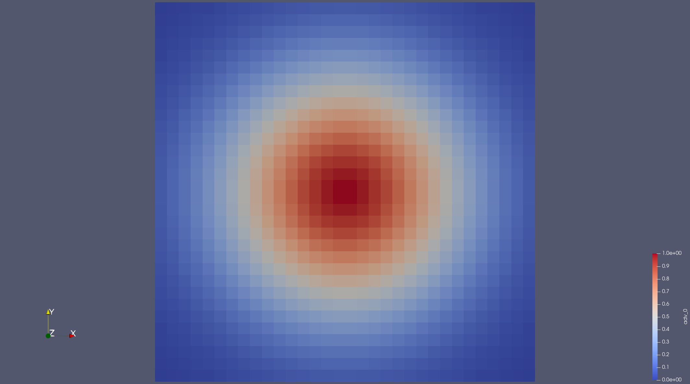

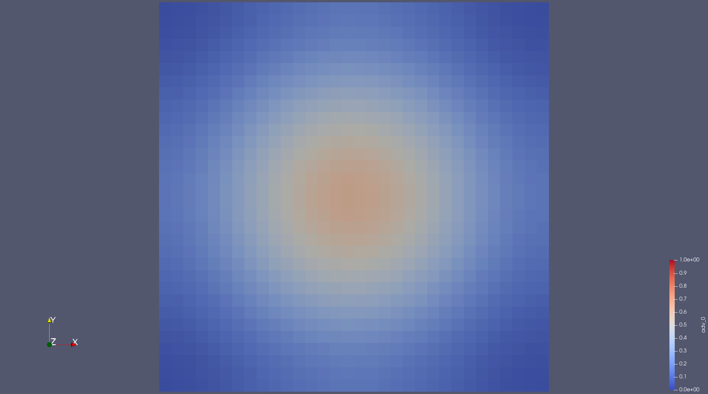

.. _fig:scalar_diffusion_uniform:

.. table:: Advection and diffusion of a spherical blob in a uniform velocity field (100,0,0)

   +-----------------------------------------------------+------------------------------------------------------+
   |                        |a7|                         |                        |b7|                          |
   +-----------------------------------------------------+------------------------------------------------------+
   |   Scalar concentration at t=0.                      |   Scalar concentration at 20 steps (t = 0.01).       |
   +-----------------------------------------------------+------------------------------------------------------+

Rayleigh Damping
----------------

This tests Rayleigh damping.  The problem is initialized as in the shear flow case, then
Rayleigh damping is applied with a target mean profile of (2,1,0).

Test Location: `Tests/test_files/RayleighDamping`_

.. _`Tests/test_files/RayleighDamping`: https://github.com/erf-model/ERF/tree/development/Tests/test_files/RayleighDamping

Problem Location: `Exec/RegTests/ScalarAdvDiff`_

.. _`Exec/RegTests/ScalarAdvDiff`: https://github.com/erf-model/ERF/tree/development/Exec/RegTests/ScalarAdvDiff

Isentropic Vortex: Stationary
-----------------------------
This tests advection of an isentropic vortex with triply periodic boundaries.

Test Location: `Tests/test_files/IsentropicVortexStationary`_

.. _`Tests/test_files/IsentropicVortexStationary`: https://github.com/erf-model/ERF/tree/development/Tests/test_files/IsentropicVortexStationary

Problem Location: `Exec/RegTests/IsentropicVortex`_

.. _`Exec/RegTests/IsentropicVortex`: https://github.com/erf-model/ERF/tree/development/Exec/RegTests/IsentropicVortex

Isentropic Vortex: Advecting
----------------------------
This tests advection of an isentropic vortex with triply periodic boundaries.

Test Location: `Tests/test_files/IsentropicVortexAdvecting`_

.. _`Tests/test_files/IsentropicVortexAdvecting`: https://github.com/erf-model/ERF/tree/development/Tests/test_files/IsentropicVortexAdvecting

Problem Location: `Exec/RegTests/IsentropicVortex`_

.. _`Exec/RegTests/IsentropicVortex`: https://github.com/erf-model/ERF/tree/development/Exec/RegTests/IsentropicVortex

Taylor Green Vortex: Advection
------------------------------------------------
This tests advection and diffusion with triply periodic boundaries.

Test Location: `Tests/test_files/TaylorGreenAdvecting`_

.. _`Tests/test_files/TaylorGreenAdvecting`: https://github.com/erf-model/ERF/tree/development/Tests/test_files/TaylorGreenAdvecting

Problem Location: `Exec/RegTests/TaylorGreenVortex`_

.. _`Exec/RegTests/TaylorGreenVortex`: https://github.com/erf-model/ERF/tree/development/Exec/RegTests/TaylorGreenVortex

Taylor Green Vortex: Advection and Diffusion
------------------------------------------------
This tests advection and diffusion with triply periodic boundaries.

Test Location: `Tests/test_files/TaylorGreenAdvectingDiffusing`_

.. _`Tests/test_files/TaylorGreenAdvectingDiffusing`: https://github.com/erf-model/ERF/tree/development/Tests/test_files/TaylorGreenAdvectingDiffusing

Problem Location: `Exec/RegTests/TaylorGreenVortex`_

.. _`Exec/RegTests/TaylorGreenVortex`: https://github.com/erf-model/ERF/tree/development/Exec/RegTests/TaylorGreenVortex

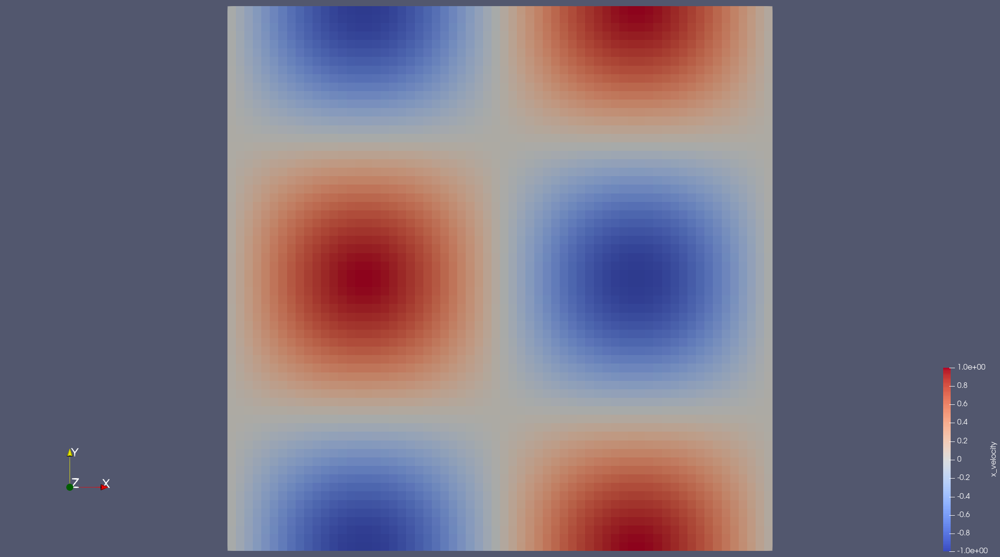

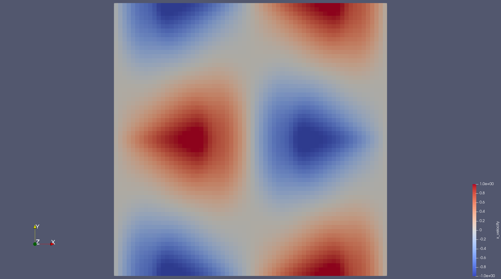

.. _fig:taylor_green_vortex:

.. table:: Scalar concentration

   +-----------------------------------------------------+------------------------------------------------------+
   |                        |a8|                         |                        |b8|                          |
   +-----------------------------------------------------+------------------------------------------------------+
   |   Flow field at t=0.                                |   Flow field at 10 steps (t = 1.6).                  |
   +-----------------------------------------------------+------------------------------------------------------+

Couette Flow (x-direction)
---------------------------

This tests Couette flow in a channel.  The domain is periodic in the x- and y-directions, and has
NoSlipWall bc's on the low-z and high-z faces.  At the high-z boundary
the velocity is specified to be :math:`U = (2,0,0)`.   The steady solution for this problem is
:math:`U = (z/8,0,0)` in the domain which is 16 units high in z.

Test Location: `Tests/test_files/CouetteFlow_x`_

.. _`Tests/test_files/CouetteFlow_x`: https://github.com/erf-model/ERF/tree/development/Tests/test_files/CouetteFlow_x

Problem Location: ``Exec/RegTests/Couette_Poiseuille``

Couette Flow (y-direction)
---------------------------

This tests Couette flow in a channel.  The domain is periodic in the x- and y-directions, and has
NoSlipWall bc's on the low-z and high-z faces.  At the high-z boundary
the velocity is specified to be :math:`U = (0,2,0)`.   The steady solution for this problem is
:math:`U = (0,z/8,0)` in the domain which is 16 units high in z.

Test Location: `Tests/test_files/CouetteFlow_y`_

.. _`Tests/test_files/CouetteFlow_y`: https://github.com/erf-model/ERF/tree/development/Tests/test_files/CouetteFlow_y

Problem Location: ``Exec/RegTests/Couette_Poiseuille``

Poiseuille Flow (x-direction)
-----------------------------

This tests Poiseuille flow in a channel.  The domain is periodic in the x- and y-directions, and has
NoSlipWall bc's on the low-z and high-z faces.  We initialize the solution with the steady parabolic
profile :math:`U = (1-z^2,0,0)` in the domain which runs from -1. to 1. in z.  The viscosity is
specified to be 0.1 and the imposed pressure gradient is :math:`Gp = (-0.2,0,0)`.

Test Location: `Tests/test_files/PoiseuilleFlow_x`_

.. _`Tests/test_files/PoiseuilleFlow_x`: https://github.com/erf-model/ERF/tree/development/Tests/test_files/PoiseuilleFlow_x

Problem Location: ``Exec/RegTests/Couette_Poiseuille``

Poiseuille Flow (y-direction)
-----------------------------

This tests Poiseuille flow in a channel.  The domain is periodic in the x- and y-directions, and has
NoSlipWall bc's on the low-z and high-z faces.  We initialize the solution with the steady parabolic
profile :math:`U = (0,1-z^2,0)` in the domain which runs from -1. to 1. in z.  The viscosity is
specified to be 0.1 and the imposed pressure gradient is :math:`Gp = (0,-0.2,0)`.

Test Location: `Tests/test_files/PoiseuilleFlow_y`_

.. _`Tests/test_files/PoiseuilleFlow_y`: https://github.com/erf-model/ERF/tree/development/Tests/test_files/PoiseuilleFlow_y

Problem Location: ``Exec/RegTests/Couette_Poiseuille``

Nonlinear Density Current
---------------------------
The density current problem tests the effects of gravity and the behavior at a slip wall.

See :ref:`sec:Verification` for more information.

Test Location: `Tests/test_files/DensityCurrent`_

.. _`Tests/test_files/DensityCurrent`: https://github.com/erf-model/ERF/tree/development/Tests/test_files/DensityCurrent

Problem Location: ``Exec/CanonicalTests/DensityCurrent``

.. _`Exec/CanonicalTests/DensityCurrent`: https://github.com/erf-model/ERF/tree/development/Exec/CanonicalTests/DensityCurrent

Canonical RANS
---------------------------
Five cases exercise the one-equation :math:`k` RANS closure (see :ref:`RANS`)
on flat ground (neutral, stable and convective boundary layers) and on
terrain-fitted meshes (a 2D ridge and a 3D hill), each for 40 steps. Every
entry then runs the case's Python check script, which reads the plotfile
with a standard-library AMReX reader, averages or samples the fields, and
compares numbers against stated targets with tolerances: wall distance
against the exact distance to the terrain, length scale against its bounds,
the wall value of :math:`k` against :math:`u_*^2 / (c_\mu^0)^2`, dissipation
against AL01 Eq. 19, and, in the longer physics runs documented in each
case's README, the log law, GABLS1 depths and jets, the convective heat
budget and the hill-top speed-up. The script's exit code is the verdict; a
clean exit alone never passes a test. The ``_Poisson`` variants run the
terrain cases with the Poisson wall distance instead of the terrain height.

Test names: ``RANS_Neutral_ABL_Flat``, ``RANS_Stable_ABL_Flat``,
``RANS_Convective_ABL_Flat``, ``RANS_Neutral_Hill_2D`` (and ``_Poisson``),
``RANS_Flat_Fitted_2D`` (and ``_Poisson``), ``RANS_Neutral_Hill_3D`` (and
``_Poisson``); label ``rans``. The flat cases run with the MLMG projection
(``erf.use_fft=false``); the terrain-fitted cases need the FFT-preconditioned
projection and are registered only when the build enables FFT
(``ERF_ENABLE_FFT``).

``RANS_Checks_SelfTest`` tests the check scripts' own verdict logic rather
than any physics: it states, for each kind of comparison the shared
``rans_checks.py`` offers, what the check must decide for values inside and
just outside the stated tolerance or band, and fails when a check disagrees.
It also calls ``check_implicit_explicit_ke.py`` with malformed arguments (a
missing or non-numeric ``--tol``, too few plotfiles), each of which must print
the usage and exit with status 2 rather than fail with a traceback.
It runs no ERF executable; labels ``rans`` and ``unit``. It is registered
only when CMake finds a Python 3 interpreter, so a configuration without
one simply does not have the test rather than failing the unit stage.

Problem Location: `Exec/CanonicalTests/Canonical_RANS`_

.. _`Exec/CanonicalTests/Canonical_RANS`: https://github.com/erf-model/ERF/tree/development/Exec/CanonicalTests/Canonical_RANS

Restart parity
--------------
``MoistBubble_Kessler_Restart`` (MPI builds, not Windows) runs the moist bubble
deck with Kessler rain (``erf.moisture_model=Kessler``, the rain fields in the
plotfile) straight to step 8,
again to a checkpoint at step 4, and from that checkpoint to step 8, and
requires the two plotfiles at step 8 to be identical (``Tests/RunRestartParity.cmake``,
no gold file; label ``restart-parity``). Every run has a time limit of its own,
so a restart whose first step never finishes fails with a message. Until
September 2026 the restart path handed the microphysics its minimum cell
height only on terrain-fitted meshes; on a constant-dz mesh the sedimentation
substep count of the first restarted step was computed from an uninitialised
value and the step never finished. Only the schemes that size their
sedimentation substeps from that height are affected, namely Kessler
(``ERF_Kessler.cpp``) and SAM (``ERF_PrecipFall.cpp``, ``ERF_IceFall.cpp``);
Morrison, WSM6 and WDM6 store the minimum cell height but never read it.

Test Location: `Tests/test_files/MoistBubble_Kessler_Restart`_

.. _`Tests/test_files/MoistBubble_Kessler_Restart`: https://github.com/erf-model/ERF/tree/development/Tests/test_files/MoistBubble_Kessler_Restart

Closure box, rank and tiling parity
-----------------------------------
The ``Closure_BoxParity_*`` tests (MPI builds, not Windows; label ``box-parity``)
run the unstable, perturbed ABL deck of ``ABL_MRF_Tiling`` twice: on one box, on
one rank, without tiling, and on four 16 x 16 x 32 boxes on two ranks with 8 x 8
tiles. The plotfiles after 10 steps must agree to a relative tolerance of 1e-9
(``Tests/RunBoxParity.cmake``, no gold file). The entries choose the physics on
the command line: the Deardorff closure, once with ``erf.vert_implicit = false``
and once with the implicit vertical solve that ERF uses by default; the k-eqn
closure with its PBL-height length cap; the MYNN25, MYNNEDMF, MYJ and native
SHOC PBL schemes; Kessler microphysics on a moist sounding; and Smagorinsky on a
stretched mesh whose levels are chosen so that they sum to the top of the domain.
With the FFT build, two more run the anelastic MidPoint integrator with the
Deardorff closure and with Kessler microphysics.
Until September 2026 the anelastic integrator copied the projected momentum
into the fluxes of the slow scalars tile by tile inside the loop that advects
them, so the turbulent kinetic energy, moisture and passive scalars of anelastic
runs depended on the tile size. The boxes are never split in z, so the column
solves apply. The moist sounding is supersaturated below 150 m so that Kessler
condenses, autoconverts and sediments within the ten steps of the run; otherwise
``qc`` and ``qp`` would be compared as zero against zero. MYNNEDMF computed its
diffusivities on a box grown by one cell in the vertical, so its vertical-derivative
stencil reached two cells outside the domain; it now uses the valid box, as MYNN25
does. The ghost values it computed were discarded in any case, since
``ComputeTurbulentViscosity`` refills every eddy-viscosity ghost cell after the
scheme returns, and dropping them leaves the answer bit for bit unchanged.

Test Location: `Tests/test_files/Closure_BoxParity`_

.. _`Tests/test_files/Closure_BoxParity`: https://github.com/erf-model/ERF/tree/development/Tests/test_files/Closure_BoxParity

Station time series
-------------------
``StationSampling_BoxParity`` and ``StationSampling_Restart`` cover the station
time series written by ``erf.station_names`` (see :ref:`sec:Inputs`). A station
value is an interpolation from whichever level and whichever box happens to
cover the point, so the two things most likely to break it are a change of
decomposition and a restart, and both are checked against the run that does it
in one piece. Beyond the plotfile comparison every parity test makes, each
compares ``Output_Stations/Center.dat`` line by line, to the ten significant
digits the series prints rather than the six a data log prints
(``DATALOG_SIGDIGITS`` in ``Tests/RunBoxParity.cmake`` and
``Tests/RunRestartParity.cmake``). ``Center.dat`` is the series compared because
it is the one that varies; the stations in the still air away from the bubble
would compare a constant against a constant. The restart comparison strips the
comment lines first, since the restarted run marks the seam with a comment the
straight run does not have.

The deck is the Straka density current refined over the lower middle of the
domain, with four stations chosen so that the run touches every path the sampler
has: ``Center``, two locations inside the refined region with two heights each,
so the values come from level 1 and the vertical interpolation runs; ``Edge``,
inside the outer half cell of the non-periodic ``x`` boundary, where the
horizontal stencil collapses onto the edge cell; ``Wrap``, inside the outer half
cell of the periodic ``y`` boundary, where the stencil reaches across the
periodic image; and ``Surface``, a 2D diagnostic, which has no height and is
filled by the 2D plotfile path rather than the 3D one. The refined box stops
halfway up the domain, so the deck also pins down the level test: a level
supplies a station when it covers the column from the bottom of the domain up
through the cells the vertical interpolation reads, not when it covers the whole
column, and with ``erf.v = 1`` the sampler prints the level it chose for each
station. The deck lowers ``erf.station_buffer_steps`` to 2, well below its
default of 100, so that a ten-step run exercises the flush path and, on the
restart, the header check that fires with the first flush of the restarted run.

Test Location: `Tests/test_files/StationSampling`_

.. _`Tests/test_files/StationSampling`: https://github.com/erf-model/ERF/tree/development/Tests/test_files/StationSampling

Station output does not change the answer
-----------------------------------------
The three ``StationSampling_AnswerParity*`` tests (label ``option-parity``) hold
the sampler to the claim made in :ref:`sec:Inputs`, that turning station output
on does not change the solution. Each runs one deck twice, once with the
stations off and once with them on, and requires the plotfile to be identical
**bit for bit** -- ``--rel_tol 0 --abs_tol 0``, not the tolerances the gold-file
tests use, because a diagnostic that moves the answer at all is a bug rather
than a tolerance question (``Tests/RunOptionParity.cmake``, no gold file). Both
legs run on the same number of ranks with the same decomposition, so anything
that survives is the sampler's own doing. Each names a file the "on" leg must
write and the "off" leg must not, so a misspelled option cannot pass as
agreement, and the harness refuses two legs given the same options.

The claim is not free, which is why it is tested. The sampler asks
``BuildPlot3DScratch`` not to average the microphysics state down
(``sync_solution = false``), since that call modifies the coarse solution. What
it still does at every sampled step is fillpatch the state on every level up to
the highest one a station is on, re-point the ``qmoist`` pointers on every
level, and fill the requested variables over whole levels. The three decks cover
the paths that could break:

* ``StationSampling_AnswerParity`` on the ``StationSampling`` deck -- two
  levels, dry. The only one of the three whose station resolves to level 1, so
  it is the case that exercises ``FillPatchFineLevel``.
* ``StationSampling_AnswerParity_MOST`` on ``ABL_MOST`` -- the surface layer.
  ``u_star`` and ``t_star`` are 2D diagnostics of the MOST path, so the "on" leg
  reads what the surface layer computed as well as the 3D state.
* ``StationSampling_AnswerParity_SDM`` on ``SDM_MoistBubble2D_AMR1`` (MPI builds
  with ``ERF_ENABLE_PARTICLES``) -- Lagrangian microphysics on two levels with
  ``CouplingType::TwoWay``, which is the configuration in which
  ``BuildPlot3DScratch`` would average the microphysics state down, and so the
  one the ``sync_solution = false`` argument exists for. Unlike the SDM
  gold-file tests this one compares a run against itself, so it needs neither
  the machine-specific gold files nor the flags that gate them.

One gap is left open deliberately. A run driven by time-dependent lateral
boundary data is the remaining case where an extra fill at ``t_new`` could in
principle matter, and it is not covered: there is no ``nc_bdy_file`` fixture
under ``Tests/test_files``, and the decks that read one
(``Exec/RegTests/WPS_Test``, ``Exec/RegTests/MetGrid``, the Katrina inputs under
``Exec/CanonicalTests/Hurricanes``) need NetCDF input that CI does not have. The
argument that it is safe is that the boundary path reaches
``ReadBndryPlanes::interp_in_time``, which memoizes on the requested time and is
otherwise a pure function of it, so a second fill at ``t_new`` re-derives what
the step already wrote rather than consuming a read. That is an argument, not a
measurement.

Ekman Spiral
---------------------------
The Ekman spiral problem tests the computation of the stress term internally and at no-slip walls, as well as Coriolis and geostrophic forcing.

See :ref:`sec:Verification` for more information.

Test Location: `Tests/test_files/EkmanSpiral`_

.. _`Tests/test_files/EkmanSpiral`: https://github.com/erf-model/ERF/tree/development/Tests/test_files/EkmanSpiral

Problem Location: `Exec/CanonicalTests/EkmanSpiral`_

.. _`Exec/CanonicalTests/EkmanSpiral`: https://github.com/erf-model/ERF/tree/development/Exec/CanonicalTests/EkmanSpiral
