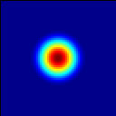

Regression Tests
================
Last update: 2021-11-11.

There are currently 12 tests which are run as part of every PR and also as part
of a nightly regression suite.  The CI tests use cmake and are based on the version
of AMReX in the ERF submodule; the nightly tests use GNUMake and use the current
development branch of AMReX.

Results from the nightly CPU tests can be found here: `CPU tests`_

Results from the nightly GPU tests can be found here: `GPU tests`_

.. _`CPU tests`: https://ccse.lbl.gov/pub/RegressionTesting1/ERF

.. _`GPU tests`: https://ccse.lbl.gov/pub/GpuRegressionTesting/ERF

The following problems are currently tested:

Scalar Advection by Uniform Flow in X Direction
------------------------------------------------
This tests scalar advection with triply periodic boundaries.

Problem Definition
~~~~~~~~~~~~~~~~~~
Test Location: `test_files/ScalarAdvectionUniformU`_

.. _`test_files/ScalarAdvectionUniformU`: https://github.com/erf-model/ERF/tree/development/Tests/test_files/ScalarAdvectionUniformU

Problem Location: `ScalarAdvection`_

.. _`ScalarAdvection`: https://github.com/erf-model/ERF/tree/development/Exec/ScalarAdvection

Sample Solution/ Flow-field
~~~~~~~~~~~~~~~~~~~~~~~~~~~~
.. image:: figures/tests/scalar_advec_uniform_u_start.png
  :width: 600
.. image:: figures/tests/scalar_advec_uniform_u_end.png
  :width: 600
Scalar concentration at times {0, 0.0264788} s.

V&V for the Reference Solution
~~~~~~~~~~~~~~~~~~~~~~~~~~~~~~~~~

Scalar Advection by Uniform Flow in XY Plane
------------------------------------------------
This tests scalar advection with triply periodic boundaries.

Problem Definition
~~~~~~~~~~~~~~~~~~
Test Location: `test_files/ScalarAdvectionUniformUV`_

.. _`test_files/ScalarAdvectionUniformUV`: https://github.com/erf-model/ERF/tree/development/Tests/test_files/ScalarAdvectionUniformUV

Problem Location: `ScalarAdvection`_

.. _`ScalarAdvection`: https://github.com/erf-model/ERF/tree/development/Exec/ScalarAdvection

Sample Solution/ Flow-field
~~~~~~~~~~~~~~~~~~~~~~~~~~~~
.. image:: figures/tests/scalar_advec_uniform_uv_start.png
  :width: 600
.. image:: figures/tests/scalar_advec_uniform_uv_end.png
  :width: 600
Scalar concentration at times {0, 0.6937161} s

V&V for the Reference Solution
~~~~~~~~~~~~~~~~~~~~~~~~~~~~~~~~~

Scalar Advection by Sheared Flow
------------------------------------------------
This tests scalar advection with triply periodic boundaries.

Problem Definition
~~~~~~~~~~~~~~~~~~
Test Location: `test_files/ScalarAdvectionShearedU`_

.. _`test_files/ScalarAdvectionShearedU`: https://github.com/erf-model/ERF/tree/development/Tests/test_files/ScalarAdvectionShearedU

Problem Location: `ScalarAdvection`_

.. _`ScalarAdvection`: https://github.com/erf-model/ERF/tree/development/Exec/ScalarAdvection

Sample Solution/ Flow-field
~~~~~~~~~~~~~~~~~~~~~~~~~~~~

.. image:: figures/tests/scalar_advec_sheared_u_end.png
  :width: 600
Scalar concentration at times {0, 0.9819669} s.

V&V for the Reference Solution
~~~~~~~~~~~~~~~~~~~~~~~~~~~~~~~~~

Scalar Advection: Rigid Rotation
----------------------------------
Problem Definition
~~~~~~~~~~~~~~~~~~
Test Location: `test_files/ScalarAdvectionRigidRotation`_

.. _`test_files/ScalarAdvectionRigidRotation`: https://github.com/erf-model/ERF/tree/development/Tests/test_files/ScalarAdvectionRigidRotation

Problem Location: `ScalarAdvecRigidRot`_

.. _`ScalarAdvecRigidRot`: https://github.com/erf-model/ERF/tree/development/Exec/ScalarAdvecRigidRot

Sample Solution/ Flow-field
~~~~~~~~~~~~~~~~~~~~~~~~~~~~
.. image:: figures/tests/scalar_advec_rigid_rot_start.png
  :width: 600
.. image:: figures/tests/scalar_advec_rigid_rot_end.png
  :width: 600
Flow-field at times {0, 6.283185} s.

V&V for the Reference Solution
~~~~~~~~~~~~~~~~~~~~~~~~~~~~~~~~~

Scalar Diffusion: Sphere of Scalar
------------------------------------------------
This tests scalar advection with triply periodic boundaries.

Problem Definition
~~~~~~~~~~~~~~~~~~
Test Location: `test_files/ScalarDiffusion`_

.. _`test_files/ScalarDiffusion`: https://github.com/erf-model/ERF/tree/development/Tests/test_files/ScalarDiffusion

Problem Location: `ScalarDiffusion`_

.. _`ScalarDiffusion`: https://github.com/erf-model/ERF/tree/development/Exec/ScalarDiffusion

Sample Solution/ Flow-field
~~~~~~~~~~~~~~~~~~~~~~~~~~~~
.. image:: figures/tests/scalar_diff_start.png
  :width: 600
.. image:: figures/tests/scalar_diff_end.png
  :width: 600
Flow-field at times {0, 0.01} s.

V&V for the Reference Solution
~~~~~~~~~~~~~~~~~~~~~~~~~~~~~~~~~

Scalar Diffusion: Sinusoidal Variation of Scalar
------------------------------------------------
This tests scalar advection with triply periodic boundaries.

Problem Definition
~~~~~~~~~~~~~~~~~~
Test Location: `test_files/ScalarDiffusionSine`_

.. _`test_files/ScalarDiffusionSine`: https://github.com/erf-model/ERF/tree/development/Tests/test_files/ScalarDiffusionSine

Problem Location: `ScalarDiffusion`_

.. _`ScalarDiffusion`: https://github.com/erf-model/ERF/tree/development/Exec/ScalarDiffusion

Sample Solution/ Flow-field
~~~~~~~~~~~~~~~~~~~~~~~~~~~~
.. image:: figures/tests/scalar_diff_sine_start.png
  :width: 600
.. image:: figures/tests/scalar_diff_sine_end.png
  :width: 600
Flow-field at times {0, 0.2} s.

V&V for the Reference Solution
~~~~~~~~~~~~~~~~~~~~~~~~~~~~~~~~~

Scalar Advection/Diffusion by Uniform Flow
------------------------------------------------
This tests scalar advection and diffusion with triply periodic boundaries.

Problem Definition
~~~~~~~~~~~~~~~~~~
Test Location: `test_files/ScalarAdvectionDiffusionUniformU`_

.. _`test_files/ScalarAdvectionDiffusionUniformU`: https://github.com/erf-model/ERF/tree/development/Tests/test_files/ScalarAdvectionDiffusionUniformU

Problem Location: `ScalarAdvecDiffUniformU`_

.. _`ScalarAdvecDiffUniformU`: https://github.com/erf-model/ERF/tree/development/Exec/ScalarAdvecDiffUniformU

Sample Solution/ Flow-field
~~~~~~~~~~~~~~~~~~~~~~~~~~~~
.. image:: figures/tests/scalar_advec_diff_start.png
  :width: 600
.. image:: figures/tests/scalar_advec_diff_end.png
  :width: 600
Flow-field at times {0, 0.01} s.

V&V for the Reference Solution
~~~~~~~~~~~~~~~~~~~~~~~~~~~~~~~~~

Isentropic Vortex: Stationary
---------------------------------
This tests advection of an isentropic vortex tith triply periodic boundaries.

Problem Definition
~~~~~~~~~~~~~~~~~~
Test Location: `test_files/IsentropicVortexStationary`_

.. _`test_files/IsentropicVortexStationary`: https://github.com/erf-model/ERF/tree/development/Tests/test_files/IsentropicVortexStationary

Problem Location: `IsentropicVortex`_

.. _`IsentropicVortex`: https://github.com/erf-model/ERF/tree/development/Exec/IsentropicVortex

Sample Solution/ Flow-field
~~~~~~~~~~~~~~~~~~~~~~~~~~~~

V&V for the Reference Solution
~~~~~~~~~~~~~~~~~~~~~~~~~~~~~~~~~

Isentropic Vortex: Advecting
---------------------------
This tests advection of an isentropic vortex tith triply periodic boundaries.

Problem Definition
~~~~~~~~~~~~~~~~~~
Test Location: `test_files/IsentropicVortexAdvecting`_

.. _`test_files/IsentropicVortexAdvecting`: https://github.com/erf-model/ERF/tree/development/Tests/test_files/IsentropicVortexAdvecting

Problem Location: `IsentropicVortex`_

.. _`IsentropicVortex`: https://github.com/erf-model/ERF/tree/development/Exec/IsentropicVortex

Sample Solution/ Flow-field
~~~~~~~~~~~~~~~~~~~~~~~~~~~~

V&V for the Reference Solution
~~~~~~~~~~~~~~~~~~~~~~~~~~~~~~~~~

Taylor Green Vortex: Advection
------------------------------------------------
This tests advection and diffusion with triply periodic boundaries.

Problem Definition
~~~~~~~~~~~~~~~~~~
Test Location: `test_files/TaylorGreenAdvecting`_

.. _`test_files/TaylorGreenAdvecting`: https://github.com/erf-model/ERF/tree/development/Tests/test_files/TaylorGreenAdvecting

Problem Location: `TaylorGreenVortex`_

.. _`TaylorGreenVortex`: https://github.com/erf-model/ERF/tree/development/Exec/TaylorGreenVortex

Sample Solution/ Flow-field
~~~~~~~~~~~~~~~~~~~~~~~~~~~~

V&V for the Reference Solution
~~~~~~~~~~~~~~~~~~~~~~~~~~~~~~~~~

Taylor Green Vortex: Advection and Diffusion
------------------------------------------------
This tests advection and diffusion with triply periodic boundaries.

Problem Definition
~~~~~~~~~~~~~~~~~~
Test Location: `test_files/TaylorGreenAdvectingDiffusing`_

.. _`test_files/TaylorGreenAdvectingDiffusing`: https://github.com/erf-model/ERF/tree/development/Tests/test_files/TaylorGreenAdvectingDiffusing

Problem Location: `TaylorGreenVortex`_

.. _`TaylorGreenVortex`: https://github.com/erf-model/ERF/tree/development/Exec/TaylorGreenVortex

Sample Solution/ Flow-field
~~~~~~~~~~~~~~~~~~~~~~~~~~~~
.. image:: figures/tests/TGV_start.png
  :width: 600
.. image:: figures/tests/TGV_end.png
  :width: 600
Flow-field at times {0, 1.6} s.

V&V for the Reference Solution
~~~~~~~~~~~~~~~~~~~~~~~~~~~~~~~~~

Channel Flow: DNS
------------------------
Problem Definition
~~~~~~~~~~~~~~~~~~
Test Location:

Problem Location: `ChannelDNS`_

.. _`ChannelDNS`: https://github.com/erf-model/ERF/tree/development/Exec/ChannelDNS

Sample Solution/ Flow-field
~~~~~~~~~~~~~~~~~~~~~~~~~~~~

V&V for the Reference Solution
~~~~~~~~~~~~~~~~~~~~~~~~~~~~~~~~~

Channel Flow: LES
------------------------
Problem Definition
~~~~~~~~~~~~~~~~~~
Test Location:

Problem Location: `ChannelLES`_

.. _`ChannelLES`: https://github.com/erf-model/ERF/tree/development/Exec/ChannelLES

Sample Solution/ Flow-field
~~~~~~~~~~~~~~~~~~~~~~~~~~~~

V&V for the Reference Solution
~~~~~~~~~~~~~~~~~~~~~~~~~~~~~~~~~

Couette Flow
------------
Problem Definition
~~~~~~~~~~~~~~~~~~
Test Location: `test_files/CouetteFlow`_

.. _`test_files/CouetteFlow`: https://github.com/erf-model/ERF/tree/development/Tests/test_files/CouetteFlow

Problem Location: `CouetteFlow`_

.. _`CouetteFlow`: https://github.com/erf-model/ERF/tree/development/Exec/CouetteFlow

Sample Solution/ Flow-field
~~~~~~~~~~~~~~~~~~~~~~~~~~~~

V&V for the Reference Solution
~~~~~~~~~~~~~~~~~~~~~~~~~~~~~~~~~

Ekman Spiral
---------------------------
This tests the Coriolis and geostrophic forcing.

Problem Definition
~~~~~~~~~~~~~~~~~~
Test Location:

Problem Location: `EkmanSpiral`_

.. _`EkmanSpiral`: https://github.com/erf-model/ERF/tree/development/Exec/EkmanSpiral

Sample Solution/ Flow-field
~~~~~~~~~~~~~~~~~~~~~~~~~~~~

V&V for the Reference Solution
~~~~~~~~~~~~~~~~~~~~~~~~~~~~~~~~~
