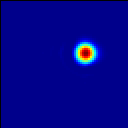

 .. _RegressionTests:

Regression Tests
================

There are currently 26 tests which are run as part of every PR.
The CI tests use cmake and are based on the version
of AMReX in the ERF submodule.

In addition there are nightly tests that use GNUMake and use the current
development branch of AMReX.

Results from the nightly CPU tests can be found here: `CPU tests`_

Results from the nightly GPU tests can be found here: `GPU tests`_

.. _`CPU tests`: https://ccse.lbl.gov/pub/RegressionTesting1/ERF

.. _`GPU tests`: https://ccse.lbl.gov/pub/GpuRegressionTesting/ERF

The following problems are currently tested in the CI:

+-------------------------------+----------+----------+----------+------------+-------+-----------------------+
| Test                          | nx ny nz | xbc      | ybc      | zbc        | Ext   | Other                 |
+===============================+==========+==========+==========+============+=======+=======================+
| Bubble_Density_Current        | 256 4 64 | Symmetry | Periodic | SlipWall   | None  | USE_MOISTURE=TRUE     |
|                               |          | Outflow  |          | SlipWall   |       |                       |
+-------------------------------+----------+----------+----------+------------+-------+-----------------------+
| CouetteFlow                   | 32 4  16 | Periodic | Periodic | SlipWall   | None  | inhomogeneous         |
|                               |          |          |          | SlipWall   |       | bc at zhi             |
+-------------------------------+----------+----------+----------+------------+-------+-----------------------+
| DensityCurrent                | 256 4 64 | Symmetry | Periodic | SlipWall   | None  | +gravity              |
|                               |          | Outflow  |          | SlipWall   |       |                       |
+-------------------------------+----------+----------+----------+------------+-------+-----------------------+
| DensityCurrent_detJ2          | 256 4 64 | Symmetry | Periodic | SlipWall   | None  | use_terrain = true    |
|                               |          | Outflow  |          | SlipWall   |       | uses zlevels          |
|                               |          | Outflow  |          | SlipWall   |       | detJ = 2 everywhere   |
+-------------------------------+----------+----------+----------+------------+-------+-----------------------+
| DensityCurrent_detJ2_nosub    | 256 4 64 | Symmetry | Periodic | SlipWall   | None  | use_terrain = true    |
|                               |          | Outflow  |          | SlipWall   |       | uses zlevels          |
|                               |          |          |          |            |       | detJ = 2 everywhere   |
|                               |          |          |          |            |       | no substepping        |
+-------------------------------+----------+----------+----------+------------+-------+-----------------------+
| DensityCurrent_detJ2_MT       | 256 4 64 | Symmetry | Periodic | SlipWall   | None  | use_terrain = true    |
|                               |          | Outflow  |          | SlipWall   |       | uses zlevels          |
|                               |          | Outflow  |          | SlipWall   |       | detJ = 2 everywhere   |
|                               |          |          |          |            |       | terrain_type = Moving |
+-------------------------------+----------+----------+----------+------------+-------+-----------------------+
| EkmanSpiral                   | 4 4 400  | Periodic | Periodic | NoSlipWall | Geo   | +Coriolis             |
|                               |          |          |          | SlipWall   |       | +gravity              |
+-------------------------------+----------+----------+----------+------------+-------+-----------------------+
| IsentropicVortexAdvecting     | 48 48  4 | Periodic | Periodic | SlipWall   | None  |                       |
|                               |          |          |          | SlipWall   |       |                       |
+-------------------------------+----------+----------+----------+------------+-------+-----------------------+
| IsentropicVortexStationary    | 48 48  4 | Periodic | Periodic | SlipWall   | None  |                       |
|                               |          |          |          | SlipWall   |       |                       |
+-------------------------------+----------+----------+----------+------------+-------+-----------------------+
| MSF_NoSub_IsentropicVortexAdv | 48 48  4 | Periodic | Periodic | SlipWall   | None  | tests map factors     |
|                               |          |          |          | SlipWall   |       | without substepping   |
+-------------------------------+----------+----------+----------+------------+-------+-----------------------+
| MSF_Sub_IsentropicVortexAdv   | 48 48  4 | Periodic | Periodic | SlipWall   | None  | tests map factors     |
|                               |          |          |          | SlipWall   |       | with substepping      |
+-------------------------------+----------+----------+----------+------------+-------+-----------------------+
| PoiseuilleFlow                | 32 4  16 | Periodic | Periodic | NoSlipWall | GradP |                       |
|                               |          |          |          | NoSlipWall | in x  |                       |
+-------------------------------+----------+----------+----------+------------+-------+-----------------------+
| RayleighDamping               | 64  4 64 | Periodic | Periodic | SlipWall   | None  | Rayleigh damping      |
|                               |          |          |          | SlipWall   |       |                       |
+-------------------------------+----------+----------+----------+------------+-------+-----------------------+
| ScalarAdvectionUniformU       | 64 64  4 | Periodic | Periodic | SlipWall   | None  |                       |
|                               |          |          |          | SlipWall   |       |                       |
+-------------------------------+----------+----------+----------+------------+-------+-----------------------+
| ScalarAdvectionShearedU       | 64  4 64 | Periodic | Periodic | SlipWall   | None  |                       |
|                               |          |          |          | SlipWall   |       |                       |
+-------------------------------+----------+----------+----------+------------+-------+-----------------------+
| ScalarAdvDiff_order2          | 32 32 32 | Periodic | Periodic | SlipWall   | None  | advection + diffusion |
|                               |          |          |          | SlipWall   |       | "Centered_2nd"        |
+-------------------------------+----------+----------+----------+------------+-------+-----------------------+
| ScalarAdvDiff_order3          | 32 32 32 | Periodic | Periodic | SlipWall   | None  | advection + diffusion |
|                               |          |          |          | SlipWall   |       | "Upwind_3rd"          |
+-------------------------------+----------+----------+----------+------------+-------+-----------------------+
| ScalarAdvDiff_order4          | 32 32 32 | Periodic | Periodic | SlipWall   | None  | advection + diffusion |
|                               |          |          |          | SlipWall   |       | "Centered_4th"        |
+-------------------------------+----------+----------+----------+------------+-------+-----------------------+
| ScalarAdvDiff_order5          | 32 32 32 | Periodic | Periodic | SlipWall   | None  | advection + diffusion |
|                               |          |          |          | SlipWall   |       | "Upwind_5th"          |
+-------------------------------+----------+----------+----------+------------+-------+-----------------------+
| ScalarAdvDiff_order6          | 32 32 32 | Periodic | Periodic | SlipWall   | None  | advection + diffusion |
|                               |          |          |          | SlipWall   |       | "Centered_6th"        |
+-------------------------------+----------+----------+----------+------------+-------+-----------------------+
| ScalarDiffusionGaussian       | 16 16 16 | Periodic | Periodic | SlipWall   | None  |                       |
|                               |          |          |          | SlipWall   |       |                       |
+-------------------------------+----------+----------+----------+------------+-------+-----------------------+
| ScalarDiffusionSine           | 16 16  4 | Periodic | Periodic | SlipWall   | None  |                       |
|                               |          |          |          | SlipWall   |       |                       |
+-------------------------------+----------+----------+----------+------------+-------+-----------------------+
| TaylorGreenAdvecting          | 16 16 16 | Periodic | Periodic | SlipWall   | None  |                       |
|                               |          |          |          | SlipWall   |       |                       |
+-------------------------------+----------+----------+----------+------------+-------+-----------------------+
| TaylorGreenAdvectingDiffusing | 16 16 16 | Periodic | Periodic | SlipWall   | None  |                       |
|                               |          |          |          | SlipWall   |       |                       |
+-------------------------------+----------+----------+----------+------------+-------+-----------------------+

while the following tests are run nightly:

+-------------------------------+----------+----------+----------+------------+-------+------------------+
| Test                          | nx ny nz | xbc      | ybc      | zbc        | Ext   | Other            |
+===============================+==========+==========+==========+============+=======+==================+
| ABL-Deardorff                 | 64 64 64 | Periodic | Periodic | NoSlipWall | None  | LES              |
|                               |          |          |          | SlipWall   |       |                  |
+-------------------------------+----------+----------+----------+------------+-------+------------------+
| ABL-Smag                      | 64 64 64 | Periodic | Periodic | NoSlipWall | None  | LES              |
|                               |          |          |          | SlipWall   |       |                  |
+-------------------------------+----------+----------+----------+------------+-------+------------------+
| CouetteFlow-x                 | 32 4  16 | Periodic | Periodic | NoSlipWall | None  | inhomogeneous    |
|                               |          |          |          | NoSlipWall |       | bc at zhi        |
+-------------------------------+----------+----------+----------+------------+-------+------------------+
| CouetteFlow-y                 | 4  32 16 | Periodic | Periodic | NoSlipWall | None  | inhomogeneous    |
|                               |          |          |          | NoSlipWall |       | bc at zhi        |
+-------------------------------+----------+----------+----------+------------+-------+------------------+
| DensityCurrent                | 256 4 64 | Symmetry | Periodic | SlipWall   | None  | +gravity         |
|                               |          | Outflow  |          | SlipWall   |       |                  |
+-------------------------------+----------+----------+----------+------------+-------+------------------+
| EkmanSpiral                   | 4 4 400  | Periodic | Periodic | NoSlipWall | Geo   | +Coriolis        |
|                               |          |          |          | SlipWall   |       | +gravity         |
+-------------------------------+----------+----------+----------+------------+-------+------------------+
| EkmanSpiral_restart           | 4 4 400  | Periodic | Periodic | NoSlipWall | Geo   | restart test     |
|                               |          |          |          | SlipWall   |       |                  |
+-------------------------------+----------+----------+----------+------------+-------+------------------+
| IsentropicVortexAdvecting     | 48 48  4 | Periodic | Periodic | SlipWall   | None  |                  |
|                               |          |          |          | SlipWall   |       |                  |
+-------------------------------+----------+----------+----------+------------+-------+------------------+
| IsentropicVortexStationary    | 48 48  4 | Periodic | Periodic | SlipWall   | None  |                  |
|                               |          |          |          | SlipWall   |       |                  |
+-------------------------------+----------+----------+----------+------------+-------+------------------+
| PoiseuilleFlow-x              | 32 4  16 | Periodic | Periodic | NoSlipWall | GradP |                  |
|                               |          |          |          | NoSlipWall | in x  |                  |
+-------------------------------+----------+----------+----------+------------+-------+------------------+
| PoiseuilleFlow-y              | 4  32 16 | Periodic | Periodic | NoSlipWall | GradP |                  |
|                               |          |          |          | NoSlipWall | in y  |                  |
+-------------------------------+----------+----------+----------+------------+-------+------------------+
| ScalarAdvecDiffDoubleDen      | 32 32 32 | Periodic | Periodic | SlipWall   | None  | Density = 2      |
|                               |          |          |          | SlipWall   |       |                  |
+-------------------------------+----------+----------+----------+------------+-------+------------------+
| ScalarAdvDiffInflowOutflow    | 32 32 32 | Inflow   | Periodic | SlipWall   | None  |                  |
|                               |          | Outflow  |          | SlipWall   |       |                  |
+-------------------------------+----------+----------+----------+------------+-------+------------------+
| ScalarAdvecDiffUniformU       | 32 32 32 | Periodic | Periodic | SlipWall   | None  |                  |
|                               |          |          |          | SlipWall   |       |                  |
+-------------------------------+----------+----------+----------+------------+-------+------------------+
| ScalarAdvecUniformU           | 64 64  4 | Periodic | Periodic | SlipWall   | None  |                  |
|                               |          |          |          | SlipWall   |       |                  |
+-------------------------------+----------+----------+----------+------------+-------+------------------+
| ScalarAdvecShearedU           | 64  4 64 | Periodic | Periodic | SlipWall   | None  |                  |
|                               |          |          |          | SlipWall   |       |                  |
+-------------------------------+----------+----------+----------+------------+-------+------------------+
| ScalarAdvecUniformU           | 64 64  4 | Periodic | Periodic | SlipWall   | None  |                  |
|                               |          |          |          | SlipWall   |       |                  |
+-------------------------------+----------+----------+----------+------------+-------+------------------+
| ScalarDiffusionGaussian       | 64 64 64 | Periodic | Periodic | SlipWall   | None  |                  |
|                               |          |          |          | SlipWall   |       |                  |
+-------------------------------+----------+----------+----------+------------+-------+------------------+
| ScalarDiffusionSine           | 64 64 4  | Periodic | Periodic | SlipWall   | None  |                  |
|                               |          |          |          | SlipWall   |       |                  |
+-------------------------------+----------+----------+----------+------------+-------+------------------+
| TaylorGreenAdvecting          | 64 64 64 | Periodic | Periodic | SlipWall   | None  |                  |
|                               |          |          |          | SlipWall   |       |                  |
+-------------------------------+----------+----------+----------+------------+-------+------------------+
| TaylorGreenAdvDiffDoubleDen   | 64 64 64 | Periodic | Periodic | SlipWall   | None  | Density = 2      |
|                               |          |          |          | SlipWall   |       |                  |
+-------------------------------+----------+----------+----------+------------+-------+------------------+

More details about the CI tests are given below.

Scalar Advection by Uniform Flow in XY Plane
------------------------------------------------
This tests scalar advection with periodic boundaries in the lateral directions and slip walls at low and high z.

Test Location: `Tests/test_files/ScalarAdvectionUniformU`_

.. _`Tests/test_files/ScalarAdvectionUniformU`: https://github.com/erf-model/ERF/tree/development/Tests/test_files/ScalarAdvectionUniformU

Problem Location: `Exec/RegTests/ScalarAdvDiff`_

.. _`Exec/RegTests/ScalarAdvDiff`: https://github.com/erf-model/ERF/tree/development/Exec/RegTests/ScalarAdvDiff

.. |a2| image:: figures/tests/scalar_advec_uniform_u_start.png
        :width: 200

.. _fig:scalar_advection_uniform_u

.. table:: X-Y slice of a 2-d cylindrical blob in a uniform velocity field (10,5,0)

   +-----------------------------------------------------+------------------------------------------------------+
   |                        |a2|                         |                        |b2|                          |
   +-----------------------------------------------------+------------------------------------------------------+
   |   Scalar concentration at t=0.                      |   Scalar concentration at 20 steps.                  |
   +-----------------------------------------------------+------------------------------------------------------+

Scalar Advection by Sheared Flow
------------------------------------------------
This tests scalar advection with periodic boundaries in the lateral directions and slip walls at low and high z.

Test Location: `Tests/test_files/ScalarAdvectionShearedU`_

.. _`Tests/test_files/ScalarAdvectionShearedU`: https://github.com/erf-model/ERF/tree/development/Tests/test_files/ScalarAdvectionShearedU

Problem Location: `Exec/RegTests/ScalarAdvDiff`_

.. _`Exec/RegTests/ScalarAdvDiff`: https://github.com/erf-model/ERF/tree/development/Exec/RegTests/ScalarAdvDiff

.. |a3| image:: figures/tests/scalar_advec_sheared_u_start.png
        :width: 200

.. |b3| image:: figures/tests/scalar_advec_sheared_u_end.png
        :width: 200

.. _fig:scalar_advection_sheared_u

.. table:: X-Z slice of a 2-d cylindrical blob in a uniform shearing velocity field (8 log( (z+z0)/z0 ) / log ( (zref+z0)/z0 )
   with z0 = 0.1 and zref = 80 in a triply periodic domain 8x8x8

   +-----------------------------------------------------+------------------------------------------------------+
   |                        |a3|                         |                        |b3|                          |
   +-----------------------------------------------------+------------------------------------------------------+
   |   Scalar concentration at t=0.                      |   Scalar concentration at 80 steps                   |
   +-----------------------------------------------------+------------------------------------------------------+

Scalar Diffusion: Sphere of Scalar
------------------------------------------------
This tests scalar diffusion with periodic boundaries in the lateral directions and slip walls at low and high z.

Test Location: `Tests/test_files/ScalarDiffusionGaussian`_

.. _`Tests/test_files/ScalarDiffusionGaussian`: https://github.com/erf-model/ERF/tree/development/Tests/test_files/ScalarDiffusionGaussian

Problem Location: `Exec/RegTests/ScalarAdvDiff`_

.. _`Exec/RegTests/ScalarAdvDiff`: https://github.com/erf-model/ERF/tree/development/Exec/RegTests/ScalarAdvDiff

.. |a5| image:: figures/tests/scalar_diff_start.png
        :width: 300

.. |b5| image:: figures/tests/scalar_diff_end.png
        :width: 300

.. _fig:scalar_diffusion_gaussian

.. table:: Diffusion of a spherical blob of scalar

   +-----------------------------------------------------+------------------------------------------------------+
   |                        |a5|                         |                        |b5|                          |
   +-----------------------------------------------------+------------------------------------------------------+
   |   Scalar concentration at t=0.                      |   Scalar concentration at 20 steps (t = 0.01).       |
   +-----------------------------------------------------+------------------------------------------------------+

Scalar Diffusion: Sinusoidal Variation of Scalar
------------------------------------------------
This tests scalar diffusion with periodic boundaries in the lateral directions and slip walls at low and high z.

Test Location: `Tests/test_files/ScalarDiffusionSine`_

.. _`Tests/test_files/ScalarDiffusionSine`: https://github.com/erf-model/ERF/tree/development/Tests/test_files/ScalarDiffusionSine

Problem Location: `Exec/RegTests/ScalarAdvDiff`_

.. _`Exec/RegTests/ScalarAdvDiff`: https://github.com/erf-model/ERF/tree/development/Exec/RegTests/ScalarAdvDiff

.. |a6| image:: figures/tests/scalar_diff_sine_start.png
        :width: 300

.. |b6| image:: figures/tests/scalar_diff_sine_end.png
        :width: 300

.. _fig:scalar_diffusion_sine

.. table:: Diffusion of a scalar initialized as sin(x)

   +-----------------------------------------------------+------------------------------------------------------+
   |                        |a6|                         |                        |b6|                          |
   +-----------------------------------------------------+------------------------------------------------------+
   |   Scalar concentration at t=0.                      |   Scalar concentration at 20 steps (t = 0.2).        |
   +-----------------------------------------------------+------------------------------------------------------+

Scalar Advection/Diffusion by Uniform Flow With Different Spatial Orders
------------------------------------------------------------------------
This tests scalar advection and diffusion with periodic boundaries in the lateral directions and slip walls at low and high z.

Test Location (for 2nd order): `Tests/test_files/ScalarAdvDiff_order2`_

.. _`Tests/test_files/ScalarAdvDiff_order2`: https://github.com/erf-model/ERF/tree/development/Tests/test_files/ScalarAdvDiff_order2

Problem Location: `Exec/RegTests/ScalarAdvDiff`_

.. _`Exec/RegTests/ScalarAdvDiff`: https://github.com/erf-model/ERF/tree/development/Exec/RegTests/ScalarAdvDiff

.. |a7| image:: figures/tests/scalar_advec_diff_start.png
        :width: 300

.. |b7| image:: figures/tests/scalar_advec_diff_end.png
        :width: 300

.. _fig:scalar_diffusion_sine

.. table:: Advection and diffusion of a spherical blob in a uniform velocity field (100,0,0)

   +-----------------------------------------------------+------------------------------------------------------+
   |                        |a7|                         |                        |b7|                          |
   +-----------------------------------------------------+------------------------------------------------------+
   |   Scalar concentration at t=0.                      |   Scalar concentration at 20 steps (t = 0.01).       |
   +-----------------------------------------------------+------------------------------------------------------+

Rayleigh Damping
----------------

This tests Rayleigh damping.  The problem is initialized as in the shear flow case, then
Rayleigh damping is applied with a target mean profile of (2,1,0).

Test Location: `Tests/test_files/RayleighDamping`_

.. _`Tests/test_files/RayleighDamping`: https://github.com/erf-model/ERF/tree/development/Tests/test_files/RayleighDamping

Problem Location: `Exec/RegTests/ScalarAdvDiff`_

.. _`Exec/RegTests/ScalarAdvDiff`: https://github.com/erf-model/ERF/tree/development/Exec/RegTests/ScalarAdvDiff

Isentropic Vortex: Stationary
-----------------------------
This tests advection of an isentropic vortex with triply periodic boundaries.

Test Location: `Tests/test_files/IsentropicVortexStationary`_

.. _`Tests/test_files/IsentropicVortexStationary`: https://github.com/erf-model/ERF/tree/development/Tests/test_files/IsentropicVortexStationary

Problem Location: `Exec/RegTests/IsentropicVortex`_

.. _`Exec/RegTests/IsentropicVortex`: https://github.com/erf-model/ERF/tree/development/Exec/RegTests/IsentropicVortex

Isentropic Vortex: Advecting
----------------------------
This tests advection of an isentropic vortex with triply periodic boundaries.

Test Location: `Tests/test_files/IsentropicVortexAdvecting`_

.. _`Tests/test_files/IsentropicVortexAdvecting`: https://github.com/erf-model/ERF/tree/development/Tests/test_files/IsentropicVortexAdvecting

Problem Location: `Exec/RegTests/IsentropicVortex`_

.. _`Exec/RegTests/IsentropicVortex`: https://github.com/erf-model/ERF/tree/development/Exec/RegTests/IsentropicVortex

Taylor Green Vortex: Advection
------------------------------------------------
This tests advection and diffusion with triply periodic boundaries.

Test Location: `Tests/test_files/TaylorGreenAdvecting`_

.. _`Tests/test_files/TaylorGreenAdvecting`: https://github.com/erf-model/ERF/tree/development/Tests/test_files/TaylorGreenAdvecting

Problem Location: `Exec/RegTests/TaylorGreenVortex`_

.. _`Exec/RegTests/TaylorGreenVortex`: https://github.com/erf-model/ERF/tree/development/Exec/RegTests/TaylorGreenVortex

Taylor Green Vortex: Advection and Diffusion
------------------------------------------------
This tests advection and diffusion with triply periodic boundaries.

Test Location: `Tests/test_files/TaylorGreenAdvectingDiffusing`_

.. _`Tests/test_files/TaylorGreenAdvectingDiffusing`: https://github.com/erf-model/ERF/tree/development/Tests/test_files/TaylorGreenAdvectingDiffusing

Problem Location: `Exec/RegTests/TaylorGreenVortex`_

.. _`Exec/RegTests/TaylorGreenVortex`: https://github.com/erf-model/ERF/tree/development/Exec/RegTests/TaylorGreenVortex

.. |a8| image:: figures/tests/TGV_start.png
        :width: 300

.. |b8| image:: figures/tests/TGV_end.png
        :width: 300

.. _fig:taylor_green_vortex

.. table:: Scalar concentration

   +-----------------------------------------------------+------------------------------------------------------+
   |                        |a8|                         |                        |b8|                          |
   +-----------------------------------------------------+------------------------------------------------------+
   |   Flow field at t=0.                                |   Flow field at 10 steps (t = 1.6).                  |
   +-----------------------------------------------------+------------------------------------------------------+

Couette Flow
------------

This tests Couette flow in a channel.  The domain is periodic in the x- and y-directions, and has
NoSlipWall bc's on the low-z and high-z faces.  At the high-z boundary
the velocity is specified to be :math:`U = (2,0,0)`.   The steady solution for this problem is
:math:`U = (z/8,0,0)` in the domain which is 16 units high in z.

Test Location: `Tests/test_files/CouetteFlow`_

.. _`Tests/test_files/CouetteFlow`: https://github.com/erf-model/ERF/tree/development/Tests/test_files/CouetteFlow

Problem Location: `Exec/RegTests/CouetteFlow`_

.. _`Exec/RegTests/CouetteFlow`: https://github.com/erf-model/ERF/tree/development/Exec/RegTests/CouetteFlow

Poiseuille Flow
---------------

This tests Poiseuille flow in a channel.  The domain is periodic in the x- and y-directions, and has
NoSlipWall bc's on the low-z and high-z faces.  We initialize the solution with the steady parabolic
profile :math:`U = (1-z^2,0,0)` in the domain which runs from -1. to 1. in z.  The viscosity is
specified to be 0.1 and the imposed pressure gradient is :math:`Gp = (-0.2,0,0)`.

Test Location: `Tests/test_files/PoiseuilleFlow`_

.. _`Tests/test_files/PoiseuilleFlow`: https://github.com/erf-model/ERF/tree/development/Tests/test_files/PoiseuilleFlow

Problem Location: `Exec/RegTests/PoiseuilleFlow`_

.. _`Exec/RegTests/PoiseuilleFlow`: https://github.com/erf-model/ERF/tree/development/Exec/RegTests/PoiseuilleFlow

Nonlinear Density Current
---------------------------
The density current problem tests the effects of gravity and the behavior at a slip wall.

See :ref:`sec:Verification` for more information.

Test Location: `Tests/test_files/DensityCurrent`_

.. _`Tests/test_files/DensityCurrent`: https://github.com/erf-model/ERF/tree/development/Tests/test_files/DensityCurrent

Problem Location: `Exec/RegTests/DensityCurrent`_

.. _`Exec/DensityCurrent`: https://github.com/erf-model/ERF/tree/development/Exec/RegTests/DensityCurrent

Ekman Spiral
---------------------------
The Ekman spiral problem tests the computation of the stress term internally and at no-slip walls, as well as Coriolis and geostrophic forcing.

See :ref:`sec:Verification` for more information.

Test Location: `Tests/test_files/EkmanSpiral`_

.. _`Tests/test_files/EkmanSpiral`: https://github.com/erf-model/ERF/tree/development/Tests/test_files/EkmanSpiral

Problem Location: `Exec/RegTests/EkmanSpiral`_

.. _`Exec/RegTests/EkmanSpiral`: https://github.com/erf-model/ERF/tree/development/Exec/RegTests/EkmanSpiral_ideal
