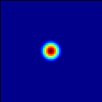
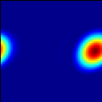

Regression Tests
================
Last update: 2021-11-11.

There are currently 12 tests which are run as part of every PR and also as part
of a nightly regression suite.  The CI tests use cmake and are based on the version
of AMReX in the ERF submodule; the nightly tests use GNUMake and use the current
development branch of AMReX.

Results from the nightly CPU tests can be found here: `CPU tests`_

Results from the nightly GPU tests can be found here: `GPU tests`_

.. _`CPU tests`: https://ccse.lbl.gov/pub/RegressionTesting1/ERF

.. _`GPU tests`: https://ccse.lbl.gov/pub/GpuRegressionTesting/ERF

The following problems are currently tested in the CI:

+-------------------------------+----------+-----+-----+-----+-------+------------------+
| Test                          | nx ny nz | xbc | ybc | zbc | Ext   | Other            |
+===============================+==========+=====+=====+=====+=======+==================+
| ScalarAdvectionUniformU       | 16 16 16 | per | per | per | None  |                  |
+-------------------------------+----------+-----+-----+-----+-------+------------------+
| ScalarAdvectionUniformUV      | 16 16  4 | per | per | per | None  |                  |
+-------------------------------+----------+-----+-----+-----+-------+------------------+
| ScalarAdvectionShearedU       | 16  4 16 | per | per | per | None  |                  |
+-------------------------------+----------+-----+-----+-----+-------+------------------+
| ScalarAdvectionRigidRotation  | 16 16  4 | per | per | per | None  |                  |
+-------------------------------+----------+-----+-----+-----+-------+------------------+
| ScalarAdvectionDiffusion      | 16 16 16 | per | per | per | None  |                  |
+-------------------------------+----------+-----+-----+-----+-------+------------------+
| ScalarDiffusionGaussian       | 16 16 16 | per | per | per | None  |                  |
+-------------------------------+----------+-----+-----+-----+-------+------------------+
| ScalarDiffusionSine           | 16 16  4 | per | per | per | None  |                  |
+-------------------------------+----------+-----+-----+-----+-------+------------------+
| RayleighDamping               | 64  4 64 | per | per | per | None  | Rayleigh damping |
+-------------------------------+----------+-----+-----+-----+-------+------------------+
| IsentropicVortexAdvecting     | 48 48  4 | per | per | per | None  |                  |
+-------------------------------+----------+-----+-----+-----+-------+------------------+
| IsentropicVortexStationary    | 48 48  4 | per | per | per | None  |                  |
+-------------------------------+----------+-----+-----+-----+-------+------------------+
| TaylorGreenAdvecting          | 16 16 16 | per | per | per | None  |                  |
+-------------------------------+----------+-----+-----+-----+-------+------------------+
| TaylorGreenAdvectingDiffusing | 16 16 16 | per | per | per | None  |                  |
+-------------------------------+----------+-----+-----+-----+-------+------------------+
| CouetteFlow                   | 32 4  16 | per | per | NSW | None  |                  |
|                               |          |     |     | Dir |       |                  |
+-------------------------------+----------+-----+-----+-----+-------+------------------+
| PoiseuilleFlow                | 32 4  16 | per | per | NSW | GradP |                  |
|                               |          |     |     | NSW |       |                  |
+-------------------------------+----------+-----+-----+-----+-------+------------------+
| EkmanSpiral                   | 4 4 400  | per | per | NSW | Geo   | +Coriolis        |
|                               |          |     |     | SW  |       | +gravity         |
+-------------------------------+----------+-----+-----+-----+-------+------------------+

Scalar Advection by Uniform Flow in X-Direction
------------------------------------------------

Test Location: `Tests/test_files/ScalarAdvectionUniformU`_

.. _`Tests/test_files/ScalarAdvectionUniformU`: https://github.com/erf-model/ERF/tree/development/Tests/test_files/ScalarAdvectionUniformU

Problem Location: `Exec/ScalarAdvDiff`_

.. _`Exec/ScalarDiff`: https://github.com/erf-model/ERF/tree/development/Exec/ScalarAdvDiff

.. |b1| image:: figures/tests/scalar_advec_uniform_u_end.png
        :width: 300

.. _fig:scalar_advection_u

.. table:: Advection of a spherical blob in a uniform velocity field (100,0,0)

   +-----------------------------------------------------+------------------------------------------------------+
   |                        |a1|                         |                       |b1|                           |
   +-----------------------------------------------------+------------------------------------------------------+
   |   Scalar concentration at t=0.                      |   Scalar concentration at 20 steps (t = 0.0264788).  |
   +-----------------------------------------------------+------------------------------------------------------+

Scalar Advection by Uniform Flow in XY Plane
------------------------------------------------
This tests scalar advection with triply periodic boundaries.

Test Location: `Tests/test_files/ScalarAdvectionUniformUV`_

.. _`Tests/test_files/ScalarAdvectionUniformUV`: https://github.com/erf-model/ERF/tree/development/Tests/test_files/ScalarAdvectionUniformUV

Problem Location: `Exec/ScalarAdvDiff`_

.. _`Exec/ScalarAdvDiff`: https://github.com/erf-model/ERF/tree/development/Exec/ScalarAdvDiff

.. |a2| image:: figures/tests/scalar_advec_uniform_uv_start.png
        :width: 300

.. |b2| image:: figures/tests/scalar_advec_uniform_uv_end.png
        :width: 300

.. _fig:scalar_advection_uv

.. table:: Advection of a spherical blob in a uniform velocity field (10,5,0)

   +-----------------------------------------------------+------------------------------------------------------+
   |                        |a2|                         |                        |b2|                          |
   +-----------------------------------------------------+------------------------------------------------------+
   |   Scalar concentration at t=0.                      |   Scalar concentration at 20 steps (t = 0.6937161).  |
   +-----------------------------------------------------+------------------------------------------------------+

Scalar Advection by Sheared Flow
------------------------------------------------
This tests scalar advection in horizontal flow in the x-direction with triply periodic boundaries.

Test Location: `Tests/test_files/ScalarAdvectionShearedU`_

.. _`Tests/test_files/ScalarAdvectionShearedU`: https://github.com/erf-model/ERF/tree/development/Tests/test_files/ScalarAdvectionShearedU

Problem Location: `Exec/ScalarAdvDiff`_

.. _`Exec/ScalarAdvDiff`: https://github.com/erf-model/ERF/tree/development/Exec/ScalarAdvDiff

.. |a3| image:: figures/tests/scalar_advec_sheared_u_start.png
        :width: 300

.. _fig:scalar_advection_sheared_u

.. table:: Advection of a spherical blob in a uniform shearing velocity field (8 log( (z+z0)/z0 ) / log ( (zref+z0)/z0 )
   with z0 = 0.1 and zref = 80 in a domain 8x8x8

   +-----------------------------------------------------+------------------------------------------------------+
   |                        |a3|                         |                        |b3|                          |
   +-----------------------------------------------------+------------------------------------------------------+
   |   Scalar concentration at t=0.                      |   Scalar concentration at 20 steps (t = 0.9819669.   |
   +-----------------------------------------------------+------------------------------------------------------+

Scalar Advection: Rigid Rotation
----------------------------------
This tests scalar advection in a flow field representing rigid body rotation.

Test Location: `Tests/test_files/ScalarAdvectionRigidRotation`_

.. _`Tests/test_files/ScalarAdvectionRigidRotation`: https://github.com/erf-model/ERF/tree/development/Tests/test_files/ScalarAdvectionRigidRotation

Problem Location: `Exec/ScalarAdvDiff`_

.. _`Exec/ScalarAdvecAdvDiff`: https://github.com/erf-model/ERF/tree/development/Exec/ScalarAdvDiff

.. |a4| image:: figures/tests/scalar_advec_rigid_rot_start.png
        :width: 300

.. |b4| image:: figures/tests/scalar_advec_rigid_rot_end.png
        :width: 300

.. _fig:scalar_advection_rigid_rot

.. table::   Advection of a 2D blob in a rotating velocity field (.5-y, x-.5, 0) in a domain 1x1x1

   +-----------------------------------------------------+------------------------------------------------------+
   |                        |a4|                         |                        |b4|                          |
   +-----------------------------------------------------+------------------------------------------------------+
   |   Scalar concentration at t=0.                      |   Scalar concentration at 20 steps (t = 6.283185).   |
   +-----------------------------------------------------+------------------------------------------------------+

See http://ammar-hakim.org/sj/je/je16/je16-ldg.html#rigid-body-rotating-flow

Scalar Diffusion: Sphere of Scalar
------------------------------------------------
This tests scalar diffusion with triply periodic boundaries.

Test Location: `Tests/test_files/ScalarDiffusionGaussian`_

.. _`Tests/test_files/ScalarDiffusionGaussian`: https://github.com/erf-model/ERF/tree/development/Tests/test_files/ScalarDiffusionGaussian

Problem Location: `Exec/ScalarAdvDiff`_

.. _`Exec/ScalarAdvDiff`: https://github.com/erf-model/ERF/tree/development/Exec/ScalarAdvDiff

.. |a5| image:: figures/tests/scalar_diff_start.png
        :width: 300

.. |b5| image:: figures/tests/scalar_diff_end.png
        :width: 300

.. _fig:scalar_diffusion_gaussian

.. table:: Diffusion of a spherical blob of scalar

   +-----------------------------------------------------+------------------------------------------------------+
   |                        |a5|                         |                        |b5|                          |
   +-----------------------------------------------------+------------------------------------------------------+
   |   Scalar concentration at t=0.                      |   Scalar concentration at 20 steps (t = 0.01).       |
   +-----------------------------------------------------+------------------------------------------------------+

Scalar Diffusion: Sinusoidal Variation of Scalar
------------------------------------------------
This tests scalar diffusion with triply periodic boundaries.

Test Location: `Tests/test_files/ScalarDiffusionSine`_

.. _`Tests/test_files/ScalarDiffusionSine`: https://github.com/erf-model/ERF/tree/development/Tests/test_files/ScalarDiffusionSine

Problem Location: `Exec/ScalarAdvDiff`_

.. _`Exec/ScalarAdvDiff`: https://github.com/erf-model/ERF/tree/development/Exec/ScalarAdvDiff

.. |a6| image:: figures/tests/scalar_diff_sine_start.png
        :width: 300

.. |b6| image:: figures/tests/scalar_diff_sine_end.png
        :width: 300

.. _fig:scalar_diffusion_sine

.. table:: Diffusion of a scalar initialized as sin(x)

   +-----------------------------------------------------+------------------------------------------------------+
   |                        |a6|                         |                        |b6|                          |
   +-----------------------------------------------------+------------------------------------------------------+
   |   Scalar concentration at t=0.                      |   Scalar concentration at 20 steps (t = 0.2).        |
   +-----------------------------------------------------+------------------------------------------------------+

Scalar Advection/Diffusion by Uniform Flow
------------------------------------------------
This tests scalar advection and diffusion with triply periodic boundaries.

Test Location: `Tests/test_files/ScalarAdvectionDiffusionUniformU`_

.. _`Tests/test_files/ScalarAdvectionDiffusionUniformU`: https://github.com/erf-model/ERF/tree/development/Tests/test_files/ScalarAdvectionDiffusionUniformU

Problem Location: `Exec/ScalarAdvDiff`_

.. _`Exec/ScalarAdvDiff`: https://github.com/erf-model/ERF/tree/development/Exec/ScalarAdvDiff

.. |a7| image:: figures/tests/scalar_advec_diff_start.png
        :width: 300

.. |b7| image:: figures/tests/scalar_advec_diff_end.png
        :width: 300

.. _fig:scalar_diffusion_sine

.. table:: Advection and diffusion of a spherical blob in a uniform velocity field (100,0,0)

   +-----------------------------------------------------+------------------------------------------------------+
   |                        |a7|                         |                        |b7|                          |
   +-----------------------------------------------------+------------------------------------------------------+
   |   Scalar concentration at t=0.                      |   Scalar concentration at 20 steps (t = 0.01).       |
   +-----------------------------------------------------+------------------------------------------------------+

Rayleigh Damping
----------------

This tests Rayleigh damping.  The problem is initialized as in the shear flow case, then
Rayleigh damping is applied with a target mean profile of (2,1,0).

Test Location: `Tests/test_files/RayleighDamping`_

.. _`Tests/test_files/RayleighDamping`: https://github.com/erf-model/ERF/tree/development/Tests/test_files/RayleighDamping

Problem Location: `Exec/ScalarAdvDiff`_

.. _`Exec/ScalarAdvDiff`: https://github.com/erf-model/ERF/tree/development/Exec/ScalarAdvDiff

Isentropic Vortex: Stationary
---------------------------------
This tests advection of an isentropic vortex with triply periodic boundaries.

Test Location: `Tests/test_files/IsentropicVortexStationary`_

.. _`Tests/test_files/IsentropicVortexStationary`: https://github.com/erf-model/ERF/tree/development/Tests/test_files/IsentropicVortexStationary

Problem Location: `Exec/IsentropicVortex`_

.. _`Exec/IsentropicVortex`: https://github.com/erf-model/ERF/tree/development/Exec/IsentropicVortex

Isentropic Vortex: Advecting
---------------------------
This tests advection of an isentropic vortex with triply periodic boundaries.

Test Location: `Tests/test_files/IsentropicVortexAdvecting`_

.. _`Tests/test_files/IsentropicVortexAdvecting`: https://github.com/erf-model/ERF/tree/development/Tests/test_files/IsentropicVortexAdvecting

Problem Location: `Exec/IsentropicVortex`_

.. _`Exec/IsentropicVortex`: https://github.com/erf-model/ERF/tree/development/Exec/IsentropicVortex

Taylor Green Vortex: Advection
------------------------------------------------
This tests advection and diffusion with triply periodic boundaries.

Test Location: `Tests/test_files/TaylorGreenAdvecting`_

.. _`Tests/test_files/TaylorGreenAdvecting`: https://github.com/erf-model/ERF/tree/development/Tests/test_files/TaylorGreenAdvecting

Problem Location: `Exec/TaylorGreenVortex`_

.. _`Exec/TaylorGreenVortex`: https://github.com/erf-model/ERF/tree/development/Exec/TaylorGreenVortex

Taylor Green Vortex: Advection and Diffusion
------------------------------------------------
This tests advection and diffusion with triply periodic boundaries.

Test Location: `Tests/test_files/TaylorGreenAdvectingDiffusing`_

.. _`Tests/test_files/TaylorGreenAdvectingDiffusing`: https://github.com/erf-model/ERF/tree/development/Tests/test_files/TaylorGreenAdvectingDiffusing

Problem Location: `Exec/TaylorGreenVortex`_

.. _`Exec/TaylorGreenVortex`: https://github.com/erf-model/ERF/tree/development/Exec/TaylorGreenVortex

.. |a8| image:: figures/tests/TGV_start.png
        :width: 300

.. |b8| image:: figures/tests/TGV_end.png
        :width: 300

.. _fig:taylor_green_vortex

.. table:: Scalar concentration

   +-----------------------------------------------------+------------------------------------------------------+
   |                        |a8|                         |                        |b8|                          |
   +-----------------------------------------------------+------------------------------------------------------+
   |   Flow field at t=0.                                |   Flow field at 10 steps (t = 1.6).                  |
   +-----------------------------------------------------+------------------------------------------------------+

Channel Flow: DNS
------------------------

This tests DNS flow in a channel which is periodic in x and z, and no-slip-wall on both y-faces

Test Location:

Problem Location: `Exec/ChannelFlow`_

.. _`Exec/ChannelFlow`: https://github.com/erf-model/ERF/tree/development/Exec/ChannelFlow

Channel Flow: LES
------------------------

This tests LES flow in a channel which is periodic in x and z, and no-slip-wall on both y-faces

Test Location:

Problem Location: `Exec/ChannelFlow`_

.. _`Exec/ChannelFlow`: https://github.com/erf-model/ERF/tree/development/Exec/ChannelFlow

Couette Flow
------------

This tests Couette flow in a channel.  The domain is periodic in the x- and y-directions, and has
NoSlipWall bc's on the low-z face and Dirichlet bc's on the high-z face.  At the high-z boundary
the velocity is specified to be :math:`U = (2,0,0)`.   The steady solution for this problem is
:math:`U = (z/8,0,0)` in the domain which is 16 units high in z.

Test Location: `Tests/test_files/CouetteFlow`_

.. _`Tests/test_files/CouetteFlow`: https://github.com/erf-model/ERF/tree/development/Tests/test_files/CouetteFlow

Problem Location: `Exec/CouetteFlow`_

.. _`Exec/CouetteFlow`: https://github.com/erf-model/ERF/tree/development/Exec/CouetteFlow

Poiseuille Flow
---------------

This tests Poiseuille flow in a channel.  The domain is periodic in the x- and y-directions, and has
NoSlipWall bc's on the low-z and high-z faces.  We initialize the solution with the steady parabolic
profile :math:`U = (1-z^2,0,0)` in the domain which runs from -1. to 1. in z.  The viscosity is
specified to be 0.1 and the imposed pressure gradient is :math:`Gp = (-0.2,0,0)`.

Test Location: `Tests/test_files/PoiseuilleFlow`_

.. _`Tests/test_files/PoiseuilleFlow`: https://github.com/erf-model/ERF/tree/development/Tests/test_files/PoiseuilleFlow

Problem Location: `Exec/PoiseuilleFlow`_

.. _`Exec/PoiseuilleFlow`: https://github.com/erf-model/ERF/tree/development/Exec/PoiseuilleFlow

Ekman Spiral
---------------------------
The Ekman spiral problem tests the computation of the stress term internally and at no-slip walls, as well as Coriolis and geostrophic forcing.

A description of the problem, including the exact solution, can be found at `Ekman Spiral Description`_

.. _`Ekman Spiral Description`: https://exawind.github.io/amr-wind/developer/verification.html#ekman-spiral

The steady solution is shown below, as well as a log-log plot showing the error scaling as :math:`O(\Delta z^2)`.

Test Location: `Tests/test_files/EkmanSpiral`_

.. _`Tests/test_files/EkmanSpiral`: https://github.com/erf-model/ERF/tree/development/Tests/test_files/EkmanSpiral

Problem Location: `Exec/EkmanSpiral`_

.. _`Exec/EkmanSpiral`: https://github.com/erf-model/ERF/tree/development/Exec/EkmanSpiral

.. |aek| image:: figures/ekman_spiral_profiles.png
         :width: 300

.. |bek| image:: figures/ekman_spiral_errors.png
         :width: 300

.. _fig:ekman_spiral

.. table:: Flow profile and Error

   +-----------------------------------------------------+------------------------------------------------------+
   |                        |aek|                        |                        |bek|                         |
   +-----------------------------------------------------+------------------------------------------------------+
   |   Flow profiles                                     |   Convergence study                                  |
   +-----------------------------------------------------+------------------------------------------------------+
