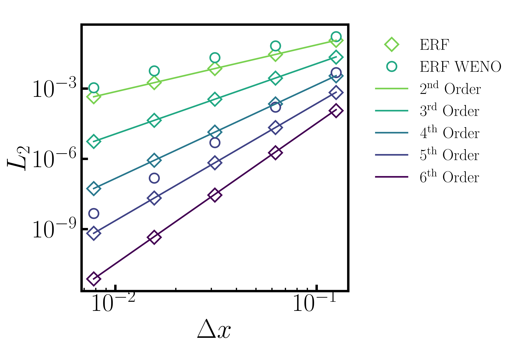

.. role:: cpp(code)
  :language: c++

.. _sec:Verification:

Verification
============

The following tests are used to verify the correct behavior of different algorithmic components of ERF.

Scalar Advection
----------------

Here we present a convergence study of the advection stencils in ERF for second through sixth order.
The initial data is constant density and pressure, constant velocity :math:`u=10` in the x-direction,
and a scalar initialized with profile :math:`cos(\pi x)` in a domain that is 2 units wide and
periodic in the lateral directions with slip walls on top and bottom.

The simulation is run for one period, i.e. until time :math:`t=0.2`  For all cases shown here, the time step
was held fixed at :math:`\Delta t = 0.0000078125` to ensure that the spatial error dominates the temporal error.

Nonlinear Density Current
---------------------------
The density current problem tests the effects of gravity and the behavior at a slip wall.

A detailed description of the problem and a comparison of solutions using a number
of different codes can be found in the `Straka 1993 paper`_

.. _`Straka 1993 paper`: https://onlinelibrary.wiley.com/doi/10.1002/fld.1650170103

.. |adc| image:: figures/density_current_600.png
         :width: 300

.. _fig:density_currennt

.. table:: Potential temperature perturbation at 600s and 900s

   +-----------------------------------------------------+------------------------------------------------------+
   |                        |adc|                        |                        |bdc|                         |
   +-----------------------------------------------------+------------------------------------------------------+
   |   Perturbational potential temperature at t = 600s  |   Perturbational potential temperature at t = 900s   |
   +-----------------------------------------------------+------------------------------------------------------+

Ekman Spiral
---------------------------
The Ekman spiral problem tests the computation of the stress term internally and at no-slip walls, as well as Coriolis and geostrophic forcing.

A description of the problem, including the exact solution, can be found at `Ekman Spiral Description`_

.. _`Ekman Spiral Description`: https://exawind.github.io/amr-wind/developer/verification.html#ekman-spiral

The steady solution is shown below, as well as a log-log plot showing the error scaling as :math:`O(\Delta z^2)`.

.. |aek| image:: figures/ekman_spiral_profiles.png
         :width: 300

.. |bek| image:: figures/ekman_spiral_errors.png
         :width: 300

.. _fig:ekman_spiral

.. table:: Flow profile and Error

   +-----------------------------------------------------+------------------------------------------------------+
   |                        |aek|                        |                        |bek|                         |
   +-----------------------------------------------------+------------------------------------------------------+
   |   Flow profiles                                     |   Convergence study                                  |
   +-----------------------------------------------------+------------------------------------------------------+

Potential flow over a semi-cylinder
----------------------------------------
The potential flow over a semi-cylinder problem tests the terrain feature in two dimensions and the 
effectiveness of sponge zones in preventing spurious reflections. This is a classic text book problem which 
has an `exact solution`_. The flow velocity is 10 m/s, and sponge zones are used on both the streamwise 
boundaries as well as the top boundary. The bottom wall is inviscid, slip wall. The schematic of the 
computational domain and the steady state streamwise velocity profiles at two different horizontal 
and vertical locations are shown below.

.. _`exact solution`: https://en.wikipedia.org/wiki/Potential_flow_around_a_circular_cylinder 

.. |aek| image:: figures/Terrain2d_Cylinder.png
  :width: 600

.. table:: Steady state solution 

   +-----------------------------------------------------+
   |                        |aek|                        |
   +-----------------------------------------------------+
   |   Schematic of the computational domain and  	     |  
   +-----------------------------------------------------+

