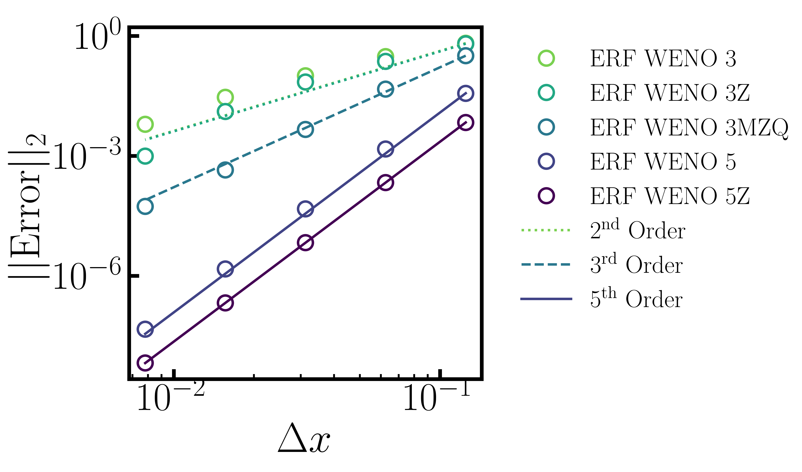
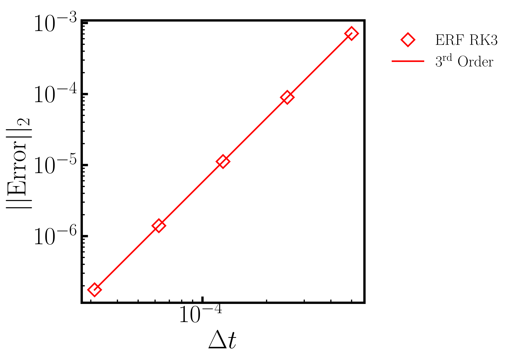

.. role:: cpp(code)
  :language: c++

.. _sec:Verification:

Verification
============

The following tests are used to verify the correct behavior of different algorithmic components of ERF.

Scalar Advection
----------------

Here we present spatial and temporal convergence studies for simple scalar advection with a uniform velocity field.
The initial data has constant density and pressure, constant velocity :math:`u=10` in the x-direction,
and a scalar initialized with profile :math:`cos(\pi x)` in a domain that is 2 units wide and
periodic in the lateral directions with slip walls on top and bottom.
The simulation is run for 10 periods, i.e. until time :math:`t=2.0`

The first study, shown below on the left, tests the horizontal centered/upwind advection stencils for
second through sixth order. The study on the right tests the WENO 3rd and 5th order stencils,
with and without the ``smoothing`` contributions in the stencil.  In all of these cases,
the time step was held fixed at :math:`\Delta t = 0.0000078125` to ensure that the spatial error dominates
the temporal error.

.. |aconv| image:: figures/conv_plot_spatial.png
           :width: 300

.. _fig:convergence_spatial

.. table:: Convergence studies of spatial error

   +-----------------------------------------------------+------------------------------------------------------+
   |                     |aconv|                         |                      |bconv|                         |
   +-----------------------------------------------------+------------------------------------------------------+
   |  Spatial convergence study (centered/upwind)        |  Spatial convergence study (WENO)                    |
   +-----------------------------------------------------+------------------------------------------------------+

The second study tests the temporal accuracy by first setting :math:`\Delta t = 0.0005`
and :math:`\Delta x = 1/8`, then reducing both :math:`\Delta t` and :math:`\Delta x` by a factor of two, keeping
the ratio of :math:`\Delta t` to :math:`\Delta x` constant.   These tests were run with the 6th order accurate
spatial stencil so that the temporal error dominated the spatial error.  Here we recover the expected 3rd order
accuracy of the RK3 scheme.

.. _fig:convergence_temporal

.. table:: Convergence study of temporal error

   +-----------------------------------------------------+
   |                     |tconv|                         |
   +-----------------------------------------------------+
   |  Temporal convergence study                         |
   +-----------------------------------------------------+

Nonlinear Density Current
---------------------------
The density current problem tests the effects of gravity and the behavior at a slip wall.

A detailed description of the problem and a comparison of solutions using a number
of different codes can be found in the `Straka 1993 paper`_

.. _`Straka 1993 paper`: https://onlinelibrary.wiley.com/doi/10.1002/fld.1650170103

.. |bdc| image:: figures/density_current_900.png
         :width: 300

.. _fig:density_currennt

.. table:: Potential temperature perturbation at 600s and 900s

   +-----------------------------------------------------+------------------------------------------------------+
   |                        |adc|                        |                        |bdc|                         |
   +-----------------------------------------------------+------------------------------------------------------+
   |   Perturbational potential temperature at t = 600s  |   Perturbational potential temperature at t = 900s   |
   +-----------------------------------------------------+------------------------------------------------------+

Ekman Spiral
---------------------------
The Ekman spiral problem tests the computation of the stress term internally and at no-slip walls, as well as Coriolis and geostrophic forcing.

A description of the problem, including the exact solution, can be found at `Ekman Spiral Description`_

.. _`Ekman Spiral Description`: https://exawind.github.io/amr-wind/developer/verification.html#ekman-spiral

The steady solution is shown below, as well as a log-log plot showing the error scaling as :math:`O(\Delta z^2)`.

.. |aek| image:: figures/ekman_spiral_profiles.png
         :width: 300

.. |bek| image:: figures/ekman_spiral_errors.png
         :width: 300

.. _fig:ekman_spiral

.. table:: Flow profile and Error

   +-----------------------------------------------------+------------------------------------------------------+
   |                        |aek|                        |                        |bek|                         |
   +-----------------------------------------------------+------------------------------------------------------+
   |   Flow profiles                                     |   Convergence study                                  |
   +-----------------------------------------------------+------------------------------------------------------+

Potential flow over a semi-cylinder
----------------------------------------
The potential flow over a semi-cylinder problem tests the terrain feature in two dimensions and the
effectiveness of sponge zones in preventing spurious reflections. This is a classic text book problem which
has an `exact result`_. The density is constant and the streamwise velocity is 10 m/s, and sponge zones
are used on both the streamwise boundaries as well as the top boundary. The bottom wall is an inviscid,
slip wall. The schematic of the computational domain and the comparison of the steady state velocity profiles
with the exact solution at two different horizontal and vertical locations are shown below. This case runs
without any diffusion.

.. _`exact result`: https://en.wikipedia.org/wiki/Potential_flow_around_a_circular_cylinder

Potential flow over a hemisphere
----------------------------------------
The potential flow over a hemisphere problem tests the terrain feature in three dimensions and the
effectiveness of sponge zones in preventing spurious reflections. This is a classic text book problem which
has an `exact solution`_. The density is constant and the streamwise velocity is 10 m/s, and sponge zones
are used on both the streamwise boundaries as well as the top boundary. The bottom wall is an inviscid,
slip wall. The schematic of the computational domain and the comparison of the steady state velocity profiles
with the exact solution at two different horizontal locations are shown below. A small amount of physical diffusion
was added to keep the simulation stable in this case. Hence the wall velocities in the plot below do not match
exactly to the inviscid solution. But away from the walls, excellent quantitative agreement is observed.

.. _`exact solution`: https://farside.ph.utexas.edu/teaching/336L/Fluidhtml/node102.html

Stokes second problem - viscous flow over an oscillating flat plate
--------------------------------------------------------------------------
The Stokes second problem - viscous flow over an oscillating flat plate in quiescent initial conditions,
tests the viscous terms in the governing equations with terrain and the feature for specifying a custom terrain velocity.
This is a classic text book problem which has an `analytical solution`_. The bottom wall is specified as a flat terrain and all
other boundaries are outflow. The contours of horizontal velocity and the comparison of the numerical and exact solutions
at a given time are shown in the figure below.

.. _`analytical solution`: https://en.wikipedia.org/wiki/Stokes_problem

Dry bubble and moist bubble rise simulations
----------------------------------------------
Benchmark simulations of dry and moist bubble rises in `Bryan and Fritsch`_ are reproduced. The test case consists of a 
warm bubble rising in dry and moist conditions. The potential temperature perturbation and the vertical velocity 
are compared as shown in the figures below. Excellent quantitative comparisons are obtained. The dry and moist bubble cases are 
in ``Exec/RegTests/Bubble`` with the corresponding input files ``inputs_BF02_dry_bubble`` and ``inputs_BF02_moist_bubble``.

.. _`Bryan and Fritsch`: https://journals.ametsoc.org/view/journals/mwre/130/12/1520-0493_2002_130_2917_absfmn_2.0.co_2.xml

