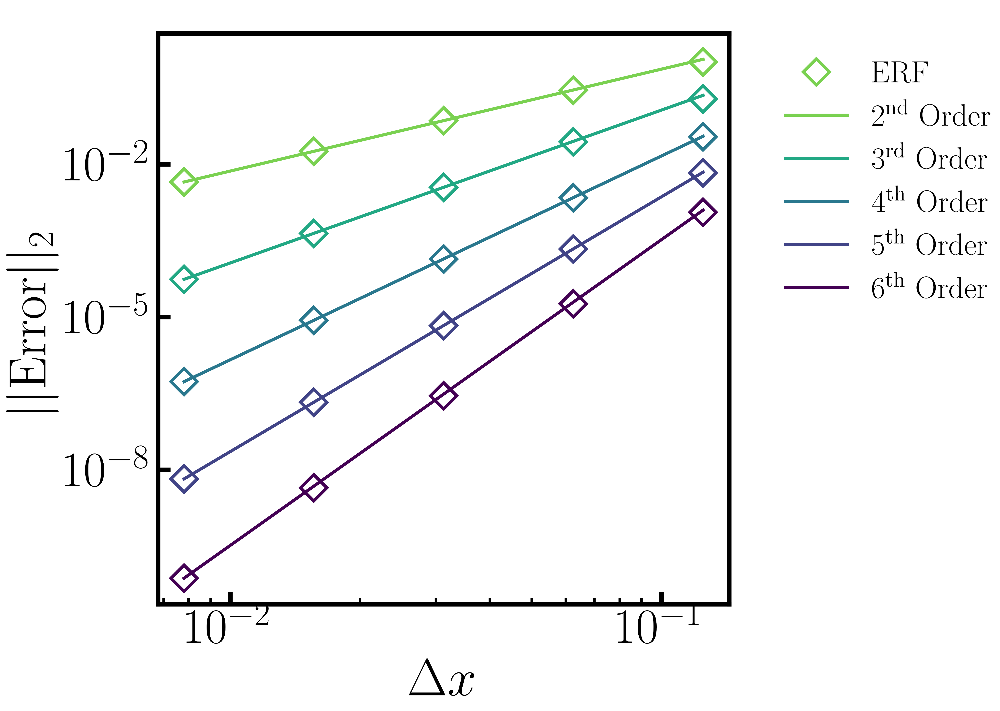

.. role:: cpp(code)
  :language: c++

.. _sec:Verification:

Verification
============

The following tests are used to verify the correct behavior of different algorithmic components of ERF.

Scalar Advection
----------------

Here we present two convergence studies of simple scalar advection with a uniform velocity field.
The initial data has constant density and pressure, constant velocity :math:`u=10` in the x-direction,
and a scalar initialized with profile :math:`cos(\pi x)` in a domain that is 2 units wide and
periodic in the lateral directions with slip walls on top and bottom.
The simulation is run for one period, i.e. until time :math:`t=0.2`

The first study, shown below on the left, tests the horizontal advection stencils for
second through sixth order, including the WENO 3rd and 5th order stencils.  In all of these cases,
the time step was held fixed at :math:`\Delta t = 0.0000078125` to ensure that the spatial error dominates
the temporal error.

The second study, shown on the right below, tests the temporal accuracy by first setting :math:`\Delta t = 0.0005`
and :math:`\Delta x = 1/8`, then reducing both :math:`\Delta t` and :math:'\Delta x` by a factor of two, keeping
the ratio of :math:`\Delta t` to :math:`\Delta x` constant.   These tests were run with the 6th order accurate
spatial stencil so that the temporal error dominated the spatial error.  Here we recover the expected 3rd order
accuracy of the RK3 scheme.

.. |bconv| image:: figures/conv_plot_temporal.png
           :width: 300

.. _fig:convergence

.. table:: Convergence studies of spatial and temporal error

   +-----------------------------------------------------+------------------------------------------------------+
   |                     |aconv|                         |                      |bconv|                         |
   +-----------------------------------------------------+------------------------------------------------------+
   |  Spatial convergence study                          |  Temporal convergence study                          |
   +-----------------------------------------------------+------------------------------------------------------+

Nonlinear Density Current
---------------------------
The density current problem tests the effects of gravity and the behavior at a slip wall.

A detailed description of the problem and a comparison of solutions using a number
of different codes can be found in the `Straka 1993 paper`_

.. _`Straka 1993 paper`: https://onlinelibrary.wiley.com/doi/10.1002/fld.1650170103

.. |adc| image:: figures/density_current_600.png
         :width: 300

.. |bdc| image:: figures/density_current_900.png
         :width: 300

.. _fig:density_currennt

.. table:: Potential temperature perturbation at 600s and 900s

   +-----------------------------------------------------+------------------------------------------------------+
   |                        |adc|                        |                        |bdc|                         |
   +-----------------------------------------------------+------------------------------------------------------+
   |   Perturbational potential temperature at t = 600s  |   Perturbational potential temperature at t = 900s   |
   +-----------------------------------------------------+------------------------------------------------------+

Ekman Spiral
---------------------------
The Ekman spiral problem tests the computation of the stress term internally and at no-slip walls, as well as Coriolis and geostrophic forcing.

A description of the problem, including the exact solution, can be found at `Ekman Spiral Description`_

.. _`Ekman Spiral Description`: https://exawind.github.io/amr-wind/developer/verification.html#ekman-spiral

The steady solution is shown below, as well as a log-log plot showing the error scaling as :math:`O(\Delta z^2)`.

.. |aek| image:: figures/ekman_spiral_profiles.png
         :width: 300

.. |bek| image:: figures/ekman_spiral_errors.png
         :width: 300

.. _fig:ekman_spiral

.. table:: Flow profile and Error

   +-----------------------------------------------------+------------------------------------------------------+
   |                        |aek|                        |                        |bek|                         |
   +-----------------------------------------------------+------------------------------------------------------+
   |   Flow profiles                                     |   Convergence study                                  |
   +-----------------------------------------------------+------------------------------------------------------+
