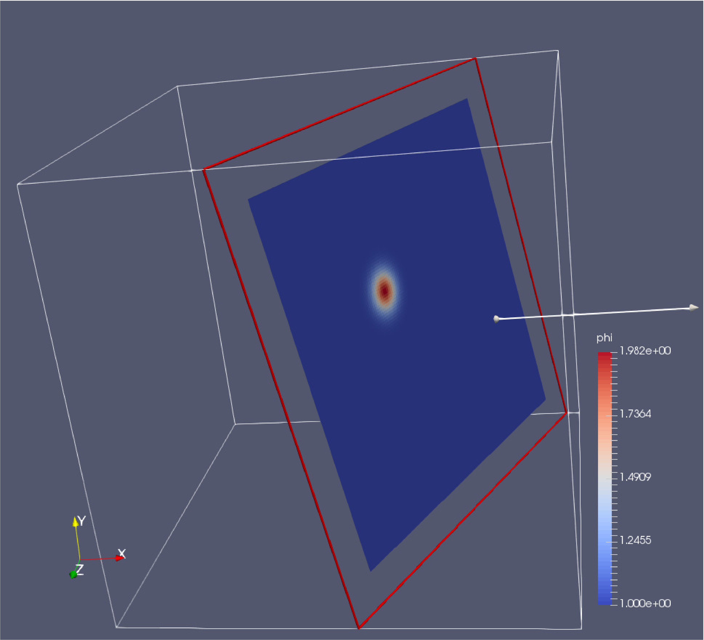
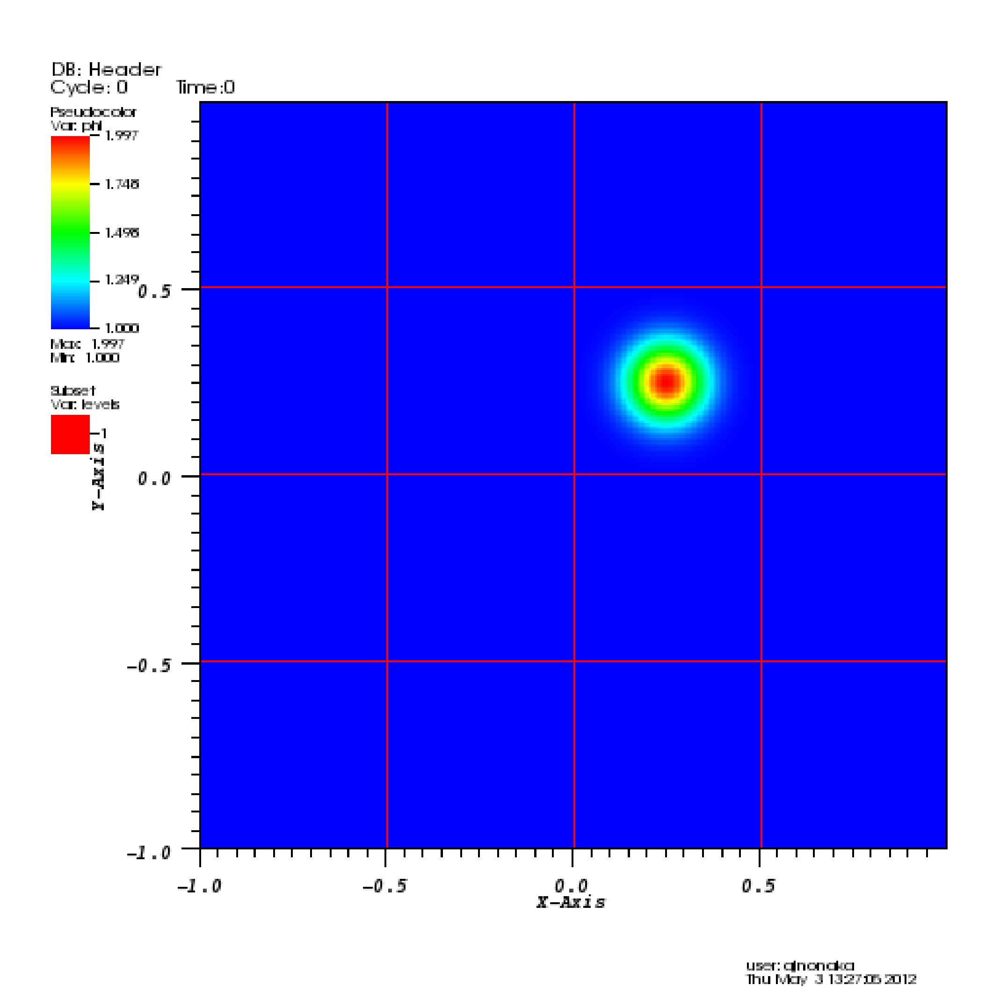
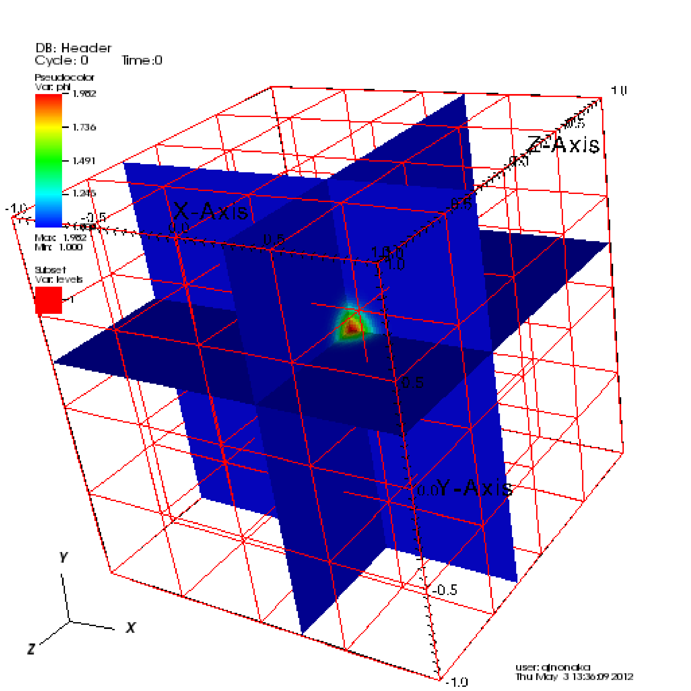

 .. role:: cpp(code)
    :language: c++

.. _Visualization:

Visualization
=============

ERF currently generates plotfile in the native AMReX format or as NetCDF files; see
 :ref:`sec:Plotfiles` for how to set the plotfile options.

There are several visualization tools that can be used for AMReX plotfiles, specifically
ParaView, VisIt and AMReXplorer.

In addition, a new tool called "pltview" is available at https://github.com/wang1202/pltview;
this is a lightweight X11 viewer for AMReX plotfiles.  See the `plotview README <https://github.com/wang1202/pltview/>`_
for more details on how to download and install pltview.

If NetCDF output is preferred, one suggestion is to write the plotfiles in the native AMReX
format for efficient I/O performance, then to convert the plotfiles to NetCDF files using
the executable you can build in Exec/Tools.

.. _section-1:

ParaView
--------

The open source visualization package ParaView v5.10 and later can be used to view ERF
plotfiles with and without terrain. You can download the paraview executable at https://www.paraview.org/.

To open a plotfile

#. Run ParaView v5.10, then select "File" :math:`\rightarrow` "Open".

#. Navigate to your run directory, and select either a single plotfile or a set of plotfiles.
   Open multiple plotfile at once by selecting ``plt..`` Paraview will load the plotfiles as a time series.
   ParaView will ask you about the file type -- choose "AMReX/BoxLib Grid Reader".

#. If you have run the ERF executable with terrain-fitted coordinates, then the mapped grid information will
   be stored as nodal data.  Choose the "point data" called "nu", then click on "Warp by Vector"
   which can be found via Filters-->Alphabetical.  This will then plot data onto the mapped grid
   locations.

#. Under the "Cell Arrays" field, select a variable (e.g., "x_velocity") and click
   "Apply". Note that the default number of refinement levels loaded and visualized is 1.
   Change to the required number of AMR level before clicking "Apply".

#. For "Representation" select "Surface".

#. For "Coloring" select the variable you chose above.

#. To add planes, near the top left you will see a cube icon with a green plane
   slicing through it. If you hover your mouse over it, it will say "Slice".
   Click that button.

#. You can play with the Plane Parameters to define a plane of data to view, as
   shown in :numref:`fig:ParaView`.

.. raw:: latex

   \begin{center}

.. _fig:ParaView:

   : Plotfile image generated with ParaView

.. raw:: latex

   \end{center}

.. _sec:visit:

.. _section-2:

VisIt
-----

AMReX data can also be visualized by VisIt, an open source visualization and
analysis software. To follow along with this example, first build and run the
first `heat equation`_ tutorial code.

.. _`heat equation`: https://github.com/AMReX-Codes/amrex-tutorials/tree/main/GuidedTutorials/HeatEquation

Next, download VisIt from
https://visit-dav.github.io/visit-website/ and install.  To open a single
plotfile, run VisIt, then select "File" :math:`\rightarrow` "Open file ...",
then select the Header file associated the the plotfile of interest (e.g.,
plt00000/Header).  Assuming you ran the simulation in 2D, here are instructions
for making a simple plot:

-  To view the data, select "Add" :math:`\rightarrow` "Pseudocolor"
   :math:`\rightarrow` "phi", and then select "Draw".

-  To view the grid structure (not particularly interesting yet, but when we
   add AMR it will be), select "Add" :math:`\rightarrow` "Subset"
   :math:`\rightarrow` "levels". Then double-click the text "Subset - levels",
   enable the "Wireframe" option, select "Apply", select "Dismiss", and then
   select "Draw".

-  To save the image, select "File" :math:`\rightarrow` "Set save options",
   then customize the image format to your liking, then click "Save".

Your image should look similar to the left side of :numref:`Fig:VisIt`.

.. raw:: latex

   \begin{center}

.. _Fig:VisIt:

.. table:: : 2D (left) and 3D (right) images generated using VisIt.
   :align: center

   +-----+-----+
   | |c| | |d| |
   +-----+-----+

.. raw:: latex

   \end{center}

In 3D, you must apply the "Operators" :math:`\rightarrow` "Slicing"
:math:`\rightarrow` "ThreeSlice", with the "ThreeSlice operator attribute" set
to ``x=0.25``, ``y=0.25``, and ``z=0.25``. You can left-click and drag over the
image to rotate the image to generate something similar to right side of
:numref:`Fig:VisIt`.

To make a movie, you must first create a text file named ``movie.visit`` with a
list of the Header files for the individual frames. This can most easily be
done using the command:

.. highlight:: console

::

    ~/amrex/Tutorials/Basic/HeatEquation_EX1_C> ls -1 plt*/Header | tee movie.visit
    plt00000/Header
    plt01000/Header
    plt02000/Header
    plt03000/Header
    plt04000/Header
    plt05000/Header
    plt06000/Header
    plt07000/Header
    plt08000/Header
    plt09000/Header
    plt10000/Header

The next step is to run VisIt, select "File" :math:`\rightarrow` "Open file...",
then select movie.visit. Create an image to your liking and press the
"play"  button on the VCR-like control panel to preview all the frames. To save
the movie, choose "File" :math:`\rightarrow` "Save movie ...", and follow the
on-screen instructions.

Caveat:

The Visit reader determines "Cycle" from the name of the plotfile (directory),
specifically from the integer that follows the string "plt" in the plotfile name.

So ... if you call it plt00100 or myplt00100 or this_is_my_plt00100 then it will
correctly recognize and print Cycle: 100.

If you call it plt00100_old it will also correctly recognize and print Cycle: 100

But, if you do not have "plt" followed immediately by the number,
e.g. you name it pltx00100, then VisIt will not be able to correctly recognize
and print the value for "Cycle".  (It will still read and display the data itself.)

.. _sec:amrexplorer:

.. _section-3:

AMReXplorer
-----------

AMReXplorer is a desktop application for interactive exploration of AMReX data,
available at https://github.com/AMReX-Codes/amrexplorer. A single executable opens
2-D and 3-D plotfiles as well as standalone FAB and MultiFab data, so it can be
used both on ERF plotfiles and on raw data dumped while debugging.

It is worth noting for ERF users in particular that AMReXplorer draws mapped
(terrain-following and stretched) grids from the node positions that ERF plotfiles
store, rather than assuming a uniform mesh, so a run over terrain is displayed on
the grid it was actually computed on.

Other features of interest include demand-driven reads of the AMR hierarchy with a
bounded cache, composite and exact-level views, value probing, line plots, contours,
vector glyphs, three orthogonal slice views for 3-D data, plotfile-sequence and
plane-sweep animation, and PNG, FITS and MP4 export.

Plotfiles that live on a remote machine can be opened without copying them: the
application starts its own server on the remote machine over ssh, with no ports or
tunnels to arrange. This is convenient for looking at output that is still sitting
on an HPC file system.

AMReXplorer is built from source and requires CMake 3.25 or newer, a C++20 compiler,
and Qt 6.4 or newer; it has been tested on Linux, macOS and WSL. See the
`AMReXplorer installation guide <https://github.com/AMReX-Codes/amrexplorer/blob/main/INSTALL.md>`_
for the dependencies and build instructions, and the
`AMReXplorer user guide <https://github.com/AMReX-Codes/amrexplorer/blob/main/docs/user-guide.md>`_
for the workflows, controls and keyboard shortcuts. The user guide is also bundled
in the application under **Help > User Guide...**.
