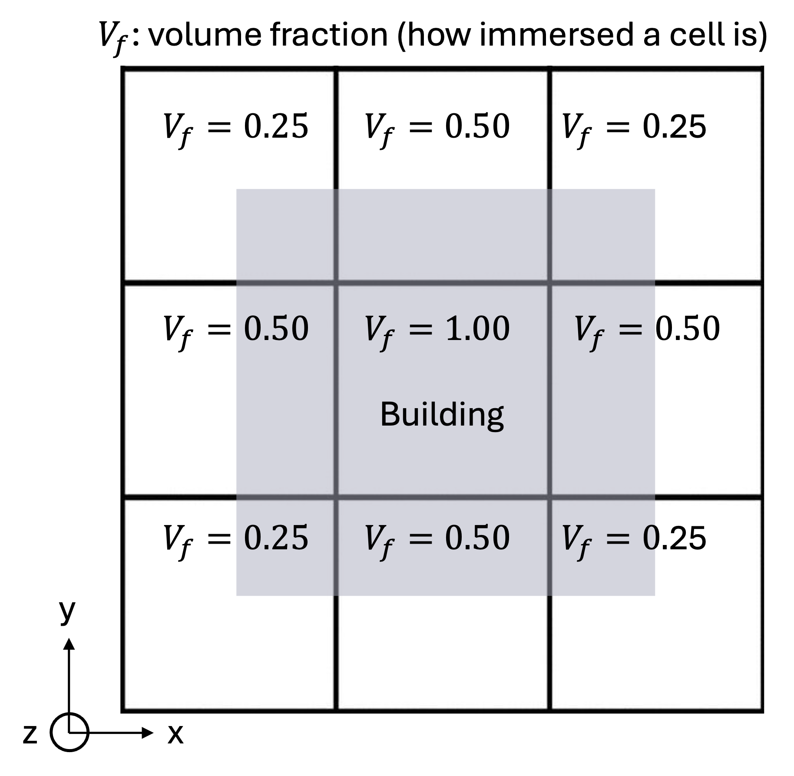

 .. role:: cpp(code)
    :language: c++

 .. role:: f(code)
    :language: fortran

.. _Forcings:

Physical Forcings
=================

Physical forcings available in ERF comprise the standard source terms for atmospheric modeling.
These include Coriolis and geostrophic forcing; Rayleigh damping and sponge layer(s); subsidence;
simplified radiative thermal sources; and solution nudging towards a prescribed input sounding.

ERF also supports models for wind farm parametrization in which the effects of wind turbines are represented
by imposing a momentum sink on the mean flow and/or turbulent kinetic energy (TKE).
Currently the Fitch model, Explicit Wake Parametrization (EWP) model, Simplified Actuator Disk model (SAD),
and Generalized Actuator Disk model (GAD) are supported. See :ref:`sec:WindFarmModels` for more information.

Below is more detail on how to set the forcing terms.

Buoyancy
--------

If

::

      use_gravity == true

then buoyancy is included in the momentum equations.  See :ref:`Buoyancy` for more detail
about the possible formulations of the buoyancy term.

Coriolis Forcing
----------------

If

::

      use_coriolis == true

then Coriolis forcing is included in the momentum equations, i.e. :

.. math::

  \mathbf{F} = (C_f \; (\rho v \sin{\phi} - \rho w \cos{\phi}), -C_f \; \rho u \sin{\phi}, C_f \; \rho u \cos{\phi})

where :math:`C_f = 4 \pi / P_{rot}` is the Coriolis factor with :math:`P_{rot}` the rotational
period (measured in seconds), and :math:`\phi` the latitude.

Values for ``erf.rotational_time_period``, ``erf.latitude``, and ``erf.coriolis_3d``; the first two are used
to compute the Coriolis frequency and the last of these determines whether to include the z-component in the Coriolis forcing.

When initializing from a ``wrfinput`` or ``met_em`` file, the latitude at the grid cell centers will be known. For this case, a user may specify

::

      variable_coriolis == true

to use the grid latitude, :math:`\phi(y)`, when computing the sine and cosine coefficients above.

There is no dependence on the radial distance from the center of the earth, thus the curvature of the earth is neglected.

Rayleigh Damping
----------------

Rayleigh damping can be imposed on any or all of :math:`u, v, w, T` by
setting one or more of
::

      erf.rayleigh_damp_U = true
      erf.rayleigh_damp_V = true
      erf.rayleigh_damp_W = true
      erf.rayleigh_damp_T = true

in the inputs file.  The time integration of the damping terms is controlled
by ``erf.rayleigh_damping_type``.  Rayleigh damping is disabled when all four
``rayleigh_damp_*`` flags are false.

When one or more of those flags is true and
the Rayleigh damping type is set to ``SlowExplicit`` or ``FastExplicit``,
then explicit Rayleigh damping is included in the energy and/or momentum equations
in the form described in Section 4.4.3 of the WRF Model Version 4 documentation (p40), i.e. :

.. math::

  \mathbf{F} = - \tau(z) \rho \; (u - \overline{u}, v - \overline{v}, w - \overline{w})

and

.. math::

  F_{\rho \theta} = - \tau(z) \rho (\theta - \overline{\theta})

where :math:`(\overline{u}, \overline{v}, \overline{w})` is the reference
state velocity, typically defined as the initial horizontally homogeneous
fields in idealized simulations, and :math:`\overline{\theta}` is the
reference state potential temperature.  The default Rayleigh helper sets
constant reference values from ``prob.rayleigh_U_0``, ``prob.rayleigh_V_0``,
``prob.rayleigh_W_0``, and ``prob.rayleigh_T_0``.  If the initialization type
is ``Input_Sounding``, ERF overwrites :math:`\overline{u}`,
:math:`\overline{v}`, and :math:`\overline{\theta}` with the sounding profiles
and sets :math:`\overline{w}=0`.  Problem setups can also override
``erf_init_rayleigh`` to define custom vertical reference profiles.

The height-dependent damping coefficient is

.. math::

   \tau(z) = \alpha R(z),

where :math:`\alpha` is ``erf.rayleigh_dampcoef`` in :math:`\mathrm{s}^{-1}`.
Thus ``rayleigh_dampcoef`` is an inverse damping timescale: if
:math:`R(z)=1`, perturbations from the reference profile are damped with
timescale :math:`1/\alpha`.

The nondimensional vertical ramp :math:`R(z)` is set by
``erf.rayleigh_zdamp``:

.. math::

   R(z) =
   \begin{cases}
   \sin^2\left[\frac{\pi}{2}
      \left(1 - \frac{z_\mathrm{top} - z}{H}\right)\right],
      & z > z_\mathrm{top} - H, \\
   0, & z \le z_\mathrm{top} - H,
   \end{cases}

where :math:`H` is ``erf.rayleigh_zdamp`` and :math:`z_\mathrm{top}` is the
model top.  The ramp is zero at the bottom of the damping layer
(:math:`z=z_\mathrm{top}-H`) and increases smoothly to one at the model top.
For :math:`u`, :math:`v`, and :math:`\theta`, ERF evaluates this ramp at
cell-center heights.  For :math:`w`, ERF evaluates it at the vertically
staggered :math:`w` levels.  Setting ``rayleigh_zdamp`` larger than the domain
height makes the ramp start below the domain; very large values make
:math:`R(z) \approx 1` throughout the domain, giving nearly uniform damping.

If the Rayleigh damping type is set to SlowExplicit then all the damping terms are computed once per
RK stage; if the type is FastExplicit then the damping terms are computed once per acoustic substep.
Either way, they are added explicitly.

If the Rayleigh damping type is set to FastImplicit then the damping term for w only is included implicitly
within the acoustic substepping algorithm; any additional Rayleigh damping (e.g. for u, v, or T) occurs
as if the type is FastExplicit.

The algorithm for FastExplicit is as described in (3.44) of the `MPAS report`_
which is equivalent to that written in (9) of
`Klemp, Dudhia & Hassiotis, An Upper Gravity-Wave Absorbing Layer for NWP Applications (2008)`_.

.. _`MPAS report`: https://www2.mmm.ucar.edu/projects/mpas/mpas_website_linked_files/MPAS-A_tech_note.pdf

.. _`Klemp, Dudhia & Hassiotis, An Upper Gravity-Wave Absorbing Layer for NWP Applications (2008)`: https://journals.ametsoc.org/view/journals/mwre/136/10/2008mwr2596.1.xml

Sponge regions
----------------------

ERF provides the capability to apply sponge source terms near domain boundaries to prevent spurious reflections that otherwise occur
at the domain boundaries if standard extrapolation boundary condition is used. The sponge zone is implemented as a source term
in the governing equations, which are active in a volumetric region at the boundaries that is specified by the user in the inputs file.
Currently the target condition to which the sponge zones should be forced towards is to be specified by the user in the inputs file.

.. math::

   \frac{dQ}{dt} = \mathrm{RHS} - A\xi^n(Q-Q_\mathrm{target})

where RHS are the other right-hand side terms. The parameters to be set by the user are -- `A` is the sponge amplitude,
`n` is the sponge strength and the :math:`Q_\mathrm{target}` -- the target solution in the sponge.
:math:`\xi` is a linear coordinate that is 0 at the beginning of the sponge and 1 at the end.
An example of the sponge inputs can be found in ``Exec/RegTests/Terrain2d_Cylinder`` and is given below.
This list of inputs specifies sponge zones in the inlet and outlet of the domain in the x-direction
and the outlet of the domain in the z-direction. The `start` and `end` parameters specify the starting
and ending of the sponge zones. At the inlet, the sponge starts at :math:`x=0` and at the outlet
the sponge ends at :math:`x=L` -- the end of the domain. The sponge amplitude `A` has to be adjusted in a
problem-specific manner.
In addition to the density and the :math:`x, y, z` velocities, ERF can now also
relax :math:`\rho \theta` and :math:`\rho q_v` in the sponge zones.
These are controlled with ``erf.sponge_rhotheta`` and ``erf.sponge_rhomoist``, respectively.
If either scalar target is omitted or set to a negative value,
ERF falls back to the local base-state target, i.e. :math:`\rho_0 \theta_0`
for ``erf.sponge_rhotheta`` and :math:`\rho_0 q_{v,0}` for ``erf.sponge_rhomoist``,
where :math:`\rho_0` is the dry base-state density.

::

          erf.sponge_strength = 10000.0
          erf.use_xlo_sponge_damping = true
          erf.xlo_sponge_end = 4.0
          erf.use_xhi_sponge_damping = true
          erf.xhi_sponge_start = 26.0
          erf.use_zhi_sponge_damping = true
          erf.zhi_sponge_start = 8.0

          erf.sponge_density = 1.2
          erf.sponge_rhotheta = 360.0
          erf.sponge_rhomoist = 0.012
          erf.sponge_x_velocity = 10.0
          erf.sponge_y_velocity = 0.0
          erf.sponge_z_velocity = 0.0

In that example, ``erf.sponge_density`` and the velocity targets define the momentum sponge state, while ``erf.sponge_rhotheta`` and ``erf.sponge_rhomoist`` define the target values for the conserved potential-temperature and water-vapor fields. If more than one moisture species is present, only :math:`\rho q_v` is relaxed to the specified sponge target; the remaining moisture species are damped toward zero in the sponge region.

Another way of specifying sponge zones is by providing the sponge zone data as a text file input. This is currently implemented only for forcing :math:`x` and :math:`y` velocities in the sponge zones.
The sponge data is input as a text file with 3 columns containing :math:`z, u, v` values.
An example can be found in ``Exec/CanonicalTests/Idealized_Terrain/WitchOfAgnesi`` and a sample inputs list for using this feature is given below.
This list specifies a sponge zone in the inlet in the x-direction.
The :math:`u` and :math:`v` velocity forcing in the sponge zones will be read in from the text file -- `input_sponge_file.txt`.

::

          erf.sponge_type = "input_sponge"
          erf.input_sponge_file = "input_sponge_file.txt"
          erf.sponge_strength = 1000.0
          erf.use_xlo_sponge_damping = true
          erf.xlo_sponge_end = 4.0

Immersed forcing to represent terrain
-------------------------------------

An additional option for representing terrain in ERF is to use an immersed forcing method where large body forces are applied to the momentum equations as sinks to force the velocity to near zero or to a desired value.
This method follows the methods of `Chan and Leach (2007) <https://doi.org/10.1175/2006JAMC1321.1>`_ and `Muñoz-Esparza et al. (2020) <https://doi.org/10.1029/2020MS002141>`_, but is expanded to allow the user to utilize a wall-model (based on Monin Obukhov similarity theory, :ref:`sec:surface_layer`).
During initialization, we determine a mask (:math:`\beta_r`) over the entire domain by calculating each cell's volume fraction, which indicates how much of a cell is filled by terrain.
Fully immersed cells have a value of 1, free cells have a value of 0, and partially immersed cells have a value between 0 and 1.
The goal is to force interior cells to near-zero velocities using the following formulation:

.. math::

    F_{\rho u_i} = -C_{d,m} \beta_r \left(\sqrt[3]{\Delta x_1 \Delta x_2 \Delta x_3}\right)^{-1} \rho u_i U

where :math:`C_{d,m}` is a drag coefficient and :math:`U` is the wind speed magnitude.
The drag coefficient can be specified by the user using ``erf.if_Cd_momentum``, which defaults to a value of 10.
A larger drag coefficient results in smaller velocities for immersed cells but may require a smaller timestep due to the stiffness of the force.

For partially immersed cells, the user has the option to specify whether to use MOST: ``erf.if_use_most``.
If the user does not specify MOST, then the equation above will be applied and there is an implicit no-slip boundary condition.
If the user does specify MOST, then the following formulation is applied to partially immersed cells:

.. math::

    F_{\rho u_i} = -C_{d,m} (1 - \beta_r) \left(\sqrt[3]{\Delta x_1 \Delta x_2 \Delta x_3}\right)^{-1} \rho |U_s| (u_i - u_{i,target})

where :math:`u_{i,target}` is a value determined through MOST and :math:`|U_s|` is a unit velocity scale.
This formulation essentially forces the velocity at the wall to a value determined by using MOST, but the strength forcing is inversely related to how immersed the cell is.
For cells that are more immersed, there is weaker forcing to the target velocity while for cells that are less immersed, there is stronger forcing to the MOST value.

Temperature forcing is also available to represent the temperature of the 'surface'.
The user can specify either a surface temperature and heating rate, a surface flux, or an Obukhov length.
The temperature forcing is then formulated as follows:

.. math::

    F_{\rho\theta} = -C_{d,s} \beta_r \left(\sqrt[3]{\Delta x_1 \Delta x_2 \Delta x_3}\right)^{-1} |U_s| (\rho \theta_{target} - \rho\theta)

The target temperature :math:`\theta_{target}`` is straightforward when using a surface temperature and heating rate; when specifying a surface flux or Obukhov length, the target temperature is determined using MOST.
The following inputs are available when representing terrain using immersed forcing:

::

        erf.if_Cd_scalar               = FLOAT
        erf.if_Cd_momentum             = FLOAT
        erf.if_z0                      = FLOAT
        erf.if_surf_temp_flux          = FLOAT
        erf.if_init_surf_temp          = FLOAT
        erf.if_surf_heating_rate       = FLOAT
        erf.if_Olen                    = FLOAT
        erf.if_use_most                = BOOL
        erf.if_implicit_drag           = BOOL
        erf.immersed_forcing_substep   = BOOL

An example of using immersed forcing for a Witch of Agnesi hill is available in ``Exec/RegTests/ImmersedForcingTest``.

.. note:: When using fully compressible simulations, it is recommended to apply immersed forcing on the substep for numerical stability.

.. note:: By default (``erf.if_implicit_drag = false``) the momentum drag is applied with an explicit (forward-Euler) source term. Setting ``erf.if_implicit_drag = true`` switches to a point-implicit (linearly-implicit) formulation of the same drag, which is unconditionally stable and prevents momentum overshoot in stiff (high :math:`C_{d,m}`) or large-timestep regimes such as anelastic runs without acoustic substepping.

Immersed forcing to represent buildings
---------------------------------------

The immersed forcing capability can also be used to represent buildings.
The user can specify the use of a wall model (``erf.if_use_most = true``), which follows Monin Obukhov similarity theory but is slightly different than the formulation as described above as there are now horizontal wall cells.
However, the default behavior is to not use the wall model ((``erf.if_use_most = false``)), in which the behavior would be identical to the first equation described in the previous section.

The top-down schematic below can help breakdown the wall-model behavior when using immersed forcing to represent buildings.

.. _fig:ImmersedForcing_Building:

   Top-down view of a building footprint when using immersed forcing.

If a cell is fully immersed (:math:`\beta_r = V_f = 1.0`), then the forcing term takes the following form:

.. math::

    F_{\rho u_i} = -C_{d,m} \left(\sqrt[3]{\Delta x_1 \Delta x_2 \Delta x_3}\right)^{-1} \rho u_i U

If a cell is partially immersed (:math:`0.0 < V_f < 1.0`), then a target velocity is calculated using MOST:

.. math::

    F_{\rho u_i} = -C_{d,m} \left(\sqrt[3]{\Delta x_1 \Delta x_2 \Delta x_3}\right)^{-1} \rho |U_s| (u_i - u_{i,target})

where :math:`u_{i,target} = \left(1 - V_f\right) u_{i,\textrm{MOST}}`. :math:`u_{i,\textrm{MOST}}` is defined as:

.. math::

      u_{i,\mathrm{MOST}} = \frac{u_{\*,i+1}}{\kappa} \left[ \log \left( \frac{0.5 \Delta x_i}{z_{0,\mathrm{w}}} \right) \right]

with

.. math::

          u_{\*,i+1} = U_{i+1, \textrm{tangent}} \frac{\kappa}{\log \left[\frac{1.5 \Delta x_i}{z_{0,\textrm{w}}} \right]}

This formulation is used for all three direction and we assume walls are orthogonal to cell faces.
If ``erf.if_stability_correction = false`` (which is the default), then MOST simply becomes the log law.
The stability corrections are available for the similarity functions ``erf.if_stability_correction = true``; however, they should only be used with extreme caution as their validity for horizontal walls is questionable.
For additional details on this formulation, please see see `Wise et al. (2025) <https://essopenarchive.org/doi/full/10.22541/essoar.176659709.97467775/v1>`_.

Similar to the previous section, temperature forcing is also available for the building 'surface'.
However, the user should proceed with caution when specifying a surface flux or Obukhov length as this pathway is more susceptible to numerical instability as there is no temporal or spatial averaging done in the MOST formulation.
Efforts to have more realistic thermal boundary conditions using building properties and radiation are a subject of ongoing work.

Inputs that can be used with immersed forcing for buildings are as follows:

::

        erf.buildings_type             = STRING #ImmersedForcing or None
        erf.buildings_file_name        = STRING
        erf.if_Cd_scalar               = FLOAT
        erf.if_Cd_momentum             = FLOAT
        erf.if_z0                      = FLOAT
        erf.if_surf_temp_flux          = FLOAT
        erf.if_init_surf_temp          = FLOAT
        erf.if_surf_heating_rate       = FLOAT
        erf.if_Olen                    = FLOAT
        erf.if_use_most                = BOOL
        erf.if_stability_correction    = BOOL
        erf.if_implicit_drag           = BOOL
        erf.immersed_forcing_substep   = BOOL

The default drag coefficients are different when using the fully compressible solver compared to the anelastic solver.
This is because the timestep used for the anelastic solver is typically much coarser compared to the substep timestep for the fully compressible solver.
A larger drag coefficient will more quickly force a cell to the desired value; however, there is a stability limit related to the timestep due to the explicit form of the drag term.
The recommended values are ``erf.if_Cd_scalar = 50.0`` and ``erf.if_Cd_momentum = 500.0`` for the fully compressible solver and
``erf.if_Cd_scalar = 5.0`` and ``erf.if_Cd_momentum = 50.0`` (note that these are the default values).
The immersed forcing formulation for buildings has been rigorously tested at grid spacings of 5.0 m and less.
Caution is needed when using immersed forcing at coarser grid spacings.
If immersed forcing is causing your simulations to become unstable, the first recommendation is to reduce the drag coefficients.

Immersed forcing for buildings can be used in conjunction with the ``StaticFittedMesh`` terrain option.
However, currently, the user must specify the z-coordinates using ``erf.terrain_z_levels``.
In the future, this requirement will be removed.
Note that the volume fraction is calculated prior to the grid transformation; therefore, building heights when located in steep terrain should be considered approximate.

An example of immersed forcing for a building located on top of a Witch of Agnesi hill is available in ``Exec/RegTests/ImmersedForcingTest``.
Additional examples are in ``Exec/RegTests/ImmersedForcingTest/wall_model`` demonstrating the wall model and different idealized thermal boundary conditions.

Problem-Specific Forcing
========================

The following two options can be used to specify external forcing terms.

Pressure Gradient
-----------------

If

::

      abl_driver_type == "PressureGradient"

then

.. math::

  \mathbf{F} = (\nabla p_{x,ext}, \nabla p_{y,ext}, \nabla p_{z,ext})

where :math:`(\nabla p_{x,ext}, \nabla p_{y,ext}, \nabla p_{z,ext})` are user-specified through ``erf.abl_pressure_grad``.

Geostrophic Forcing
-------------------

If

::

      abl_driver_type == "GeostrophicWind"

then geostrophic forcing is included in the forcing terms, i.e.

.. math::

  \mathbf{F} = (-C_f \; v_{geo}, C_f \; u_{geo}, 0)

where :math:`C_f = 4 \pi / P_{rot}` is the Coriolis factor with :math:`P_{rot}` the rotational
period (measured in seconds), and the geostrophic wind :math:`(u_{geo}, v_{geo}, 0)` is
user-specified through ``erf.abl_geo_wind``.  Note that if geostrophic forcing is enabled,
Coriolis forcing must also be included.
