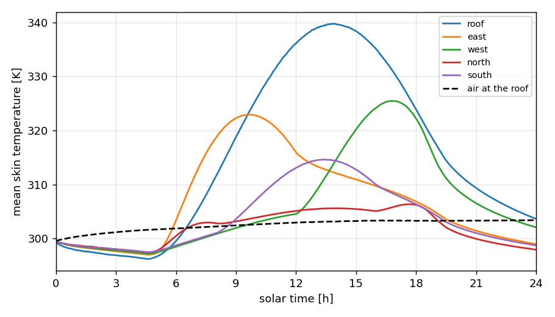
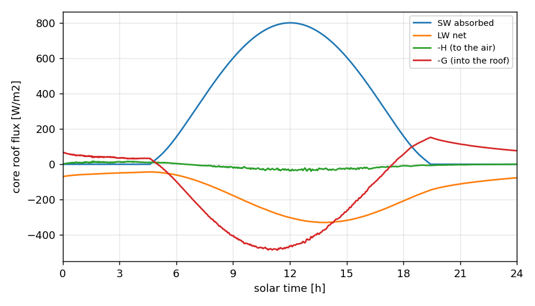
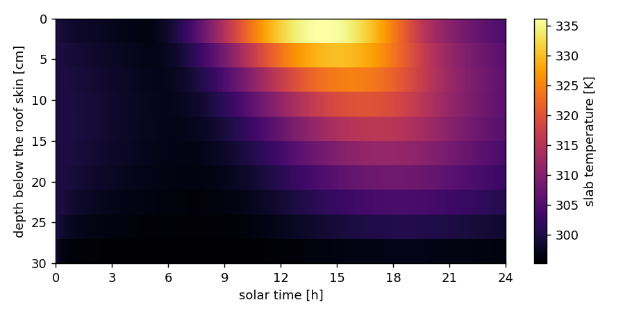
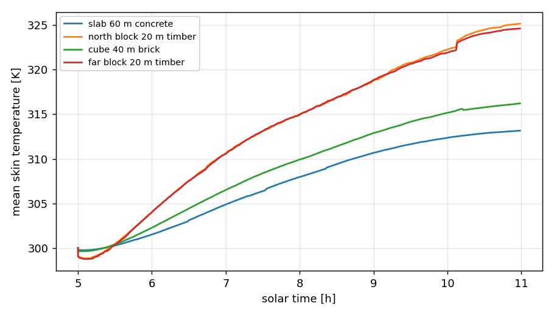
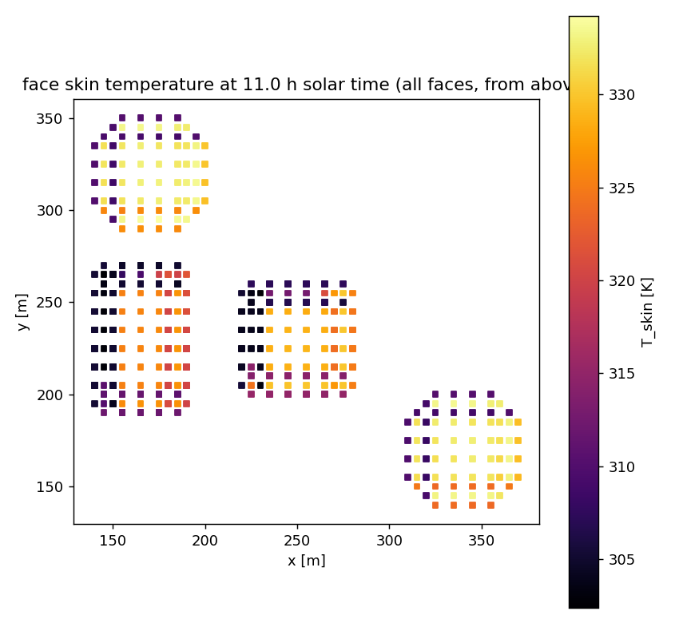

.. _sec:IBSEB:

Surface energy balance on immersed-boundary faces
=================================================

Buildings represented by immersed forcing (:cpp:`erf.buildings_type =
ImmersedForcing`) are resolved: every cell is either fluid or solid, and the
faces between them are the walls and roofs. The immersed-boundary surface
energy balance gives each such face its own skin temperature from

.. math::

   C \frac{dT_s}{dt} = SW_{abs} + LW_{net} - H - LE - G ,

with the absorbed shortwave, the net longwave, the sensible and latent heat
to the air, and the conduction into the wall. The sections below describe
each term and the case under ``Exec/CanonicalTests/SEB`` that verifies it.

Face storage
------------

A wall face lies between a fluid cell, where the blanking is below one
half, and a solid cell, where it is at or above one half. Each face is
stored once, on the rank that owns the fluid cell, as a compact list rather
than a face-centred field: the fluid cell, the face direction, the side the
solid is on, the building id, the material id, the area, the skin
temperature, the slab temperatures, the view fractions and the current
fluxes, all in device arrays, contiguous per local box. Every input the
balance needs is in the fluid cell next to the face, so the per-step update
is one kernel over the list with no communication; only the reports reduce
across ranks.

Building ids come from labelling the solid columns of the blanking, four
connected in the horizontal and numbered in scan order; a face carries the
id of its solid neighbour's column. The per-building report,
:cpp:`erf.ibseb.csv_file`, lists every :cpp:`erf.ibseb.csv_int` steps the
number of faces, the area, the area-weighted mean skin temperature with
its range, the mean fluxes, the largest balance residual and the sun of
the step for each building, and a ``[IBSEB]`` line prints the face counts
per direction, the number of buildings, the total area, the skin
temperature range and the mean fluxes. With
:cpp:`erf.ibseb.dump_faces_file` every face is written at the same
interval (one file per rank; :cpp:`erf.ibseb.dump_faces_tag_step` keeps
every dump), which is what the regtests and the canonical cases read.

For output the list is scattered into cell-centred fields: ``ibseb_nfaces``
and ``ibseb_tskin`` in the plotfile, and ``IBSEBState`` in the checkpoint,
which holds the skin temperature, sensible flux and slab temperatures of the
faces of each cell. Its boxes are 4 x 4 column blocks clipped to the k-range
that owns faces, and it carries one slot per face rather than the six a cell
could hold in principle, so its width is the largest face count on any cell
of the level (two or three around ordinary buildings). Face-owning cells are
the fluid cells against solid, a one-cell shell, so a block over the interior
of a wide footprint keeps only the layer above the roof while a block on a
wall still spans its height. On restart the list is rebuilt from the blanking
and refilled from that field, so a restart does not depend on the number of
ranks. ``Exec/CanonicalTests/SEB/FaceStorage`` checks the face counts against
the mask, the rank independence and the checkpoint round trip.

The field still carries whole boxes rather than the faces alone, so its size
grows with the surface of the buildings and, through the wall blocks, with
their height. A city-scale deck should expect the checkpoint to grow with the
built area; storing the faces themselves, rather than a cell field that
covers them, would be needed to make it proportional to the face count.

Shortwave and shadow
--------------------

The downwelling radiation reaches the balance through a provider,
:cpp:`erf.ibseb.radiation`. The built-in ``prescribed`` provider gives the
direct-normal irradiance, the diffuse irradiance on a horizontal surface and
the sun vector either as fixed inputs (:cpp:`erf.ibseb.sun_mode = fixed`,
for analytic tests), from the two-stream radiation's own sun (``two_stream``,
see `Refined levels`_ below for why it must be used with that model) or from
the site and time (``solar``): declination,
equation of time, hour angle, zenith and azimuth by the Spencer series, the
direct beam by the Bird transmission :math:`S_0 E_0 \tau^{1/\cos z}` and the
diffuse light as a fraction :math:`k_d` of what the beam lost on the way
down. The sun vector points from a surface toward the sun, with the azimuth
clockwise from north, so east is :math:`+x` and north :math:`+y`.

On a face with outward normal :math:`\mathbf{n}` the direct beam is
:math:`I_{dn}\, \max(0, \mathbf{n}\cdot\mathbf{s})` unless the face is in
shadow. Shadow is decided by a ray cast from the face centre toward the sun
against the height of every column of the level, a two-dimensional walk over
the columns the ray crosses: buildings stand on the ground and the ray only
rises, so the ray is blocked wherever its height on entering a column is
below that column's top. The column tops are an array over the bounding
box of the built columns, replicated on every rank, holding the index of the
highest solid cell of each column rather than its height (4 bytes per built
column per rank; every column outside the box is open ground), so the test
needs no communication and costs a few operations per column crossed. That
replication is still proportional to the built area rather than to this
rank's share of it, which is the limit to watch on a city-scale deck; the
walk itself is already bounded, since a rising ray stops once it passes the
tallest column and a descending one stops at the ground, so a ray reaches no
further than the tallest building divided by the tangent of its elevation. The diffuse light on a face is the sky view fraction
times the horizontal diffuse plus the ground view fraction times the ground
albedo times the total horizontal irradiance, with the fractions from the
hemisphere sampling below. The absorbed shortwave is one minus the face
albedo times the sum.

View fractions and longwave
---------------------------

Once, at initialisation, every face samples a cosine-weighted hemisphere
around its outward normal: :cpp:`erf.ibseb.view_n_az` azimuths by
:cpp:`erf.ibseb.view_n_el` elevations, stratified with
:math:`\theta = \arcsin\sqrt{u}` from the normal so that every ray carries
the same weight and the counts are view factors. Each ray goes through the
same column walk as the shadow test, made direction-aware: a rising ray is
blocked by a column whose top is above its entry height and otherwise
reaches the sky; a falling ray is blocked by a column it descends into and
otherwise reaches the ground. The fractions of rays ending on the sky, the
ground and a building, :math:`f_{sky}`, :math:`f_{ground}` and
:math:`f_{bldg}`, sum to one. A roof sees no ground; a wall on open ground
sees half sky and half ground; a wall facing another building sees it.

The longwave arriving at a face is

.. math::

   LW_{in} = f_{sky}\, LW_{sky} + f_{ground}\, \varepsilon_g \sigma T_g^4
           + f_{bldg}\, \sigma T_s^4 ,

the sky term either the input :cpp:`erf.ibseb.lw_down` or, with
:cpp:`erf.ibseb.lw_mode = gray`, :math:`\varepsilon_{sky} \sigma T_{air}^4`
with the air temperature of the face's fluid cell; the ground term at the
input ground temperature; and the building term at the face's own skin
temperature, the isothermal-surroundings approximation under which a face
and the walls it sees exchange no net longwave. There are no face-to-face
view factors and no radiosity; the fractions are stored so a radiosity pass
can be added later without touching the balance. The net longwave,
:math:`\varepsilon (LW_{in} - \sigma T_s^4)`, is positive into the face.

``Exec/CanonicalTests/SEB/Longwave`` checks the fractions of every
face against an independent hemisphere sampling, their closure and the
analytic values on the clean planes, and the longwave formulas on every
face, on one and four ranks.

Sensible and latent heat
------------------------

The sensible heat leaves a face through a wall function between its skin
temperature and the adjacent fluid cell, the same form the immersed forcing
uses for momentum. The tangential wind of the fluid cell, at half a cell
from the wall, gives the friction velocity with the roughness
:cpp:`erf.ibseb.z0_wall`, :math:`u_* = \kappa U_t / \ln(\delta/z_0)`; the
difference between the skin temperature, expressed as a potential
temperature with the cell's Exner function, and the cell's potential
temperature gives the temperature scale with :cpp:`erf.ibseb.z0h_wall`; and

.. math::

   H = \rho c_p u_* \theta_* = \rho c_p u_* \kappa
       \frac{\theta_s - \theta_{air}}{\ln(\delta/z_{0h})} ,

positive out of the face. Vertical faces are neutral, since buoyancy runs
along them; on roofs :cpp:`erf.ibseb.stability_correction` applies the
surface layer's similarity functions with a few fixed-point passes on the
Obukhov length. The latent flux is zero in this version and its argument
is in place for a wet-surface option.

The flux enters the atmosphere as a source: every face deposits
:math:`H A / (c_p V \Pi)` into the rho-theta equation of its fluid cell,
with :math:`A` the face area, :math:`V` the cell volume and :math:`\Pi`
the Exner function, so the cell warms by :math:`H A / (c_p V)` per second
in temperature. It is added after the sources are rebuilt at every slow
stage and never overwrites another term. :cpp:`erf.ibseb.couple_heat =
false` diagnoses the flux without applying it. Because the balance now
owns the temperature condition at the buildings, the immersed forcing's
surface-temperature inputs must not be set with it.

``Exec/CanonicalTests/SEB/SensibleHeat`` holds a cube's faces at 320 K in
an 8 m/s wind at 300 K and checks the wall function on every face against
the formulas, the rank independence, the heat budget of the closed domain
against the summed face flux, and a mass-inflow, pressure-outflow variant
whose wake is warmer than the inflow.

Conduction into the wall and materials
--------------------------------------

Every face carries a slab of :cpp:`erf.ibseb.n_slab_layers` uniform layers
between its skin and the building interior at :cpp:`erf.ibseb.T_interior`.
The conduction is solved implicitly with the Thomas algorithm, the form of
the SLUCM branch's slab solver with the skin temperature as the top
boundary instead of a flux; the layer centres sit half a layer below the
skin and half a layer above the interior, so both boundary fluxes use
:math:`2k/\Delta z`. The conduction into the slab through the skin,

.. math::

   G = \frac{2k}{\Delta z}\,(T_s - T_0) ,

is positive into the wall. The scheme is unconditionally stable, so thick
walls with a few layers and thin walls with many are both fine.

The conductivity, heat capacity and thickness of the slab, and the albedo
and emissivity of the face, come from a material library when
:cpp:`erf.ibseb.material_file` is given, a CSV in the SLUCM schema so one
file serves both models; :cpp:`erf.ibseb.material_default` applies to every
building and :cpp:`erf.ibseb.material_by_building` gives one id per
building. Without a file the uniform inputs apply to every face.

``Exec/CanonicalTests/SEB/SlabConduction`` checks a thick finely layered slab
against the semi-infinite erfc solution, a thin light slab against the
steady linear profile, the materials per building, and the slab through a
checkpoint restart.

The prognostic balance
----------------------

With :cpp:`erf.ibseb.prognostic` (the default once the balance is on) the
skin of every face is massless and its temperature at the end of each
atmospheric step closes the balance

.. math::

   SW_{abs} + \epsilon\,Q_{ext} + \epsilon\,\big[LW_{ext} - (1 - f_b)\,\sigma T_s^4\big]
   - C_H\,(T_s/\Pi - \theta_a) - LE - G(T_s) = 0 ,

the form of the SLUCM branch's facet solver with three changes. The
external incident flux :math:`Q_{ext}` is the hook through which a fire's
radiation will enter; it is absorbed with the longwave emissivity since
such sources are thermal, and :cpp:`erf.ibseb.Q_ext_uniform` sets it on
every face for tests. The wall term of the incoming longwave,
:math:`f_b \sigma T_s^4` under the isothermal-surroundings approximation,
depends on the unknown and folds into the emission as the factor
:math:`(1 - f_b)`. And the conduction is not the lagged
:math:`2k(T_s - T_0^n)/\Delta z` but the flux the implicit slab step will
actually take, :math:`G = a T_s - b`, whose two coefficients come from two
trial slab steps (the step is linear in :math:`T_s`); the balance and the
slab therefore agree to rounding instead of by one step's lag, and the
slab energy changes by exactly :math:`\Delta t\,(G - G_{bottom})`.

The sensible coefficient :math:`C_H = \rho c_p \kappa u_* / \ln(\delta/z_{0h})`
is frozen at the wind of the step, with the Exner function :math:`\Pi` of
the fluid cell turning the skin temperature into a potential temperature;
the latent flux is held at its stored value (zero so far). Newton's method
with the analytic Jacobian, every term of which is negative, converges in
two or three iterations from the previous step's temperature; a step cap
(:cpp:`erf.ibseb.newton_max_step_K`) and the bounds
:cpp:`erf.ibseb.T_skin_min` / :cpp:`erf.ibseb.T_skin_max` guard it. The
bounds are inputs because a face under a fire legitimately exceeds the
380 K of the urban canopy model; a face held at a bound leaves a non-zero
residual, which every face stores and the summary reports as
``resid_max``. After the solve the slab is advanced with the new skin
temperature and the longwave, sensible and conduction fluxes are rewritten
at it, so the heat the air receives during the step, the dumps and the
reports all describe the same closed balance. The atmosphere is seen at
the start of the step and the skin is implicit within it, the coupling of
a land-surface model.

Setting :cpp:`erf.ibseb.prognostic = false` keeps the skin at its initial
or restart value and diagnoses the terms around it, which is how the
term-by-term regression tests check each term on its own.

``Exec/CanonicalTests/SEB/PrognosticSkin`` runs a cube under a fixed sun
with every step dumped and checks the residual on every face, the
consistency of every stored flux with the skin temperature, the slab
energy per step, the closure over the run (radiation in equals heat
convected, stored and conducted out to within the summed residual), and
an independent Python model with its own Newton and a dense slab solve
driven by the dumped forcing, which reproduces the skin temperature of
every face to 1e-9 K. It also exercises the external flux with the bound
raised, a checkpoint restart, and the sun rising over the cube at Boulder
on the solstice, where the east wall warms before the roof.

The wall function beyond neutral
--------------------------------

The neutral log law on the tangential wind cannot shed heat from a hot
face in calm air: with the wind at its floor the friction velocity
vanishes and so does the flux, which is why the roof of the isolated
building reaches 340 K in the day canonical. Two switches, both off by
default, address it.

:cpp:`erf.ibseb.convective_velocity = deardorff` puts a convective
velocity scale into the wind the wall function sees, in Beljaars'
gustiness form,

.. math::

   U_{eff}^2 = U_{tan}^2 + (\beta w_*)^2, \qquad
   w_* = \Big(\frac{g}{\theta}\,\frac{H}{\rho c_p}\,z_i\Big)^{1/3},

with :math:`H` the previous step's flux out of the face (and :math:`w_* = 0`
when the flux is into it) and :math:`\beta` from :cpp:`erf.ibseb.beta_conv`.
The depth is the mixed layer above a roof, :math:`z_i - z_{face}` floored
at the building height, and the building height for a wall, the height of
its natural-convection column. :math:`z_i` follows the diurnal cycle
rather than a constant: :cpp:`erf.ibseb.z_i_mode = bulk_ri` diagnoses it
every step on the horizontal-mean profile of level 0 (for the faces of every
level) by the bulk Richardson method
(the first cell centre where :math:`Ri_b` exceeds :cpp:`erf.ibseb.ri_crit`,
the domain top for a neutral profile), ``pblh`` reads the surface layer's
own boundary-layer height at the face's column, and ``fixed`` takes
:cpp:`erf.ibseb.z_i`. The scale goes as the cube root of the depth, so a
30 percent error in it is a 10 percent error in :math:`w_*`.

:cpp:`erf.ibseb.stability_correction` applies the surface layer's
similarity functions (Dyer's forms, the ones ERF's own surface layer
uses) on the roofs, iterated to convergence on the face's own Obukhov
length :math:`L = u_*^2 \theta / (\kappa g \theta_*)`, seeded from the
ground surface layer's 2D field at the face's column
(:cpp:`erf.ibseb.obukhov_seed`) so the iteration starts in the right
regime. The walls stay on the log law: the functions assume a horizontal
surface, and on a wall the convective scale is what carries free
convection. The face's :math:`L` stays its own because a roof in a
separation zone or a sunlit wall can be in the opposite regime from the
ground under it.

``Exec/CanonicalTests/SEB/WallFunction`` puts the cube in calm air
under a strong sun and checks that the neutral law sheds under 1 W/m2
from a 340 K roof while the convective scale sheds hundreds; that
:math:`w_*`, the depth, :math:`u_*` and :math:`H` follow the formulas on
every face to 1e-9; that the roofs' Obukhov length is negative and
consistent with :math:`u_*` and :math:`\theta_*` and that :math:`u_*` and
:math:`H` follow the corrected log law to 1e-7; and that the bulk
Richardson depth on a capped sounding is the first cell above the
inversion, with the roof height subtracted in :math:`w_*`.

Canonical case: an isolated building over a day
------------------------------------------------

``Exec/CanonicalTests/SEB/IsolatedBuilding`` runs a 40 m concrete
cube at Boulder on the June solstice from midnight for 24 hours in a light
westerly, with the prescribed clear-sky provider and a gray sky.

   The isolated building's day: mean skin temperature of the roof and the
   four walls, and the air next to the roof.

   The core roof's budget through the day: absorbed shortwave, net
   longwave, sensible flux to the air and conduction into the roof.

   Temperature through the 30 cm roof slab against time.

The
sequence through the day is the one a building shows: radiative cooling of
every face below the air at night, the east wall lit first after sunrise,
the roof peaking early in the afternoon and lagging the sun, the west wall
peaking towards evening, and a south-north contrast at midday. The
checker asserts that sequence, the balance residual over the day, the
absorbed shortwave on the roof against the clear-sky formulas integrated
independently over the day, and the slab energy against the integrated
conduction; the plot script draws the skin temperature by orientation,
the roof budget, the sun path, the slab profile through the day and
slices from the plotfiles.

``Exec/CanonicalTests/SEB/Shortwave`` puts a short box 40 m east of a
tall one and checks the shadow flag of every face against an independent
ray cast, the incidence on every orientation, the height to which the tall
box shadows the short one's west wall against
:math:`H - d \tan(\text{elevation})`, the agreement of one and four ranks,
and the solar mode against the solstice-noon zenith at Boulder. The
embedded-boundary reader steps each building edge over one cell, so the
boxes have a full-height core with a half-height rim, which the test
reads from the face dump rather than assuming.

Refined levels
--------------

The balance runs on every level of a static hierarchy (regridding,
:cpp:`erf.regrid_int` > 0, is not supported). Each level builds its own
face list, building ids, view fractions and ray cast from its own
blanking, and its faces heat its own cells. Where a refined level covers
a building, the levels below keep their coarser faces of it, whose balance
heats cells that the average down then replaces with the refined level's
values. So the reports carry a ``level`` column, and with
:cpp:`erf.ibseb.dump_faces_file` a refined level writes its faces to
``<prefix>.lev<N>...`` beside the coarse level's ``<prefix>...``.

A building must lie wholly inside a refined level, with at least one cell
of the level below around it, or wholly outside it. A level that covered
part of a building would give it a partial face list. ERF checks this at
start-up and stops, naming the first cell that lies on the edge: on the
level below for the buildings it resolves, and on the refined level itself
for one only that level resolves (a low block under the coarser cell height),
including a block that runs across the edge solid against solid. A
building outside a refined level has its faces only on the levels below,
and the refined level's rays still find it: its columns are copied from the
column map of the level below into the refined level's ray cast, so it
shades the refined faces and enters their view fractions at the coarser
resolution. The copy takes ratio x ratio entries per coarse column, so the
refined level's map covers the built area of every level at its own
resolution, replicated on every rank like the level's own: 4 bytes per
column, 16 MB per rank for 1024 x 1024 built coarse columns at a ratio of 2. On the coarse level a building can reach one cell beyond its
footprint, where the embedded boundary ramps from its roof to the ground,
so a street that carries the edge of a refined level must be four coarse
cells wide: two ramp cells and the two cells between which the edge falls.

**Make refinement regions for this feature with**
``Exec/CanonicalTests/SEB/ibseb_refinement_box.py``. Given a deck (it
follows ``FILE`` includes and reads the height map of
:cpp:`erf.buildings_file_name`), it checks the refined level that the deck's
static :cpp:`erf.<name>.in_box_lo` / :cpp:`in_box_hi` boxes make together (a
building two boxes cover between them is inside) and proposes a grown box
when a building crosses it. With ``--all`` or ``--region XLO XHI
YLO YHI`` it proposes a box and prints the deck lines; ``--fit tight`` asks
for the smallest box the check accepts, ``--fit relaxed`` for one padded by
``--margin`` coarse cells (3 by default), which keeps the edge of the
refined level, where the coarse level fills the fine one, away from the
buildings and the flow around them. It judges the grids AMReX builds from
the box (grown to whole :cpp:`amr.blocking_factor` blocks), and its model of
the coarse footprint is conservative, so a box it accepts passes the start-up
check. It handles a level-1 box spanning the depth, and stops unless the deck
sets :cpp:`amr.n_error_buf = 0` (ERF stops on an explicit box otherwise).

With :cpp:`erf.radiation_model = TwoStream` the faces must see the sun the
two-stream columns see. The prescribed provider's own sun (``solar``) is
Spencer's, with the equation of time; the radiation models' orbital
formula has none, so the two sit up to about 4 degrees apart in hour angle
through the year whatever the inputs (1.5 degrees on 5 August).
:cpp:`erf.ibseb.sun_mode = two_stream` gives the
faces the two-stream sun itself: the declination and the Earth-Sun distance
factor of :cpp:`start_datetime` from the routine the sweep uses
(``two_stream_sun_date``), the hour angle of the same formula at
:cpp:`erf.rad_cons_lon`, the site latitude :cpp:`erf.rad_cons_lat`, and the
sweep's top-of-atmosphere irradiance (:cpp:`erf.fixed_total_solar_irradiance`,
or the reference scaled by the distance factor), from which the clear-sky
formulas of ``solar`` give the direct and diffuse light. With the
two-stream sun following the calendar the faces must use ``two_stream``; with
it fixed at :cpp:`erf.fixed_solar_zenith_angle` (a cosine, with no azimuth)
:cpp:`erf.ibseb.sun_mode = fixed` at the same zenith; ERF stops at start-up
otherwise, and on ``two_stream`` without the two-stream radiation or on a
grid that carries a latitude and longitude per column (in a NetCDF build,
where the columns follow it). With the two-stream shortwave off only a
``two_stream`` request is checked. RRTMGP places its sun by the same orbital
formula and is not checked: the faces' ``solar`` sun sits as far off it.

What ``two_stream`` shares is the sun's position and its top-of-atmosphere
irradiance. The atmosphere the faces' beam crosses is still the prescribed
clear-sky one, :cpp:`erf.ibseb.sw_transmission` and
:cpp:`erf.ibseb.sw_diffuse_coeff`, and the faces' ground longwave still uses
:cpp:`erf.ibseb.T_ground`, not the two-stream ground balance. For the clear
two-stream column (single-scattering albedo 0, no diffuse light) with total
shortwave optical depth :math:`\tau`, :cpp:`erf.ibseb.sw_transmission =
exp(-tau)` and :cpp:`erf.ibseb.sw_diffuse_coeff = 0` give the faces the
column's own direct beam, as the canonical case below does. The two-stream
ground balance also covers the building footprints, and the two-stream
columns pass through the buildings.

Inputs that go by building, :cpp:`erf.ibseb.material_by_building`, follow
level 0's numbering on every level: a refined level finds each of its
buildings in level 0 by a vote of its columns, each naming the level-0
building under it, so a building outside the refined level, or two that
level 0 merges into one, do not shift the materials. A building only a
refined level resolves takes :cpp:`erf.ibseb.material_default`, with a
warning at start-up.
The per-building report carries each level's own number and, in
``building_level0``, level 0's.

``Tests/test_files/IBSEB_RefinedLevels`` (CTest ``IBSEB_RefinedLevels``)
puts a cube on level 1 and a tower outside it under a low eastern sun and
checks that the cube's refined faces see the same shadow as when level 1
holds both, and runs a refined level with no building and the script's
verdicts; ``IBSEB_RefinedLevelCutsBuilding``,
``IBSEB_RefinedLevelCutsLowBuilding``, ``IBSEB_TwoStreamSunSolar``,
``IBSEB_TwoStreamSunFixed``, ``IBSEB_TwoStreamSunNoDate``,
``IBSEB_TwoStreamSunSolarInputs`` and ``IBSEB_TwoStreamSunWithoutTwoStream`` check the
start-up stops, and the unit tests ``IBSEBTwoStreamSun.*`` that the faces'
two-stream zenith is the columns' at every hour.

Canonical case: a building set
------------------------------

``Exec/CanonicalTests/SEB/BuildingSet`` runs four buildings from a
nodal height map (a 60 m concrete slab, a 40 m brick cube east of it, two
20 m timber blocks) through a solstice morning with the convective
velocity scale and the stability functions on and the immersed forcing
snapped to whole cells, and checks the mutual shadowing, the building
view fractions of the facing walls, the ordering of the roof temperatures
by material, the wall function beyond neutral and the cost of the face
list.

   Mean skin temperature of each building from 05:00 to 11:00 solar time;
   the two timber blocks track each other, the brick cube and the concrete
   slab lag by their heavier walls.

   Every face at 11:00 coloured by skin temperature, seen from above.
