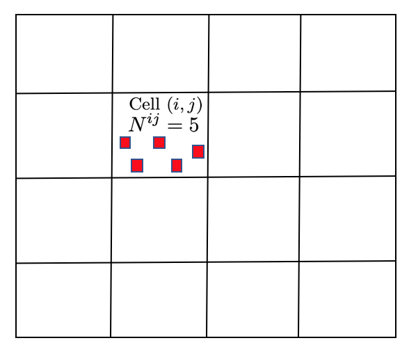
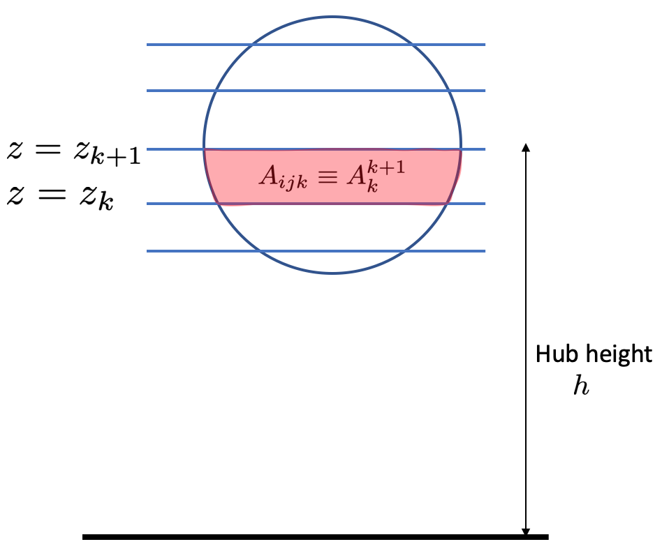
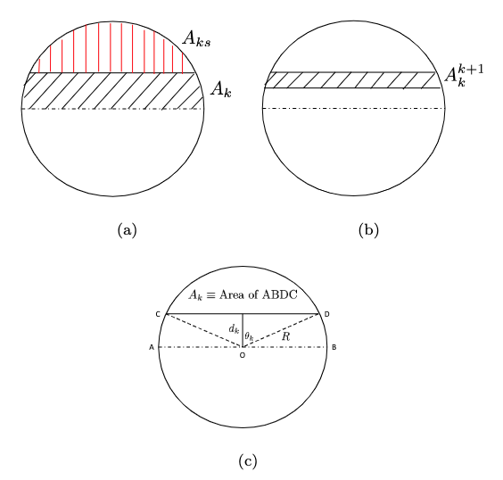
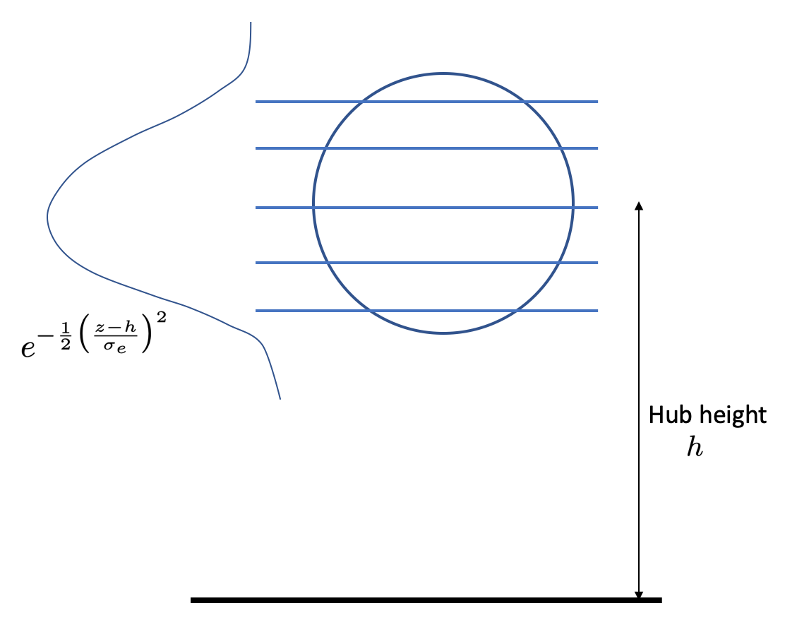
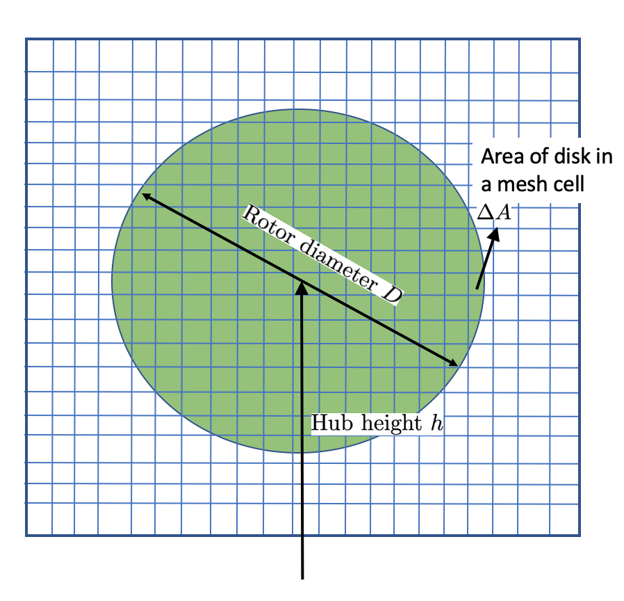
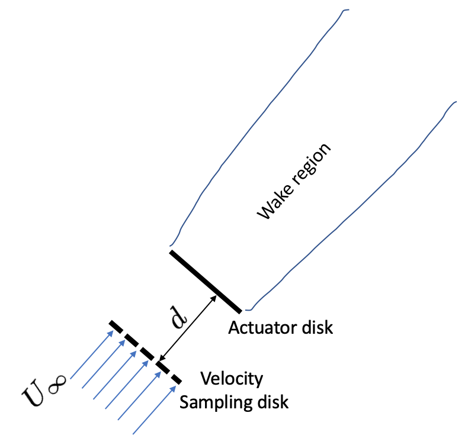
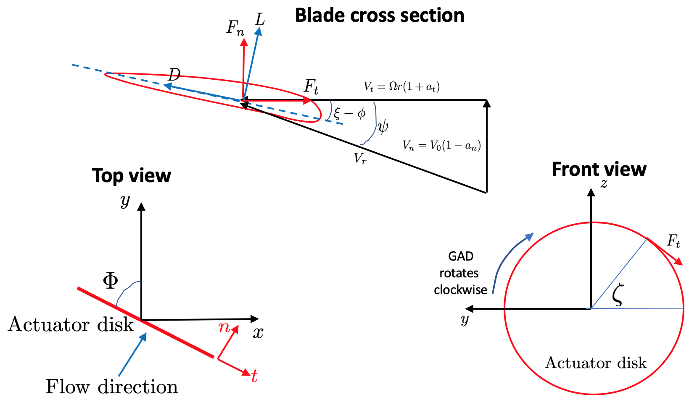

Wind farm models
==================

Introduction
-------------

ERF supports models for wind farm parametrization in which the effects of wind turbines are represented by imposing a momentum sink on the mean flow and/or turbulent kinetic energy (TKE). Currently the Fitch model (`Fitch et al. 2012`_), Explicit Wake Parametrization (EWP) model (`Volker et al. 2015`_) and Simplified actuator disk model (See Section 3.2 in `Wind Energy Handbook 2nd edition`_) are supported.

.. _Fitch model:

Fitch model
------------

The Fitch model for wind farms introduced in `Fitch et al. 2012`_  models the effect of wind farms (See Fig. `1`) as source terms in the governing equations for the horizontal components of momentum (i.e., :math:`x` and :math:`y` momentum) and the turbulent kinetic energy (TKE). The wind turbine is discretized only in the vertical (ie. `z` direction). At a given cell :math:`(i,j,k)`, the source terms in the governing equations are

.. _`Fitch et al. 2012`: https://journals.ametsoc.org/view/journals/mwre/140/9/mwr-d-11-00352.1.xml

.. math::

    \frac{\partial u_{ijk}}{\partial t} &= \frac{u_{ijk}}{|V|_{ijk}}\frac{\partial |V|_{ijk}}{\partial t} \\
    \frac{\partial v_{ijk}}{\partial t} &= \frac{v_{ijk}}{|V|_{ijk}}\frac{\partial |V|_{ijk}}{\partial t} \\
    \frac{\partial \text{TKE}_{ijk}}{\partial t} &=  \frac{0.5N_{ij}C_{TKE}(|V|_{ijk})|V|_{ijk}^3A_{ijk}}{\Delta x \Delta y (z_{k+1}-z_k)}

where

.. math::

    \frac{\partial |V|_{ijk}}{\partial t} = \frac{0.5N_{ij}C_T(|V|_{ijk})|V|_{ijk}^2A_{ijk}}{\Delta x \Delta y (z_{k+1}-z_k)}

where `u` and `v` are horizontal components of velocity, `|V|` is the velocity magnitude, :math:`N_{ij}` is the number of turbines in cell :math:`(i,j)` (see Fig. :numref:`fig:WindFarm`), :math:`C_T` is the coefficient of thrust of the turbines, :math:`C_{TKE}` is the fraction of energy converted to turbulent kinetic energy -- both of which are functions of the velocity magnitude, and :math:`A_{ijk}` is the area intersected by the swept area of the turbine between levels :math:`z=z_k` and :math:`z= z_{k+1}`, and is explained in the next section.

Intersected area :math:`A_{ijk}`
~~~~~~~~~~~~~~~~~~~~~~~~~~~~~~~~~~

Consider :math:`A_k^{k+1}` -- the area intersected by the swept area of the wind turbine between :math:`z=z_k` and :math:`z = z_{k+1}`. We have (see Figs. :numref:`fig:WindTurbine_Fitch` and :numref:`fig:Fitch_Aijk` below)

.. math::

    A_k = \frac{\pi R^2}{2} - A_{ks}

where :math:`A_{ks}` is the area of the segment of the circle as shown in Fig. :numref:`fig:Fitch_Aijk`. We have from geometry, :math:`d_k = \min(|z_k - h|,R)` is the perpendicular distance of the center of the turbine to :math:`z = z_k`, where :math:`h` is the height of the center of the turbine from the ground. The area of the segment is

.. math::

    A_{ks} = R^2\theta_k - d_k\sqrt{R^2 - d_k^2}

where :math:`\theta_k = \cos^{-1}\left(\frac{d_k}{R}\right)`.

Hence, we have the intersected area :math:`A_{ijk}\equiv A_k^{k+1}` as

.. math::

    A_k^{k+1} =
    \begin{cases}
        |A_k - A_{k+1}| & \text{if } (z_k - h)(z_{k+1}-h) > 0 \\
        |A_k + A_{k+1}| & \text{if } (z_k - h)(z_{k+1}-h) \le 0 \\
    \end{cases}

An example of the Fitch model is in ``Exec/Fitch``

.. _fig:WindFarm:

   Horizontal view of the wind farm in the Fitch model -- shows a wind farm in cell `(i,j)` with 5 wind turbines. The turbines are discretized only in the vertical direction.

.. _fig:WindTurbine_Fitch:

   The vertical discretization of the wind turbine in the Fitch model.

.. _fig:Fitch_Aijk:

   The area terminology in the Fitch model. The circle represents the area swept by the turbine blades.

.. _explicit-wake-parametrization-ewp-model:

Explicit Wake Parametrization (EWP) model
-----------------------------------------

The Explicit Wake Parametrization (EWP) model [`Volker et al. 2015`_] is very similar to the Fitch model, and models the effect of wind farms as source terms in the governing equations for the horizontal components of momentum (i.e., :math:`x` and :math:`y` momentum) and the turbulent kinetic energy (TKE). At a given cell :math:`(i,j,k)`, the source terms in the governing equations are:

.. math::
    \frac{\partial u_{ijk}}{\partial t} = -\sqrt{\frac{\pi}{8}}\frac{N_{ij}c_tr_0^2\overline{u}_0^2}{\Delta x \Delta y \sigma_e}
    \exp\left\{-\frac{1}{2}\left(\frac{z-h}{\sigma_e}\right)^2\right\}\cos(\phi(k))

.. math::
    \frac{\partial v_{ijk}}{\partial t} = -\sqrt{\frac{\pi}{8}}\frac{N_{ij}c_tr_0^2\overline{u}_0^2}{\Delta x \Delta y \sigma_e}
    \exp\left\{-\frac{1}{2}\left(\frac{z-h}{\sigma_e}\right)^2\right\}\sin(\phi(k))

.. math::
    \frac{\partial \text{TKE}_{ijk}}{\partial t} = -N_{ij}\rho A_rc_t\langle \overline{u}_{i,h}\overline{u'^2}_{i,h}\rangle

with

.. math::
    \sigma_e = \frac{\overline{u}_0}{3KL}\left[\left(\frac{2KL}{\overline{u}_0} + \sigma_0^2\right)^{\frac{3}{2}} - \sigma_0^3\right]

where :math:`N_{ij}` is the number of turbines in cell :math:`(i,j)`, :math:`c_t` is the thrust coefficient, :math:`r_0` is the rotor radius, :math:`\overline{u}_0` is the mean advection velocity at hub height, :math:`h` is the hub height, :math:`\sigma_0 \approx 1.7 r_0` [`Volker et al. 2017`_] is a length scale that accounts for near-wake expansion, :math:`L` is the downstream distance that the wake travels within the cell approximated as a fraction of the cell size, :math:`K` is the turbulence eddy diffusivity (:math:`m^2/s`), :math:`\Delta x` and :math:`\Delta y` are the mesh sizes in the horizontal directions, and :math:`\phi(k)` is the wind direction with respect to the x-axis. :math:`\overline{u}_{i,h}` and :math:`\overline{u'}_{i,h}` are the mean and the fluctuating values of the velocity components (subscript :math:`i` is the direction index) at the hub height :math:`h`, :math:`A_r = \pi r^2` is the swept area of the rotor and :math:`\rho` is the density of air.

The EWP model does not have a concept of intersected area by the turbine rotor like the Fitch model (see :ref:`Fitch model`). The exponential factor in the source terms for the velocities models the effect of the rotor for the momentum sinks (see Fig. :numref:`fig:WindTurbine_EWP`), and the turbulent kinetic energy source term only depends on the density, hub-height mean velocities and fluctuations, and the total swept area of the rotor :math:`A_r`.

.. _fig:WindTurbine_EWP:

   In the EWP model, the exponential factor in the source terms for the velocities models the effect of the rotor for the momentum sinks unlike the Fitch model which computes the
   intersected area (see Fig. :numref:`fig:WindTurbine_Fitch`).

.. _`Volker et al. 2015`: https://gmd.copernicus.org/articles/8/3715/2015/
.. _`Volker et al. 2017`: https://doi.org/10.1088/1748-9326/aa5d86

.. _actuator_disk_model_simplified:

Simplified actuator disk model
=================================

A simplified actuator disk model based on one-dimensional momentum theory is implemented (See Section 3.2 in `Wind Energy Handbook 2nd edition`_). A schematic of the actuator disk is shown in  Fig. :numref:`fig:ActuatorDisk_Schematic`.
The model is implemented as source terms in the equations for the horizontal velocity components (ie. `x` and `y` directions). The thrust force from the one-dimensional momentum theory is given by

.. math::

    F = 2 \rho \pi R^2 (\mathbf{U}_\infty \cdot \mathbf{n})^2 a (1-a) \\
      = \int_0^{2\pi}\int_0^R 2 \rho (\mathbf{U}_\infty \cdot \mathbf{n})^2 a (1 - a) r\,dr\,d\theta,

where :math:`\rho` is the density of incoming air, :math:`\mathbf{U}_\infty` is the velocity vector of incoming air at some distance (say :math:`d=2.5` times the turbine diameter) upstream of the turbine (see Fig. :numref:`fig:ActuatorDisk_Sampling`), :math:`\mathbf{n}` is the surface normal vector of the actuator disk, and :math:`a = 1 - \cfrac{C_P}{C_T}`, is the axial induction factor for the turbine, and :math:`R` is the radius of the wind turbine swept area. The integration is performed over the swept area of the disk. Hence, the force on an elemental annular disk of thickness :math:`dr` is

.. math::

    dF = 2 \rho (\mathbf{U}_\infty \cdot \mathbf{n})^2 a (1 - a) r\,dr\,d\theta,

where :math:`r~dr~d\theta` is the elemental area of the actuator disk. In general, this can be written as

.. math::

    dF = 2 \rho (\mathbf{U}_\infty \cdot \mathbf{n})^2 a (1 - a) dA \\

where :math:`dA` is the area of the actuator disk in the mesh cell (see Fig. :numref:`fig:ActuatorDisk_Schematic`). In the context of the simplified actuator disk model, the source term is imposed only on a single cell, and hence the volume over which the force :math:`dF` is acting is the volume of the cell — :math:`dV \equiv \Delta x \Delta y \Delta z`. Hence, the source terms in the horizontal velocity equations are the acceleration (or deceleration) due to the thrust force :math:`dF` and is given by

.. math::

    \frac{\partial u}{\partial t} &= -\frac{dF \cos{\phi}}{\rho dV} \\
                                  &= -\frac{dF \cos{\phi}}{\rho \times \Delta x \Delta y \Delta z} \\
                                  &= -2(\mathbf{U}_\infty \cdot \mathbf{n})^2 a (1 - a)\frac{\Delta A}{\Delta x\Delta y\Delta z} \cos{\phi},

.. math::

    \frac{\partial v}{\partial t} = -2(\mathbf{U}_\infty \cdot \mathbf{n})^2 a (1 - a)\frac{\Delta A}{\Delta x\Delta y\Delta z} \sin{\phi}.

.. _fig:ActuatorDisk_Schematic:

   Schematic of the simplified actuator disk model.

.. _fig:ActuatorDisk_Sampling:

   Top view showing the freestream velocity sampling disk at a distance of :math:`d` from the turbine actuator disk.

.. _`Wind Energy Handbook 2nd edition`: https://www.wiley.com/en-us/Wind+Energy+Handbook%2C+2nd+Edition-p-9781119993926

.. _Inputs:

.. _generalized_actuator_disk_model:

Generalized actuator disk model
===============================

The generalized actuator model (GAD) based on blade element theory (`Mirocha et. al. 2014`_, see Chapter 3 of `Small Wind Turbines`_) is implemented. Similar to the simplified actuator disk model, GAD also models the wind turbine as a disk, but takes into account the details of the blade geometry (see :numref:`fig:GAD_Schematic`). The forces on the blades in the x, y, z directions are computed, and that contributes to the source terms for the fluid momentum equations. The source terms in a mesh cell inside the actuator disk are given as:

.. math::
   :label: GAD_source_terms

   \frac{\partial u}{\partial t} &= -\frac{F_x}{\rho \Delta x\Delta y\Delta z} \\
   \frac{\partial v}{\partial t} &= -\frac{F_y}{\rho \Delta x\Delta y\Delta z} \\
   \frac{\partial w}{\partial t} &= -\frac{F_z}{\rho \Delta x\Delta y\Delta z},

where :math:`\rho` is the density of air in the cell, and :math:`\Delta x, \Delta y, \Delta z` are the mesh spacing in the x, y, and z directions. The forces on the GAD are given by:

.. math::
   :label: GAD_forces

   F_x &= F_n \cos{\Phi} + F_t \sin\zeta \sin\Phi \\
   F_y &= F_n \sin{\Phi} - F_t \sin\zeta \cos\Phi \\
   F_z &= -F_t \cos\zeta,

where :math:`F_n` and :math:`F_t` are the normal and tangential forces, and the angles are as shown in Figure :numref:`fig:GAD_Schematic`. The normal and tangential forces are:

.. math::
   :label: GAD_Fn_Ft

   \begin{bmatrix}
   F_n \\
   F_t
   \end{bmatrix}
   =
   \begin{bmatrix}
   \cos\Psi & \sin\Psi \\
   \sin\Psi & -\cos\Psi
   \end{bmatrix}
   \begin{bmatrix}
   L \\
   D
   \end{bmatrix},

where

.. math::

   \Psi = \tan^{-1}\left(\frac{V_n}{V_t}\right),

and

.. math::
   :label: GAD_Vn_Vt

   V_n &= V_0(1-a_n) \\
   V_t &= \Omega(1+a_t)r,

where :math:`\Omega` is the rotational speed of the turbine, :math:`r` is the radial location along the blade span, and :math:`a_n` and :math:`a_t` are the normal and tangential induction factors. The lift and drag forces are given by:

.. math::
   :label: GAD_L_D

   L &= \frac{1}{2} \rho V_r^2 c C_l \\
   D &= \frac{1}{2} \rho V_r^2 c C_d,

where :math:`\rho` is the density of air, :math:`c` is the chord length of the airfoil cross-section, :math:`C_l` and :math:`C_d` are the sectional lift and drag coefficients on the airfoil cross-section, and the relative wind velocity is :math:`V_r = \sqrt{V_n^2 + V_t^2}`. The normal and tangential sectional coefficients are computed as:

.. math::
   :label: GAD_Cn_Ct

   \begin{bmatrix}
   C_n \\
   C_t
   \end{bmatrix}
   =
   \begin{bmatrix}
   \cos\Psi & \sin\Psi \\
   \sin\Psi & -\cos\Psi
   \end{bmatrix}
   \begin{bmatrix}
   C_l \\
   C_d
   \end{bmatrix},

and the normal and tangential induction factors are given by:

.. math::
   :label: GAD_an_at

   a_n &= \left[1 + \frac{4F \sin^2\psi}{s C_n}\right]^{-1} \\
   a_t &= \left[\frac{4F \sin\psi \cos\psi}{s C_t} - 1\right]^{-1},

where

.. math::

   F = F_\text{tip} + F_\text{hub} = \frac{2}{\pi} \left[\cos^{-1}\left(\exp(-f_\text{tip})\right) + \cos^{-1}\left(\exp(-f_\text{hub})\right)\right],

and

.. math::

   f_\text{tip} &= B \frac{(r_\text{tip}-r)}{2r \sin\psi} \\
   f_\text{hub} &= B \frac{(r-r_\text{hub})}{2r \sin\psi},

where :math:`r_\text{hub}` and :math:`r_\text{tip}` are the radius of the hub and the blade tip from the center of rotation of the disk, :math:`r` is the radial location along the blade span, and the solidity factor is :math:`s=\frac{cB}{2\pi r}`, where :math:`B` is the number of blades.

An iterative procedure is needed to compute the source terms, and is as follows:

1. An initial value is assumed for the normal and tangential induction factors :math:`a_n` and :math:`a_t`.
2. Compute the normal and tangential velocities from Eqn. :eq:`GAD_Vn_Vt`.
3. From the tables for the `details of the blade geometry`_ and the `sectional coefficients of the airfoil cross sections`_, compute the values of :math:`C_l` and :math:`C_d` corresponding to the radial location :math:`r` along the blade span and the angle of attack :math:`\alpha = \psi - \xi`.
4. Compute the normal and tangential sectional coefficients :math:`C_n` and :math:`C_t` from Eqn. :eq:`GAD_Cn_Ct`.
5. Compute the normal and tangential induction factors :math:`a_n` and :math:`a_t` using Eqn. :eq:`GAD_an_at`.
6. Repeat steps 2 to 5 until the error in the normal and tangential induction factors, :math:`a_n` and :math:`a_t`, are less than :math:`1 \times 10^{-5}`.
7. Once the iterations converge, compute the sectional lift and drag forces, :math:`L` and :math:`D`, using Eqn. :eq:`GAD_L_D`.
8. Compute the normal and tangential forces, :math:`F_n` and :math:`F_t`, using Eqn. :eq:`GAD_Fn_Ft`.
9. Compute the forces on the disk using Eqn. :eq:`GAD_forces`.
10. Compute the source terms in the momentum equation using Eqn. :eq:`GAD_source_terms`.

.. _fig:GAD_Schematic:

   Different views of the GAD showing the forces and angles involved: Blade cross section showing the normal (:math:`V_n`) and tangential (:math:`V_t`) components of velocity with the normal (:math:`a_n`) and tangential (:math:`a_t`) induction factors, relative wind velocity :math:`V_r`, blade twist angle :math:`\xi`, angle of relative wind :math:`\psi`, lift (:math:`L`) and drag (:math:`D`) forces, and normal (:math:`F_n`) and tangential (:math:`F_t`) forces; top view showing the flow direction and inclination angle :math:`\Phi`; and front view showing the actuator disk rotating clockwise.

.. _`Mirocha et. al. 2014`: https://doi.org/10.1063/1.4861061
.. _`Small Wind Turbines`: https://doi.org/10.1007/978-1-84996-175-2
.. _`details of the blade geometry`: https://github.com/NREL/openfast-turbine-models/blob/main/IEA-scaled/NREL-2.8-127/20_monolithic_opt2/OpenFAST/NREL-2p8-127_AeroDyn15_blade.dat
.. _`sectional coefficients of the airfoil cross sections` : https://github.com/NREL/openfast-turbine-models/tree/main/IEA-scaled/NREL-2.8-127/20_monolithic_opt2/OpenFAST/Airfoils

Inputs for wind farm parametrization models
------------------------------------------------------------

The following are the inputs required for wind farm simulations.

.. code-block:: cpp

    // The parametrization model - Fitch, EWP, SimpleActuatorDisk
    erf.windfarm_type = "Fitch"

    // How are the turbine locations specified? - using latitude-longitude
    // format or x-y format? lat_lon or x_y
    erf.windfarm_loc_type = "lat_lon"

    // If using lat_lon, then the shift of the bounding box of the wind farm
    // from the x and y axes should be given. This is to avoid boundary
    // effects from the inflow boundaries. For example for 2 km shift from the
    // x and y axes, it should be
    erf.windfarm_x_shift     = 2000.0
    erf.windfarm_y_shift     = 2000.0

    // Table having the wind turbine locations
    erf.windfarm_loc_table = "windturbines_1WT.txt"

    // Table having the specifications of the wind turbines. All turbines are assumed to
    // have the same specifications
    erf.windfarm_spec_table = "wind-turbine_1WT.tbl"

    // For simplified actuator disk model the following parameters are needed

    // The distance of the freestream velocity sampling disk from the turbine actuator
    // disk
    erf.sampling_distance_by_D = 2.5

    // The angle of the turbine actuator disk from the x axis
    erf.turb_disk_angle_from_x = 135.0

1. ``erf.windfarm_type`` has to be one of the supported models - ``Fitch``, ``EWP``, ``SimpleActuatorDisk``.
2. ``erf.windfarm_loc_type`` is a variable to specify how the wind turbine locations in the wind farm is specified. If using the latitude and longitude of the turbine location, this has to be ``lat_lon`` or if using x and y coordinates to specify the turbine locations, this input is ``x_y``.

   - If using ``lat_lon`` format, ``erf.windfarm_x_shift`` and ``erf.windfarm_y_shfit`` specifies the shift of the bounding box of the wind farm from the x and y axes, so as to place the wind farm sufficiently inside the domain to avoid inflow boundary effects.

   - If using ``x_y`` format, there is no need to specify the ``erf.windfarm_x_shift`` and ``erf.windfarm_y_shift``.

3. The ``erf.windfarm_loc_table`` specifies the locations of the wind turbines in the wind farm.

   - For the latitude-longitude format, an example is as below. Each line specifies the latitude and longitude of the wind turbine location. The third entry simply has to be always 1 (WRF requires the third entry to be always 1, so maintaining same format here). The first entry means that the turbine is located at ``35.7828 deg N, 99.0168 deg W`` (note the negative sign in the entry corresponding to West).

     .. code-block:: cpp

        35.7828828829 -99.0168 1
        35.8219219219 -99.0168 1
        35.860960961 -99.0168 1
        35.9 -99.0168 1
        35.939039039 -99.0168 1
        35.9780780781 -99.0168 1
        36.0171171171 -99.0168 1
        35.7828828829 -98.9705333333 1

   - For the x-y format, an example is as below. Each line specifies the x and y coordinates of the wind turbine location in metres

     .. code-block:: cpp

        89264.99080053 91233.3333309002
        89259.1966417755 95566.6666710007
        89254.1277665419 99900.0000000001
        89249.7842982733 104233.333329
        89246.1663427532 108566.6666691
        89243.2739881117 112899.9999981
        93458.6633652711 86900.0000019001
        93450.4377452458 91233.3333309002
        93442.9032518779 95566.6666710007

4. The ``erf.windfarm_spec_table`` gives the specifications of the wind turbines in the wind farm. All wind turbines are assumed to have the same specifications. Here is a sample specifications table.

.. code-block:: cpp

    4
    119.0 178.0 0.130 2.0
    9   0.805    50.0
    10   0.805    50.0
    11   0.805    50.0
    12   0.805    50.0

The first line is the number of pairs of entries for the power curve and thrust coefficient (there are 4 entries in this table which are in the last four lines of the table).
The second line gives the height in meters of the turbine hub, the diameter in
meters of the rotor, the standing thrust coefficient, and the nominal power of the turbine in MW.
The remaining lines (four in this case) contain the three values of: wind speed (m/s), thrust coefficient, and power production in kW.

.. _Outputs:

Outputs
----------
1. Turbine locations are written into `turbine_locations.vtk`.
2. If using an actuator disk model, all the actuator disks are written out to `actuator_disks_all.vtk`. The actuator disks which are enclosed by the
   computational domain are written out to `actuator_disks_in_dom.vtk`.

These `vtk` files can be visualized in both VisIt and ParaView. The `turbine_locations.vtk` can be visualized using the `Points Gaussian` feature in ParaView or the `Mesh`
feature in VisIt. The `actuator_disks_in_dom.vtk` and `actuator_disks_all.vtk` files can be visualized using the `Wireframe` feature in ParaView or `Mesh` feature in VisIt.

