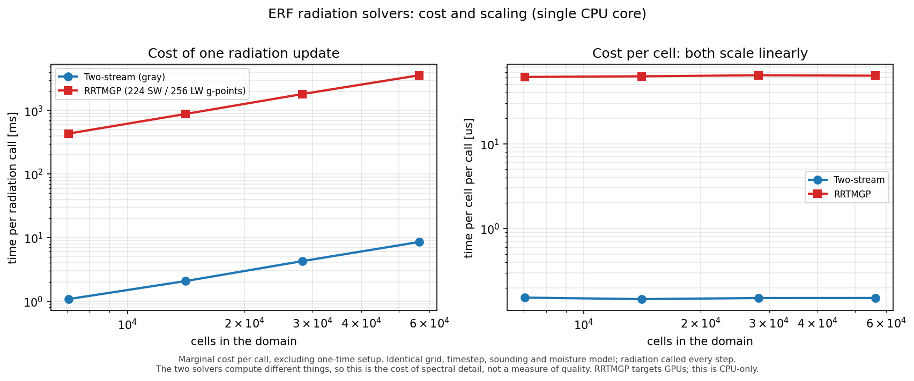

# Two-Stream vs RRTMGP: Cost and Scaling

## Objective

Measure what each radiation solver costs per call, and how that cost scales
with problem size, with everything except the solver held fixed.

This is a cost measurement, not a ranking. RRTMGP solves band-resolved
radiative transfer across 224 shortwave and 256 longwave g-points with gas
optics from lookup tables; the two-stream solver does a single gray sweep per
column. The difference is the price of spectral detail. Which one belongs in a
given run depends on whether that detail matters for the science, and on how
much of the timestep budget radiation is allowed to take.



## Results

Measured on one CPU core, marginal cost per call, radiation called every step:

| Grid | Cells | Two-stream | RRTMGP |
|---|---|---|---|
| 42 x 4 x 42 | 7,056 | 1.08 ms | 433 ms |
| 84 x 4 x 42 | 14,112 | 2.07 ms | 881 ms |
| 84 x 4 x 84 | 28,224 | 4.27 ms | 1,812 ms |
| 168 x 4 x 84 | 56,448 | 8.55 ms | 3,581 ms |

Both solvers scale linearly with cell count: cost per cell is flat across a
factor of eight in problem size, so either extrapolates predictably to a
production grid. That is the practical value of the measurement.

## What is held fixed

A timing comparison means nothing unless the two runs differ only in the
solver. Both inputs pull in `shared_settings` with AMReX's `FILE =` include, so
the shared configuration is literally the same bytes rather than two lists that
happen to agree today. Pinned there:

- identical grid, timestep, step count, sounding and boundary conditions;
- the same moisture model (`SatAdj`), since RRTMGP needs gas and condensate
  fields and running two-stream without them would compare different physics;
- the same surface temperature for both solvers;
- radiation called on every slow step, so the comparison is per call rather
  than an artifact of update frequency;
- plotfiles and both solvers' diagnostic logs switched off, so file I/O stays
  out of the measured region;
- fixed MFIter tiling, so neither is measured with a different decomposition.

## How the cost is measured

The figure reports the **marginal** cost per call, not wall time and not a
simple average:

- Time comes from the `BL_PROFILE` region at each solver's entry point, read
  out of AMReX's TinyProfiler, so the dycore is excluded.
- Each configuration is run at two step counts and the reported cost is
  `(T_long - T_short) / (calls_long - calls_short)`. That cancels one-time
  work. It matters: RRTMGP reads roughly 45 MB of lookup tables on its first
  call, which inflates a naive average by about 150 ms.
- The two-stream solver is invoked twice per step, at `pre_dycore` and
  `post_dycore`, while RRTMGP runs once. Normalising by the profiler's own
  call count rather than by step count keeps that from skewing the result.
- Each measurement is repeated and the minimum taken, since the minimum is the
  least noisy estimator of a compute cost on a shared machine.

## Caveats

- Single CPU core. RRTMGP is written to exploit GPUs and is not being used the
  way it is designed to be used here.
- The solvers do not compute the same thing, so cost per call is not cost per
  unit of accuracy.
- Absolute numbers are machine specific; the scaling and the ratio are the
  transferable part.

## Running it

The two-stream half needs no special build. The RRTMGP half needs an ERF built
with `-DERF_ENABLE_RRTMGP=ON`, and RRTMGP's four netCDF lookup tables, which
ship with `Submodules/RRTMGP`, staged into one directory:

```
mkdir rrtmgp_data
cp Submodules/RRTMGP/rrtmgp/data/rrtmgp-data-{sw-g224,lw-g256}-2018-12-04.nc rrtmgp_data/
cp Submodules/RRTMGP/extensions/cloud_optics/rrtmgp-cloud-optics-coeffs-{sw,lw}.nc rrtmgp_data/

./run_timing_comparison.py --exe /path/to/erf_exec --rrtmgp-data ./rrtmgp_data
```

Without an RRTMGP build the script still measures two-stream and reports that
the RRTMGP half was skipped. It writes `radiation_timing_comparison.csv` and
`radiation_timing_comparison.png`.

## Checker

`check_timing_fairness.py` guards the invariant that makes the numbers
meaningful. It fails if either input shadows a shared setting, sets anything
outside its own solver's namespace, stops including the shared block, changes
the surface temperature on one side only, stops calling radiation every step,
or turns plotfiles back on. It runs without needing an RRTMGP build.
